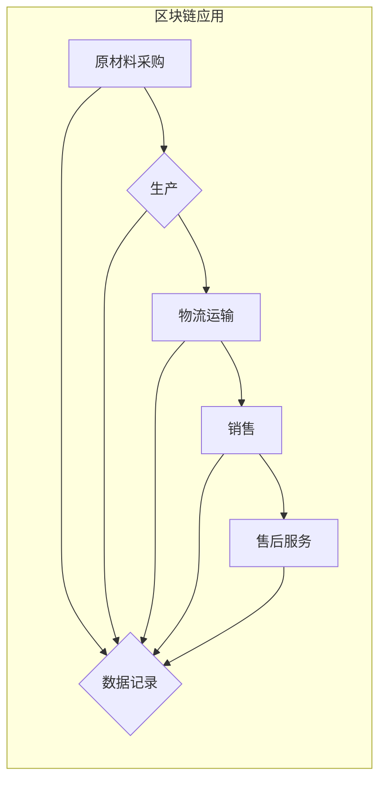

                 

## 区块链技术在供应链管理中的应用

> 关键词：区块链、供应链管理、透明度、安全性、可追溯性、智能合约、去中心化

## 1. 背景介绍

在当今全球化经济体系中，供应链管理扮演着至关重要的角色。供应链的复杂性、跨地域性以及信息孤岛问题，使得传统的供应链管理模式面临着诸多挑战。例如，缺乏透明度导致信息不对称，难以追踪产品来源和流向；安全性问题容易导致数据篡改和欺诈行为；信息孤岛导致各环节之间缺乏协作和沟通，效率低下。

区块链技术作为一种分布式、去中心化、安全可靠的底层技术，为解决供应链管理中的痛点提供了新的解决方案。其核心特点是：

* **分布式存储：** 数据存储在多个节点上，避免了单点故障和数据丢失的风险。
* **去中心化管理：** 供应链各参与方共享数据，无需依赖第三方平台，提高了效率和透明度。
* **不可篡改性：** 数据一旦写入区块链，就不可修改，保证了数据的真实性和可靠性。
* **加密安全：** 使用加密算法保护数据安全，防止数据泄露和篡改。

## 2. 核心概念与联系

### 2.1 区块链

区块链是一种分布式账本技术，它将数据记录成一个个区块，每个区块包含多个交易记录，并通过加密算法链接在一起，形成一个不可篡改的链条。

### 2.2 供应链管理

供应链管理是指从原材料采购到最终产品交付的全过程管理，包括计划、采购、生产、物流、销售等环节。

### 2.3 区块链与供应链管理的联系

区块链技术可以应用于供应链管理的各个环节，例如：

* **产品溯源：** 通过记录产品的生产、运输、销售等信息，实现产品的可追溯性，提高产品质量和安全保障。
* **信息共享：** 各参与方共享供应链数据，提高信息透明度和协作效率。
* **智能合约：** 自动执行合同条款，减少人工干预，提高效率和降低成本。
* **防伪溯源：** 利用区块链的不可篡改性，防止假冒伪劣产品进入市场。

**Mermaid 流程图**



## 3. 核心算法原理 & 具体操作步骤

### 3.1 算法原理概述

区块链的核心算法包括：

* **哈希算法：** 用于生成区块的唯一标识，并确保数据的完整性。
* **密码学算法：** 用于加密数据，保证数据的安全性和隐私性。
* **共识算法：** 用于验证交易和生成新的区块，确保区块链的安全性。

### 3.2 算法步骤详解

1. **交易发起：** 供应链参与方发起交易请求，例如原材料采购、产品生产、物流运输等。
2. **交易广播：** 交易请求被广播到整个区块链网络。
3. **交易验证：** 节点验证交易的合法性和有效性，例如检查交易金额、身份验证等。
4. **区块打包：** 验证通过的交易被打包成一个区块。
5. **区块哈希：** 生成区块的哈希值，并将其与前一个区块的哈希值链接在一起，形成一个不可篡改的链条。
6. **区块广播：** 新生成的区块被广播到整个区块链网络。
7. **区块确认：** 节点验证新区块的合法性和有效性，并将其添加到区块链中。

### 3.3 算法优缺点

**优点：**

* **安全性高：** 数据加密和不可篡改性保证了数据的安全性和可靠性。
* **透明度高：** 所有交易记录都公开透明，任何参与方都可以查看。
* **效率高：** 去中心化管理和智能合约可以提高效率和降低成本。

**缺点：**

* **技术复杂：** 区块链技术本身比较复杂，需要专业的技术人员进行开发和维护。
* **可扩展性有限：** 区块链的处理能力有限，难以处理海量数据。
* **监管不完善：** 区块链技术尚处于发展阶段，相关的法律法规和监管体系尚未完善。

### 3.4 算法应用领域

区块链技术在供应链管理之外，还广泛应用于其他领域，例如：

* 金融服务
* 医疗保健
* 政府管理
* 数字资产

## 4. 数学模型和公式 & 详细讲解 & 举例说明

### 4.1 数学模型构建

区块链的数学模型主要基于密码学和图论。

* **密码学模型：** 用于保证数据的安全性和隐私性，例如哈希函数、公钥加密、数字签名等。
* **图论模型：** 用于描述区块链网络的结构和节点之间的关系，例如区块链网络的拓扑结构、节点的连接度等。

### 4.2 公式推导过程

* **哈希函数：**

$$H(x) = y$$

其中，$H$ 是哈希函数，$x$ 是输入数据，$y$ 是输出哈希值。哈希函数具有单向性、不可逆性和抗碰撞性等特点。

* **公钥加密：**

$$C = E_p(M)$$

其中，$C$ 是密文，$E_p$ 是公钥加密算法，$M$ 是明文，$p$ 是公钥。

### 4.3 案例分析与讲解

**举例说明：**

假设Alice想要发送一条消息给Bob，可以使用公钥加密算法进行加密。Alice首先获取Bob的公钥，然后使用公钥加密算法将消息加密，发送给Bob。Bob收到消息后，使用自己的私钥解密消息。

## 5. 项目实践：代码实例和详细解释说明

### 5.1 开发环境搭建

* **操作系统：** Linux 或 macOS
* **编程语言：** Python 或 Go
* **区块链框架：** Hyperledger Fabric 或 Ethereum

### 5.2 源代码详细实现

以下是一个使用Hyperledger Fabric实现供应链管理的简单代码示例：

```python
# 定义智能合约
from fabric_contract_api import Contract

class SupplyChainContract(Contract):
    def __init__(self, ctx):
        super().__init__(ctx)

    def create_product(self, product_id, product_name, origin):
        # 将产品信息存储到区块链
        return self.ctx.stub.put_state(product_id, product_name, origin)

    def get_product_info(self, product_id):
        # 获取产品信息
        return self.ctx.stub.get_state(product_id)
```

### 5.3 代码解读与分析

* **定义智能合约：** 使用Hyperledger Fabric的Contract类定义智能合约。
* **创建产品：** 使用`create_product`函数将产品信息存储到区块链。
* **获取产品信息：** 使用`get_product_info`函数获取产品信息。

### 5.4 运行结果展示

运行代码后，可以将产品信息存储到区块链中，并通过`get_product_info`函数查询产品信息。

## 6. 实际应用场景

### 6.1 食品安全溯源

区块链可以记录食品从生产到消费的全过程信息，实现食品的溯源追查，提高食品安全保障。

### 6.2 药品供应链管理

区块链可以防止药品的假冒伪劣，确保药品的真实性和安全性。

### 6.3 diamonds 钻石供应链管理

区块链可以记录钻石的来源和交易历史，防止钻石走私和洗钱。

### 6.4 未来应用展望

区块链技术在供应链管理领域的应用前景广阔，未来将应用于更多领域，例如：

* **可持续供应链：** 记录原材料的来源和加工过程，确保供应链的可持续性。
* **供应链金融：** 利用区块链的透明性和安全性，提高供应链金融的效率和安全性。
* **跨境贸易：** 简化跨境贸易流程，降低贸易成本。

## 7. 工具和资源推荐

### 7.1 学习资源推荐

* **Hyperledger Fabric官方文档：** https://hyperledger-fabric.readthedocs.io/en/latest/
* **Ethereum官方文档：** https://ethereum.org/en/developers/docs/
* **区块链技术书籍：** 《区块链技术入门》、《区块链应用开发》

### 7.2 开发工具推荐

* **Visual Studio Code：** https://code.visualstudio.com/
* **Docker：** https://www.docker.com/
* **Go语言开发工具：** https://go.dev/doc/install

### 7.3 相关论文推荐

* **"Blockchain Technology for Supply Chain Management: A Comprehensive Review"**
* **"A Survey on Blockchain Applications in Supply Chain Management"**

## 8. 总结：未来发展趋势与挑战

### 8.1 研究成果总结

区块链技术在供应链管理领域的应用取得了显著成果，例如提高了透明度、安全性、效率等。

### 8.2 未来发展趋势

* **技术成熟度提升：** 区块链技术的性能、可扩展性和安全性将不断提升。
* **应用场景拓展：** 区块链技术将应用于更多供应链管理场景，例如可持续供应链、供应链金融等。
* **标准化和监管完善：** 区块链技术的标准化和监管体系将不断完善，推动区块链技术的应用推广。

### 8.3 面临的挑战

* **技术复杂性：** 区块链技术本身比较复杂，需要专业的技术人员进行开发和维护。
* **可扩展性问题：** 区块链的处理能力有限，难以处理海量数据。
* **隐私保护问题：** 区块链的公开透明性可能会导致隐私泄露问题。

### 8.4 研究展望

未来研究方向包括：

* **提高区块链技术的性能和可扩展性。**
* **解决区块链技术的隐私保护问题。**
* **探索区块链技术在供应链管理中的更多应用场景。**

## 9. 附录：常见问题与解答

**常见问题：**

* **区块链技术与传统数据库有什么区别？**

**解答：** 区块链是一种分布式账本技术，数据存储在多个节点上，而传统数据库则集中存储在单一服务器上。区块链具有不可篡改性、透明度高、安全性强等特点，而传统数据库则更侧重于数据存储和查询效率。

* **区块链技术如何保证数据的安全性？**

**解答：** 区块链技术使用加密算法和哈希函数来保证数据的安全性。每个区块都与前一个区块链接在一起，形成一个不可篡改的链条。

* **区块链技术如何实现数据共享？**

**解答：** 区块链技术采用去中心化的管理方式，所有参与方都可以共享数据。

**作者：禅与计算机程序设计艺术 / Zen and the Art of Computer Programming**<end_of_turn>

