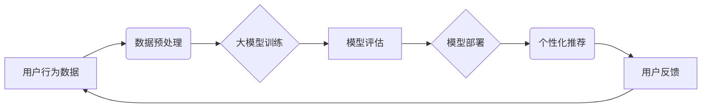

                 

## 大模型在电商平台用户兴趣探索与利用平衡中的应用

> 关键词：大模型、电商平台、用户兴趣探索、推荐系统、个性化体验、数据隐私、伦理问题

## 1. 背景介绍

随着电商平台的蓬勃发展，用户兴趣的探索与利用已成为平台核心竞争力之一。传统推荐系统主要依赖用户行为数据和商品特征，但随着数据规模的增长和用户行为的多样性，传统方法面临着挑战。大模型的出现为电商平台用户兴趣探索与利用带来了新的机遇。大模型，特别是基于Transformer架构的模型，凭借其强大的语义理解和文本生成能力，能够更深入地挖掘用户兴趣，提供更精准、个性化的推荐服务。

然而，大模型的应用也带来了一些新的挑战。例如，大模型训练需要海量数据，而用户数据往往涉及隐私敏感信息，如何平衡用户隐私保护和推荐效果提升是一个需要认真考虑的问题。此外，大模型的决策过程往往难以解释，这可能导致用户对推荐结果的信任度下降。

## 2. 核心概念与联系

### 2.1 用户兴趣探索

用户兴趣探索是指通过分析用户行为、偏好、兴趣等信息，挖掘用户潜在需求和兴趣点。电商平台可以通过以下方式进行用户兴趣探索：

* **行为数据分析:** 分析用户浏览历史、购买记录、收藏列表等行为数据，识别用户偏好的商品类别、品牌、价格等特征。
* **文本数据分析:** 分析用户评论、评价、咨询等文本数据，挖掘用户对商品的感受、需求和期望。
* **协同过滤:** 基于用户相似度或商品相似度，推荐与用户或商品相似的其他用户或商品。
* **内容过滤:** 基于商品特征和用户偏好，推荐与用户兴趣相符的商品。

### 2.2 大模型在用户兴趣探索中的应用

大模型可以有效提升用户兴趣探索的精准度和效率。例如：

* **语义理解:** 大模型可以理解用户评论、评价等文本数据的深层语义，挖掘用户更细粒度的兴趣点。
* **知识图谱构建:** 大模型可以构建商品、用户、品牌等实体之间的知识图谱，帮助平台更全面地理解用户兴趣。
* **个性化推荐:** 大模型可以根据用户的历史行为、偏好和兴趣，生成个性化的商品推荐列表。

### 2.3  大模型应用架构



## 3. 核心算法原理 & 具体操作步骤

### 3.1  算法原理概述

大模型在电商平台用户兴趣探索与利用中的应用主要基于以下核心算法：

* **Transformer模型:** Transformer模型是一种基于注意力机制的深度学习模型，能够有效捕捉文本序列中的长距离依赖关系，在自然语言处理任务中取得了优异的性能。
* **BERT模型:** BERT模型是一种基于Transformer架构的预训练语言模型，通过在大量的文本数据上进行预训练，能够对文本语义进行更深入的理解。
* **推荐系统算法:** 

推荐系统算法包括协同过滤、内容过滤、混合推荐等，大模型可以结合这些算法，提升推荐效果。

### 3.2  算法步骤详解

1. **数据收集与预处理:** 收集用户行为数据、商品信息、文本评论等数据，并进行清洗、格式化、特征提取等预处理操作。
2. **大模型训练:** 使用预训练的BERT模型或其他Transformer模型，对预处理后的数据进行训练，学习用户兴趣和商品特征之间的关系。
3. **模型评估:** 使用测试数据对训练好的模型进行评估，评估模型的推荐准确率、覆盖率等指标。
4. **模型部署:** 将训练好的模型部署到电商平台，用于个性化推荐。
5. **用户反馈收集:** 收集用户对推荐结果的反馈，并将其反馈回模型训练流程，不断优化模型性能。

### 3.3  算法优缺点

**优点:**

* **精准度提升:** 大模型能够更深入地理解用户兴趣，提供更精准的推荐。
* **个性化体验:** 大模型可以根据用户的个性化需求，生成个性化的推荐列表。
* **新商品推荐:** 大模型可以根据用户兴趣和市场趋势，推荐新商品。

**缺点:**

* **数据依赖:** 大模型训练需要海量数据，数据质量直接影响模型性能。
* **计算资源消耗:** 大模型训练和部署需要大量的计算资源。
* **解释性差:** 大模型的决策过程难以解释，可能导致用户对推荐结果的信任度下降。

### 3.4  算法应用领域

大模型在电商平台用户兴趣探索与利用中的应用领域广泛，包括：

* **商品推荐:** 根据用户的兴趣和历史行为，推荐相关的商品。
* **个性化营销:** 根据用户的兴趣和需求，进行个性化的营销推广。
* **内容推荐:** 根据用户的兴趣，推荐相关的文章、视频等内容。
* **用户画像:** 通过分析用户的行为和偏好，构建用户画像，帮助平台更好地了解用户需求。

## 4. 数学模型和公式 & 详细讲解 & 举例说明

### 4.1  数学模型构建

大模型在电商平台用户兴趣探索与利用中的应用可以构建以下数学模型：

* **用户兴趣模型:**  

$$
u_i = f(h_i, c_i)
$$

其中：

* $u_i$ 表示用户 $i$ 的兴趣向量。
* $h_i$ 表示用户 $i$ 的历史行为数据。
* $c_i$ 表示用户 $i$ 的上下文信息。
* $f$ 表示一个映射函数，用于将历史行为数据和上下文信息映射到用户兴趣向量。

* **商品相似度模型:**

$$
s(p_i, p_j) = \frac{ \sum_{k=1}^{n} w_k \cdot \text{sim}(p_{i,k}, p_{j,k})}{\sum_{k=1}^{n} w_k}
$$

其中：

* $s(p_i, p_j)$ 表示商品 $p_i$ 和 $p_j$ 的相似度。
* $n$ 表示商品特征的数量。
* $w_k$ 表示商品特征 $k$ 的权重。
* $\text{sim}(p_{i,k}, p_{j,k})$ 表示商品 $p_i$ 和 $p_j$ 在特征 $k$ 上的相似度。

### 4.2  公式推导过程

用户兴趣模型的构建基于深度学习的Transformer模型，其核心是注意力机制。注意力机制可以学习到文本序列中不同词语之间的关系，并赋予不同词语不同的权重。

商品相似度模型基于余弦相似度计算，可以衡量两个商品在特征空间上的相似度。

### 4.3  案例分析与讲解

假设一个电商平台想要推荐用户喜欢的书籍。

* **用户兴趣模型:** 可以使用BERT模型对用户的阅读历史、评论等文本数据进行预训练，学习用户的阅读偏好。
* **商品相似度模型:** 可以使用商品的标题、作者、分类等特征计算商品之间的相似度。

通过将用户兴趣模型和商品相似度模型结合，平台可以推荐与用户兴趣相符的书籍。

## 5. 项目实践：代码实例和详细解释说明

### 5.1  开发环境搭建

* **操作系统:** Ubuntu 20.04
* **Python版本:** 3.8
* **深度学习框架:** PyTorch 1.8
* **其他依赖库:** transformers, numpy, pandas

### 5.2  源代码详细实现

```python
# 用户兴趣模型
from transformers import BertModel, BertTokenizer

class UserInterestModel(BertModel):
    def __init__(self, config):
        super().__init__(config)
        self.bert = BertModel.from_pretrained('bert-base-uncased')
        self.dropout = nn.Dropout(0.1)
        self.fc = nn.Linear(config.hidden_size, 128)

    def forward(self, input_ids, attention_mask):
        outputs = self.bert(input_ids=input_ids, attention_mask=attention_mask)
        pooled_output = outputs.pooler_output
        output = self.dropout(pooled_output)
        output = self.fc(output)
        return output

# 商品相似度模型
from sklearn.metrics.pairwise import cosine_similarity

def calculate_similarity(item1, item2):
    # 计算商品特征向量
    feature_vector1 = item1['features']
    feature_vector2 = item2['features']
    # 计算余弦相似度
    similarity = cosine_similarity([feature_vector1], [feature_vector2])[0][0]
    return similarity

# 推荐系统
def recommend_items(user_interest, items):
    # 计算用户与商品的相似度
    similarities = [calculate_similarity(user_interest, item) for item in items]
    # 排序推荐结果
    sorted_items = sorted(zip(items, similarities), key=lambda x: x[1], reverse=True)
    return sorted_items

```

### 5.3  代码解读与分析

* **用户兴趣模型:** 使用BERT模型对用户的阅读历史、评论等文本数据进行预训练，学习用户的阅读偏好。
* **商品相似度模型:** 使用余弦相似度计算商品之间的相似度。
* **推荐系统:** 将用户兴趣模型和商品相似度模型结合，计算用户与商品的相似度，并排序推荐结果。

### 5.4  运行结果展示

运行上述代码，可以得到与用户兴趣相符的书籍推荐列表。

## 6. 实际应用场景

### 6.1  电商平台商品推荐

大模型可以根据用户的浏览历史、购买记录、收藏列表等数据，推荐与用户兴趣相符的商品。例如，如果用户经常购买运动鞋，平台可以推荐其他类型的运动鞋、运动服等相关商品。

### 6.2  个性化营销

大模型可以根据用户的兴趣和需求，进行个性化的营销推广。例如，可以根据用户的阅读偏好，推荐相关的书籍、电子书等产品。

### 6.3  内容推荐

大模型可以根据用户的兴趣，推荐相关的文章、视频、音频等内容。例如，如果用户喜欢看科技新闻，平台可以推荐相关的科技文章、视频等内容。

### 6.4  未来应用展望

大模型在电商平台用户兴趣探索与利用中的应用前景广阔，未来可能应用于以下领域：

* **更精准的推荐:** 大模型可以学习到更细粒度的用户兴趣，提供更精准的商品推荐。
* **更个性化的体验:** 大模型可以根据用户的个性化需求，提供更个性化的购物体验。
* **更智能的客服:** 大模型可以用于构建智能客服系统，帮助用户解决购物问题。
* **更有效的营销:** 大模型可以帮助电商平台进行更有效的营销推广，提高转化率。

## 7. 工具和资源推荐

### 7.1  学习资源推荐

* **书籍:**
    * 《深度学习》
    * 《自然语言处理》
    * 《Transformer模型》
* **在线课程:**
    * Coursera: 深度学习
    * Udacity: 自然语言处理
    * fast.ai: 深度学习

### 7.2  开发工具推荐

* **深度学习框架:** PyTorch, TensorFlow
* **自然语言处理库:** transformers, spaCy, NLTK
* **数据处理库:** pandas, numpy

### 7.3  相关论文推荐

* **BERT: Pre-training of Deep Bidirectional Transformers for Language Understanding**
* **Attention Is All You Need**
* **Recurrent Neural Network Based Language Model**

## 8. 总结：未来发展趋势与挑战

### 8.1  研究成果总结

大模型在电商平台用户兴趣探索与利用中的应用取得了显著成果，能够提升推荐精准度、个性化体验等。

### 8.2  未来发展趋势

* **模型规模与性能提升:** 未来大模型规模将进一步扩大，性能将得到进一步提升。
* **多模态融合:** 大模型将融合文本、图像、音频等多模态数据，提供更全面的用户体验。
* **解释性增强:** 研究者将致力于提升大模型的解释性，帮助用户理解推荐结果背后的逻辑。

### 8.3  面临的挑战

* **数据隐私保护:** 大模型训练需要海量数据，如何平衡用户隐私保护和推荐效果提升是一个需要认真考虑的问题。
* **算法公平性:** 大模型的决策过程可能存在偏差，导致推荐结果不公平。
* **可解释性:** 大模型的决策过程难以解释，可能导致用户对推荐结果的信任度下降。

### 8.4  研究展望

未来研究将重点关注以下几个方面:

* **隐私保护机制:** 研究更有效的隐私保护机制，保障用户数据安全。
* **公平性算法:** 研究公平性算法，避免大模型决策过程中的偏差。
* **可解释性模型:** 研究可解释性模型，帮助用户理解推荐结果背后的逻辑。


## 9. 附录：常见问题与解答

**Q1: 大模型训练需要多少数据？**

A1: 大模型训练需要海量数据，通常需要百万甚至数十亿条数据。

**Q2: 大模型训练需要多少计算资源？**

A2: 大模型训练需要大量的计算资源，通常需要使用高性能GPU集群。

**Q3: 如何平衡用户隐私保护和推荐效果提升？**

A3: 可以使用联邦学习等隐私保护技术，将模型训练分散到多个设备上，避免集中存储用户数据。

**Q4: 如何解决大模型的解释性问题？**

A4: 可以使用可解释性模型，例如LIME、SHAP等，帮助用户理解推荐结果背后的逻辑。


作者：禅与计算机程序设计艺术 / Zen and the Art of Computer Programming 
<end_of_turn>

