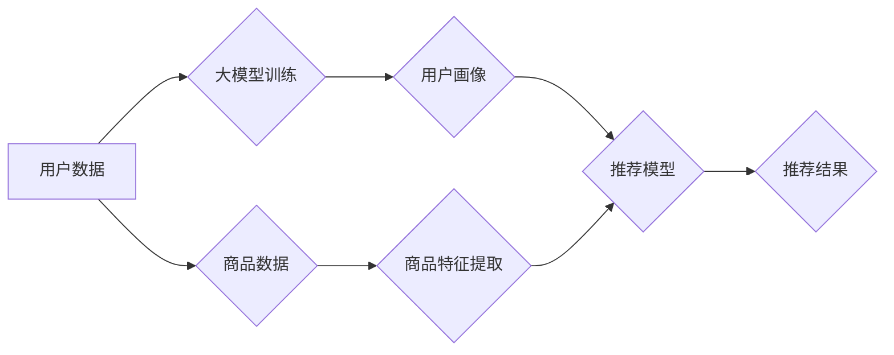

                 

## 大模型如何优化电商平台的实时个性化推荐系统效率

> 关键词：大模型、个性化推荐、电商平台、实时推荐、效率优化、Transformer、BERT、深度学习

## 1. 背景介绍

在当今数据爆炸的时代，电商平台面临着日益激烈的竞争压力。如何精准地推荐用户感兴趣的商品，提升用户体验和转化率，成为电商平台的核心竞争力之一。传统的个性化推荐系统主要依赖于协同过滤、基于内容的过滤等方法，但这些方法在处理海量数据、捕捉用户细微偏好、应对冷启动问题等方面存在一定的局限性。

近年来，大模型技术在自然语言处理、计算机视觉等领域取得了突破性进展，其强大的学习能力和泛化能力为电商平台的个性化推荐系统带来了新的机遇。大模型能够从海量文本、图像、用户行为等数据中学习到更深层的用户特征和商品关联性，从而实现更精准、更个性化的商品推荐。

## 2. 核心概念与联系

### 2.1 个性化推荐系统

个性化推荐系统旨在根据用户的历史行为、偏好、兴趣等信息，推荐用户可能感兴趣的商品或服务。其目标是提高用户体验、提升转化率、促进平台商业价值增长。

### 2.2 大模型

大模型是指参数量巨大、训练数据量庞大的深度学习模型。其强大的学习能力和泛化能力使其能够在各种自然语言处理、计算机视觉等任务中取得优异的性能。

### 2.3 核心架构

大模型在电商平台的个性化推荐系统中主要扮演着以下角色：

* **用户画像构建:** 大模型能够从用户的历史购买记录、浏览记录、评论等数据中学习到用户的兴趣、偏好、消费习惯等特征，构建更加精准的用户画像。
* **商品特征提取:** 大模型能够从商品的标题、描述、图片等多模态数据中提取商品的特征，例如商品类别、品牌、属性、风格等，构建商品的语义表示。
* **推荐模型训练:** 大模型可以作为推荐模型的核心组件，学习用户和商品之间的关系，预测用户对商品的兴趣和点击概率。

**Mermaid 流程图**



## 3. 核心算法原理 & 具体操作步骤

### 3.1 算法原理概述

大模型在电商平台的个性化推荐系统中，常用的算法包括Transformer、BERT等。这些算法基于深度学习，能够学习到用户和商品之间的复杂关系，实现更精准的推荐。

* **Transformer:** Transformer是一种基于注意力机制的序列模型，能够有效地捕捉长距离依赖关系，在自然语言处理任务中取得了优异的性能。在电商平台的个性化推荐系统中，Transformer可以用于学习用户历史行为序列和商品特征序列之间的关系，预测用户对商品的兴趣。
* **BERT:** BERT是一种基于Transformer的预训练语言模型，能够理解上下文信息，在文本分类、问答等任务中取得了突破性进展。在电商平台的个性化推荐系统中，BERT可以用于理解用户的商品查询意图，提取商品的语义特征，从而实现更精准的商品推荐。

### 3.2 算法步骤详解

**Transformer**

1. **输入编码:** 将用户的历史行为序列和商品特征序列编码成向量表示。
2. **多头注意力机制:** 利用多头注意力机制学习用户历史行为和商品特征之间的关系，捕捉长距离依赖关系。
3. **前馈神经网络:** 对注意力输出进行进一步处理，提取更深层的特征表示。
4. **输出层:** 将特征表示输入到输出层，预测用户对商品的兴趣或点击概率。

**BERT**

1. **预训练:** 在大量的文本数据上预训练BERT模型，学习到语言的语义表示。
2. **下游任务微调:** 将预训练的BERT模型用于电商平台的个性化推荐任务，在少量的数据上进行微调，使其能够理解用户的商品查询意图和商品的语义特征。
3. **推荐:** 根据用户的商品查询意图和商品的语义特征，利用BERT模型进行商品推荐。

### 3.3 算法优缺点

**Transformer**

* **优点:** 能够有效地捕捉长距离依赖关系，在处理序列数据时具有较强的表达能力。
* **缺点:** 计算复杂度较高，训练时间较长。

**BERT**

* **优点:** 预训练模型能够有效地利用已有知识，在处理文本理解任务时具有较强的性能。
* **缺点:** 需要大量的预训练数据，训练成本较高。

### 3.4 算法应用领域

* **电商平台个性化推荐:** 推荐用户可能感兴趣的商品，提升用户体验和转化率。
* **内容推荐:** 推荐用户可能感兴趣的文章、视频、音乐等内容。
* **搜索引擎结果排序:** 根据用户的搜索意图，排序搜索结果，提高搜索效率。

## 4. 数学模型和公式 & 详细讲解 & 举例说明

### 4.1 数学模型构建

在电商平台的个性化推荐系统中，常用的数学模型包括协同过滤模型、内容过滤模型、深度学习模型等。

* **协同过滤模型:** 基于用户的历史行为数据，预测用户对商品的兴趣。
* **内容过滤模型:** 基于商品的特征数据，预测用户对商品的兴趣。
* **深度学习模型:** 利用深度神经网络学习用户和商品之间的复杂关系，预测用户对商品的兴趣。

### 4.2 公式推导过程

**协同过滤模型**

协同过滤模型常用的公式是基于矩阵分解的方法，例如：

$$
r_{ui} = p_u^T q_i
$$

其中：

* $r_{ui}$ 表示用户 $u$ 对商品 $i$ 的评分或偏好度。
* $p_u$ 表示用户 $u$ 的潜在特征向量。
* $q_i$ 表示商品 $i$ 的潜在特征向量。

**内容过滤模型**

内容过滤模型常用的公式是基于机器学习的分类算法，例如：

$$
y = f(x_1w_1 + x_2w_2 + ... + x_nw_n + b)
$$

其中：

* $y$ 表示预测的用户对商品的兴趣。
* $x_1, x_2, ..., x_n$ 表示商品的特征向量。
* $w_1, w_2, ..., w_n$ 表示特征权重。
* $b$ 表示偏置项。
* $f$ 表示激活函数。

### 4.3 案例分析与讲解

**案例:** 假设有一个电商平台，用户 $u$ 对商品 $i$ 的评分为 4，用户 $u$ 的潜在特征向量为 $[0.2, 0.5, 0.8]$, 商品 $i$ 的潜在特征向量为 $[0.3, 0.1, 0.6]$. 

根据协同过滤模型的公式，可以计算出用户 $u$ 对商品 $i$ 的评分为：

$$
r_{ui} = [0.2, 0.5, 0.8] * [0.3, 0.1, 0.6] = 0.06 + 0.05 + 0.48 = 0.6
$$

## 5. 项目实践：代码实例和详细解释说明

### 5.1 开发环境搭建

* **操作系统:** Linux/macOS
* **编程语言:** Python
* **深度学习框架:** TensorFlow/PyTorch
* **其他工具:** Git、Jupyter Notebook

### 5.2 源代码详细实现

```python
# 使用 TensorFlow 构建 Transformer 模型
import tensorflow as tf

# 定义 Transformer 模型
class Transformer(tf.keras.Model):
    def __init__(self, vocab_size, embedding_dim, num_heads, num_layers):
        super(Transformer, self).__init__()
        self.embedding = tf.keras.layers.Embedding(vocab_size, embedding_dim)
        self.transformer_layers = tf.keras.layers.StackedRNNCells([
            tf.keras.layers.MultiHeadAttention(num_heads=num_heads, key_dim=embedding_dim)
            for _ in range(num_layers)
        ])

    def call(self, inputs):
        # Embedding 层将输入序列转换为向量表示
        embedded_inputs = self.embedding(inputs)
        # Transformer 层处理嵌入后的输入序列
        outputs = self.transformer_layers(embedded_inputs)
        return outputs

# 实例化 Transformer 模型
model = Transformer(vocab_size=10000, embedding_dim=128, num_heads=8, num_layers=6)

# 训练模型
model.compile(optimizer='adam', loss='mse')
model.fit(x_train, y_train, epochs=10)

```

### 5.3 代码解读与分析

* **Embedding 层:** 将输入序列转换为向量表示，每个词语对应一个向量。
* **Transformer 层:** 利用多头注意力机制和前馈神经网络，学习用户历史行为和商品特征之间的关系。
* **训练模型:** 使用 Adam 优化器和均方误差损失函数训练模型。

### 5.4 运行结果展示

训练完成后，可以使用模型预测用户对商品的兴趣，并与实际评分进行比较，评估模型的性能。

## 6. 实际应用场景

### 6.1 个性化商品推荐

大模型可以根据用户的历史购买记录、浏览记录、评论等数据，学习用户的兴趣偏好，推荐用户可能感兴趣的商品。

### 6.2 个性化内容推荐

大模型可以根据用户的阅读习惯、观看记录、点赞等数据，推荐用户可能感兴趣的文章、视频、音乐等内容。

### 6.3 个性化广告推荐

大模型可以根据用户的兴趣爱好、消费习惯等数据，推荐用户可能感兴趣的广告。

### 6.4 未来应用展望

* **更精准的推荐:** 大模型能够学习到更深层的用户特征和商品关联性，实现更精准的推荐。
* **多模态推荐:** 大模型能够融合文本、图像、视频等多模态数据，实现更丰富的推荐体验。
* **实时推荐:** 大模型能够实时更新用户画像和商品特征，实现更及时、更精准的推荐。

## 7. 工具和资源推荐

### 7.1 学习资源推荐

* **书籍:**
    * 《深度学习》
    * 《自然语言处理》
* **在线课程:**
    * Coursera
    * edX
* **开源项目:**
    * TensorFlow
    * PyTorch

### 7.2 开发工具推荐

* **IDE:** PyCharm, VS Code
* **深度学习框架:** TensorFlow, PyTorch
* **数据处理工具:** Pandas, NumPy

### 7.3 相关论文推荐

* **BERT:** Devlin, J., Chang, M. W., Lee, K., & Toutanova, K. (2018). BERT: Pre-training of deep bidirectional transformers for language understanding. arXiv preprint arXiv:1810.04805.
* **Transformer:** Vaswani, A., Shazeer, N., Parmar, N., Uszkoreit, J., Jones, L., Gomez, A. N., ... & Polosukhin, I. (2017). Attention is all you need. In Advances in neural information processing systems (pp. 5998-6008).

## 8. 总结：未来发展趋势与挑战

### 8.1 研究成果总结

大模型在电商平台的个性化推荐系统中取得了显著的成果，能够实现更精准、更个性化的商品推荐，提升用户体验和转化率。

### 8.2 未来发展趋势

* **模型规模和能力提升:** 大模型的规模和能力将继续提升，能够学习到更深层的用户特征和商品关联性，实现更精准的推荐。
* **多模态融合:** 大模型将融合文本、图像、视频等多模态数据，实现更丰富的推荐体验。
* **实时推荐:** 大模型将实现实时更新用户画像和商品特征，实现更及时、更精准的推荐。

### 8.3 面临的挑战

* **数据隐私和安全:** 大模型需要大量的用户数据进行训练，如何保护用户数据隐私和安全是一个重要的挑战。
* **模型解释性和可解释性:** 大模型的决策过程往往是复杂的，如何提高模型的解释性和可解释性是一个重要的研究方向。
* **模型训练成本:** 大模型的训练成本很高，如何降低模型训练成本是一个重要的技术挑战。

### 8.4 研究展望

未来，大模型在电商平台的个性化推荐系统中将发挥越来越重要的作用，为用户提供更精准、更个性化的商品推荐体验。


## 9. 附录：常见问题与解答

**Q1: 大模型的训练需要多少数据？**

A1: 大模型的训练需要大量的训练数据，通常需要百万甚至数十亿条数据。

**Q2: 大模型的训练成本很高吗？**

A2: 是的，大模型的训练成本很高，需要强大的计算资源和大量的电力消耗。

**Q3: 如何保护用户数据隐私？**

A3: 在训练大模型时，需要采取措施保护用户数据隐私，例如数据匿名化、联邦学习等。


作者：禅与计算机程序设计艺术 / Zen and the Art of Computer Programming 
<end_of_turn>

