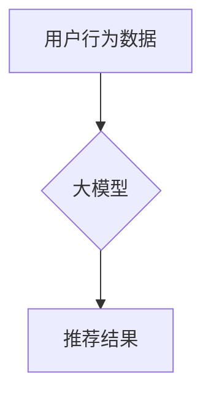

                 

## 大模型直接生成推荐结果的可能性探索

> 关键词：大模型、推荐系统、直接生成、Transformer、Fine-tuning、潜在语义、个性化推荐

## 1. 背景介绍

推荐系统是信息时代的核心技术之一，旨在根据用户的历史行为、偏好和上下文信息，预测用户可能感兴趣的内容，并将其推荐给用户。传统的推荐系统主要依赖于基于内容的过滤、协同过滤和基于用户的模型，这些模型通常需要大量的用户数据和复杂的特征工程。

近年来，大模型的快速发展为推荐系统带来了新的机遇。大模型，例如 GPT-3、BERT 和 T5 等，拥有强大的文本理解和生成能力，能够从海量文本数据中学习到丰富的语义知识和模式。这使得直接使用大模型进行推荐成为一种新的可能性。

## 2. 核心概念与联系

### 2.1  大模型

大模型是指参数量在数十亿甚至千亿级别的神经网络模型，通过训练海量文本数据，能够掌握丰富的语言知识和模式。大模型通常基于 Transformer 架构，具有强大的文本理解和生成能力。

### 2.2  推荐系统

推荐系统旨在根据用户的历史行为、偏好和上下文信息，预测用户可能感兴趣的内容，并将其推荐给用户。传统的推荐系统主要依赖于基于内容的过滤、协同过滤和基于用户的模型。

### 2.3  直接生成推荐

直接生成推荐是指利用大模型直接从用户的历史行为、偏好和上下文信息中生成推荐结果，无需复杂的特征工程和模型训练过程。

**核心概念与联系流程图:**



## 3. 核心算法原理 & 具体操作步骤

### 3.1  算法原理概述

直接生成推荐的核心算法原理是利用大模型的强大的文本理解和生成能力，从用户的历史行为、偏好和上下文信息中学习到用户的潜在需求，并直接生成符合用户需求的推荐结果。

### 3.2  算法步骤详解

1. **数据预处理:** 收集用户的历史行为数据，例如浏览记录、购买记录、评分记录等，并进行清洗、格式化和编码。
2. **大模型预训练:** 使用预训练的大模型，例如 GPT-3 或 T5，在海量文本数据上进行预训练，使其掌握丰富的语言知识和模式。
3. **模型微调:** 将预训练的大模型进行微调，使用用户的历史行为数据进行训练，使其能够更好地理解用户的潜在需求。
4. **推荐结果生成:** 根据用户的当前行为和上下文信息，输入到微调后的模型中，模型会根据学习到的知识和模式，直接生成符合用户需求的推荐结果。

### 3.3  算法优缺点

**优点:**

* **无需复杂的特征工程:** 直接使用大模型，无需手动设计和提取特征，简化了推荐系统的开发过程。
* **强大的个性化推荐能力:** 大模型能够学习到用户的潜在需求，提供更个性化的推荐结果。
* **可扩展性强:** 大模型可以轻松扩展到新的领域和数据类型。

**缺点:**

* **训练成本高:** 大模型的训练需要大量的计算资源和时间。
* **数据依赖性强:** 大模型的性能依赖于训练数据的质量和数量。
* **解释性差:** 大模型的决策过程难以解释，难以理解模型是如何生成推荐结果的。

### 3.4  算法应用领域

直接生成推荐算法可以应用于各种场景，例如：

* **电商推荐:** 推荐商品、优惠券、促销活动等。
* **内容推荐:** 推荐文章、视频、音乐等。
* **社交推荐:** 推荐好友、群组、话题等。
* **新闻推荐:** 推荐新闻、博客文章等。

## 4. 数学模型和公式 & 详细讲解 & 举例说明

### 4.1  数学模型构建

直接生成推荐算法通常使用 Transformer 架构，其核心是注意力机制。注意力机制能够学习到文本中不同词语之间的关系，并赋予重要词语更高的权重。

**注意力机制公式:**

$$
Attention(Q, K, V) = softmax(\frac{QK^T}{\sqrt{d_k}})V
$$

其中：

* $Q$：查询矩阵
* $K$：键矩阵
* $V$：值矩阵
* $d_k$：键向量的维度
* $softmax$：softmax 函数

### 4.2  公式推导过程

注意力机制的公式通过计算查询向量 $Q$ 与键向量 $K$ 的点积，并使用 softmax 函数将其归一化，得到每个键向量对应的权重。然后，将这些权重与值向量 $V$ 进行加权求和，得到最终的注意力输出。

### 4.3  案例分析与讲解

假设我们有一个句子 "我喜欢吃苹果和香蕉"，我们想要预测下一个词语。可以使用注意力机制来学习到 "苹果" 和 "香蕉" 对 "我喜欢吃" 的影响，并根据这些影响预测下一个词语。

## 5. 项目实践：代码实例和详细解释说明

### 5.1  开发环境搭建

推荐使用 Python 语言和 PyTorch 或 TensorFlow 深度学习框架进行开发。

### 5.2  源代码详细实现

```python
import torch
import torch.nn as nn

class Recommender(nn.Module):
    def __init__(self, vocab_size, embedding_dim, num_heads):
        super(Recommender, self).__init__()
        self.embedding = nn.Embedding(vocab_size, embedding_dim)
        self.transformer = nn.Transformer(d_model=embedding_dim, nhead=num_heads)
        self.linear = nn.Linear(embedding_dim, vocab_size)

    def forward(self, input_ids):
        embeddings = self.embedding(input_ids)
        output = self.transformer(embeddings)
        output = self.linear(output[:, -1, :])
        return output
```

### 5.3  代码解读与分析

* `Recommender` 类定义了一个推荐模型，包含嵌入层、Transformer 层和线性层。
* `embedding` 层将输入的词语 ID 映射到词向量。
* `transformer` 层利用注意力机制学习到词语之间的关系。
* `linear` 层将 Transformer 输出映射到目标词语的概率分布。

### 5.4  运行结果展示

训练完成后，可以使用模型对用户的历史行为数据进行预测，并生成推荐结果。

## 6. 实际应用场景

### 6.1  电商推荐

直接生成推荐算法可以用于推荐商品、优惠券、促销活动等。例如，当用户浏览某个商品时，模型可以根据用户的浏览历史、购买记录和商品信息，直接生成推荐的其他相关商品。

### 6.2  内容推荐

直接生成推荐算法可以用于推荐文章、视频、音乐等。例如，当用户阅读某个新闻时，模型可以根据用户的阅读历史、兴趣标签和新闻内容，直接生成推荐其他相关新闻。

### 6.3  个性化推荐

直接生成推荐算法可以根据用户的个性化需求生成推荐结果。例如，可以根据用户的年龄、性别、兴趣爱好等信息，生成个性化的商品推荐、内容推荐和社交推荐。

### 6.4  未来应用展望

随着大模型技术的不断发展，直接生成推荐算法将在更多领域得到应用，例如：

* **医疗推荐:** 推荐疾病诊断、治疗方案和药物。
* **教育推荐:** 推荐学习资源、课程和辅导。
* **金融推荐:** 推荐理财产品、投资策略和贷款方案。

## 7. 工具和资源推荐

### 7.1  学习资源推荐

* **论文:**

    * "BERT: Pre-training of Deep Bidirectional Transformers for Language Understanding"
    * "Attention Is All You Need"
    * "T5: Text-to-Text Transfer Transformer"

* **博客:**

    * The Illustrated Transformer
    * Jay Alammar's Blog

### 7.2  开发工具推荐

* **PyTorch:** https://pytorch.org/
* **TensorFlow:** https://www.tensorflow.org/

### 7.3  相关论文推荐

* "Exploring the Limits of Transfer Learning with a Unified Text-to-Text Transformer"
* "Language Models are Few-Shot Learners"
* "Scaling Laws for Neural Language Models"

## 8. 总结：未来发展趋势与挑战

### 8.1  研究成果总结

直接生成推荐算法利用大模型的强大能力，为推荐系统带来了新的可能性。它简化了推荐系统的开发过程，提高了推荐的个性化程度，并具有良好的可扩展性。

### 8.2  未来发展趋势

* **模型规模的进一步扩大:** 随着计算资源的不断发展，大模型的规模将进一步扩大，其推荐能力将得到进一步提升。
* **多模态推荐:** 将文本、图像、音频等多种模态信息融合到推荐系统中，实现更全面的用户理解和个性化推荐。
* **可解释性增强:** 研究如何提高大模型的解释性，使推荐结果更加透明和可信。

### 8.3  面临的挑战

* **训练成本高:** 大模型的训练需要大量的计算资源和时间，这对资源有限的机构和个人来说是一个挑战。
* **数据依赖性强:** 大模型的性能依赖于训练数据的质量和数量，缺乏高质量数据的场景下，模型效果难以保证。
* **伦理问题:** 大模型的应用可能带来一些伦理问题，例如数据隐私、算法偏见等，需要引起足够的重视和关注。

### 8.4  研究展望

未来，直接生成推荐算法将继续朝着更强大、更智能、更可解释的方向发展。随着技术的不断进步，大模型将为推荐系统带来更多的创新和突破。

## 9. 附录：常见问题与解答

**Q1: 大模型直接生成推荐算法的准确率如何？**

A1: 大模型直接生成推荐算法的准确率取决于模型的规模、训练数据和应用场景。一般来说，大模型的准确率较高，但仍有提升空间。

**Q2: 大模型直接生成推荐算法的训练成本高吗？**

A2: 是的，大模型的训练成本较高，需要大量的计算资源和时间。

**Q3: 大模型直接生成推荐算法的解释性如何？**

A3: 大模型的决策过程难以解释，其推荐结果的解释性相对较差。


作者：禅与计算机程序设计艺术 / Zen and the Art of Computer Programming 
<end_of_turn>

