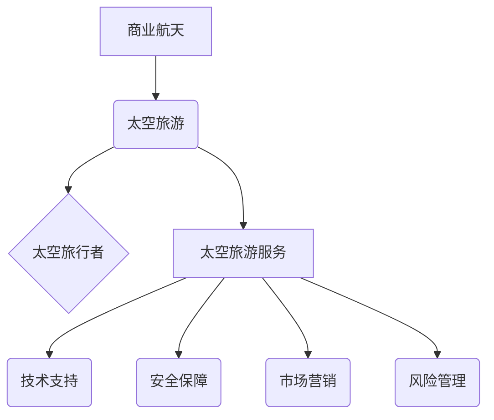

                 

## 太空旅游创业：开拓太空商业的先驱

> 关键词：太空旅游、商业航天、人工智能、软件架构、云计算、数据分析、风险管理

### 1. 背景介绍

人类对太空的探索从未停止，从最初的卫星发射到如今的国际空间站，我们不断突破技术瓶颈，将梦想一步步变成现实。而太空旅游，作为人类探索宇宙的新领域，正逐渐从科幻小说走向现实。随着太空技术的进步和成本的降低，太空旅游将成为未来的一项热门产业，为人类带来全新的体验和机遇。

然而，太空旅游创业并非易事。它面临着诸多挑战，包括技术难度、安全风险、成本高昂、监管政策等。 为了成功开拓太空商业，需要具备强大的技术实力、敏锐的市场洞察力和完善的风险管理体系。

### 2. 核心概念与联系

太空旅游创业的核心概念包括：

* **商业航天:** 指利用航天技术进行商业活动的范畴，包括太空旅游、卫星发射、太空资源开发等。
* **太空旅游:** 指乘坐航天器进入太空进行观赏、体验或进行其他商业活动的活动。
* **太空旅行者:** 指参与太空旅游活动的个人或团体。
* **太空旅游服务:** 指为太空旅行者提供太空旅行相关服务的机构或企业。

**核心概念架构:**



### 3. 核心算法原理 & 具体操作步骤

太空旅游创业需要运用多种算法和技术，例如：

* **轨道计算:** 用于计算航天器在太空中的运动轨迹，确保安全抵达目的地。
* **导航控制:** 用于控制航天器的飞行方向和速度，实现精准的定位和操控。
* **数据分析:** 用于分析太空环境数据，预测潜在风险，优化飞行计划。
* **人工智能:** 用于辅助航天器操作、提供乘客服务、进行故障诊断等。

#### 3.1 算法原理概述

轨道计算算法基于牛顿万有引力定律和航天器运动的动力学方程，通过数值积分方法计算航天器在太空中的运动轨迹。导航控制算法则利用传感器数据和控制指令，实时调整航天器的姿态和速度，实现精准的飞行控制。数据分析算法利用机器学习和统计分析技术，从海量太空环境数据中提取有价值的信息，辅助决策和风险管理。人工智能算法则通过深度学习和强化学习等技术，模拟人类的智能行为，实现自动化控制和智能服务。

#### 3.2 算法步骤详解

**轨道计算算法步骤:**

1. 确定航天器初始状态，包括位置、速度、质量等参数。
2. 根据牛顿万有引力定律和航天器运动的动力学方程，建立轨道运动方程。
3. 利用数值积分方法，例如欧拉法或龙格-库塔法，求解轨道运动方程，得到航天器在不同时间点的轨迹。
4. 分析计算结果，确定航天器到达目标位置的时间和轨迹参数。

**导航控制算法步骤:**

1. 收集航天器姿态和速度传感器数据。
2. 根据控制指令和传感器数据，计算航天器所需的控制力矩和推力。
3. 将控制指令发送到航天器的推进系统和控制系统，实现姿态和速度的调整。
4. 实时监控航天器状态，并根据需要调整控制指令。

#### 3.3 算法优缺点

**轨道计算算法:**

* **优点:** 理论基础扎实，计算精度高。
* **缺点:** 计算量大，对硬件资源要求高。

**导航控制算法:**

* **优点:** 能够实现实时控制，提高航天器飞行精度。
* **缺点:** 算法复杂，对传感器精度要求高。

#### 3.4 算法应用领域

轨道计算和导航控制算法广泛应用于航天领域，包括：

* **卫星发射:** 计算卫星的轨道参数，确保卫星顺利进入预定轨道。
* **空间站建造:** 控制航天器在轨飞行和对接，完成空间站的组装。
* **太空探测:** 计算探测器的轨道参数，确保探测器能够到达目标区域。
* **太空旅游:** 计算太空旅行者的轨道参数，确保安全抵达太空观景点。

### 4. 数学模型和公式 & 详细讲解 & 举例说明

#### 4.1 数学模型构建

太空旅游创业涉及到多个数学模型，例如：

* **轨道运动模型:** 描述航天器在太空中的运动轨迹，主要基于牛顿万有引力定律和航天器运动的动力学方程。
* **成本模型:** 计算太空旅游的成本，包括航天器发射成本、运营成本、乘客服务成本等。
* **风险模型:** 分析太空旅游的潜在风险，例如技术故障、安全事故、环境风险等。

#### 4.2 公式推导过程

**轨道运动模型:**

牛顿万有引力定律:

$$F = G \frac{m_1 m_2}{r^2}$$

其中:

* $F$ 是万有引力
* $G$ 是万有引力常数
* $m_1$ 和 $m_2$ 分别是两个物体的质量
* $r$ 是两个物体之间的距离

根据牛顿第二定律:

$$F = m a$$

其中:

* $m$ 是航天器的质量
* $a$ 是航天器的加速度

将这两个公式结合起来，可以得到航天器的轨道运动方程。

#### 4.3 案例分析与讲解

假设一颗卫星绕地球运行，地球的质量为 $M_e$，卫星的质量为 $m$，地球半径为 $R_e$，卫星轨道半径为 $r$。

根据牛顿万有引力定律和牛顿第二定律，可以推导出卫星的轨道速度:

$$v = \sqrt{\frac{GM_e}{r}}$$

其中 $G$ 是万有引力常数，$M_e$ 是地球的质量，$r$ 是卫星轨道半径。

这个公式可以用来计算卫星在不同轨道高度上的速度。

### 5. 项目实践：代码实例和详细解释说明

#### 5.1 开发环境搭建

太空旅游创业项目需要搭建一个完善的开发环境，包括：

* **硬件平台:** 高性能计算服务器、存储设备、网络设备等。
* **软件平台:** 操作系统、编程语言、数据库、云计算平台等。
* **开发工具:** 代码编辑器、调试工具、版本控制系统等。

#### 5.2 源代码详细实现

以下是一个简单的轨道计算算法的Python代码示例:

```python
import numpy as np

# 万有引力常数
G = 6.67430e-11

# 地球质量
M_e = 5.972e24

# 地球半径
R_e = 6.371e6

# 卫星质量
m = 1000

# 卫星轨道半径
r = R_e + 100e3

# 计算卫星的轨道速度
v = np.sqrt(G * M_e / r)

print(f"卫星的轨道速度为: {v} m/s")
```

#### 5.3 代码解读与分析

这段代码首先定义了万有引力常数、地球质量、地球半径、卫星质量和卫星轨道半径。然后，利用公式计算卫星的轨道速度，并打印结果。

#### 5.4 运行结果展示

运行这段代码后，会输出卫星的轨道速度，例如：

```
卫星的轨道速度为: 7668.94796783 m/s
```

### 6. 实际应用场景

太空旅游创业的实际应用场景包括：

* **观赏太空景色:** 乘坐航天器进入太空，观赏地球、月球、星星等壮丽景色。
* **体验失重环境:** 在太空环境中体验失重的感觉，进行太空运动和娱乐活动。
* **进行太空研究:** 为科学研究提供平台，例如进行太空生物实验、观测宇宙现象等。
* **太空商业活动:** 在太空进行商业活动，例如太空广告、太空旅游服务等。

#### 6.4 未来应用展望

未来，太空旅游将更加普及和多样化，例如：

* **太空酒店:** 在太空建造酒店，为游客提供住宿和餐饮服务。
* **太空游乐园:** 在太空建造游乐园，提供各种太空娱乐项目。
* **太空采矿:** 在太空开采资源，例如小行星上的金属矿物。
* **太空殖民:** 在太空建立殖民地，为人类开拓新的家园。

### 7. 工具和资源推荐

#### 7.1 学习资源推荐

* **书籍:** 《太空旅行: 从梦想到现实》
* **网站:** NASA官网、SpaceX官网
* **课程:** Coursera上的“太空探索”课程

#### 7.2 开发工具推荐

* **编程语言:** Python、C++、Java
* **软件平台:** Linux、Windows、macOS
* **云计算平台:** AWS、Azure、GCP

#### 7.3 相关论文推荐

* **“太空旅游的经济可行性分析”**
* **“太空旅游的风险管理策略”**
* **“太空旅游的社会影响”**

### 8. 总结：未来发展趋势与挑战

#### 8.1 研究成果总结

太空旅游创业是一个充满机遇和挑战的领域。通过运用先进的科技手段，我们可以克服技术难题，降低成本，提高安全性，为人类带来更加便捷、安全、舒适的太空旅行体验。

#### 8.2 未来发展趋势

未来，太空旅游将朝着以下方向发展:

* **更加普及化:**  太空旅游成本将进一步降低，更多人能够体验太空旅行。
* **更加多样化:**  太空旅游产品将更加丰富，例如太空酒店、太空游乐园等。
* **更加智能化:**  人工智能将被广泛应用于太空旅游，例如自动驾驶航天器、智能服务机器人等。

#### 8.3 面临的挑战

太空旅游创业仍然面临着诸多挑战，例如:

* **技术难题:**  航天器技术、生命支持系统、太空环境适应等方面仍需突破。
* **安全风险:**  太空飞行存在着安全风险，需要完善的风险管理体系。
* **成本高昂:**  太空旅游成本仍然较高，需要进一步降低成本。
* **监管政策:**  太空旅游的监管政策尚不完善，需要制定相应的法律法规。

#### 8.4 研究展望

未来，我们需要继续加强太空旅游技术的研发，完善风险管理体系，降低成本，制定完善的监管政策，推动太空旅游产业健康发展。

### 9. 附录：常见问题与解答

* **太空旅游安全吗？**

太空旅游存在一定的风险，但随着技术的进步和安全措施的完善，风险将得到有效控制。

* **太空旅游费用是多少？**

目前，太空旅游费用较高，但随着技术的进步和市场竞争的加剧，费用将逐渐降低。

* **谁可以去太空旅游？**

目前，太空旅游主要面向富裕人群，但随着技术的进步和成本的降低，未来将更加普及。


作者：禅与计算机程序设计艺术 / Zen and the Art of Computer Programming 
<end_of_turn>

