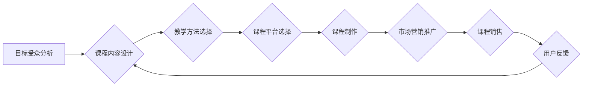

                 

## 打造技术型知识付费课程:方法与技巧

> 关键词：知识付费、技术课程、课程设计、教学方法、在线教育、技术传播、市场营销、商业模式

## 1. 背景介绍

近年来，随着互联网技术的快速发展和普及，在线教育行业蓬勃发展，知识付费模式也逐渐成为一种主流的学习方式。技术型知识付费课程作为其中重要的一部分，凭借其专业性、实用性和高价值性，吸引了越来越多的学习者和创作者。

技术型知识付费课程的优势在于：

* **专业性强:**  由行业专家或资深工程师授课，内容深度和专业性高，能够满足学习者对特定技术领域的深入学习需求。
* **实用性强:**  课程内容注重实践应用，通过案例分析、代码实战等方式，帮助学习者快速掌握技术技能，提升实际工作能力。
* **价值高:**  技术技能是职场竞争力的重要因素，掌握先进的技术知识能够提升个人价值，获得更好的职业发展机会。

然而，技术型知识付费课程的市场竞争也日益激烈，创作者需要不断提升课程质量和竞争力，才能在激烈的市场竞争中脱颖而出。

## 2. 核心概念与联系

技术型知识付费课程的成功构建需要结合多个核心概念和环节，形成一个完整的闭环体系。

**核心概念:**

* **目标受众:**  明确课程的目标受众群体，包括他们的技术背景、学习目标和需求。
* **课程内容:**  根据目标受众的学习需求，设计课程内容框架，确保内容的深度、广度和实用性。
* **教学方法:**  选择合适的教学方法，例如视频讲解、代码实战、案例分析、在线答疑等，提高学习者的参与度和理解能力。
* **课程平台:**  选择合适的在线教育平台，提供稳定的课程发布、管理和互动功能。
* **市场营销:**  制定有效的市场营销策略，推广课程，吸引目标受众。

**课程构建流程:**

## 3. 核心算法原理 & 具体操作步骤

**3.1 算法原理概述**

在技术型知识付费课程中，算法是核心内容之一。选择合适的算法，并对其原理进行深入讲解，能够帮助学习者理解技术背后的逻辑，提升学习效果。

**3.2 算法步骤详解**

对于每个算法，需要详细阐述其步骤，并结合代码示例进行演示，让学习者能够清晰地理解算法的执行流程。

**3.3 算法优缺点**

需要分析算法的优缺点，包括时间复杂度、空间复杂度、适用场景等，帮助学习者选择合适的算法，并根据实际情况进行优化。

**3.4 算法应用领域**

介绍算法在实际应用中的场景，例如机器学习、数据挖掘、图像处理等，帮助学习者了解算法的价值和应用范围。

## 4. 数学模型和公式 & 详细讲解 & 举例说明

**4.1 数学模型构建**

对于一些需要数学模型支撑的技术，需要构建数学模型，并解释模型的含义和应用场景。

**4.2 公式推导过程**

详细推导公式，并解释每个公式的含义和作用，帮助学习者理解数学模型背后的逻辑。

**4.3 案例分析与讲解**

通过案例分析，将数学模型和公式应用到实际问题中，帮助学习者理解数学模型的应用价值。

**举例说明:**

假设我们想要构建一个推荐系统的数学模型，可以使用协同过滤算法。

$$
R(u, i) = \frac{\sum_{v \in N(u)} \sum_{j \in N(v)} r(v, j) * s(u, v)}{\sum_{v \in N(u)} \sum_{j \in N(v)} s(u, v)}
$$

其中：

* $R(u, i)$ 表示用户 $u$ 对物品 $i$ 的评分预测值。
* $r(v, j)$ 表示用户 $v$ 对物品 $j$ 的真实评分。
* $s(u, v)$ 表示用户 $u$ 和用户 $v$ 的相似度。

这个公式通过计算用户 $u$ 和与其相似用户的评分偏好，来预测用户 $u$ 对物品 $i$ 的评分。

## 5. 项目实践：代码实例和详细解释说明

**5.1 开发环境搭建**

提供详细的开发环境搭建步骤，包括软件安装、配置环境变量等。

**5.2 源代码详细实现**

提供完整的源代码，并进行逐行解释，帮助学习者理解代码的逻辑和功能。

**5.3 代码解读与分析**

对代码进行深入解读和分析，解释代码的设计思想、算法实现、数据结构等，帮助学习者提升代码阅读和理解能力。

**5.4 运行结果展示**

展示代码运行的结果，并进行分析解释，帮助学习者验证代码的正确性和效果。

## 6. 实际应用场景

**6.1 应用场景介绍**

介绍技术在实际应用中的场景，例如在金融、医疗、电商等行业中的应用。

**6.2 案例分析**

通过案例分析，展示技术在实际应用中的效果和价值。

**6.3 未来应用展望**

展望技术的未来发展趋势，以及在未来应用中的潜力。

## 7. 工具和资源推荐

**7.1 学习资源推荐**

推荐一些相关的学习资源，例如书籍、论文、在线课程等。

**7.2 开发工具推荐**

推荐一些常用的开发工具，例如IDE、版本控制系统、调试工具等。

**7.3 相关论文推荐**

推荐一些相关的技术论文，帮助学习者深入了解技术原理和发展趋势。

## 8. 总结：未来发展趋势与挑战

**8.1 研究成果总结**

总结技术领域的研究成果，并分析其对技术的推动作用。

**8.2 未来发展趋势**

展望技术的未来发展趋势，例如人工智能、云计算、大数据等领域的应用。

**8.3 面临的挑战**

分析技术发展过程中面临的挑战，例如技术瓶颈、伦理问题、安全问题等。

**8.4 研究展望**

展望未来技术研究的方向，以及需要解决的关键问题。

## 9. 附录：常见问题与解答

解答一些常见的问题，例如课程学习方法、技术应用场景、平台使用技巧等。

作者：禅与计算机程序设计艺术 / Zen and the Art of Computer Programming 
<end_of_turn>

