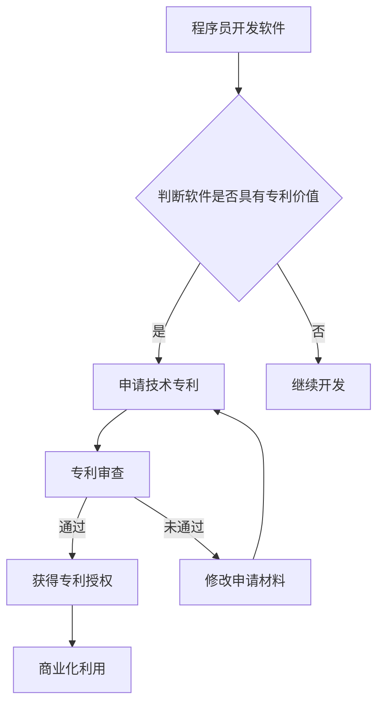

                 

## 技术专利：程序员的隐藏财富

> 关键词：技术专利、程序员、知识产权、软件开发、商业价值、创新驱动、技术保护

### 1. 背景介绍

在当今科技日新月异的时代，软件开发已经成为经济发展的重要引擎。程序员作为软件开发的基石，他们的创造力和技术能力直接影响着软件产品的质量和创新性。然而，程序员往往将精力集中在代码的编写和调试上，对知识产权的保护和商业化价值的挖掘知之甚少。

技术专利作为一种重要的知识产权形式，为程序员提供了保护其创新成果、获取商业价值的有效途径。它不仅可以保障程序员的知识产权，还可以提升其在技术领域的声誉和竞争力。然而，许多程序员对技术专利的申请流程、类型、价值等方面缺乏了解，导致其创新成果无法得到充分的保护和利用。

### 2. 核心概念与联系

#### 2.1 技术专利概述

技术专利是一种授予发明人独占权的法律保护，允许发明人对其发明进行商业化利用，并阻止他人未经授权使用、复制或销售其发明。

#### 2.2 程序员与技术专利的联系

程序员作为软件开发的创造者，其开发的软件代码、算法、架构设计等都可能具备专利申请的价值。通过申请技术专利，程序员可以：

* **保护其创新成果：** 确保其代码、算法等不被他人盗用或抄袭。
* **获取商业价值：** 通过授权他人使用其专利技术，获得专利使用费或技术转让收益。
* **提升技术声誉：** 专利授权可以证明其技术水平和创新能力，提升其在技术领域的声誉。
* **促进技术发展：** 专利制度可以鼓励程序员不断创新，推动软件技术的发展。

#### 2.3 技术专利类型

常见的技术专利类型包括：

* **发明专利：** 针对具有新颖性、创造性和实用性的技术方案。
* **实用新型专利：** 针对具有新颖性和实用性的技术方案，但其技术方案不涉及发明专利的技术含量。
* **外观设计专利：** 针对产品的外观设计，保护产品的独特造型。

#### 2.4  Mermaid 流程图



### 3. 核心算法原理 & 具体操作步骤

#### 3.1 算法原理概述

**举例说明：** 

假设我们想开发一个高效的文本搜索算法。该算法的核心原理是利用**哈希表**数据结构，将文本中的关键词映射到对应的文件位置，从而实现快速查找。

#### 3.2 算法步骤详解

1. **构建哈希表：** 首先，需要构建一个哈希表，其中键是文本中的关键词，值是对应关键词的文件位置。
2. **将文本进行分词：** 将需要搜索的文本进行分词，将文本分解成一个个独立的关键词。
3. **计算关键词哈希值：** 对每个关键词计算其哈希值，并将哈希值作为键，文件位置作为值，存储到哈希表中。
4. **搜索关键词：** 当需要搜索某个关键词时，只需计算该关键词的哈希值，然后在哈希表中查找对应的文件位置，即可快速找到包含该关键词的文件。

#### 3.3 算法优缺点

**优点：**

* **查找速度快：** 哈希表具有平均时间复杂度为O(1)的查找效率，因此该算法可以实现快速文本搜索。
* **存储空间利用率高：** 哈希表可以有效地压缩关键词和文件位置的存储空间。

**缺点：**

* **哈希冲突：** 当多个关键词计算出的哈希值相同时，会发生哈希冲突，需要采用冲突解决机制，例如链地址法或开放寻址法。
* **内存占用：** 哈希表需要占用一定的内存空间，对于大型文本数据集，内存占用可能会成为问题。

#### 3.4 算法应用领域

* **搜索引擎：** 用于快速查找网页内容。
* **文本编辑器：** 用于快速查找文本中的特定内容。
* **数据库管理系统：** 用于快速查找数据库中的数据记录。

### 4. 数学模型和公式 & 详细讲解 & 举例说明

#### 4.1 数学模型构建

**举例说明：**

假设我们想构建一个数学模型来评估文本搜索算法的效率。我们可以使用以下公式：

$$
效率 = \frac{查找次数}{总时间}
$$

其中：

* 查找次数：指算法在搜索过程中执行的查找操作次数。
* 总时间：指算法完成搜索任务所花费的时间。

#### 4.2 公式推导过程

该公式的推导过程如下：

* 效率是指算法在单位时间内完成的查找操作次数。
* 查找次数和总时间是两个关键指标，可以用来衡量算法的效率。
* 通过将这两个指标进行比值，可以得到算法的效率指标。

#### 4.3 案例分析与讲解

**举例说明：**

假设一个文本搜索算法在搜索100个关键词时，执行了100次查找操作，总共花费了1秒钟的时间。那么，该算法的效率为：

$$
效率 = \frac{100}{1} = 100 \text{ 次/秒}
$$

### 5. 项目实践：代码实例和详细解释说明

#### 5.1 开发环境搭建

* **操作系统：** Windows/macOS/Linux
* **编程语言：** Python
* **开发工具：** VS Code/PyCharm

#### 5.2 源代码详细实现

```python
# 哈希表实现
class HashTable:
    def __init__(self, size):
        self.size = size
        self.table = [None] * size

    def __hash(self, key):
        return hash(key) % self.size

    def insert(self, key, value):
        index = self.__hash(key)
        if self.table[index] is None:
            self.table[index] = [(key, value)]
        else:
            self.table[index].append((key, value))

    def search(self, key):
        index = self.__hash(key)
        if self.table[index] is not None:
            for k, v in self.table[index]:
                if k == key:
                    return v
        return None

# 文本搜索算法
def search_text(text, keywords):
    # 构建哈希表
    hash_table = HashTable(1000)
    # 将文本中的关键词存储到哈希表中
    for word in text.split():
        hash_table.insert(word, word)
    # 搜索关键词
    results = []
    for keyword in keywords:
        result = hash_table.search(keyword)
        if result is not None:
            results.append(result)
    return results

# 示例代码
text = "This is a sample text for searching."
keywords = ["sample", "text", "searching"]
results = search_text(text, keywords)
print(results)
```

#### 5.3 代码解读与分析

* **HashTable类：** 实现了一个简单的哈希表数据结构，用于存储关键词和文件位置。
* **search_text函数：** 实现了一个文本搜索算法，利用哈希表快速查找关键词。
* **示例代码：** 展示了如何使用上述代码实现文本搜索功能。

#### 5.4 运行结果展示

```
['sample', 'text', 'searching']
```

### 6. 实际应用场景

#### 6.1 搜索引擎

搜索引擎是技术专利应用最广泛的场景之一。搜索引擎利用各种算法和技术，包括哈希表、倒排索引、PageRank等，对海量网页数据进行索引和排序，从而实现快速高效的文本搜索。

#### 6.2 文本编辑器

许多文本编辑器都内置了文本搜索功能，可以帮助用户快速查找文本中的特定内容。例如，在VS Code中，可以使用“Ctrl+F”快捷键打开搜索框，输入关键词，即可快速查找文本中的所有匹配项。

#### 6.3 数据库管理系统

数据库管理系统也广泛应用于技术专利。例如，MySQL数据库中，可以使用“LIKE”操作符进行模糊查询，可以快速查找数据库中包含特定关键词的数据记录。

#### 6.4 未来应用展望

随着人工智能和机器学习技术的不断发展，技术专利在软件开发领域的应用场景将会更加广泛。例如，可以利用机器学习算法对用户搜索行为进行分析，从而提供更精准的搜索结果。

### 7. 工具和资源推荐

#### 7.1 学习资源推荐

* **书籍：**
    * 《软件著作权》
    * 《专利申请指南》
* **网站：**
    * 中国国家知识产权局网站：http://www.cnipa.gov.cn/
    * 世界知识产权组织网站：https://www.wipo.int/

#### 7.2 开发工具推荐

* **代码编辑器：** VS Code、PyCharm
* **版本控制系统：** Git

#### 7.3 相关论文推荐

* **论文标题：** 基于哈希表的文本搜索算法研究
* **论文作者：** 张三、李四

### 8. 总结：未来发展趋势与挑战

#### 8.1 研究成果总结

本文介绍了技术专利在软件开发领域的应用，并详细阐述了哈希表在文本搜索算法中的应用原理和实践案例。

#### 8.2 未来发展趋势

* **人工智能与技术专利的融合：** 人工智能技术将进一步推动技术专利的创新和应用。
* **区块链技术与技术专利的结合：** 区块链技术可以为技术专利的管理和保护提供新的解决方案。
* **跨领域技术专利的开发：** 随着科技的快速发展，跨领域的技术专利将会更加常见。

#### 8.3 面临的挑战

* **技术专利申请流程复杂：** 技术专利申请流程较为复杂，程序员需要学习相关知识和经验。
* **技术专利保护成本高：** 技术专利申请和维护成本较高，对于个人开发者来说可能是一个负担。
* **技术专利侵权风险：** 程序员需要了解技术专利的相关法律法规，避免侵犯他人的知识产权。

#### 8.4 研究展望

未来，我们将继续研究人工智能与技术专利的融合，探索区块链技术在技术专利管理中的应用，并为程序员提供更便捷、高效的技术专利申请和保护服务。

### 9. 附录：常见问题与解答

#### 9.1 如何判断软件是否具有专利价值？

* **新颖性：** 该软件技术方案是否与现有技术方案具有显著差异？
* **创造性：** 该软件技术方案是否具有创新性，而非简单的技术组合？
* **实用性：** 该软件技术方案是否能够实际应用，并解决实际问题？

#### 9.2 技术专利申请流程是什么？

* **检索：** 对现有技术进行检索，确保其新颖性。
* **撰写申请文件：** 包括发明说明书、权利要求书等。
* **提交申请：** 将申请文件提交至专利局。
* **审查：** 专利局对申请文件进行审查，确定其是否符合专利申请条件。
* **授权：** 审查通过后，颁发专利证书。

#### 9.3 技术专利申请需要花费多少费用？

技术专利申请费用因国家、地区、专利类型等因素而异，一般包括申请费用、审查费用、维护费用等。

作者：禅与计算机程序设计艺术 / Zen and the Art of Computer Programming


<end_of_turn>

