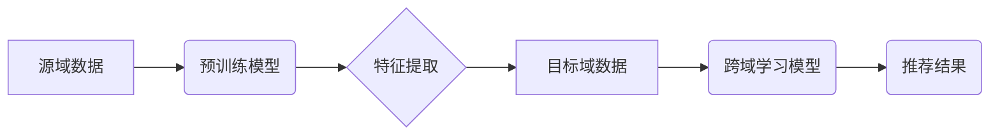

                 

## 推荐系统中的跨域学习：大模型技术

> 关键词：推荐系统、跨域学习、大模型、迁移学习、多模态学习、知识蒸馏、个性化推荐

## 1. 背景介绍

推荐系统作为信息过滤和个性化内容呈现的重要工具，在电商、社交媒体、视频平台等领域发挥着越来越重要的作用。传统的推荐系统主要依赖用户行为数据，例如点击、购买、评分等，但这些数据往往存在稀疏性、冷启动问题等挑战。

跨域学习（Cross-Domain Learning）作为一种机器学习范式，旨在利用不同领域的数据来提升模型性能。近年来，随着大模型（Large Language Models，LLMs）的兴起，跨域学习在推荐系统领域展现出巨大的潜力。大模型拥有海量参数和强大的泛化能力，能够从不同领域的数据中学习到丰富的知识和模式，从而提升推荐系统的准确性和个性化程度。

## 2. 核心概念与联系

**2.1 跨域学习的概念**

跨域学习是指利用不同领域的数据来训练机器学习模型，以提升模型在目标领域的性能。不同领域的“数据”可以指用户行为数据、商品信息、文本描述等多种形式。

**2.2 大模型的优势**

大模型拥有以下优势，使其成为跨域学习的理想选择：

* **海量参数：** 大模型拥有数亿甚至数十亿的参数，能够学习到更复杂的特征和模式。
* **强大的泛化能力：** 大模型在预训练阶段学习了大量的知识，能够更好地泛化到新的领域。
* **多模态学习能力：** 一些大模型能够处理多种数据类型，例如文本、图像、音频等，这对于跨域学习具有重要意义。

**2.3 跨域学习与推荐系统的结合**

跨域学习可以帮助推荐系统解决以下问题：

* **数据稀疏性：** 利用其他领域的丰富数据来补充目标领域的稀疏数据。
* **冷启动问题：** 利用其他领域的用户特征或商品信息来预测新用户的偏好或新商品的受欢迎程度。
* **个性化推荐：** 利用跨域学习融合不同领域的知识，为用户提供更个性化的推荐。

**2.4 跨域学习的架构**



## 3. 核心算法原理 & 具体操作步骤

**3.1 算法原理概述**

跨域学习在推荐系统中主要采用以下几种算法：

* **迁移学习：** 将预训练模型在源域的数据上训练，然后迁移到目标域进行微调。
* **多模态学习：** 利用不同模态的数据（例如文本、图像、音频）来训练模型，提升推荐的准确性和个性化程度。
* **知识蒸馏：** 将知识从大型模型蒸馏到小型模型，以提高模型的效率和部署能力。

**3.2 算法步骤详解**

以迁移学习为例，其具体步骤如下：

1. **数据预处理：** 对源域和目标域的数据进行清洗、格式化和特征提取。
2. **预训练模型选择：** 选择一个在相关领域预训练的模型，例如BERT、GPT等。
3. **迁移学习：** 将预训练模型迁移到目标域，并使用目标域的数据进行微调。
4. **模型评估：** 使用目标域的数据评估模型的性能，并进行调参优化。
5. **部署和监控：** 将训练好的模型部署到生产环境中，并持续监控模型的性能。

**3.3 算法优缺点**

* **优点：** 能够利用源域数据的丰富信息，提升目标域模型的性能；能够解决目标域数据稀疏的问题。
* **缺点：** 需要找到合适的源域数据，源域和目标域的数据分布差异较大时，迁移效果可能不佳。

**3.4 算法应用领域**

* **电商推荐：** 利用用户行为数据、商品信息等跨域数据提升商品推荐的准确性。
* **社交媒体推荐：** 利用用户兴趣、好友关系等跨域数据提升内容推荐的个性化程度。
* **新闻推荐：** 利用用户阅读历史、新闻主题等跨域数据提升新闻推荐的时效性和相关性。

## 4. 数学模型和公式 & 详细讲解 & 举例说明

**4.1 数学模型构建**

假设我们有一个推荐系统，目标是预测用户对商品的评分。我们可以使用以下数学模型来表示：

$$
r_{u,i} = f(h_u, h_i, \theta)
$$

其中：

* $r_{u,i}$ 表示用户 $u$ 对商品 $i$ 的评分。
* $h_u$ 表示用户 $u$ 的特征向量。
* $h_i$ 表示商品 $i$ 的特征向量。
* $\theta$ 表示模型参数。
* $f$ 表示评分预测函数。

**4.2 公式推导过程**

我们可以使用梯度下降算法来优化模型参数 $\theta$。目标函数是预测评分与真实评分之间的均方误差：

$$
L(\theta) = \frac{1}{N} \sum_{u,i} (r_{u,i} - \hat{r}_{u,i})^2
$$

其中：

* $N$ 表示训练样本的数量。
* $\hat{r}_{u,i}$ 表示模型预测的用户 $u$ 对商品 $i$ 的评分。

梯度下降算法的更新规则为：

$$
\theta = \theta - \alpha \nabla L(\theta)
$$

其中：

* $\alpha$ 表示学习率。
* $\nabla L(\theta)$ 表示目标函数 $L(\theta)$ 的梯度。

**4.3 案例分析与讲解**

假设我们有一个电商平台，想要推荐商品给用户。我们可以使用迁移学习来训练推荐模型。

* **源域数据：** 使用其他电商平台的用户行为数据，例如点击、购买、评分等。
* **目标域数据：** 使用当前电商平台的用户行为数据。
* **预训练模型：** 选择一个在用户行为数据上预训练的模型，例如BERT。
* **迁移学习：** 将预训练模型迁移到目标域，并使用目标域数据进行微调。

通过迁移学习，我们可以利用其他电商平台的用户行为数据来提升当前电商平台的推荐模型性能。

## 5. 项目实践：代码实例和详细解释说明

**5.1 开发环境搭建**

* Python 3.7+
* TensorFlow/PyTorch
* CUDA Toolkit

**5.2 源代码详细实现**

```python
# 导入必要的库
import tensorflow as tf

# 定义模型结构
class RecommenderModel(tf.keras.Model):
    def __init__(self, embedding_dim, num_users, num_items):
        super(RecommenderModel, self).__init__()
        self.user_embedding = tf.keras.layers.Embedding(num_users, embedding_dim)
        self.item_embedding = tf.keras.layers.Embedding(num_items, embedding_dim)
        self.dense = tf.keras.layers.Dense(1)

    def call(self, user_ids, item_ids):
        user_embeddings = self.user_embedding(user_ids)
        item_embeddings = self.item_embedding(item_ids)
        combined_embeddings = user_embeddings * item_embeddings
        predictions = self.dense(combined_embeddings)
        return predictions

# 实例化模型
model = RecommenderModel(embedding_dim=64, num_users=10000, num_items=10000)

# 定义损失函数和优化器
loss_fn = tf.keras.losses.MeanSquaredError()
optimizer = tf.keras.optimizers.Adam(learning_rate=0.001)

# 训练模型
# ...

# 预测评分
predictions = model.predict(user_ids, item_ids)
```

**5.3 代码解读与分析**

* 该代码实现了一个简单的推荐模型，使用嵌入层来表示用户和商品的特征，然后使用稠密层进行评分预测。
* 模型使用均方误差作为损失函数，并使用Adam优化器进行训练。
* 训练过程需要使用源域和目标域的数据进行微调。

**5.4 运行结果展示**

* 训练完成后，可以使用测试数据评估模型的性能，例如使用均方根误差（RMSE）来衡量预测评分与真实评分之间的差异。

## 6. 实际应用场景

**6.1 电商推荐**

* 利用用户购买历史、浏览记录、购物车内容等数据，推荐用户可能感兴趣的商品。
* 利用商品属性、分类、价格等数据，推荐用户符合特定需求的商品。

**6.2 社交媒体推荐**

* 利用用户关注的人、点赞的内容、评论的主题等数据，推荐用户可能感兴趣的内容。
* 利用内容的标签、分类、作者等数据，推荐用户符合特定兴趣的内容。

**6.3 新闻推荐**

* 利用用户阅读历史、订阅的频道、分享的内容等数据，推荐用户可能感兴趣的新闻。
* 利用新闻的主题、分类、作者等数据，推荐用户符合特定需求的新闻。

**6.4 未来应用展望**

* **多模态跨域学习：** 利用文本、图像、音频等多种数据来训练推荐模型，提升推荐的准确性和个性化程度。
* **联邦学习跨域学习：** 在保护用户隐私的前提下，利用多个平台的用户数据进行跨域学习，提升推荐模型的泛化能力。
* **个性化跨域学习：** 根据用户的个性化需求，动态调整跨域学习策略，提供更精准的推荐。

## 7. 工具和资源推荐

**7.1 学习资源推荐**

* **书籍：**
    * 《深度学习》 - Ian Goodfellow, Yoshua Bengio, Aaron Courville
    * 《机器学习》 - Tom Mitchell
* **在线课程：**
    * Coursera: Machine Learning
    * Udacity: Deep Learning Nanodegree
* **博客和网站：**
    * Towards Data Science
    * Machine Learning Mastery

**7.2 开发工具推荐**

* **TensorFlow:** https://www.tensorflow.org/
* **PyTorch:** https://pytorch.org/
* **Scikit-learn:** https://scikit-learn.org/stable/

**7.3 相关论文推荐**

* **Domain Adaptation for Recommender Systems: A Survey**
* **Cross-Domain Transfer Learning for Recommender Systems**
* **Knowledge Distillation for Recommender Systems**

## 8. 总结：未来发展趋势与挑战

**8.1 研究成果总结**

跨域学习在推荐系统领域取得了显著的进展，能够有效提升推荐模型的性能和泛化能力。

**8.2 未来发展趋势**

* **多模态跨域学习：** 利用多种数据类型来训练推荐模型，提升推荐的准确性和个性化程度。
* **联邦学习跨域学习：** 在保护用户隐私的前提下，利用多个平台的用户数据进行跨域学习，提升推荐模型的泛化能力。
* **个性化跨域学习：** 根据用户的个性化需求，动态调整跨域学习策略，提供更精准的推荐。

**8.3 面临的挑战**

* **数据分布差异：** 源域和目标域的数据分布差异较大时，跨域学习效果可能不佳。
* **隐私保护：** 在跨域学习过程中，需要保护用户隐私，避免数据泄露。
* **模型解释性：** 跨域学习模型的复杂性使得其解释性较差，难以理解模型的决策过程。

**8.4 研究展望**

未来研究将继续探索跨域学习在推荐系统中的应用，并解决上述挑战，以提升推荐系统的准确性、个性化程度和可解释性。

## 9. 附录：常见问题与解答

**9.1 如何选择合适的源域数据？**

选择源域数据时，需要考虑以下因素：

* 数据质量：源域数据需要高质量、干净、可靠。
* 数据相关性：源域数据与目标域数据需要有一定的相关性。
* 数据规模：源域数据需要足够大，以支持模型训练。

**9.2 如何解决数据分布差异问题？**

可以使用以下方法来解决数据分布差异问题：

* 数据预处理：对源域和目标域的数据进行预处理，例如标准化、归一化等，以减少数据分布差异。
* 迁移学习算法：使用迁移学习算法，例如领域自适应、领域不变性学习等，来适应数据分布差异。

**9.3 如何评估跨域学习模型的性能？**

可以使用以下指标来评估跨域学习模型的性能：

* 准确率：模型预测正确率。
* 精度：模型预测正样本的比例。
* 召回率：模型预测出所有正样本的比例。
* F1-score：准确率和召回率的调和平均值。


作者：禅与计算机程序设计艺术 / Zen and the Art of Computer Programming 
<end_of_turn>

