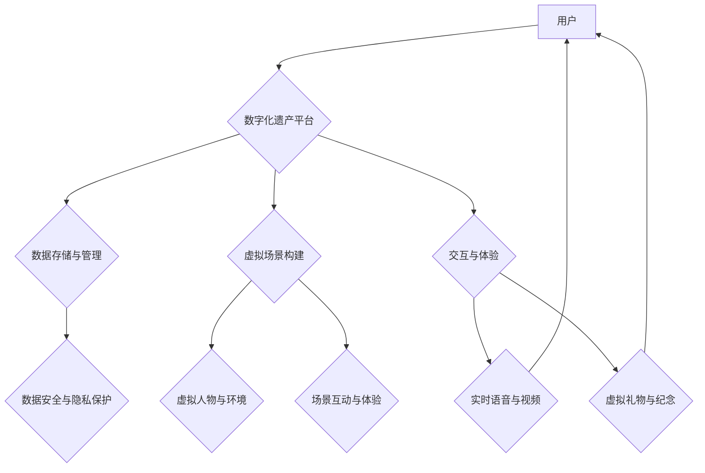

                 

##  数字化遗产虚拟重聚创业：跨越时空的家庭团聚

> 关键词：数字化遗产、虚拟重聚、家庭团聚、人工智能、区块链、元宇宙、云计算、数据可视化

## 1. 背景介绍

随着科技的飞速发展，人类社会正经历着数字化转型。我们的生活、工作、娱乐等各个方面都离不开数字技术。在这个过程中，我们积累了大量的数字化遗产，包括照片、视频、文字、音频等。这些数字化遗产承载着我们的人生记忆、情感体验和文化传承，是不可或缺的个人和家庭宝贵财富。

然而，随着时间的推移，这些数字化遗产面临着以下挑战：

* **数据孤岛问题：** 数字化遗产往往分散存储在不同的设备、平台和云服务中，难以整合和管理。
* **数据安全问题：** 数字化遗产容易受到数据泄露、丢失和损坏的威胁。
* **数据传承问题：** 如何将数字化遗产传承给下一代，使其能够被理解和利用，成为一个亟待解决的问题。

为了解决这些问题，并更好地利用数字化遗产的价值，"数字化遗产虚拟重聚创业"应运而生。

## 2. 核心概念与联系

**2.1 数字化遗产**

数字化遗产是指在数字形式下存留的人类创造物和信息，包括个人和家庭的各种数字文件，如照片、视频、音频、文字文档、社交媒体记录、电子邮箱等。

**2.2 虚拟重聚**

虚拟重聚是指利用虚拟现实、增强现实等技术，模拟真实场景，让分散在不同时空的人们能够进行互动交流，重温共同经历，感受亲情和友情。

**2.3 家庭团聚**

家庭团聚是指家庭成员聚在一起，共享生活、情感和回忆，增进彼此的了解和感情。

**2.4 核心概念联系**

数字化遗产虚拟重聚创业将数字化遗产与虚拟重聚技术相结合，为家庭成员提供一个跨越时空的虚拟平台，实现家庭团聚。

**2.5 架构图**



## 3. 核心算法原理 & 具体操作步骤

**3.1 算法原理概述**

数字化遗产虚拟重聚创业的核心算法主要包括：

* **数据挖掘与分析算法：** 从海量数字化遗产中提取关键信息，如人物关系、时间线、地点信息等，构建家庭成员的数字化档案。
* **虚拟场景构建算法：** 根据数字化档案信息，构建虚拟场景，包括虚拟人物、虚拟环境、虚拟事件等。
* **交互与体验算法：** 设计交互机制，让用户能够与虚拟场景和虚拟人物进行互动，体验虚拟重聚。

**3.2 算法步骤详解**

1. **数据收集与整理：** 收集用户提供的数字化遗产，包括照片、视频、文字文档、音频等。
2. **数据清洗与预处理：** 对收集到的数据进行清洗、格式化和预处理，去除噪声和冗余信息，使其能够被算法有效处理。
3. **数据挖掘与分析：** 利用数据挖掘和分析算法，从数据中提取关键信息，构建家庭成员的数字化档案。
4. **虚拟场景构建：** 根据数字化档案信息，构建虚拟场景，包括虚拟人物、虚拟环境、虚拟事件等。
5. **交互与体验设计：** 设计交互机制，让用户能够与虚拟场景和虚拟人物进行互动，体验虚拟重聚。
6. **平台部署与维护：** 将虚拟重聚平台部署到云服务器，并进行持续维护和更新。

**3.3 算法优缺点**

* **优点：**
    * 可以跨越时空，让分散在不同地方的家庭成员能够进行虚拟重聚。
    * 可以利用数字化遗产，重温共同经历，感受亲情和友情。
    * 可以帮助用户更好地了解和传承家族历史。
* **缺点：**
    * 需要大量的数字化遗产作为基础数据。
    * 需要复杂的算法和技术支持。
    * 虚拟重聚体验可能无法完全替代现实生活中的团聚。

**3.4 算法应用领域**

* **家庭团聚：** 为分散在不同地方的家庭成员提供虚拟重聚平台。
* **文化传承：** 利用数字化遗产，传承家族历史和文化。
* **教育培训：** 利用虚拟场景，进行沉浸式教育和培训。
* **旅游娱乐：** 利用虚拟场景，打造沉浸式旅游体验。

## 4. 数学模型和公式 & 详细讲解 & 举例说明

**4.1 数学模型构建**

数字化遗产虚拟重聚创业的数学模型可以基于图论和时空分析。

* **图论模型：** 将家庭成员和他们的关系表示为图，其中节点代表家庭成员，边代表他们的关系。
* **时空分析模型：** 利用时间戳和地理位置信息，分析家庭成员的活动轨迹和互动关系。

**4.2 公式推导过程**

* **节点相似度计算：** 利用节点之间的连接关系和属性信息，计算节点之间的相似度。例如，可以使用Jaccard系数计算两个节点之间的关系相似度。

$$
J(A,B) = \frac{|A \cap B|}{|A \cup B|}
$$

其中，A和B代表两个节点，A∩B代表A和B共同连接的节点，A∪B代表A和B所有连接的节点。

* **时间距离计算：** 利用时间戳信息，计算两个事件之间的时间距离。

$$
T(A,B) = |t_A - t_B|
$$

其中，A和B代表两个事件，t_A和t_B代表A和B的时间戳。

* **空间距离计算：** 利用地理位置信息，计算两个事件之间的空间距离。

$$
S(A,B) = \sqrt{(x_A - x_B)^2 + (y_A - y_B)^2}
$$

其中，A和B代表两个事件，(x_A, y_A)和(x_B, y_B)代表A和B的地理坐标。

**4.3 案例分析与讲解**

假设我们有一个家庭成员的数字化档案，包含照片、视频、文字文档等。我们可以利用上述算法，构建一个虚拟场景，包括虚拟人物、虚拟环境、虚拟事件等。

例如，我们可以根据照片信息，构建虚拟人物，并根据视频信息，构建虚拟场景。用户可以通过虚拟人物与虚拟环境进行互动，重温共同经历。

## 5. 项目实践：代码实例和详细解释说明

**5.1 开发环境搭建**

* **操作系统：** Ubuntu 20.04 LTS
* **编程语言：** Python 3.8
* **框架：** Django 3.2
* **数据库：** PostgreSQL 13
* **云服务：** AWS EC2

**5.2 源代码详细实现**

```python
# models.py
from django.db import models

class User(models.Model):
    name = models.CharField(max_length=255)
    email = models.EmailField(unique=True)
    password = models.CharField(max_length=255)

class Photo(models.Model):
    user = models.ForeignKey(User, on_delete=models.CASCADE)
    title = models.CharField(max_length=255)
    image = models.ImageField(upload_to='photos/')
    description = models.TextField(blank=True)
    timestamp = models.DateTimeField(auto_now_add=True)

# views.py
from django.shortcuts import render
from .models import Photo

def photo_list(request):
    photos = Photo.objects.all()
    context = {'photos': photos}
    return render(request, 'photos/list.html', context)
```

**5.3 代码解读与分析**

* **models.py:** 定义了用户和照片的模型，包括用户姓名、邮箱、密码、照片标题、图片、描述和时间戳等字段。
* **views.py:** 定义了照片列表页面的视图函数，从数据库中获取所有照片，并将其传递给模板进行渲染。

**5.4 运行结果展示**

运行上述代码，可以访问一个照片列表页面，展示所有用户上传的照片。

## 6. 实际应用场景

**6.1 家庭回忆重温**

数字化遗产虚拟重聚创业可以帮助家庭成员重温共同经历，回忆过去的美好时光。例如，可以利用老照片和视频，构建一个虚拟场景，让用户能够与虚拟的家人进行互动，重温童年时光。

**6.2 跨越时空的团聚**

数字化遗产虚拟重聚创业可以帮助分散在不同地方的家庭成员进行跨越时空的团聚。例如，可以利用虚拟现实技术，构建一个虚拟场景，让用户能够与虚拟的家人进行互动，感受亲情和友情。

**6.3 文化传承与挖掘**

数字化遗产虚拟重聚创业可以帮助传承家族历史和文化。例如，可以利用数字化遗产，构建一个虚拟博物馆，展示家族的历史和文化，让后代能够了解和传承家族文化。

**6.4 未来应用展望**

数字化遗产虚拟重聚创业的应用场景非常广泛，未来还将有更多新的应用场景出现。例如，可以利用人工智能技术，自动生成虚拟人物和场景，让用户能够更轻松地体验虚拟重聚。

## 7. 工具和资源推荐

**7.1 学习资源推荐**

* **书籍：**
    * 《人机交互》
    * 《虚拟现实技术》
    * 《人工智能》
* **在线课程：**
    * Coursera: 人工智能
    * edX: 虚拟现实技术
    * Udemy: 人机交互

**7.2 开发工具推荐**

* **虚拟现实平台：** Unity, Unreal Engine
* **人工智能平台：** TensorFlow, PyTorch
* **云服务平台：** AWS, Azure, Google Cloud

**7.3 相关论文推荐**

* **数字遗产管理：**
    * "Digital Heritage Management: A Review"
    * "Towards a Framework for Digital Heritage Preservation"
* **虚拟重聚技术：**
    * "Virtual Reality for Social Presence and Interaction"
    * "Immersive Storytelling for Virtual Reenactments"

## 8. 总结：未来发展趋势与挑战

**8.1 研究成果总结**

数字化遗产虚拟重聚创业是一个新兴的领域，近年来取得了显著的进展。

* **技术方面：** 虚拟现实、增强现实、人工智能等技术的快速发展，为数字化遗产虚拟重聚创业提供了强大的技术支撑。
* **应用方面：** 数字化遗产虚拟重聚创业的应用场景不断拓展，从家庭团聚到文化传承，从教育培训到旅游娱乐，都有着广泛的应用前景。

**8.2 未来发展趋势**

* **更沉浸式的体验：** 未来，数字化遗产虚拟重聚创业将更加注重沉浸式的体验，利用更先进的虚拟现实和增强现实技术，让用户能够更加真实地感受虚拟重聚。
* **更智能化的交互：** 未来，数字化遗产虚拟重聚创业将更加智能化，利用人工智能技术，自动生成虚拟人物和场景，让用户能够更轻松地体验虚拟重聚。
* **更广泛的应用场景：** 未来，数字化遗产虚拟重聚创业将应用到更多领域，例如医疗、教育、文化等，为人们的生活带来更多便利和乐趣。

**8.3 面临的挑战**

* **数据安全与隐私保护：** 数字化遗产虚拟重聚创业需要处理大量的个人数据，因此数据安全和隐私保护是一个重要的挑战。
* **技术复杂性：** 数字化遗产虚拟重聚创业涉及多个技术领域，技术复杂性是一个重要的挑战。
* **用户接受度：** 虚拟重聚体验可能无法完全替代现实生活中的团聚，因此需要提高用户的接受度。

**8.4 研究展望**

数字化遗产虚拟重聚创业是一个充满机遇和挑战的领域，未来将会有更多新的研究方向和应用场景出现。

## 9. 附录：常见问题与解答

**9.1 如何上传数字化遗产？**

用户可以通过平台提供的上传接口，上传照片、视频、文字文档等数字化遗产。

**9.2 如何构建虚拟场景？**

平台提供了一套虚拟场景构建工具，用户可以根据自己的需求，选择虚拟人物、虚拟环境、虚拟事件等元素，构建虚拟场景。

**9.3 如何与虚拟人物进行互动？**

用户可以通过语音、文字、表情等方式与虚拟人物进行互动。

**9.4 数据安全与隐私保护如何保障？**

平台采用严格的数据安全和隐私保护措施，包括数据加密、访问控制、匿名化处理等，确保用户数据的安全和隐私。


作者：禅与计算机程序设计艺术 / Zen and the Art of Computer Programming<end_of_turn>

