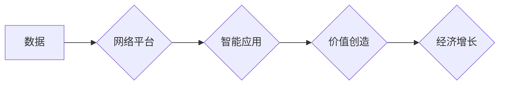

                 

## 数字经济：社会发展的助推器

> 关键词：数字经济、数据驱动、人工智能、云计算、大数据、物联网、区块链

### 1. 背景介绍

21世纪，科技发展日新月异，互联网、移动互联网、大数据、人工智能等技术的蓬勃发展，深刻地改变着人类社会生产方式、生活方式和社会组织方式。其中，数字经济作为以数字技术为基础，以数据为要素，以网络为平台，以智能为驱动的经济形态，正在成为全球经济发展的新引擎。

数字经济的兴起，源于以下几个关键因素：

* **信息技术的飞速发展:**  互联网、移动互联网、云计算、大数据等技术的快速发展，为数字经济提供了强大的技术支撑。
* **数据量的爆炸式增长:**  随着互联网和移动互联网的普及，海量数据被不断产生和积累，为数字经济提供了丰富的资源。
* **人工智能技术的突破:**  人工智能技术的快速发展，赋予了数字经济更强的智能化和自动化能力。
* **全球化和开放的趋势:**  全球化和开放的趋势，促进了数字经济的跨国融合和发展。

数字经济的出现，为人类社会带来了前所未有的机遇和挑战。它不仅推动了经济增长和社会进步，也带来了新的伦理、安全和监管问题。

### 2. 核心概念与联系

数字经济的核心概念包括：

* **数据:**  数字经济的核心要素，是数字经济的生产要素和价值创造的源泉。
* **网络:**  数字经济的平台和基础设施，连接着数据、用户和应用。
* **智能:**  数字经济的驱动力，通过人工智能等技术，赋予数字经济更强的分析、决策和执行能力。

数字经济的形成是一个复杂的过程，涉及到多个领域和环节的相互作用。

**Mermaid 流程图:**



### 3. 核心算法原理 & 具体操作步骤

数字经济的核心算法原理主要包括：

* **机器学习:**  通过算法训练，使计算机能够从数据中学习，并做出预测或决策。
* **深度学习:**  一种更高级的机器学习算法，能够处理更复杂的数据，并取得更优的性能。
* **自然语言处理:**  使计算机能够理解和处理人类语言。
* **计算机视觉:**  使计算机能够“看”图像和视频，并从中提取信息。

**3.1 算法原理概述**

机器学习算法的核心思想是，通过对大量数据的训练，学习数据的规律，并将其应用于新的数据进行预测或分类。

**3.2 算法步骤详解**

机器学习算法的典型步骤包括：

1. **数据收集和预处理:**  收集相关数据，并进行清洗、转换和特征工程等预处理工作。
2. **模型选择:**  根据具体任务选择合适的机器学习算法模型。
3. **模型训练:**  使用训练数据训练模型，调整模型参数，使其能够准确地预测或分类。
4. **模型评估:**  使用测试数据评估模型的性能，并进行调优。
5. **模型部署:**  将训练好的模型部署到实际应用场景中。

**3.3 算法优缺点**

机器学习算法的优点包括：

* **自动化:**  能够自动学习数据规律，无需人工编程。
* **精准度高:**  能够实现高精度的数据预测和分类。
* **可扩展性强:**  能够处理海量数据，并随着数据量的增加而提高性能。

机器学习算法的缺点包括：

* **数据依赖性强:**  算法的性能取决于训练数据的质量和数量。
* **解释性差:**  一些机器学习算法的决策过程难以解释。
* **需要专业知识:**  开发和部署机器学习模型需要一定的专业知识和技术能力。

**3.4 算法应用领域**

机器学习算法广泛应用于各个领域，例如：

* **电商推荐:**  根据用户的购买历史和行为数据，推荐个性化的商品。
* **金融风险控制:**  识别和预测金融风险，降低金融机构的损失。
* **医疗诊断:**  辅助医生诊断疾病，提高诊断准确率。
* **智能交通:**  优化交通流量，提高交通效率。

### 4. 数学模型和公式 & 详细讲解 & 举例说明

数字经济的核心算法通常基于复杂的数学模型和公式。

**4.1 数学模型构建**

例如，在机器学习中，常用的线性回归模型可以表示为：

$$y = w_0 + w_1x_1 + w_2x_2 + ... + w_nx_n + \epsilon$$

其中：

* $y$ 是预测值
* $w_0, w_1, w_2, ..., w_n$ 是模型参数
* $x_1, x_2, ..., x_n$ 是输入特征
* $\epsilon$ 是误差项

**4.2 公式推导过程**

模型参数的学习过程通常使用梯度下降算法，通过不断调整参数，使模型预测值与真实值之间的误差最小化。

**4.3 案例分析与讲解**

例如，在电商推荐系统中，可以使用协同过滤算法，通过分析用户的历史购买行为，推荐用户可能感兴趣的商品。协同过滤算法的核心思想是，用户对商品的评分或购买行为具有相似性，可以用来预测用户对其他商品的兴趣。

### 5. 项目实践：代码实例和详细解释说明

**5.1 开发环境搭建**

数字经济的开发通常需要使用云计算平台、大数据处理工具、机器学习框架等工具。

**5.2 源代码详细实现**

例如，可以使用Python语言和Scikit-learn机器学习库实现一个简单的线性回归模型。

```python
from sklearn.linear_model import LinearRegression
from sklearn.model_selection import train_test_split
import numpy as np

# 生成示例数据
X = np.array([[1, 2], [3, 4], [5, 6], [7, 8]])
y = np.array([3, 7, 11, 15])

# 将数据分成训练集和测试集
X_train, X_test, y_train, y_test = train_test_split(X, y, test_size=0.2)

# 创建线性回归模型
model = LinearRegression()

# 训练模型
model.fit(X_train, y_train)

# 使用模型预测测试集数据
y_pred = model.predict(X_test)

# 打印预测结果
print(y_pred)
```

**5.3 代码解读与分析**

这段代码首先生成示例数据，然后将数据分成训练集和测试集。接着，创建线性回归模型，并使用训练集训练模型。最后，使用训练好的模型预测测试集数据，并打印预测结果。

**5.4 运行结果展示**

运行这段代码后，会输出测试集数据的预测结果。

### 6. 实际应用场景

数字经济的应用场景非常广泛，例如：

* **电商:**  个性化推荐、精准营销、智能客服
* **金融:**  风险控制、欺诈检测、智能理财
* **医疗:**  疾病诊断、药物研发、远程医疗
* **教育:**  个性化学习、在线教育、智能评估
* **交通:**  智能交通管理、自动驾驶、出行规划

**6.4 未来应用展望**

数字经济的未来发展趋势包括：

* **更加智能化:**  人工智能技术的进一步发展，将使数字经济更加智能化和自动化。
* **更加个性化:**  数据分析和机器学习技术的进步，将使数字经济更加个性化和定制化。
* **更加融合:**  数字经济将与其他领域更加融合，形成更加复杂的生态系统。

### 7. 工具和资源推荐

**7.1 学习资源推荐**

* **在线课程:**  Coursera、edX、Udacity等平台提供丰富的数字经济相关课程。
* **书籍:**  《数字经济》、《数据驱动》、《人工智能》等书籍可以帮助读者深入了解数字经济的相关知识。
* **学术期刊:**  《科学》、《自然》、《经济学季刊》等学术期刊发表了大量关于数字经济的研究成果。

**7.2 开发工具推荐**

* **云计算平台:**  AWS、Azure、GCP等云计算平台提供强大的计算和存储资源，支持数字经济的开发和部署。
* **大数据处理工具:**  Hadoop、Spark、Hive等大数据处理工具可以帮助处理海量数据。
* **机器学习框架:**  TensorFlow、PyTorch、Scikit-learn等机器学习框架可以帮助开发和部署机器学习模型。

**7.3 相关论文推荐**

* **The Digital Economy: A Primer**
* **Data-Driven Decision Making in the Digital Economy**
* **Artificial Intelligence and the Future of Work**

### 8. 总结：未来发展趋势与挑战

数字经济正在深刻地改变着人类社会，为经济增长和社会进步带来了新的机遇。然而，数字经济的发展也面临着一些挑战，例如：

* **数据安全和隐私保护:**  数字经济依赖于数据的收集和使用，因此数据安全和隐私保护问题尤为重要。
* **算法偏见:**  机器学习算法可能存在偏见，导致不公平的结果。
* **数字鸿沟:**  数字经济的发展可能加剧数字鸿沟，导致社会分化。

**8.1 研究成果总结**

数字经济的研究成果表明，数字技术可以提高生产效率、降低成本、创造新的价值。

**8.2 未来发展趋势**

数字经济的未来发展趋势包括：

* **更加智能化:**  人工智能技术的进一步发展，将使数字经济更加智能化和自动化。
* **更加融合:**  数字经济将与其他领域更加融合，形成更加复杂的生态系统。
* **更加可持续:**  数字经济的发展需要更加注重可持续性，例如数据资源的循环利用和能源效率的提高。

**8.3 面临的挑战**

数字经济的发展面临着一些挑战，例如：

* **数据安全和隐私保护:**  数字经济依赖于数据的收集和使用，因此数据安全和隐私保护问题尤为重要。
* **算法偏见:**  机器学习算法可能存在偏见，导致不公平的结果。
* **数字鸿沟:**  数字经济的发展可能加剧数字鸿沟，导致社会分化。

**8.4 研究展望**

未来，数字经济的研究需要更加注重以下几个方面：

* **伦理问题:**  研究数字经济的伦理问题，例如算法偏见、数据隐私保护等。
* **社会影响:**  研究数字经济对社会的影响，例如就业、收入分配、社会公平等。
* **可持续发展:**  研究数字经济的可持续发展路径，例如数据资源的循环利用、能源效率的提高等。

### 9. 附录：常见问题与解答

**常见问题:**

* 什么是数字经济？
* 数字经济有哪些核心概念？
* 数字经济有哪些应用场景？
* 数字经济有哪些发展趋势？
* 数字经济有哪些挑战？

**解答:**

* 数字经济是指以数字技术为基础，以数据为要素，以网络为平台，以智能为驱动的经济形态。
* 数字经济的核心概念包括数据、网络、智能。
* 数字经济的应用场景非常广泛，例如电商、金融、医疗、教育、交通等。
* 数字经济的未来发展趋势包括更加智能化、更加融合、更加可持续。
* 数字经济的发展面临着一些挑战，例如数据安全和隐私保护、算法偏见、数字鸿沟等。


作者：禅与计算机程序设计艺术 / Zen and the Art of Computer Programming 
<end_of_turn>

