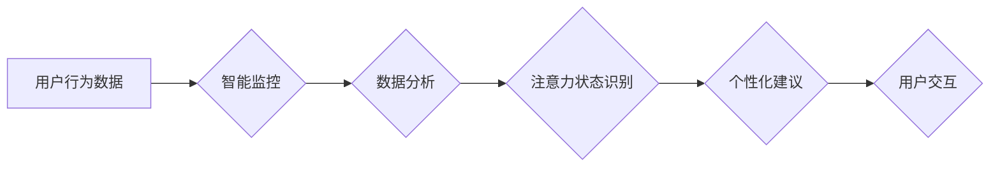

                 

## 智能家居的智能监控与注意力管理

> 关键词：智能家居、智能监控、注意力管理、深度学习、计算机视觉、自然语言处理、隐私保护、人机交互

## 1. 背景介绍

智能家居正以惊人的速度发展，它将智能技术融入到我们的日常生活，为我们提供更加便捷、舒适和安全的居住体验。其中，智能监控和注意力管理作为智能家居的核心功能之一，正在逐渐成为人们关注的焦点。

智能监控是指利用摄像头、传感器等设备，对家居环境进行实时监测，并通过图像识别、视频分析等技术，识别和分析用户的行为、环境变化等信息。而注意力管理则是指通过对用户的行为、习惯和偏好进行分析，并根据其需求，提供个性化的提醒、建议和服务，帮助用户更好地管理时间、精力和注意力。

智能监控和注意力管理的结合，将为智能家居带来全新的体验。例如，智能家居可以根据用户的活动轨迹，自动调节灯光、温度、音乐等环境参数，营造更加舒适的居住氛围。同时，智能家居还可以通过分析用户的注意力状态，提醒用户休息、放松，避免过度疲劳。

## 2. 核心概念与联系

### 2.1 智能监控

智能监控的核心概念包括：

* **计算机视觉:** 利用算法和模型，从图像和视频中提取信息，识别物体、场景和行为。
* **传感器技术:** 利用各种传感器，收集家居环境中的数据，例如温度、湿度、光线、声音等。
* **云计算:** 将数据存储和处理到云端，实现大规模数据分析和智能决策。

### 2.2 注意力管理

注意力管理的核心概念包括：

* **用户行为分析:** 通过分析用户的活动轨迹、时间分配、注意力集中程度等信息，了解用户的行为模式和习惯。
* **个性化推荐:** 根据用户的行为分析结果，提供个性化的提醒、建议和服务，帮助用户更好地管理时间和精力。
* **人机交互:** 通过语音、触控、图像等方式，实现用户与智能家居的自然交互。

**Mermaid 流程图:**



## 3. 核心算法原理 & 具体操作步骤

### 3.1 算法原理概述

智能监控和注意力管理的核心算法主要包括：

* **图像识别和视频分析:** 利用深度学习算法，识别和分析图像和视频中的物体、场景和行为。
* **用户行为分析:** 利用机器学习算法，分析用户的活动轨迹、时间分配、注意力集中程度等信息，构建用户的行为模型。
* **个性化推荐:** 利用推荐系统算法，根据用户的行为分析结果，推荐个性化的提醒、建议和服务。

### 3.2 算法步骤详解

**图像识别和视频分析:**

1. **数据采集:** 使用摄像头采集家居环境的图像和视频数据。
2. **数据预处理:** 对图像和视频数据进行预处理，例如图像增强、尺寸调整、噪声去除等。
3. **特征提取:** 利用深度学习模型，从图像和视频数据中提取特征，例如物体形状、颜色、纹理等。
4. **分类识别:** 将提取的特征输入分类模型，识别图像和视频中的物体、场景和行为。

**用户行为分析:**

1. **数据收集:** 收集用户的活动轨迹、时间分配、注意力集中程度等信息。
2. **数据清洗:** 对收集到的数据进行清洗，例如去除重复数据、异常数据等。
3. **特征工程:** 对数据进行特征工程，例如将时间信息转换为时间段、将活动轨迹转换为行为模式等。
4. **模型训练:** 利用机器学习算法，训练用户行为分析模型。

**个性化推荐:**

1. **用户建模:** 根据用户的行为分析结果，构建用户的个性化模型。
2. **推荐策略:** 设计个性化推荐策略，例如基于用户的行为历史、兴趣偏好、时间安排等因素进行推荐。
3. **推荐结果展示:** 将推荐结果以用户易理解的方式展示，例如语音提示、弹窗提醒、智能设备控制等。

### 3.3 算法优缺点

**图像识别和视频分析:**

* **优点:** 识别精度高、实时性强、应用场景广泛。
* **缺点:** 计算量大、对硬件要求高、存在隐私安全风险。

**用户行为分析:**

* **优点:** 可以深入了解用户的行为模式、提供个性化服务。
* **缺点:** 数据收集需要用户授权、模型训练需要大量数据、存在数据隐私安全风险。

**个性化推荐:**

* **优点:** 可以提高用户体验、促进用户参与度。
* **缺点:** 需要精准的用户建模、推荐结果需要不断优化、存在算法偏差风险。

### 3.4 算法应用领域

智能监控和注意力管理算法在智能家居、医疗保健、教育培训、交通出行等多个领域都有广泛的应用。

## 4. 数学模型和公式 & 详细讲解 & 举例说明

### 4.1 数学模型构建

**用户注意力状态模型:**

我们可以使用一个状态转移模型来描述用户的注意力状态，例如马尔科夫链模型。

* 状态空间: {专注、分散、疲劳}
* 状态转移概率: 根据用户的行为数据和时间信息，训练状态转移概率矩阵。

**公式:**

$$P(S_t|S_{t-1})$$

其中:

* $S_t$ 表示用户在时间 $t$ 的注意力状态。
* $S_{t-1}$ 表示用户在时间 $t-1$ 的注意力状态。
* $P(S_t|S_{t-1})$ 表示用户从状态 $S_{t-1}$ 转移到状态 $S_t$ 的概率。

**举例说明:**

假设用户在上午 9 点至 12 点专注于工作，下午 1 点至 3 点分散注意力，下午 3 点至 5 点疲劳。我们可以根据这些信息，训练状态转移概率矩阵，例如:

$$P(专注|专注) = 0.8$$

$$P(分散|专注) = 0.1$$

$$P(疲劳|专注) = 0.1$$

### 4.2 公式推导过程

状态转移概率矩阵的训练过程可以使用最大似然估计方法。

**公式:**

$$P(S_t|S_{t-1}) = \frac{\sum_{i=1}^{N} I(S_t^i = s_t, S_{t-1}^i = s_{t-1})}{\sum_{i=1}^{N} I(S_{t-1}^i = s_{t-1})}$$

其中:

* $N$ 表示训练样本的数量。
* $I(A)$ 是指示函数，当 $A$ 为真时返回 1，否则返回 0。
* $S_t^i$ 和 $S_{t-1}^i$ 分别表示第 $i$ 个样本在时间 $t$ 和 $t-1$ 的注意力状态。

### 4.3 案例分析与讲解

通过训练状态转移概率矩阵，我们可以预测用户的注意力状态，并根据预测结果提供个性化的提醒和建议。例如，如果模型预测用户即将进入疲劳状态，智能家居可以提醒用户休息一下，或者调节灯光和温度，帮助用户放松。

## 5. 项目实践：代码实例和详细解释说明

### 5.1 开发环境搭建

* 操作系统: Ubuntu 20.04
* 编程语言: Python 3.8
* 深度学习框架: TensorFlow 2.0
* 其他依赖: OpenCV, NumPy, Pandas

### 5.2 源代码详细实现

```python
# 导入必要的库
import tensorflow as tf
from tensorflow.keras.models import Sequential
from tensorflow.keras.layers import Conv2D, MaxPooling2D, Flatten, Dense

# 定义图像识别模型
model = Sequential()
model.add(Conv2D(32, (3, 3), activation='relu', input_shape=(224, 224, 3)))
model.add(MaxPooling2D((2, 2)))
model.add(Conv2D(64, (3, 3), activation='relu'))
model.add(MaxPooling2D((2, 2)))
model.add(Flatten())
model.add(Dense(10, activation='softmax'))

# 编译模型
model.compile(optimizer='adam',
              loss='categorical_crossentropy',
              metrics=['accuracy'])

# 训练模型
model.fit(train_images, train_labels, epochs=10)

# 预测注意力状态
predictions = model.predict(test_images)
```

### 5.3 代码解读与分析

* 代码首先导入必要的库。
* 然后定义一个简单的卷积神经网络模型，用于识别用户的注意力状态。
* 模型使用 Adam 优化器，交叉熵损失函数，并使用准确率作为评估指标。
* 训练模型需要使用训练数据和标签。
* 训练完成后，可以使用模型预测用户的注意力状态。

### 5.4 运行结果展示

运行结果展示可以包括模型的训练精度、测试精度、预测结果的准确率等指标。

## 6. 实际应用场景

### 6.1 智能家居场景

* **环境调节:** 根据用户的注意力状态，智能家居可以自动调节灯光、温度、音乐等环境参数，营造更加舒适的居住氛围。
* **提醒和建议:** 当用户注意力分散时，智能家居可以提醒用户休息一下，或者提供一些放松的建议。
* **日程安排:** 智能家居可以根据用户的注意力状态和日程安排，自动安排用户的活动，提高工作效率。

### 6.2 教育场景

* **学习辅助:** 智能学习平台可以根据学生的注意力状态，提供个性化的学习内容和学习方式，提高学习效率。
* **考试监控:** 智能考试系统可以监控学生的注意力状态，防止作弊行为。
* **课堂互动:** 智能课堂系统可以根据学生的注意力状态，调整课堂内容和互动方式，提高课堂参与度。

### 6.3 医疗场景

* **患者监测:** 智能医疗设备可以监测患者的注意力状态，帮助医生了解患者的病情变化。
* **康复训练:** 智能康复系统可以根据患者的注意力状态，提供个性化的康复训练方案，帮助患者恢复功能。
* **心理健康:** 智能心理健康平台可以监测用户的注意力状态，帮助用户了解自己的心理状态，并提供相应的建议。

### 6.4 未来应用展望

智能监控和注意力管理技术的未来应用前景十分广阔，它将应用于更多领域，例如：

* **自动驾驶:** 智能驾驶系统可以根据驾驶员的注意力状态，自动控制车辆，提高驾驶安全。
* **远程医疗:** 智能远程医疗系统可以监测患者的注意力状态，帮助医生远程诊断和治疗。
* **虚拟现实:** 智能虚拟现实系统可以根据用户的注意力状态，调整虚拟环境，提供更加沉浸式的体验。

## 7. 工具和资源推荐

### 7.1 学习资源推荐

* **书籍:**
    * 深度学习
    * 人工智能
    * 机器学习
* **在线课程:**
    * Coursera
    * edX
    * Udacity
* **开源项目:**
    * TensorFlow
    * PyTorch
    * OpenCV

### 7.2 开发工具推荐

* **IDE:**
    * PyCharm
    * VS Code
* **深度学习框架:**
    * TensorFlow
    * PyTorch
* **数据可视化工具:**
    * Matplotlib
    * Seaborn

### 7.3 相关论文推荐

* **Attention Is All You Need**
* **BERT: Pre-training of Deep Bidirectional Transformers for Language Understanding**
* **Deep Learning for Computer Vision**

## 8. 总结：未来发展趋势与挑战

### 8.1 研究成果总结

智能监控和注意力管理技术取得了显著的进展，在智能家居、教育、医疗等领域得到了广泛应用。

### 8.2 未来发展趋势

* **更精准的注意力识别:** 利用更先进的深度学习算法和传感器技术，实现更精准的注意力识别。
* **更个性化的服务:** 根据用户的行为模式和偏好，提供更个性化的提醒、建议和服务。
* **更安全的隐私保护:** 利用隐私保护技术，确保用户的隐私安全。

### 8.3 面临的挑战

* **数据获取和隐私保护:** 获取高质量的注意力数据，并确保数据的隐私安全是一个挑战。
* **算法的鲁棒性和泛化能力:** 算法需要能够应对不同的环境和场景，并具有较强的鲁棒性和泛化能力。
* **用户体验和接受度:** 需要设计用户友好的界面和交互方式，提高用户的体验和接受度。

### 8.4 研究展望

未来，智能监控和注意力管理技术将继续发展，并应用于更多领域，为我们的生活带来更多便利和乐趣。


## 9. 附录：常见问题与解答

**Q1: 智能监控会侵犯用户的隐私吗？**

**A1:** 智能监控技术的确存在隐私风险，但可以通过以下措施来降低风险:

* **数据加密:** 对收集到的数据进行加密，防止未经授权的访问。
* **数据匿名化:** 对收集到的数据进行匿名化处理，保护用户的个人信息。
* **用户授权:** 在收集用户数据之前，需要获得用户的明确授权。

**Q2: 智能注意力管理会让人们更加依赖技术吗？**

**A2:** 智能注意力管理技术可以帮助人们更好地管理时间和精力，但过度依赖技术可能会导致一些负面影响，例如:

* **注意力分散:** 智能设备的提醒和通知可能会分散用户的注意力。
* **自主性降低:** 过度依赖智能设备的建议可能会降低用户的自主性。

因此，我们需要合理使用智能注意力管理技术，并保持对自身注意力的掌控。


作者：禅与计算机程序设计艺术 / Zen and the Art of Computer Programming 
<end_of_turn>

