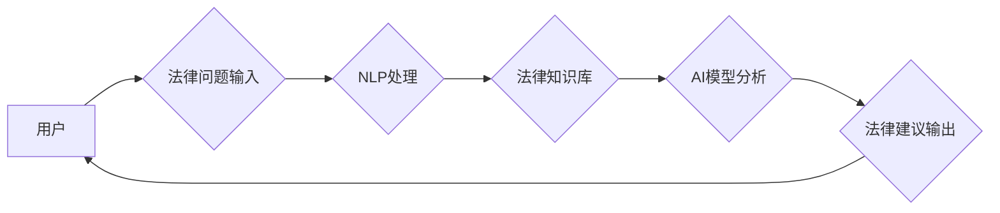

                 

## 法律科技创业：法律服务的智能化革新

> 关键词：人工智能、法律科技、智能化、法律服务、机器学习、自然语言处理、法律分析、合同审查、法律风险

## 1. 背景介绍

法律服务行业长期以来以其复杂性、专业性以及高昂的成本而著称。传统的法律服务模式往往依赖于律师的经验和人力，效率低下，成本高昂，难以满足现代社会日益增长的法律服务需求。随着人工智能（AI）技术的快速发展，法律科技（LegalTech）应运而生，旨在利用AI技术革新法律服务，提高效率、降低成本、提升服务质量。

近年来，法律科技领域取得了显著进展，AI技术在法律领域得到了广泛应用，例如：

* **法律研究和分析：** AI可以快速分析海量法律文件，识别法律条款、案例和判例，帮助律师进行法律研究和分析，提高效率和准确性。
* **合同审查和生成：** AI可以自动审查合同文本，识别潜在风险和漏洞，并根据模板生成标准合同，节省律师的时间和精力。
* **法律风险评估：** AI可以分析企业运营数据和法律法规，识别潜在的法律风险，帮助企业进行风险管理和规避。
* **诉讼支持：** AI可以分析案件证据，预测诉讼结果，帮助律师制定诉讼策略。

## 2. 核心概念与联系

法律科技的核心概念包括人工智能、自然语言处理（NLP）、机器学习（ML）、深度学习（DL）等。

**2.1  人工智能（AI）**

人工智能是指模拟人类智能行为的计算机系统。在法律科技领域，AI技术被用于模拟律师的思维和决策能力，例如法律分析、合同审查、风险评估等。

**2.2  自然语言处理（NLP）**

自然语言处理是指计算机理解和处理人类语言的技术。在法律科技领域，NLP技术被用于分析法律文本，识别法律条款、案例和判例，以及生成法律文件。

**2.3  机器学习（ML）**

机器学习是指通过算法训练模型，使模型能够从数据中学习并进行预测的技术。在法律科技领域，ML技术被用于法律预测、风险评估、案件分类等。

**2.4  深度学习（DL）**

深度学习是机器学习的一种高级形式，它使用多层神经网络来模拟人类大脑的学习过程。在法律科技领域，DL技术被用于更复杂的法律分析任务，例如法律文本摘要、法律意见撰写等。

**2.5  法律科技架构**

以下是一个简单的法律科技架构示意图：



## 3. 核心算法原理 & 具体操作步骤

### 3.1  算法原理概述

在法律科技领域，常用的算法包括：

* **文本分类算法：** 用于将法律文本分类到不同的类别，例如合同、诉讼、专利等。常见的算法包括朴素贝叶斯、支持向量机（SVM）、深度神经网络等。
* **文本相似度算法：** 用于比较两个法律文本的相似度，例如判断两个合同是否相同，或者查找与特定案件相关的案例。常见的算法包括余弦相似度、Jaccard系数、Word2Vec等。
* **关系抽取算法：** 用于从法律文本中抽取实体和关系，例如识别合同中的当事人、合同条款、权利义务等。常见的算法包括规则匹配、机器学习、深度学习等。

### 3.2  算法步骤详解

以文本分类算法为例，其具体操作步骤如下：

1. **数据预处理：** 将法律文本进行清洗、分词、词干提取等预处理操作，以便于算法训练和使用。
2. **特征提取：** 从预处理后的文本中提取特征，例如词频、词向量、语法结构等。
3. **模型训练：** 使用训练数据训练文本分类模型，例如朴素贝叶斯、SVM、深度神经网络等。
4. **模型评估：** 使用测试数据评估模型的性能，例如准确率、召回率、F1-score等。
5. **模型部署：** 将训练好的模型部署到实际应用场景中，例如法律文本分类系统。

### 3.3  算法优缺点

不同的算法具有不同的优缺点，需要根据实际应用场景选择合适的算法。

* **朴素贝叶斯算法：** 优点：简单易实现，训练速度快；缺点：假设特征独立性，对数据分布敏感。
* **支持向量机（SVM）算法：** 优点：能够处理高维数据，泛化能力强；缺点：训练时间长，参数选择复杂。
* **深度神经网络算法：** 优点：能够学习复杂的特征表示，性能优异；缺点：训练时间长，参数量大，需要大量数据训练。

### 3.4  算法应用领域

文本分类算法在法律科技领域有广泛的应用，例如：

* **法律文件分类：** 将法律文件分类到不同的类别，例如合同、诉讼、专利等，方便律师进行快速检索和管理。
* **法律风险识别：** 分析法律文本，识别潜在的法律风险，例如合同违约、知识产权侵权等，帮助企业进行风险管理和规避。
* **法律意见撰写：** 根据法律问题和相关法律法规，自动生成法律意见，提高律师的工作效率。

## 4. 数学模型和公式 & 详细讲解 & 举例说明

### 4.1  数学模型构建

在法律科技领域，常用的数学模型包括：

* **概率模型：** 用于描述法律事件发生的概率，例如判决结果的预测概率。
* **逻辑模型：** 用于描述法律规则和推理关系，例如合同条款的逻辑关系。
* **图模型：** 用于表示法律实体和关系之间的网络结构，例如案件关系图。

### 4.2  公式推导过程

以概率模型为例，假设我们要预测案件判决结果的概率。我们可以使用贝叶斯定理来推导公式：

$$P(A|B) = \frac{P(B|A)P(A)}{P(B)}$$

其中：

* $P(A|B)$ 是事件 A 在事件 B 发生的条件概率，即预测案件判决结果为 A 的概率，已知案件特征为 B。
* $P(B|A)$ 是事件 B 在事件 A 发生的条件概率，即案件特征为 B 的概率，已知案件判决结果为 A。
* $P(A)$ 是事件 A 的先验概率，即案件判决结果为 A 的概率。
* $P(B)$ 是事件 B 的概率，即案件特征为 B 的概率。

### 4.3  案例分析与讲解

假设我们要预测一宗合同纠纷案件的判决结果，判决结果有两种：胜诉和败诉。我们可以根据案件特征，例如合同条款、证据、当事人关系等，训练一个概率模型，预测案件判决结果的概率。

## 5. 项目实践：代码实例和详细解释说明

### 5.1  开发环境搭建

法律科技项目开发环境通常包括：

* **操作系统：** Linux、Windows、macOS 等。
* **编程语言：** Python、Java、C++ 等。
* **深度学习框架：** TensorFlow、PyTorch、Keras 等。
* **数据库：** MySQL、MongoDB、PostgreSQL 等。
* **云平台：** AWS、Azure、GCP 等。

### 5.2  源代码详细实现

以下是一个使用 Python 和 TensorFlow 实现文本分类的简单代码示例：

```python
import tensorflow as tf

# 定义模型
model = tf.keras.models.Sequential([
  tf.keras.layers.Embedding(input_dim=10000, output_dim=128),
  tf.keras.layers.LSTM(128),
  tf.keras.layers.Dense(2, activation='softmax')
])

# 编译模型
model.compile(loss='sparse_categorical_crossentropy', optimizer='adam', metrics=['accuracy'])

# 训练模型
model.fit(x_train, y_train, epochs=10)

# 评估模型
loss, accuracy = model.evaluate(x_test, y_test)
print('Loss:', loss)
print('Accuracy:', accuracy)
```

### 5.3  代码解读与分析

* **Embedding层：** 将词向量表示为稠密的向量，用于捕捉词语之间的语义关系。
* **LSTM层：** 用于处理序列数据，例如文本，能够捕捉文本中的长距离依赖关系。
* **Dense层：** 全连接层，用于将 LSTM 层的输出映射到输出类别。
* **softmax激活函数：** 将输出值映射到概率分布，用于预测每个类别的概率。

### 5.4  运行结果展示

训练完成后，我们可以使用模型对新的文本进行分类，并输出分类结果的概率。

## 6. 实际应用场景

法律科技已经开始在多个领域得到应用，例如：

* **合同审查和生成：** AI可以自动审查合同文本，识别潜在风险和漏洞，并根据模板生成标准合同，节省律师的时间和精力。
* **法律风险评估：** AI可以分析企业运营数据和法律法规，识别潜在的法律风险，帮助企业进行风险管理和规避。
* **诉讼支持：** AI可以分析案件证据，预测诉讼结果，帮助律师制定诉讼策略。
* **法律研究和分析：** AI可以快速分析海量法律文件，识别法律条款、案例和判例，帮助律师进行法律研究和分析，提高效率和准确性。

### 6.4  未来应用展望

未来，法律科技将继续发展，并应用于更多领域，例如：

* **智能法律助理：** AI可以作为律师的智能助手，帮助律师完成日常工作，例如文件整理、法律研究、案件管理等。
* **法律预测：** AI可以根据历史数据和法律法规，预测案件的判决结果，帮助当事人做出更明智的决策。
* **法律教育：** AI可以用于法律教育，例如模拟法庭辩论、提供个性化学习方案等。

## 7. 工具和资源推荐

### 7.1  学习资源推荐

* **在线课程：** Coursera、edX、Udacity 等平台提供人工智能、法律科技等方面的在线课程。
* **书籍：** 《人工智能：一种现代方法》、《深度学习》、《法律科技：未来法律服务的变革》等书籍。
* **博客和论坛：** AI、法律科技相关的博客和论坛，例如 AI Weekly、LegalTech News 等。

### 7.2  开发工具推荐

* **编程语言：** Python、Java、C++ 等。
* **深度学习框架：** TensorFlow、PyTorch、Keras 等。
* **自然语言处理库：** NLTK、spaCy、Gensim 等。
* **数据库：** MySQL、MongoDB、PostgreSQL 等。

### 7.3  相关论文推荐

* **ACL、EMNLP、NAACL 等自然语言处理会议论文。**
* **AI2法律科技研究中心论文。**
* **Stanford Law School Legal Tech Lab 论文。**

## 8. 总结：未来发展趋势与挑战

### 8.1  研究成果总结

法律科技领域取得了显著进展，AI技术在法律服务中得到了广泛应用，提高了效率、降低了成本、提升了服务质量。

### 8.2  未来发展趋势

未来，法律科技将继续发展，并应用于更多领域，例如：

* **更智能的法律助手：** AI将能够更深入地理解法律问题，并提供更精准的法律建议。
* **更精准的法律预测：** AI将能够基于更丰富的历史数据和法律法规，更准确地预测案件的判决结果。
* **更个性化的法律服务：** AI将能够根据用户的需求，提供个性化的法律服务。

### 8.3  面临的挑战

法律科技发展也面临一些挑战，例如：

* **数据质量问题：** 法律数据往往是结构化、碎片化的，需要进行清洗、标准化等处理。
* **算法解释性问题：** AI模型的决策过程往往是黑箱的，难以解释，这可能会导致法律专业人士对AI技术的信任不足。
* **伦理和法律问题：** AI技术的应用可能会引发一些伦理和法律问题，例如数据隐私、算法偏见等，需要进行深入研究和探讨。

### 8.4  研究展望

未来，法律科技研究需要关注以下几个方面：

* **开发更强大的法律AI模型：** 需要开发能够更好地理解法律语言、推理法律规则、预测法律结果的AI模型。
* **解决法律数据问题：** 需要开发更有效的法律数据清洗、标准化、标注等技术。
* **提高AI模型的解释性：** 需要开发能够解释AI模型决策过程的技术，提高法律专业人士对AI技术的信任。
* **研究AI技术的伦理和法律问题：** 需要对AI技术的应用进行伦理和法律规范，确保其安全、公平、可控地发展。

## 9. 附录：常见问题与解答

**1. 法律科技是否会取代律师？**

法律科技不会完全取代律师，而是会改变律师的工作方式。AI技术可以帮助律师完成一些重复性、耗时的工作，例如文件整理、法律研究，从而释放律师更多的时间和精力，专注于更复杂、更需要专业判断的法律问题。

**2. 法律科技的应用需要哪些技术背景？**

法律科技的应用需要一定的计算机科学、人工智能、法律等方面的知识背景。

**3. 如何学习法律科技相关知识？**

可以通过在线课程、书籍、博客、论坛等方式学习法律科技相关知识。

**作者：禅与计算机程序设计艺术 / Zen and the Art of Computer Programming**


<end_of_turn>

