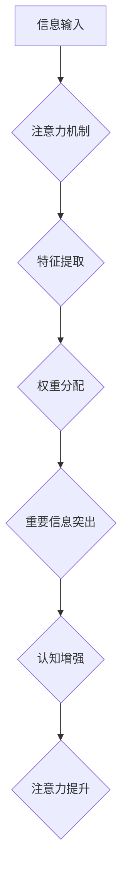

                 

## 1. 背景介绍

在当今信息爆炸的时代，我们面临着前所未有的信息量和认知挑战。注意力力的下降已成为许多人普遍的困扰，影响着学习、工作和生活各方面。如何有效地管理注意力，增强认知灵活性和专注力，已成为一个迫切需要解决的问题。

传统的注意力训练方法往往过于抽象和缺乏针对性，难以真正帮助人们提升注意力能力。随着人工智能技术的快速发展，我们开始探索利用人工智能技术来辅助注意力训练，并取得了一些令人鼓舞的成果。

## 2. 核心概念与联系

### 2.1 注意力机制

注意力机制是人工智能领域近年来发展迅速的关键技术之一，它模拟了人类大脑在处理信息时选择性关注特定内容的能力。注意力机制的核心思想是通过赋予不同输入特征不同的权重，从而突出重要信息，抑制无关信息，提高模型的学习效率和准确性。

### 2.2 大脑训练与认知增强

大脑训练是指通过特定的认知训练方法，旨在增强大脑功能，提高认知能力，例如记忆力、注意力、执行功能等。认知增强技术旨在通过科学的方法，帮助人们提升认知能力，从而更好地应对信息时代带来的挑战。

### 2.3 人工智能辅助注意力训练

人工智能辅助注意力训练是指利用人工智能技术，例如深度学习、自然语言处理等，开发出针对性强、个性化的注意力训练工具和平台。这些工具和平台可以根据用户的认知水平和需求，提供个性化的训练方案，并实时反馈训练效果，帮助用户更好地掌握注意力训练方法，提升注意力能力。

**Mermaid 流程图**



## 3. 核心算法原理 & 具体操作步骤

### 3.1 算法原理概述

注意力机制的核心算法原理是通过学习一个注意力权重向量，来对输入序列中的每个元素进行加权求和。注意力权重向量可以根据输入序列的特征和任务目标进行动态调整，从而突出重要信息，抑制无关信息。

常见的注意力机制算法包括：

* **自注意力机制 (Self-Attention):**  用于处理序列数据，可以捕捉序列中不同元素之间的关系。
* **交叉注意力机制 (Cross-Attention):** 用于处理多个序列数据，可以捕捉不同序列之间的关系。
* **位置感知注意力机制 (Positional-Aware Attention):**  在自注意力机制的基础上，引入了位置信息，可以更好地处理顺序信息。

### 3.2 算法步骤详解

1. **输入序列编码:** 将输入序列中的每个元素编码成向量表示。
2. **计算注意力权重:**  根据输入序列的特征和任务目标，计算每个元素的注意力权重。
3. **加权求和:**  将每个元素的向量表示与对应的注意力权重相乘，并求和，得到输出向量。

### 3.3 算法优缺点

**优点:**

* 可以有效地捕捉序列数据中的长距离依赖关系。
* 可以动态调整注意力权重，突出重要信息。
* 在自然语言处理、计算机视觉等领域取得了显著的成果。

**缺点:**

* 计算复杂度较高，训练时间较长。
* 对输入序列长度敏感，处理长序列数据时性能会下降。

### 3.4 算法应用领域

注意力机制在人工智能领域有着广泛的应用，例如：

* **自然语言处理:** 机器翻译、文本摘要、问答系统、情感分析等。
* **计算机视觉:** 图像分类、目标检测、图像 Captioning 等。
* **语音识别:** 语音转文本、语音合成等。
* **推荐系统:** 商品推荐、内容推荐等。

## 4. 数学模型和公式 & 详细讲解 & 举例说明

### 4.1 数学模型构建

注意力机制的数学模型可以概括为以下公式：

$$
\text{Attention}(Q, K, V) = \text{softmax}\left(\frac{Q K^T}{\sqrt{d_k}}\right) V
$$

其中：

* $Q$：查询矩阵，表示需要关注的信息。
* $K$：键矩阵，表示所有可供关注的信息。
* $V$：值矩阵，表示每个可供关注的信息对应的特征向量。
* $d_k$：键向量的维度。
* $\text{softmax}$：softmax 函数，用于将注意力权重归一化到 [0, 1] 之间。

### 4.2 公式推导过程

注意力机制的核心思想是通过计算查询向量 $Q$ 与键向量 $K$ 之间的相似度，来确定每个键向量对应的注意力权重。

* $QK^T$：计算查询向量 $Q$ 与键向量 $K$ 的点积，得到一个矩阵，其中每个元素表示查询向量与对应键向量的相似度。
* $\frac{QK^T}{\sqrt{d_k}}$：对点积矩阵进行缩放，以防止梯度爆炸。
* $\text{softmax}$：对缩放后的点积矩阵应用 softmax 函数，得到每个键向量对应的注意力权重。

### 4.3 案例分析与讲解

假设我们有一个句子 "我爱学习编程"，想要计算每个单词的注意力权重。

* $Q$：查询向量可以是句子中的某个单词的向量表示。
* $K$：键向量可以是句子的所有单词的向量表示。
* $V$：值向量可以是句子的所有单词对应的词义向量。

通过计算 $QK^T$、缩放和应用 softmax 函数，我们可以得到每个单词的注意力权重，例如 "学习" 的注意力权重可能比 "我" 的注意力权重更高，因为 "学习" 与查询词语的语义更相关。

## 5. 项目实践：代码实例和详细解释说明

### 5.1 开发环境搭建

* Python 3.x
* TensorFlow 或 PyTorch 深度学习框架
* Jupyter Notebook 或 VS Code 代码编辑器

### 5.2 源代码详细实现

```python
import tensorflow as tf

# 定义注意力机制层
class AttentionLayer(tf.keras.layers.Layer):
    def __init__(self, units):
        super(AttentionLayer, self).__init__()
        self.Wq = tf.keras.layers.Dense(units)
        self.Wk = tf.keras.layers.Dense(units)
        self.Wv = tf.keras.layers.Dense(units)
        self.fc = tf.keras.layers.Dense(1)

    def call(self, inputs):
        Q = self.Wq(inputs[0])
        K = self.Wk(inputs[1])
        V = self.Wv(inputs[2])
        attention_scores = tf.matmul(Q, K, transpose_b=True) / tf.math.sqrt(tf.cast(tf.shape(Q)[-1], tf.float32))
        attention_weights = tf.nn.softmax(attention_scores, axis=-1)
        context_vector = tf.matmul(attention_weights, V)
        output = self.fc(context_vector)
        return output

# 示例用法
inputs = [tf.random.normal((1, 10, 64)), tf.random.normal((1, 10, 64)), tf.random.normal((1, 10, 64))]
attention_layer = AttentionLayer(units=128)
output = attention_layer(inputs)
print(output.shape)
```

### 5.3 代码解读与分析

* `AttentionLayer` 类定义了一个注意力机制层，包含三个稠密层 (`Wq`, `Wk`, `Wv`) 用于将输入向量映射到查询、键和值向量，以及一个稠密层 (`fc`) 用于计算最终输出。
* `call` 方法实现注意力机制的计算过程，包括计算注意力权重、加权求和和最终输出。
* 示例用法展示了如何使用 `AttentionLayer` 层，输入三个随机向量，并输出注意力机制的计算结果。

### 5.4 运行结果展示

运行代码后，会输出一个形状为 `(1, 10, 1)` 的张量，表示注意力机制的输出结果。

## 6. 实际应用场景

### 6.1  注意力训练应用

* **认知训练游戏:** 利用注意力机制开发认知训练游戏，通过游戏化的方式，帮助用户提升注意力能力。
* **个性化学习平台:** 根据用户的学习习惯和认知水平，提供个性化的注意力训练方案，提高学习效率。
* **远程办公辅助工具:** 开发注意力管理工具，帮助远程办公人员集中注意力，提高工作效率。

### 6.2 其他应用场景

* **医疗诊断:** 利用注意力机制分析医学图像，提高诊断准确率。
* **金融风险管理:** 利用注意力机制分析金融数据，识别潜在的风险。
* **智能客服:** 利用注意力机制理解用户需求，提供更精准的客服服务。

### 6.4 未来应用展望

随着人工智能技术的不断发展，注意力机制将在更多领域得到应用，例如：

* **增强现实 (AR) 和虚拟现实 (VR):**  提高 AR 和 VR 体验的沉浸感和交互性。
* **自动驾驶:**  帮助自动驾驶系统更好地感知周围环境。
* **机器人:**  提高机器人的认知能力和决策能力。

## 7. 工具和资源推荐

### 7.1 学习资源推荐

* **书籍:**
    * 《深度学习》
    * 《Attention Is All You Need》
* **在线课程:**
    * Coursera: 深度学习
    * Udacity: 自然语言处理
* **博客:**
    * Jay Alammar's Blog: https://jalammar.github.io/
    * Distill.pub: https://distill.pub/

### 7.2 开发工具推荐

* **TensorFlow:** https://www.tensorflow.org/
* **PyTorch:** https://pytorch.org/
* **Keras:** https://keras.io/

### 7.3 相关论文推荐

* 《Attention Is All You Need》
* 《BERT: Pre-training of Deep Bidirectional Transformers for Language Understanding》
* 《Transformer-XL: Attentive Language Models Beyond a Fixed-Length Context》

## 8. 总结：未来发展趋势与挑战

### 8.1 研究成果总结

注意力机制在人工智能领域取得了显著的成果，并在自然语言处理、计算机视觉等领域得到了广泛应用。

### 8.2 未来发展趋势

* **更强大的注意力机制:**  研究更强大的注意力机制，例如长距离依赖关系的处理、多模态注意力机制等。
* **注意力机制的解释性:**  提高注意力机制的解释性，帮助人们更好地理解注意力机制的工作原理。
* **注意力机制的应用扩展:**  将注意力机制应用到更多领域，例如医疗、金融、教育等。

### 8.3 面临的挑战

* **计算复杂度:**  注意力机制的计算复杂度较高，难以处理大型数据集。
* **数据依赖性:**  注意力机制的性能依赖于训练数据的质量。
* **可解释性:**  注意力机制的决策过程难以解释，缺乏透明度。

### 8.4 研究展望

未来，注意力机制的研究将继续深入，探索更强大的注意力机制、提高注意力机制的解释性和应用扩展，为人工智能的发展做出更大的贡献。

## 9. 附录：常见问题与解答

* **什么是注意力机制？**

注意力机制是一种模拟人类大脑选择性关注特定信息的能力的技术。它通过赋予不同输入特征不同的权重，从而突出重要信息，抑制无关信息。

* **注意力机制有哪些应用场景？**

注意力机制在人工智能领域有着广泛的应用，例如自然语言处理、计算机视觉、语音识别等。

* **如何训练注意力机制？**

注意力机制可以通过监督学习的方式进行训练，例如使用预训练语言模型进行微调。

* **注意力机制的优缺点是什么？**

注意力机制的优点是能够有效地捕捉序列数据中的长距离依赖关系，并动态调整注意力权重。缺点是计算复杂度较高，对输入序列长度敏感。


作者：禅与计算机程序设计艺术 / Zen and the Art of Computer Programming 
<end_of_turn>

