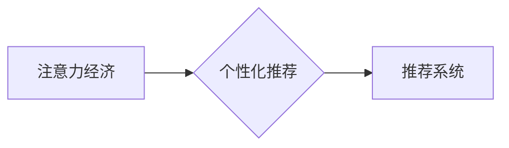

                 

##  注意力经济与个性化推荐系统：为受众提供定制、有针对性的内容和体验

> 关键词：注意力经济、个性化推荐、推荐算法、深度学习、用户行为分析、内容过滤、协同过滤、矩阵分解、神经网络

### 1. 背景介绍

在信息爆炸的时代，人们每天面临着海量信息的选择和处理。如何有效地获取所需信息，并过滤掉无关紧要的内容，成为了一个重要的挑战。注意力经济的概念应运而生，它强调了信息获取和处理的有限性，以及人们对信息的“注意力”资源的稀缺性。在这种背景下，个性化推荐系统应运而生，它旨在根据用户的兴趣、偏好和行为，为用户提供定制化的内容和体验，帮助用户更好地聚焦于他们真正感兴趣的信息。

个性化推荐系统已经广泛应用于各个领域，例如电商、社交媒体、视频平台、新闻资讯等。它可以帮助用户发现新的产品、服务和内容，提高用户体验，并促进商业发展。

### 2. 核心概念与联系

#### 2.1 注意力经济

注意力经济是指在信息过载的时代，人们对信息的注意力资源是有限的，而信息提供者为了获取用户的注意力，需要不断地竞争。

#### 2.2 个性化推荐

个性化推荐是指根据用户的个人特征、行为模式和偏好，为用户提供定制化的内容和服务。

#### 2.3 推荐系统

推荐系统是一种利用数据挖掘、机器学习等技术，根据用户的历史行为和偏好，预测用户可能感兴趣的内容或物品的系统。

**核心概念与联系流程图**



### 3. 核心算法原理 & 具体操作步骤

#### 3.1 算法原理概述

个性化推荐系统通常采用以下几种核心算法：

* **内容过滤:** 根据用户的历史行为和偏好，推荐与用户兴趣相符的内容。
* **协同过滤:** 根据其他用户对相同内容的评价和行为，推荐用户可能感兴趣的内容。
* **矩阵分解:** 将用户和物品的交互数据表示为矩阵，通过矩阵分解的方法，预测用户对物品的评分或偏好。
* **深度学习:** 利用深度神经网络，学习用户和物品的复杂特征，进行更精准的推荐。

#### 3.2 算法步骤详解

以协同过滤算法为例，其具体操作步骤如下：

1. **数据收集:** 收集用户对物品的评分或行为数据。
2. **数据预处理:** 处理数据，例如去除缺失值、规范化数据等。
3. **用户-物品矩阵构建:** 将用户和物品的信息表示为一个用户-物品矩阵，其中每个元素表示用户对物品的评分或行为。
4. **相似性计算:** 计算用户之间的相似度或物品之间的相似度。
5. **推荐生成:** 根据用户与其他用户的相似度，推荐用户可能感兴趣的物品。

#### 3.3 算法优缺点

**内容过滤:**

* **优点:** 可以推荐与用户兴趣相符的内容，不受用户历史行为的限制。
* **缺点:** 当用户历史行为数据不足时，推荐效果较差。

**协同过滤:**

* **优点:** 可以发现用户之间的潜在关系，推荐用户可能没有接触过的物品。
* **缺点:** 当用户数据稀疏时，推荐效果较差。

**矩阵分解:**

* **优点:** 可以处理高维数据，并挖掘用户和物品之间的隐含关系。
* **缺点:** 计算复杂度较高。

**深度学习:**

* **优点:** 可以学习用户和物品的复杂特征，进行更精准的推荐。
* **缺点:** 需要大量的训练数据，训练时间较长。

#### 3.4 算法应用领域

* **电商:** 推荐商品、优惠券、促销活动等。
* **社交媒体:** 推荐好友、群组、话题等。
* **视频平台:** 推荐视频、电视剧、电影等。
* **新闻资讯:** 推荐新闻、文章、博客等。

### 4. 数学模型和公式 & 详细讲解 & 举例说明

#### 4.1 数学模型构建

协同过滤算法的数学模型通常采用用户-物品评分矩阵，其中每个元素表示用户对物品的评分。

假设用户集合为U，物品集合为I，则用户-物品评分矩阵为R，其维度为|U| x |I|。

#### 4.2 公式推导过程

协同过滤算法的目标是预测用户对物品的评分，可以使用矩阵分解的方法进行预测。

假设用户u对物品i的评分为r<sub>ui</sub>，则可以使用以下公式进行预测：

$$r_{ui} = \mathbf{p}_u^T \mathbf{q}_i + b_u + b_i$$

其中：

* $\mathbf{p}_u$ 是用户u的隐向量。
* $\mathbf{q}_i$ 是物品i的隐向量。
* $b_u$ 是用户u的偏差项。
* $b_i$ 是物品i的偏差项。

#### 4.3 案例分析与讲解

例如，假设用户A对电影1评分为4，对电影2评分为3，而用户B对电影1评分为5，对电影2评分为4。

我们可以使用矩阵分解的方法，学习用户A和用户B的隐向量，以及电影1和电影2的隐向量。

然后，我们可以使用这些隐向量来预测用户A对电影2的评分，以及用户B对电影1的评分。

### 5. 项目实践：代码实例和详细解释说明

#### 5.1 开发环境搭建

* Python 3.x
* TensorFlow 或 PyTorch
* Scikit-learn

#### 5.2 源代码详细实现

```python
import tensorflow as tf

# 定义模型
model = tf.keras.Sequential([
    tf.keras.layers.Embedding(input_dim=num_users, output_dim=embedding_dim),
    tf.keras.layers.Embedding(input_dim=num_items, output_dim=embedding_dim),
    tf.keras.layers.Dot(axes=1),
    tf.keras.layers.Flatten(),
    tf.keras.layers.Dense(1)
])

# 编译模型
model.compile(optimizer='adam', loss='mse')

# 训练模型
model.fit(X_train, y_train, epochs=10)

# 预测评分
predictions = model.predict(X_test)
```

#### 5.3 代码解读与分析

* 首先，我们定义了一个简单的深度学习模型，使用嵌入层来学习用户和物品的隐向量。
* 然后，我们使用点积操作来计算用户和物品的相似度。
* 最后，我们使用一个全连接层来预测用户对物品的评分。

#### 5.4 运行结果展示

* 可以使用评估指标，例如均方误差 (MSE) 或均方根误差 (RMSE)，来评估模型的性能。

### 6. 实际应用场景

#### 6.1 电商推荐

* 推荐商品、优惠券、促销活动等。
* 个性化商品组合推荐。
* 跨界商品推荐。

#### 6.2 社交媒体推荐

* 推荐好友、群组、话题等。
* 个性化内容推荐。
* 社交关系分析和推荐。

#### 6.3 视频平台推荐

* 推荐视频、电视剧、电影等。
* 个性化内容推荐。
* 视频分类和标签推荐。

#### 6.4 未来应用展望

* 基于多模态数据的个性化推荐，例如结合文本、图像、音频等数据进行推荐。
* 基于强化学习的个性化推荐，例如通过用户反馈来不断优化推荐结果。
* 基于联邦学习的个性化推荐，例如在保护用户隐私的前提下进行推荐。

### 7. 工具和资源推荐

#### 7.1 学习资源推荐

* 书籍：《推荐系统实践》
* 在线课程：Coursera、edX、Udacity

#### 7.2 开发工具推荐

* Python
* TensorFlow
* PyTorch
* Scikit-learn

#### 7.3 相关论文推荐

* "Collaborative Filtering for Implicit Feedback Datasets"
* "Matrix Factorization Techniques for Recommender Systems"
* "Deep Learning for Recommender Systems"

### 8. 总结：未来发展趋势与挑战

#### 8.1 研究成果总结

个性化推荐系统已经取得了显著的成果，并在各个领域得到了广泛应用。

#### 8.2 未来发展趋势

* 多模态数据融合
* 强化学习优化
* 联邦学习隐私保护

#### 8.3 面临的挑战

* 数据稀疏性
* 冷启动问题
* 算法解释性和可解释性
* 隐私安全和伦理问题

#### 8.4 研究展望

未来，个性化推荐系统将朝着更加智能、个性化、安全的方向发展。

### 9. 附录：常见问题与解答

* **Q1: 如何处理数据稀疏性问题？**

* **A1:** 可以使用矩阵分解、深度学习等方法来处理数据稀疏性问题。

* **Q2: 如何解决冷启动问题？**

* **A2:** 可以使用内容过滤、协同过滤等方法来解决冷启动问题。

* **Q3: 如何保证推荐结果的公平性和准确性？**

* **A3:** 可以使用公平性评估指标、可解释性分析等方法来保证推荐结果的公平性和准确性。


作者：禅与计算机程序设计艺术 / Zen and the Art of Computer Programming 
<end_of_turn>

