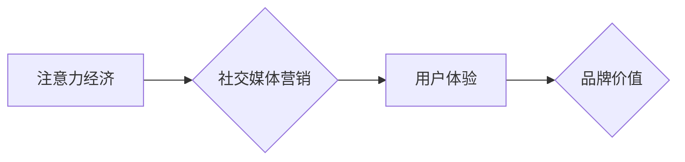

                 

##  注意力经济与社交媒体营销最佳实践：在不牺牲用户体验的情况下有效吸引受众

> 关键词：注意力经济、社交媒体营销、用户体验、内容策略、算法优化、数据分析、个性化推荐、互动式内容、品牌建设

### 1. 背景介绍

在当今数字时代，信息爆炸式增长，用户面临着来自各个方向的纷繁信息冲击。在这种情况下，**注意力**成为了稀缺的资源，而**注意力经济**的概念应运而生。注意力经济是指在信息过载的时代，人们对信息的获取和处理能力有限，而能够吸引和获取用户注意力的内容和平台拥有巨大的价值。

社交媒体作为信息传播和用户互动的重要平台，在注意力经济中扮演着举足轻重的角色。平台巨头们通过算法、内容推荐和用户行为分析等手段，不断争夺用户的注意力。然而，过度追求流量和广告收益，往往会牺牲用户体验，导致用户流失和品牌形象受损。因此，如何在不牺牲用户体验的情况下，有效吸引受众，成为了社交媒体营销的重大挑战。

### 2. 核心概念与联系

#### 2.1 注意力经济

注意力经济的核心概念是：**注意力是有限的，而信息是无限的。** 在信息爆炸的时代，人们只能选择性地关注一部分信息，而忽略另一部分。因此，能够吸引和获取用户注意力的内容和平台拥有巨大的价值。

#### 2.2 社交媒体营销

社交媒体营销是指利用社交媒体平台，通过内容创作、互动交流、广告投放等方式，实现品牌推广、用户增长和销售转化。

#### 2.3 用户体验

用户体验是指用户使用产品或服务时，所感受到的整体感受和满意度。良好的用户体验可以提升用户粘性，增强品牌忠诚度，最终促进商业目标的实现。

**Mermaid 流程图：注意力经济与社交媒体营销的关系**



### 3. 核心算法原理 & 具体操作步骤

#### 3.1 算法原理概述

社交媒体平台的推荐算法是吸引用户注意力的关键技术之一。这些算法通常基于机器学习和深度学习技术，通过分析用户的行为数据，例如浏览历史、点赞、评论、分享等，预测用户可能感兴趣的内容，并将其推荐给用户。

#### 3.2 算法步骤详解

1. **数据收集:** 收集用户的行为数据，例如浏览历史、点赞、评论、分享等。
2. **数据预处理:** 对收集到的数据进行清洗、转换和特征提取。
3. **模型训练:** 使用机器学习或深度学习算法，训练推荐模型。
4. **模型评估:** 使用测试数据评估模型的性能，并进行调优。
5. **内容推荐:** 根据用户的行为数据和模型预测，推荐用户可能感兴趣的内容。

#### 3.3 算法优缺点

**优点:**

* **个性化推荐:** 能够根据用户的兴趣和偏好，推荐个性化的内容。
* **提高用户粘性:** 通过推荐用户感兴趣的内容，可以提高用户在平台上的停留时间和互动频率。
* **提升广告效果:** 通过精准推荐广告，可以提高广告的点击率和转化率。

**缺点:**

* **信息茧房效应:** 算法可能会将用户困在信息茧房中，只推荐用户已经感兴趣的内容，导致用户视野狭窄。
* **数据隐私问题:** 收集和使用用户的行为数据可能会引发数据隐私问题。
* **算法偏差:** 算法可能会存在偏差，导致推荐结果不公平或不准确。

#### 3.4 算法应用领域

推荐算法广泛应用于各种领域，例如：

* **电商:** 商品推荐、用户画像
* **社交媒体:** 内容推荐、好友推荐
* **视频平台:** 视频推荐、用户分类
* **音乐平台:** 音乐推荐、用户喜好分析

### 4. 数学模型和公式 & 详细讲解 & 举例说明

#### 4.1 数学模型构建

推荐算法通常使用协同过滤或内容过滤等数学模型。

**协同过滤模型:**

协同过滤模型基于用户的行为相似性进行推荐。假设用户A和用户B都喜欢电影X，那么用户A可能也喜欢电影Y，而用户B也可能喜欢电影Z。

**内容过滤模型:**

内容过滤模型基于内容的特征进行推荐。例如，如果用户喜欢动作片，那么系统可能会推荐其他动作片。

#### 4.2 公式推导过程

协同过滤模型的推荐公式可以表示为：

$$r(u, i) = \bar{r}_u + \frac{\sum_{v \in N(u)} (r(v, i) - \bar{r}_v) \cdot sim(u, v)}{\sum_{v \in N(u)} sim(u, v)}$$

其中：

* $r(u, i)$ 表示用户u对物品i的评分
* $\bar{r}_u$ 表示用户u的平均评分
* $N(u)$ 表示与用户u行为相似的用户集合
* $sim(u, v)$ 表示用户u和用户v之间的相似度

#### 4.3 案例分析与讲解

假设用户A和用户B都喜欢电影X，并且用户A对电影Y的评分为4，用户B对电影Z的评分为5。

如果用户A和用户B之间的相似度为0.8，那么根据协同过滤模型的推荐公式，系统可能会推荐电影Y给用户B，因为用户A对电影Y的评分较高，并且用户A和用户B的行为相似。

### 5. 项目实践：代码实例和详细解释说明

#### 5.1 开发环境搭建

* Python 3.x
* TensorFlow 或 PyTorch
* Jupyter Notebook

#### 5.2 源代码详细实现

```python
# 导入必要的库
import numpy as np
from sklearn.metrics.pairwise import cosine_similarity

# 定义用户-物品评分矩阵
ratings = np.array([
    [5, 4, 3, 2, 1],
    [4, 5, 2, 1, 3],
    [3, 2, 5, 4, 1],
    [2, 1, 4, 5, 3],
    [1, 3, 1, 3, 5]
])

# 计算用户之间的相似度
user_similarity = cosine_similarity(ratings)

# 获取用户A的相似用户
user_a_index = 0
similar_users = np.argsort(user_similarity[user_a_index])[::-1][1:]

# 推荐给用户A的物品
recommended_items = []
for user_b_index in similar_users:
    for item_index in range(ratings.shape[1]):
        if ratings[user_b_index, item_index] > 0 and item_index not in recommended_items:
            recommended_items.append(item_index)

# 打印推荐结果
print(f"推荐给用户A的物品：{recommended_items}")
```

#### 5.3 代码解读与分析

这段代码实现了基于协同过滤的推荐算法。首先，定义了一个用户-物品评分矩阵，然后计算用户之间的相似度。接着，根据用户A的相似用户，推荐给用户A可能感兴趣的物品。

#### 5.4 运行结果展示

运行这段代码后，会输出一个包含推荐物品索引的列表。例如，如果用户A的相似用户是用户B和用户C，并且用户B和用户C都对物品3评分较高，那么系统可能会推荐物品3给用户A。

### 6. 实际应用场景

#### 6.1 内容推荐

社交媒体平台可以使用推荐算法，根据用户的兴趣和行为，推荐个性化的内容，例如新闻、视频、文章等。

#### 6.2 广告投放

社交媒体平台可以使用推荐算法，精准投放广告，将广告展示给最有可能点击和购买的用户。

#### 6.3 社交关系推荐

社交媒体平台可以使用推荐算法，推荐用户可能认识的朋友或群组，帮助用户拓展社交圈。

#### 6.4 未来应用展望

随着人工智能技术的不断发展，推荐算法将会更加智能化和个性化。未来，推荐算法可能会更加深入地理解用户的需求和意图，并提供更加精准和有效的推荐。

### 7. 工具和资源推荐

#### 7.1 学习资源推荐

* **书籍:**
    * 《推荐系统实践》
    * 《深度学习》
* **在线课程:**
    * Coursera: Recommender Systems
    * Udacity: Machine Learning Engineer Nanodegree

#### 7.2 开发工具推荐

* **Python:** 
    * TensorFlow
    * PyTorch
    * Scikit-learn
* **Spark:** 
    * Apache Spark MLlib

#### 7.3 相关论文推荐

* **Collaborative Filtering for Implicit Feedback Datasets**
* **Matrix Factorization Techniques for Recommender Systems**
* **Deep Learning for Recommender Systems**

### 8. 总结：未来发展趋势与挑战

#### 8.1 研究成果总结

注意力经济与社交媒体营销的结合，为品牌建设和用户增长提供了新的机遇。推荐算法作为吸引用户注意力的关键技术，在社交媒体营销中发挥着越来越重要的作用。

#### 8.2 未来发展趋势

* **更精准的个性化推荐:** 利用更先进的机器学习和深度学习算法，更加深入地理解用户的需求和意图，提供更加精准的个性化推荐。
* **多模态推荐:** 结合文本、图像、视频等多模态数据，提供更加丰富的推荐体验。
* **解释性推荐:** 使推荐结果更加透明和可解释，帮助用户理解推荐背后的逻辑。

#### 8.3 面临的挑战

* **数据隐私问题:** 如何保护用户的隐私数据，同时实现精准推荐，是一个需要认真考虑的挑战。
* **算法偏差:** 算法可能会存在偏差，导致推荐结果不公平或不准确，需要不断改进算法模型，减少算法偏差。
* **用户体验:** 如何在提供个性化推荐的同时，保证用户体验，避免信息过载和用户疲劳，也是一个重要的挑战。

#### 8.4 研究展望

未来，注意力经济与社交媒体营销的研究将更加深入，探索更有效的吸引用户注意力的策略，并构建更加智能、个性化和用户友好的社交媒体平台。

### 9. 附录：常见问题与解答

#### 9.1 如何提高推荐算法的准确性？

* 使用更丰富的用户数据，例如用户画像、行为轨迹、偏好设置等。
* 采用更先进的机器学习和深度学习算法，例如深度神经网络、强化学习等。
* 使用交叉验证等方法，对推荐算法进行评估和调优。

#### 9.2 如何解决信息茧房问题？

* 鼓励用户探索新的内容和观点。
* 提供多样化的推荐结果，避免只推荐用户已经感兴趣的内容。
* 使用算法机制，打破用户之间的信息孤岛，促进信息的多样化传播。


作者：禅与计算机程序设计艺术 / Zen and the Art of Computer Programming 
<end_of_turn>

