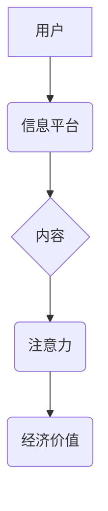

                 

## 1. 背景介绍

在信息爆炸的时代，人们面临着前所未有的信息过载。传统媒体内容生产模式，以大量生产、被动接收为主，逐渐难以适应新时代的需求。注意力经济的兴起，为传统媒体内容生产带来了新的挑战和机遇。

注意力经济的核心概念是，在信息过载的时代，人们的注意力是稀缺的资源，而获取和利用注意力是重要的经济价值。传统媒体的内容生产模式，往往是“内容为王”，注重内容的量和质量，而忽略了内容的针对性和用户体验。注意力经济的到来，强调了内容的精准投放、个性化定制和互动性，要求传统媒体更加注重用户需求，提升内容的吸引力和价值。

## 2. 核心概念与联系

### 2.1 注意力经济

注意力经济是指在信息爆炸时代，人们的注意力成为一种稀缺资源，而获取和利用注意力是重要的经济价值。

**核心原理：**

* **注意力稀缺：** 人类认知能力有限，只能同时关注有限的信息。
* **注意力竞争：** 各种信息平台和内容竞争着用户的注意力。
* **注意力价值：** 获取和利用用户注意力可以带来经济价值。

**架构图：**



### 2.2 传统媒体

传统媒体是指以报纸、杂志、广播、电视等形式传播信息的媒体。

**特点：**

* **大众化传播：** 内容面向大众，缺乏针对性。
* **被动接收：** 用户只能被动接收信息，缺乏互动性。
* **内容量大：** 为了吸引用户，传统媒体往往会大量生产内容。

### 2.3 融合与变革

注意力经济的兴起，对传统媒体内容生产模式带来了深刻影响。传统媒体需要拥抱数字化转型，利用互联网技术，提升内容的精准投放、个性化定制和互动性，才能在注意力经济时代获得生存和发展。

## 3. 核心算法原理 & 具体操作步骤

### 3.1 算法原理概述

注意力机制是一种模仿人类注意力机制的算法，它可以帮助模型专注于输入数据中最重要的部分，从而提高模型的性能。

**核心思想：**

* **赋予不同输入元素不同的权重：** 注意力机制会为每个输入元素分配一个权重，权重高的元素会被模型更加关注。
* **动态调整权重：** 注意力机制可以根据输入数据的上下文信息动态调整权重，从而更加精准地聚焦于重要信息。

### 3.2 算法步骤详解

1. **计算注意力权重：** 使用一个注意力函数计算每个输入元素的权重。
2. **加权求和：** 将每个输入元素与其权重相乘，然后求和，得到一个加权后的输出。
3. **输出结果：** 将加权后的输出作为模型的最终输出。

### 3.3 算法优缺点

**优点：**

* **提高模型性能：** 注意力机制可以帮助模型更加精准地聚焦于重要信息，从而提高模型的性能。
* **解释性强：** 注意力权重可以直观地反映模型对输入数据的关注程度，从而提高模型的解释性。

**缺点：**

* **计算复杂度高：** 注意力机制的计算复杂度较高，需要更多的计算资源。
* **参数量大：** 注意力机制需要更多的参数，需要更多的训练数据才能达到最佳效果。

### 3.4 算法应用领域

注意力机制在自然语言处理、计算机视觉、机器翻译等领域都有广泛的应用。

## 4. 数学模型和公式 & 详细讲解 & 举例说明

### 4.1 数学模型构建

注意力机制的数学模型可以表示为：

$$
\text{Attention}(Q, K, V) = \text{softmax}\left(\frac{Q K^T}{\sqrt{d_k}}\right) V
$$

其中：

* $Q$：查询矩阵
* $K$：键矩阵
* $V$：值矩阵
* $d_k$：键向量的维度
* $\text{softmax}$：softmax函数

### 4.2 公式推导过程

注意力机制的公式推导过程可以分为以下几个步骤：

1. 计算查询向量 $Q$ 和键向量 $K$ 的点积。
2. 对点积结果进行归一化，得到注意力权重。
3. 将注意力权重与值向量 $V$ 进行加权求和，得到最终的输出。

### 4.3 案例分析与讲解

**举例说明：**

假设我们有一个句子 "我爱吃苹果"，我们想要计算每个词语对句子整体语义的贡献。

我们可以将句子中的每个词语作为查询向量 $Q$，键向量 $K$ 和值向量 $V$。然后，使用注意力机制计算每个词语的注意力权重，权重高的词语对句子整体语义的贡献更大。

## 5. 项目实践：代码实例和详细解释说明

### 5.1 开发环境搭建

* Python 3.6+
* TensorFlow 2.0+
* PyTorch 1.0+

### 5.2 源代码详细实现

```python
import tensorflow as tf

# 定义注意力机制
def attention_layer(query, key, value, mask=None):
    # 计算注意力权重
    scores = tf.matmul(query, key, transpose_b=True) / tf.math.sqrt(tf.cast(key.shape[-1], tf.float32))
    if mask is not None:
        scores += (mask * -1e9)
    attention_weights = tf.nn.softmax(scores, axis=-1)
    # 加权求和
    context_vector = tf.matmul(attention_weights, value)
    return context_vector, attention_weights

# 示例代码
query = tf.random.normal([3, 4, 64])
key = tf.random.normal([3, 4, 64])
value = tf.random.normal([3, 4, 64])

context_vector, attention_weights = attention_layer(query, key, value)
print(context_vector.shape)
print(attention_weights.shape)
```

### 5.3 代码解读与分析

* `attention_layer` 函数定义了注意力机制的计算过程。
* `scores` 计算了查询向量和键向量的点积，并进行归一化。
* `attention_weights` 使用 softmax 函数计算注意力权重。
* `context_vector` 通过加权求和得到最终的输出。

### 5.4 运行结果展示

运行代码后，会输出 `context_vector` 和 `attention_weights` 的形状。

## 6. 实际应用场景

### 6.1 内容推荐系统

注意力机制可以用于构建个性化的内容推荐系统，根据用户的历史浏览记录和行为数据，预测用户对哪些内容感兴趣，并推荐相关内容。

### 6.2 内容摘要生成

注意力机制可以用于生成文本摘要，通过关注文本中最重要的部分，生成简洁准确的摘要。

### 6.3 内容分类

注意力机制可以用于文本分类，通过关注文本中与特定类别相关的关键词，提高分类的准确率。

### 6.4 未来应用展望

注意力机制在传统媒体内容生产领域还有很多潜在的应用场景，例如：

* **个性化新闻推送：** 根据用户的兴趣爱好，推送个性化的新闻内容。
* **智能内容创作：** 利用注意力机制辅助内容创作，提高内容的质量和吸引力。
* **内容互动增强：** 通过注意力机制，增强用户与内容的互动，提高用户参与度。

## 7. 工具和资源推荐

### 7.1 学习资源推荐

* **书籍：**
    * 《深度学习》
    * 《Attention Is All You Need》
* **在线课程：**
    * Coursera: Deep Learning Specialization
    * Udacity: Deep Learning Nanodegree

### 7.2 开发工具推荐

* **TensorFlow:** 开源深度学习框架
* **PyTorch:** 开源深度学习框架
* **Hugging Face Transformers:** 预训练模型库

### 7.3 相关论文推荐

* 《Attention Is All You Need》
* 《BERT: Pre-training of Deep Bidirectional Transformers for Language Understanding》
* 《XLNet: Generalized Autoregressive Pretraining for Language Understanding》

## 8. 总结：未来发展趋势与挑战

### 8.1 研究成果总结

注意力机制在传统媒体内容生产领域取得了显著的成果，例如：

* **提高了内容推荐系统的精准度。**
* **提升了内容摘要生成质量。**
* **增强了用户与内容的互动。**

### 8.2 未来发展趋势

未来，注意力机制在传统媒体内容生产领域将继续发展，主要趋势包括：

* **更强大的注意力机制：** 研究更有效的注意力机制，提高模型的性能。
* **更广泛的应用场景：** 将注意力机制应用到更多传统媒体内容生产场景。
* **更个性化的内容体验：** 利用注意力机制，为用户提供更个性化的内容体验。

### 8.3 面临的挑战

注意力机制在传统媒体内容生产领域也面临一些挑战：

* **计算复杂度高：** 注意力机制的计算复杂度较高，需要更多的计算资源。
* **参数量大：** 注意力机制需要更多的参数，需要更多的训练数据才能达到最佳效果。
* **解释性问题：** 注意力机制的注意力权重难以解释，需要进一步研究如何提高模型的解释性。

### 8.4 研究展望

未来，需要进一步研究注意力机制的理论基础、算法优化和应用场景，以更好地解决传统媒体内容生产面临的挑战，为用户提供更优质的内容体验。

## 9. 附录：常见问题与解答

**常见问题：**

* **注意力机制的原理是什么？**

**解答：** 注意力机制是一种模仿人类注意力机制的算法，它可以帮助模型专注于输入数据中最重要的部分。

* **注意力机制有哪些应用场景？**

**解答：** 注意力机制在自然语言处理、计算机视觉、机器翻译等领域都有广泛的应用。

* **如何实现注意力机制？**

**解答：** 可以使用 TensorFlow 或 PyTorch 等深度学习框架实现注意力机制。

**作者：禅与计算机程序设计艺术 / Zen and the Art of Computer Programming**<end_of_turn>

