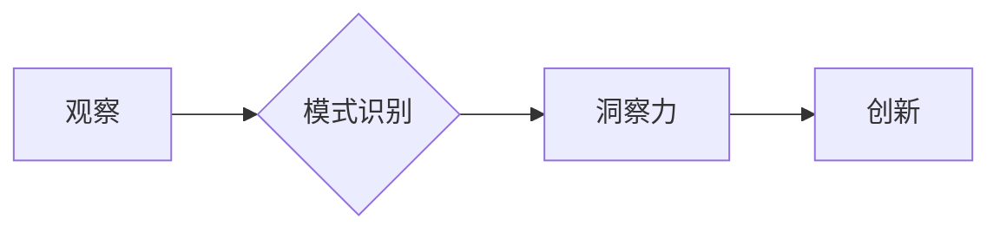

                 

## 洞察力的培养：从观察到创新的跨越

> 关键词：洞察力、观察、创新、人工智能、算法、数据分析、模式识别、机器学习

### 1. 背景介绍

在当今数据爆炸的时代，信息量呈指数级增长，人类面临着前所未有的信息处理挑战。如何从海量数据中提取有价值的洞察力，并将其转化为创新性的解决方案，成为至关重要的议题。洞察力，即对事物本质的深刻理解和预见未来的能力，是推动科技进步和社会发展的重要驱动力。

人工智能（AI）的兴起为洞察力的培养提供了强大的工具和手段。通过机器学习、深度学习等算法，AI可以从海量数据中识别出隐藏的模式和趋势，为人类提供更深入的理解和预测能力。然而，AI仅仅是工具，真正的洞察力来自于人类的观察、思考和创造。

### 2. 核心概念与联系

**2.1 观察：洞察力的起点**

观察是洞察力的基础。敏锐的观察者能够注意到细微的变化，捕捉到看似无关紧要的细节。这些细节往往蕴含着重要的信息，是理解事物本质的关键。

**2.2 模式识别：发现隐藏的规律**

模式识别是将观察到的信息进行分类和归纳，发现隐藏的规律和趋势。人类的大脑天生具备模式识别能力，但AI算法可以更有效地识别复杂的数据模式。

**2.3 创新：洞察力的应用**

创新是将洞察力转化为实际应用的过程。通过对模式的理解和思考，人类可以提出新的解决方案、创造新的价值。

**2.4  Mermaid 流程图**



### 3. 核心算法原理 & 具体操作步骤

**3.1 算法原理概述**

机器学习算法是实现洞察力的关键技术之一。通过训练数据，机器学习算法可以学习数据中的模式和规律，并将其应用于新的数据预测和分类。常见的机器学习算法包括：

* **监督学习:** 利用标记数据训练模型，例如分类和回归问题。
* **无监督学习:** 从未标记数据中发现模式，例如聚类和降维。
* **强化学习:** 通过试错学习，在环境中获得最大奖励。

**3.2 算法步骤详解**

1. **数据收集和预处理:** 收集相关数据，并进行清洗、转换和特征工程等预处理步骤。
2. **模型选择:** 根据具体问题选择合适的机器学习算法。
3. **模型训练:** 利用训练数据训练模型，调整模型参数以达到最佳性能。
4. **模型评估:** 使用测试数据评估模型的性能，例如准确率、召回率和F1-score。
5. **模型部署:** 将训练好的模型部署到实际应用场景中。

**3.3 算法优缺点**

* **优点:** 能够自动学习数据模式，提高效率和准确性。
* **缺点:** 需要大量训练数据，对数据质量要求高，解释性较差。

**3.4 算法应用领域**

机器学习算法广泛应用于各个领域，例如：

* **图像识别:** 人脸识别、物体检测、图像分类。
* **自然语言处理:** 文本分类、情感分析、机器翻译。
* **推荐系统:** 商品推荐、内容推荐、用户画像。
* **金融预测:** 股票预测、信用风险评估、欺诈检测。

### 4. 数学模型和公式 & 详细讲解 & 举例说明

**4.1 数学模型构建**

机器学习算法通常基于数学模型，例如线性回归、逻辑回归、支持向量机等。这些模型通过数学公式来描述数据之间的关系。

**4.2 公式推导过程**

例如，线性回归模型的目标是找到一条直线，将输入特征与输出标签进行拟合。模型的公式如下：

$$y = w_0 + w_1x_1 + w_2x_2 + ... + w_nx_n$$

其中：

* $y$ 是输出标签
* $w_0, w_1, w_2, ..., w_n$ 是模型参数
* $x_1, x_2, ..., x_n$ 是输入特征

模型参数可以通过最小化损失函数来求解，损失函数通常是预测值与真实值的差值。

**4.3 案例分析与讲解**

假设我们想要预测房价，输入特征包括房屋面积、房间数量、地理位置等，输出标签是房价。我们可以使用线性回归模型来建立房价预测模型。通过训练数据，模型可以学习到房屋面积、房间数量等特征与房价之间的关系，并预测新的房屋价格。

### 5. 项目实践：代码实例和详细解释说明

**5.1 开发环境搭建**

可以使用Python语言和相关的机器学习库，例如Scikit-learn、TensorFlow、PyTorch等，搭建开发环境。

**5.2 源代码详细实现**

```python
from sklearn.linear_model import LinearRegression
from sklearn.model_selection import train_test_split
from sklearn.metrics import mean_squared_error

# 加载数据
data = ...

# 将数据分为训练集和测试集
X_train, X_test, y_train, y_test = train_test_split(data.drop('price', axis=1), data['price'], test_size=0.2)

# 创建线性回归模型
model = LinearRegression()

# 训练模型
model.fit(X_train, y_train)

# 预测测试集数据
y_pred = model.predict(X_test)

# 计算模型性能
mse = mean_squared_error(y_test, y_pred)
print(f'Mean Squared Error: {mse}')
```

**5.3 代码解读与分析**

这段代码演示了如何使用Scikit-learn库训练一个线性回归模型来预测房价。

* `train_test_split()`函数将数据分为训练集和测试集。
* `LinearRegression()`函数创建线性回归模型。
* `fit()`函数训练模型。
* `predict()`函数预测测试集数据。
* `mean_squared_error()`函数计算模型性能。

**5.4 运行结果展示**

运行结果会显示测试集数据预测的房价和模型的平均平方误差。

### 6. 实际应用场景

**6.1 市场分析**

通过分析市场数据，例如销售额、客户行为、竞争对手信息等，可以洞察市场趋势，识别潜在机会和风险。

**6.2 产品开发**

通过分析用户需求、市场反馈、技术趋势等，可以洞察用户痛点，开发出更符合市场需求的产品。

**6.3 运营优化**

通过分析运营数据，例如用户活跃度、转化率、成本效益等，可以洞察运营效率，优化运营策略。

**6.4 未来应用展望**

随着人工智能技术的不断发展，洞察力的培养将更加智能化、自动化。未来，AI将能够帮助人类更深入地理解数据，发现更隐蔽的模式，并为人类提供更精准的预测和建议。

### 7. 工具和资源推荐

**7.1 学习资源推荐**

* **书籍:**
    * 《深度学习》
    * 《机器学习实战》
    * 《Python机器学习》
* **在线课程:**
    * Coursera
    * edX
    * Udacity

**7.2 开发工具推荐**

* **Python:** 
    * Scikit-learn
    * TensorFlow
    * PyTorch
* **数据可视化工具:**
    * Matplotlib
    * Seaborn
    * Tableau

**7.3 相关论文推荐**

* **AlphaGo论文:** https://arxiv.org/abs/1607.02886
* **BERT论文:** https://arxiv.org/abs/1810.04805

### 8. 总结：未来发展趋势与挑战

**8.1 研究成果总结**

近年来，人工智能领域取得了显著进展，洞察力的培养取得了突破性进展。机器学习算法能够从海量数据中识别出隐藏的模式和趋势，为人类提供更深入的理解和预测能力。

**8.2 未来发展趋势**

* **更强大的算法:** 随着算法的不断改进，AI将能够识别出更复杂、更隐蔽的模式。
* **更丰富的应用场景:** AI将应用于更多领域，例如医疗、教育、金融等。
* **更智能的交互:** AI将能够与人类进行更自然、更智能的交互。

**8.3 面临的挑战**

* **数据质量:** AI算法对数据质量要求高，数据不准确或不完整会影响模型性能。
* **算法解释性:** 许多AI算法的决策过程难以解释，这可能会导致信任问题。
* **伦理问题:** AI的应用可能会带来伦理问题，例如算法偏见、隐私泄露等。

**8.4 研究展望**

未来，我们需要继续研究更强大的算法、更丰富的应用场景和更智能的交互方式，同时也要关注AI的伦理问题，确保AI技术能够安全、可靠地应用于社会。

### 9. 附录：常见问题与解答

**9.1 如何提高模型的准确性？**

* 使用更多的数据进行训练。
* 尝试不同的算法和模型参数。
* 进行特征工程，提取更有效的特征。

**9.2 如何解释AI算法的决策过程？**

* 使用可解释性AI技术，例如LIME、SHAP等。
* 分析模型的权重和激活函数，了解模型是如何处理数据的。

**9.3 如何避免AI算法的偏见？**

* 使用多样化的训练数据，避免数据偏差。
* 定期评估模型的公平性，并进行调整。


作者：禅与计算机程序设计艺术 / Zen and the Art of Computer Programming 
<end_of_turn>

