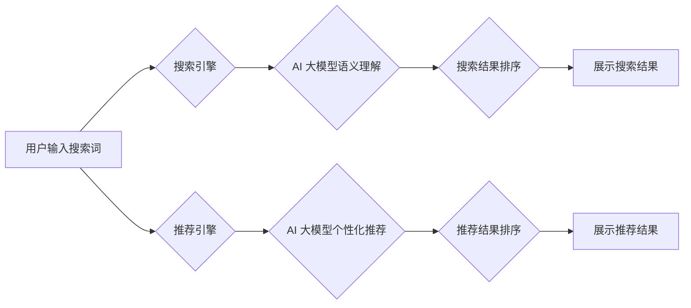

                 

## 电商平台搜索推荐系统的AI 大模型应用：提高系统性能、效率与用户体验

> 关键词：电商平台、搜索推荐系统、AI 大模型、自然语言处理、深度学习、推荐算法、用户体验、个性化推荐

## 1. 背景介绍

随着电商平台的蓬勃发展，用户对商品搜索和推荐的需求日益增长。传统的搜索推荐系统主要依赖于基于规则的算法和特征工程，难以满足用户个性化需求和快速变化的市场趋势。近年来，人工智能（AI）技术，特别是大模型的快速发展，为电商平台搜索推荐系统带来了新的机遇。

AI 大模型，例如 Transformer、BERT 等，具有强大的语义理解和文本生成能力，能够从海量数据中学习到复杂的模式和关系，从而实现更精准、更个性化的商品推荐。

## 2. 核心概念与联系

### 2.1 搜索推荐系统

电商平台搜索推荐系统是用户在平台上搜索商品并获得推荐结果的关键环节。它通常由以下几个模块组成：

* **搜索引擎:** 处理用户搜索词，并返回与搜索词相关的商品列表。
* **推荐引擎:** 基于用户历史行为、商品特征等信息，推荐与用户兴趣相关的商品。
* **个性化引擎:** 根据用户的个人偏好和行为，对搜索结果和推荐结果进行个性化排序和展示。

### 2.2 AI 大模型

AI 大模型是指在海量数据上训练的深度学习模型，具有强大的泛化能力和学习能力。常见的 AI 大模型包括：

* **Transformer:** 是一种基于注意力机制的序列模型，能够捕捉文本中的长距离依赖关系，广泛应用于自然语言处理任务，例如机器翻译、文本摘要、问答系统等。
* **BERT:** 基于 Transformer 的预训练语言模型，能够理解文本的语义和上下文关系，在搜索推荐系统中可以用于理解用户搜索意图和商品描述。

### 2.3 核心架构

AI 大模型在电商平台搜索推荐系统中的应用主要体现在以下几个方面：

* **搜索结果提升:** 利用 AI 大模型对用户搜索词进行语义理解，提高搜索结果的准确性和相关性。
* **个性化推荐:** 基于用户历史行为、商品特征等信息，训练 AI 大模型进行个性化商品推荐，提升用户体验。
* **内容生成:** 利用 AI 大模型生成商品描述、推荐文案等内容，提高商品展示效果。

**Mermaid 流程图**



## 3. 核心算法原理 & 具体操作步骤

### 3.1 算法原理概述

在电商平台搜索推荐系统中，AI 大模型通常采用以下几种算法原理：

* **协同过滤:** 基于用户对商品的评分或购买行为，预测用户对其他商品的兴趣。
* **内容过滤:** 基于商品的特征和描述，推荐与用户兴趣相符的商品。
* **混合推荐:** 结合协同过滤和内容过滤算法，提高推荐效果。

### 3.2 算法步骤详解

**协同过滤算法步骤:**

1. **数据收集:** 收集用户对商品的评分或购买行为数据。
2. **用户相似度计算:** 计算用户之间的相似度，例如基于余弦相似度或皮尔逊相关系数。
3. **商品推荐:** 根据用户相似度，推荐与相似用户喜欢的商品。

**内容过滤算法步骤:**

1. **商品特征提取:** 从商品描述、属性等信息中提取特征向量。
2. **用户兴趣建模:** 根据用户历史行为，构建用户兴趣模型。
3. **商品推荐:** 计算商品特征向量与用户兴趣模型之间的相似度，推荐相似度高的商品。

### 3.3 算法优缺点

**协同过滤算法:**

* **优点:** 可以发现用户隐性偏好，推荐个性化商品。
* **缺点:** 数据稀疏性问题，新用户和新商品推荐效果较差。

**内容过滤算法:**

* **优点:** 不需要用户历史行为数据，可以推荐新商品。
* **缺点:** 难以捕捉用户隐性偏好，推荐结果可能过于单一。

### 3.4 算法应用领域

协同过滤和内容过滤算法广泛应用于电商平台搜索推荐系统、电影推荐系统、音乐推荐系统等领域。

## 4. 数学模型和公式 & 详细讲解 & 举例说明

### 4.1 数学模型构建

**协同过滤算法的数学模型:**

假设用户集合为 U，商品集合为 I，用户对商品的评分矩阵为 R，其中 R(u, i) 表示用户 u 对商品 i 的评分。协同过滤算法的目标是预测用户 u 对商品 i 的评分 R(u, i)。

**内容过滤算法的数学模型:**

假设商品特征向量为 X，用户兴趣向量为 Y，商品推荐结果为 P。内容过滤算法的目标是计算商品特征向量 X 和用户兴趣向量 Y 之间的相似度，并根据相似度计算推荐结果 P。

### 4.2 公式推导过程

**协同过滤算法的公式推导:**

基于用户相似度，可以利用以下公式预测用户 u 对商品 i 的评分:

$$
R(u, i) = \sum_{v \in N(u)} \frac{sim(u, v) * R(v, i)}{\sum_{w \in N(u)} sim(u, w)}
$$

其中，N(u) 表示与用户 u 相似的用户集合，sim(u, v) 表示用户 u 和用户 v 的相似度。

**内容过滤算法的公式推导:**

基于商品特征向量和用户兴趣向量，可以利用以下公式计算商品推荐结果:

$$
P(u, i) = \frac{X(i) \cdot Y(u)}{\|X(i)\| \|Y(u)\|}
$$

其中，X(i) 表示商品 i 的特征向量，Y(u) 表示用户 u 的兴趣向量，· 表示向量点积，|| || 表示向量范数。

### 4.3 案例分析与讲解

**协同过滤算法案例:**

假设用户 A 和用户 B 都喜欢电影 A 和电影 B，但用户 A 还喜欢电影 C，而用户 B 不喜欢电影 C。根据协同过滤算法，可以预测用户 A 对电影 D 的评分，因为用户 A 和用户 B 在电影 A 和电影 B 上的评分相似，并且用户 B 喜欢电影 D。

**内容过滤算法案例:**

假设用户 A 喜欢动作片，而商品 X 是动作片，商品 Y 是爱情片。根据内容过滤算法，可以推荐商品 X 给用户 A，因为商品 X 的特征向量与用户 A 的兴趣向量相似。

## 5. 项目实践：代码实例和详细解释说明

### 5.1 开发环境搭建

* **操作系统:** Linux 或 macOS
* **编程语言:** Python
* **深度学习框架:** TensorFlow 或 PyTorch
* **其他工具:** Jupyter Notebook、Git

### 5.2 源代码详细实现

```python
# 协同过滤算法示例代码

import numpy as np

# 用户评分矩阵
ratings = np.array([
    [5, 4, 3, 2, 1],
    [4, 5, 2, 1, 3],
    [3, 2, 5, 4, 1],
    [2, 1, 4, 5, 3],
    [1, 3, 1, 3, 5]
])

# 计算用户相似度
def calculate_similarity(user1, user2):
    return np.corrcoef(ratings[user1], ratings[user2])[0, 1]

# 预测用户对商品的评分
def predict_rating(user, item):
    similarities = [calculate_similarity(user, v) for v in range(len(ratings))]
    weighted_ratings = [similarities[v] * ratings[v, item] for v in range(len(ratings))]
    return np.sum(weighted_ratings) / np.sum(similarities)

# 预测用户 0 对商品 2 的评分
predicted_rating = predict_rating(0, 2)
print(f"Predicted rating for user 0 on item 2: {predicted_rating}")
```

### 5.3 代码解读与分析

* **用户评分矩阵:** 存储了用户对商品的评分数据。
* **计算用户相似度:** 使用 Pearson 相关系数计算用户之间的相似度。
* **预测用户对商品的评分:** 根据用户相似度和其他用户的评分，预测用户对商品的评分。

### 5.4 运行结果展示

运行上述代码，可以得到用户 0 对商品 2 的预测评分。

## 6. 实际应用场景

### 6.1 个性化推荐

AI 大模型可以根据用户的历史行为、偏好和上下文信息，提供个性化的商品推荐，提升用户体验和转化率。

### 6.2 搜索结果提升

AI 大模型可以理解用户搜索词的语义和意图，提高搜索结果的准确性和相关性，帮助用户快速找到所需商品。

### 6.3 内容生成

AI 大模型可以生成商品描述、推荐文案等内容，提高商品展示效果和吸引力。

### 6.4 未来应用展望

* **多模态推荐:** 将文本、图像、视频等多模态数据融合到推荐系统中，提供更丰富的用户体验。
* **实时推荐:** 基于用户实时行为，提供动态变化的推荐结果，提升推荐的时效性和精准度。
* **跨平台推荐:** 将用户数据和行为信息整合到多个平台，实现跨平台的个性化推荐。

## 7. 工具和资源推荐

### 7.1 学习资源推荐

* **书籍:**
    * Deep Learning by Ian Goodfellow, Yoshua Bengio, and Aaron Courville
    * Natural Language Processing with Python by Steven Bird, Ewan Klein, and Edward Loper
* **在线课程:**
    * Stanford CS224N: Natural Language Processing with Deep Learning
    * DeepLearning.AI TensorFlow Specialization

### 7.2 开发工具推荐

* **深度学习框架:** TensorFlow, PyTorch
* **自然语言处理库:** NLTK, spaCy
* **数据处理工具:** Pandas, NumPy

### 7.3 相关论文推荐

* Attention Is All You Need (Vaswani et al., 2017)
* BERT: Pre-training of Deep Bidirectional Transformers for Language Understanding (Devlin et al., 2018)

## 8. 总结：未来发展趋势与挑战

### 8.1 研究成果总结

AI 大模型在电商平台搜索推荐系统中的应用取得了显著成果，提升了系统性能、效率和用户体验。

### 8.2 未来发展趋势

* **模型规模和能力提升:** 随着计算资源的不断发展，AI 大模型的规模和能力将进一步提升，带来更精准、更个性化的推荐结果。
* **多模态融合:** 将文本、图像、视频等多模态数据融合到推荐系统中，提供更丰富的用户体验。
* **解释性AI:** 研究AI模型的决策过程，提高推荐结果的可解释性和透明度。

### 8.3 面临的挑战

* **数据质量和隐私:** AI 大模型的训练需要海量数据，数据质量和隐私保护是需要关注的挑战。
* **模型可解释性和公平性:** AI 模型的决策过程往往难以理解，需要研究模型的可解释性和公平性问题。
* **计算资源和成本:** 训练大型AI模型需要大量的计算资源和成本，如何降低成本是需要解决的挑战。

### 8.4 研究展望

未来，AI 大模型在电商平台搜索推荐系统中的应用将更加广泛和深入，为用户提供更智能、更个性化的购物体验。


## 9. 附录：常见问题与解答

**Q1: AI 大模型的训练需要多少数据？**

A1: AI 大模型的训练需要海量数据，通常需要百万甚至数十亿条数据。

**Q2: 如何评估 AI 大模型的推荐效果？**

A2: 可以使用各种指标来评估 AI 大模型的推荐效果，例如点击率、转化率、用户满意度等。

**Q3: 如何解决 AI 大模型的过拟合问题？**

A3: 可以使用正则化、Dropout 等技术来解决 AI 大模型的过拟合问题。


作者：禅与计算机程序设计艺术 / Zen and the Art of Computer Programming 
<end_of_turn>

