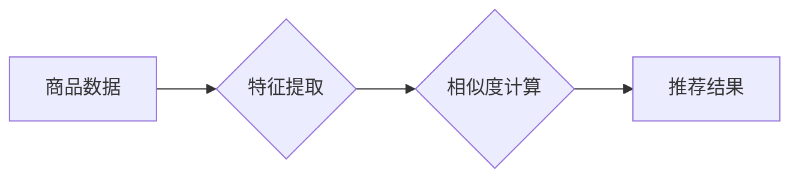

                 

## 电商搜索中的AI商品相似度计算

> 关键词：商品相似度计算、电商搜索、人工智能、机器学习、协同过滤、内容基元、向量化表示、TF-IDF、Word2Vec、深度学习

## 1. 背景介绍

在当今以电商为核心的数字经济时代，高效精准的商品搜索体验已成为消费者购物决策的关键因素。传统基于关键词匹配的搜索方式难以满足用户日益复杂的搜索需求，尤其在面对长尾关键词、模糊查询等场景时，效果往往不佳。因此，基于人工智能（AI）的商品相似度计算技术应运而生，为电商搜索带来了新的机遇和挑战。

商品相似度计算旨在根据商品的属性、特征、描述等信息，量化不同商品之间的相似程度。通过计算商品之间的相似度，电商平台可以实现以下功能：

* **推荐相关商品：** 当用户搜索特定商品时，系统可以推荐与其相似度高的其他商品，提升用户购物体验和转化率。
* **个性化搜索结果：** 根据用户的历史浏览记录、购买行为等数据，系统可以根据用户的偏好进行商品排序，提供更个性化的搜索结果。
* **商品分类和聚类：** 通过计算商品之间的相似度，可以将商品进行分类和聚类，方便用户浏览和查找商品。
* **商品价格优化：** 通过分析相似商品的价格趋势，电商平台可以制定更合理的商品定价策略。

## 2. 核心概念与联系

商品相似度计算的核心概念包括：

* **商品特征提取：** 从商品的属性、描述、图片等信息中提取特征，用于量化商品的属性和特点。
* **相似度度量：** 使用数学模型和算法计算商品之间的相似度，常用的度量方法包括余弦相似度、Jaccard相似度、编辑距离等。
* **推荐算法：** 基于商品相似度，推荐相关商品给用户，常用的推荐算法包括协同过滤、基于内容的推荐等。

**核心概念架构流程图：**



## 3. 核心算法原理 & 具体操作步骤

### 3.1  算法原理概述

商品相似度计算算法主要分为两大类：

* **基于内容的推荐算法：** 基于商品的属性、描述等内容特征进行相似度计算，例如使用TF-IDF算法计算商品关键词的权重，然后计算商品关键词之间的相似度。
* **协同过滤算法：** 基于用户对商品的评分或购买行为进行相似度计算，例如使用用户-商品矩阵进行相似度计算，找到与目标用户兴趣相似的用户，并推荐他们喜欢的商品。

### 3.2  算法步骤详解

**基于内容的推荐算法步骤：**

1. **数据预处理：** 对商品数据进行清洗、格式化等预处理，例如去除停用词、标准化文本等。
2. **特征提取：** 从商品数据中提取特征，例如商品标题、描述、类别、属性等。
3. **特征向量化：** 将提取的特征转换为向量形式，例如使用TF-IDF算法计算关键词权重，构建商品关键词向量。
4. **相似度计算：** 使用余弦相似度、Jaccard相似度等算法计算商品向量之间的相似度。
5. **推荐结果输出：** 根据商品相似度排序，推荐与目标商品相似度高的商品。

**协同过滤算法步骤：**

1. **数据收集：** 收集用户对商品的评分或购买行为数据。
2. **用户-商品矩阵构建：** 将用户和商品信息构建成用户-商品矩阵，其中每个元素表示用户对商品的评分或购买行为。
3. **相似用户/商品计算：** 使用余弦相似度、Pearson相关系数等算法计算用户之间的相似度或商品之间的相似度。
4. **推荐结果输出：** 根据相似用户或商品推荐相关商品给用户。

### 3.3  算法优缺点

**基于内容的推荐算法：**

* **优点：** 可以推荐与用户兴趣相似的商品，即使用户没有评分或购买行为数据。
* **缺点：** 需要大量的商品特征数据，并且难以捕捉用户隐性的兴趣偏好。

**协同过滤算法：**

* **优点：** 可以推荐用户可能感兴趣但从未接触过的商品，能够捕捉用户隐性的兴趣偏好。
* **缺点：** 需要大量的用户行为数据，容易出现冷启动问题，即对于新用户或新商品难以进行推荐。

### 3.4  算法应用领域

商品相似度计算算法广泛应用于以下领域：

* **电商搜索：** 推荐相关商品、个性化搜索结果。
* **推荐系统：** 基于用户兴趣推荐商品、电影、音乐等。
* **内容聚类：** 将相似内容进行聚类，方便用户浏览和查找。
* **知识图谱构建：** 基于商品相似度构建知识图谱，实现知识发现和推理。

## 4. 数学模型和公式 & 详细讲解 & 举例说明

### 4.1  数学模型构建

商品相似度计算通常使用向量空间模型，将商品表示为向量，向量中的每个维度代表商品的某个特征。

**向量空间模型：**

* **商品向量：**  每个商品用一个向量表示，向量中的每个元素代表商品的某个特征值。
* **特征权重：**  每个特征的权重代表其重要性，可以使用TF-IDF算法计算特征权重。
* **相似度度量：** 使用余弦相似度、Jaccard相似度等算法计算商品向量之间的相似度。

### 4.2  公式推导过程

**余弦相似度公式：**

$$
\text{相似度} = \frac{\mathbf{A} \cdot \mathbf{B}}{||\mathbf{A}|| ||\mathbf{B}||}
$$

其中：

* $\mathbf{A}$ 和 $\mathbf{B}$ 是两个商品的向量表示。
* $\mathbf{A} \cdot \mathbf{B}$ 是两个向量之间的点积。
* $||\mathbf{A}||$ 和 $||\mathbf{B}||$ 是两个向量的模长。

**Jaccard相似度公式：**

$$
\text{相似度} = \frac{|\mathbf{A} \cap \mathbf{B}|}{|\mathbf{A} \cup \mathbf{B}|}
$$

其中：

* $\mathbf{A}$ 和 $\mathbf{B}$ 是两个商品的特征集合。
* $|\mathbf{A} \cap \mathbf{B}|$ 是两个集合的交集大小。
* $|\mathbf{A} \cup \mathbf{B}|$ 是两个集合的并集大小。

### 4.3  案例分析与讲解

**案例：**

假设有两个商品，商品 A 的特征向量为 [1, 2, 3, 4]，商品 B 的特征向量为 [2, 3, 4, 5]。

**余弦相似度计算：**

* 点积：1*2 + 2*3 + 3*4 + 4*5 = 32
* 模长：√(1^2 + 2^2 + 3^2 + 4^2) = √30
* 模长：√(2^2 + 3^2 + 4^2 + 5^2) = √54
* 余弦相似度：32 / (√30 * √54) ≈ 0.92

**Jaccard相似度计算：**

* 交集：{2, 3, 4}
* 并集：{1, 2, 3, 4, 5}
* Jaccard相似度：3 / 5 = 0.6

**分析：**

从计算结果可以看出，两个商品的余弦相似度较高，说明它们在特征空间上的距离较近，相似度较高。而Jaccard相似度相对较低，说明它们在特征集合上的交集较小，相似度较低。

## 5. 项目实践：代码实例和详细解释说明

### 5.1  开发环境搭建

* Python 3.x
* scikit-learn 库
* Numpy 库
* Pandas 库

### 5.2  源代码详细实现

```python
import numpy as np
from sklearn.feature_extraction.text import TfidfVectorizer

# 商品数据
products = [
    {"title": "苹果手机", "description": "新款苹果手机，性能强劲，拍照出色"},
    {"title": "华为手机", "description": "华为旗舰手机，屏幕大，续航长"},
    {"title": "小米手机", "description": "性价比高的手机，配置全面"},
]

# TF-IDF 向量化
vectorizer = TfidfVectorizer()
tfidf_matrix = vectorizer.fit_transform([product["title"] + " " + product["description"] for product in products])

# 余弦相似度计算
cosine_similarities = np.dot(tfidf_matrix, tfidf_matrix.T) / (np.linalg.norm(tfidf_matrix, axis=1)[:, None] * np.linalg.norm(tfidf_matrix, axis=1)[None, :])

# 打印相似度矩阵
print(cosine_similarities)
```

### 5.3  代码解读与分析

* 使用 `TfidfVectorizer` 将商品标题和描述转换为 TF-IDF 向量。
* 使用 `np.dot` 计算商品向量之间的点积。
* 使用 `np.linalg.norm` 计算商品向量的模长。
* 使用余弦相似度公式计算商品之间的相似度。

### 5.4  运行结果展示

运行代码后，会输出一个相似度矩阵，其中每个元素表示两个商品之间的相似度。

## 6. 实际应用场景

### 6.1  电商搜索推荐

在电商平台搜索页面，当用户输入关键词时，系统可以根据商品的相似度，推荐与用户搜索关键词相关的商品，提升用户购物体验。

### 6.2  个性化商品推荐

根据用户的浏览历史、购买记录等数据，系统可以计算用户与不同商品的相似度，并推荐用户可能感兴趣的商品。

### 6.3  商品分类和聚类

通过计算商品之间的相似度，可以将商品进行分类和聚类，方便用户浏览和查找商品。

### 6.4  未来应用展望

随着人工智能技术的不断发展，商品相似度计算技术将应用于更多场景，例如：

* **智能客服：** 基于商品相似度，智能客服可以更准确地理解用户的需求，并提供更合适的商品推荐。
* **跨境电商：** 基于商品相似度，跨境电商平台可以将不同国家的商品进行匹配，方便用户购买海外商品。
* **虚拟现实购物：** 基于商品相似度，虚拟现实购物平台可以为用户提供更沉浸式的购物体验。

## 7. 工具和资源推荐

### 7.1  学习资源推荐

* **书籍：**
    * 《推荐系统实践》
    * 《机器学习》
* **在线课程：**
    * Coursera 上的《机器学习》课程
    * edX 上的《推荐系统》课程

### 7.2  开发工具推荐

* **Python:** 
    * scikit-learn 库
    * Numpy 库
    * Pandas 库
* **Spark:** 
    * 用于大规模数据处理的分布式计算框架

### 7.3  相关论文推荐

* **协同过滤算法：**
    * "Collaborative Filtering: A User-Based Approach"
    * "Memory-Based Collaborative Filtering"
* **基于内容的推荐算法：**
    * "Content-Based Recommendation Systems"
    * "Personalized Recommendation Using Content-Based Filtering"

## 8. 总结：未来发展趋势与挑战

### 8.1  研究成果总结

商品相似度计算技术已经取得了显著的成果，在电商搜索、推荐系统等领域得到了广泛应用。

### 8.2  未来发展趋势

* **深度学习应用：** 将深度学习技术应用于商品相似度计算，提高算法的准确性和效率。
* **多模态特征融合：** 将商品的文本、图像、视频等多模态特征融合，构建更全面的商品表示。
* **个性化推荐增强：** 基于用户行为、偏好等数据，实现更精准的个性化商品推荐。

### 8.3  面临的挑战

* **数据稀疏性：** 商品数据往往存在稀疏性，难以训练出准确的模型。
* **冷启动问题：** 对于新用户或新商品，难以进行有效的推荐。
* **解释性问题：** 深度学习模型的决策过程难以解释，难以理解模型是如何进行相似度计算的。

### 8.4  研究展望

未来，商品相似度计算技术将继续朝着更智能、更精准、更个性化的方向发展，为用户提供更优质的购物体验。


## 9. 附录：常见问题与解答

**Q1：如何处理商品数据中的停用词？**

**A1：** 可以使用停用词列表进行过滤，去除商品数据中的停用词，例如“的”、“是”、“在”等。

**Q2：如何选择合适的相似度度量方法？**

**A2：** 选择合适的相似度度量方法需要根据具体应用场景和数据特点进行选择。例如，对于文本数据，余弦相似度和Jaccard相似度都是常用的度量方法。

**Q3：如何解决冷启动问题？**

**A3：** 可以使用一些冷启动策略，例如：

* 基于商品属性进行推荐
* 基于用户行为进行推荐
* 使用协同过滤算法进行推荐

**作者：禅与计算机程序设计艺术 / Zen and the Art of Computer Programming**<end_of_turn>

