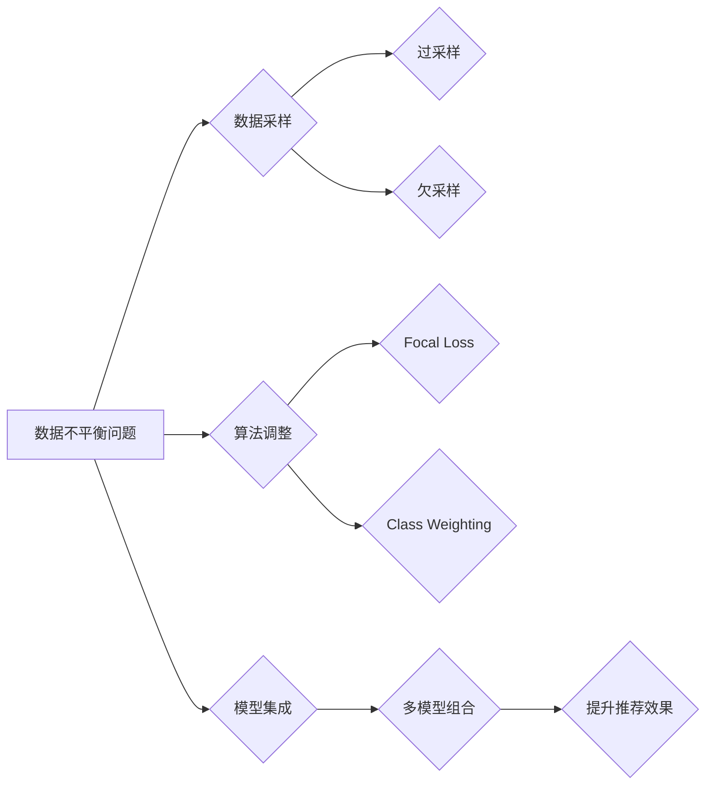

                 

## 关键词：电商搜索推荐、AI大模型、数据不平衡、解决方案、对比分析、算法原理、实践案例

## 1. 背景介绍

在当今数据爆炸的时代，电商平台的搜索推荐系统扮演着至关重要的角色。它直接影响着用户体验、商品曝光和最终的销售转化。传统的搜索推荐系统主要依赖于基于规则的算法和协同过滤技术，但随着用户行为数据的复杂性和海量化，这些方法逐渐难以满足日益增长的需求。

近年来，基于深度学习的AI大模型在自然语言处理、计算机视觉等领域取得了突破性进展，也为电商搜索推荐带来了新的机遇。AI大模型能够学习用户行为、商品特征等复杂关系，提供更精准、个性化的推荐结果。然而，电商搜索推荐数据往往存在着严重的数据不平衡问题，即某些商品的搜索量和点击量远高于其他商品，导致模型训练效果不佳，难以兼顾热门商品和冷门商品的推荐。

## 2. 核心概念与联系

### 2.1 数据不平衡问题

数据不平衡是指在训练数据集中，某些类别（例如，热门商品）的样本数量远大于其他类别（例如，冷门商品）的样本数量。这种现象在电商搜索推荐中非常普遍，主要原因包括：

* **用户偏好差异:** 用户对商品的兴趣和需求存在差异，导致某些商品的搜索量和点击量更高。
* **商品属性差异:** 商品的类别、价格、品牌等属性也会影响其搜索量和点击量。
* **平台运营策略:** 平台可能会通过推荐算法、促销活动等方式，提升热门商品的曝光率。

### 2.2 AI大模型

AI大模型是指参数量巨大、训练数据海量、能够学习复杂模式的深度学习模型。常见的AI大模型架构包括Transformer、BERT、GPT等。

### 2.3 解决方案

为了解决电商搜索推荐中的数据不平衡问题，研究者们提出了多种解决方案，主要包括：

* **数据采样:** 通过随机抽样、过采样、欠采样等方法，调整训练数据集中不同类别的样本数量，使其更加平衡。
* **算法调整:** 采用针对数据不平衡的算法，例如，Focal Loss、Class Weighting等，提高模型对少数类别的学习能力。
* **模型集成:** 将多个模型组合起来，利用不同模型的优势，提高整体推荐效果。

**Mermaid 流程图**



## 3. 核心算法原理 & 具体操作步骤

### 3.1 算法原理概述

Focal Loss是一种针对数据不平衡问题的损失函数，它通过调整样本权重，提高模型对少数类别的学习能力。Focal Loss的公式如下：

$$
\mathcal{L}_{Focal} = -\alpha_t (1-p_t)^{\gamma} \log(p_t)
$$

其中：

* $\alpha_t$ 是类别权重，用于平衡不同类别的样本数量。
* $p_t$ 是模型预测该样本属于正类的概率。
* $\gamma$ 是聚焦参数，用于控制模型对难样本的关注程度。

Focal Loss通过将 $(1-p_t)^{\gamma}$ 项引入损失函数，降低了模型对易分类样本的关注，提高了对难分类样本的学习能力。

### 3.2 算法步骤详解

1. **数据预处理:** 对训练数据进行清洗、格式化等预处理操作。
2. **数据采样:** 根据需要，对训练数据进行过采样或欠采样，调整不同类别的样本数量。
3. **模型训练:** 使用Focal Loss作为损失函数，训练深度学习模型。
4. **模型评估:** 使用测试数据评估模型的性能，例如，准确率、召回率、F1-score等。
5. **模型调参:** 根据评估结果，调整模型参数，例如，学习率、聚焦参数等，优化模型性能。

### 3.3 算法优缺点

**优点:**

* 能够有效解决数据不平衡问题。
* 提升模型对少数类别的学习能力。
* 适用于多种深度学习模型。

**缺点:**

* 需要根据具体问题调整参数，例如，类别权重、聚焦参数等。
* 训练时间可能较长。

### 3.4 算法应用领域

Focal Loss广泛应用于图像分类、目标检测、自然语言处理等领域，特别适用于数据不平衡问题较为严重的场景。

## 4. 数学模型和公式 & 详细讲解 & 举例说明

### 4.1 数学模型构建

Focal Loss的数学模型构建基于交叉熵损失函数，并引入一个聚焦因子 $(1-p_t)^{\gamma}$。

**交叉熵损失函数:**

$$
\mathcal{L}_{CE} = -y \log(p) - (1-y) \log(1-p)
$$

其中：

* $y$ 是真实标签，0或1。
* $p$ 是模型预测该样本属于正类的概率。

**Focal Loss公式:**

$$
\mathcal{L}_{Focal} = -\alpha_t (1-p_t)^{\gamma} \log(p_t)
$$

其中：

* $\alpha_t$ 是类别权重，用于平衡不同类别的样本数量。
* $p_t$ 是模型预测该样本属于正类的概率。
* $\gamma$ 是聚焦参数，用于控制模型对难样本的关注程度。

### 4.2 公式推导过程

Focal Loss的推导过程主要基于以下思想：

* **降低易分类样本的权重:** 对于易分类样本，模型预测概率 $p_t$ 接近于0或1，此时 $(1-p_t)^{\gamma}$ 项接近于1，不会对损失函数产生显著影响。
* **提高难分类样本的权重:** 对于难分类样本，模型预测概率 $p_t$ 接近于0.5，此时 $(1-p_t)^{\gamma}$ 项会随着 $\gamma$ 的增大而增大，提高了对该样本的关注程度。

### 4.3 案例分析与讲解

假设我们有一个电商搜索推荐系统，其中商品分为热门商品和冷门商品两类。热门商品的搜索量和点击量远高于冷门商品。

如果使用传统的交叉熵损失函数训练模型，模型可能会过度关注热门商品，而忽略冷门商品。

使用Focal Loss可以有效解决这个问题。通过设置较大的类别权重 $\alpha_t$ 和聚焦参数 $\gamma$，可以提高模型对冷门商品的学习能力，从而提升推荐效果。

## 5. 项目实践：代码实例和详细解释说明

### 5.1 开发环境搭建

* Python 3.6+
* TensorFlow 2.0+
* PyTorch 1.0+

### 5.2 源代码详细实现

```python
import tensorflow as tf

def focal_loss(y_true, y_pred, alpha=0.25, gamma=2.0):
    """
    Focal Loss 函数实现
    """
    epsilon = 1e-10
    p_t = tf.clip_by_value(y_pred, epsilon, 1 - epsilon)
    return -alpha * (1 - p_t)**gamma * tf.math.log(p_t)

# 使用 Focal Loss 训练模型
model.compile(optimizer='adam',
              loss=focal_loss,
              metrics=['accuracy'])
model.fit(x_train, y_train, epochs=10)
```

### 5.3 代码解读与分析

* `focal_loss` 函数实现 Focal Loss 公式。
* `alpha` 参数用于控制类别权重，`gamma` 参数用于控制聚焦程度。
* `model.compile` 方法配置模型训练参数，使用 Focal Loss 作为损失函数。
* `model.fit` 方法训练模型。

### 5.4 运行结果展示

训练完成后，可以使用测试数据评估模型的性能，例如，计算准确率、召回率、F1-score等指标。

## 6. 实际应用场景

Focal Loss在电商搜索推荐中具有广泛的应用场景，例如：

* **商品推荐:** 提升对冷门商品的推荐效果，提高用户发现新商品的可能性。
* **搜索结果排序:** 提高对用户搜索意图匹配度高的商品的排序，提升用户搜索体验。
* **个性化推荐:** 根据用户的历史行为和偏好，个性化推荐商品，提高用户满意度。

### 6.4 未来应用展望

随着AI技术的不断发展，Focal Loss在电商搜索推荐领域的应用场景将会更加广泛。例如：

* **多模态推荐:** 将文本、图像、视频等多模态数据融合，提升推荐效果。
* **实时推荐:** 基于用户的实时行为，提供更精准、更及时化的推荐。
* **跨平台推荐:** 将用户行为数据跨平台整合，提供更全面的用户画像，提升推荐精准度。

## 7. 工具和资源推荐

### 7.1 学习资源推荐

* **书籍:**
    * 深度学习
    * 自然语言处理
* **在线课程:**
    * Coursera
    * edX
    * Udacity

### 7.2 开发工具推荐

* **深度学习框架:** TensorFlow, PyTorch
* **数据处理工具:** Pandas, NumPy
* **代码编辑器:** VS Code, PyCharm

### 7.3 相关论文推荐

* Focal Loss for Dense Object Detection
* Class-Balanced Loss Based on Effective Margin for Object Detection

## 8. 总结：未来发展趋势与挑战

### 8.1 研究成果总结

Focal Loss是一种有效的解决数据不平衡问题的算法，在电商搜索推荐领域取得了显著的成果。它能够提升模型对少数类别的学习能力，提高推荐效果。

### 8.2 未来发展趋势

未来，Focal Loss的研究方向将更加注重以下几个方面：

* **算法优化:** 探索更有效的聚焦策略，提高模型对难样本的学习能力。
* **场景应用:** 将 Focal Loss应用于更多电商搜索推荐场景，例如，多模态推荐、实时推荐等。
* **理论研究:** 深入研究 Focal Loss的理论基础，探索其在不同数据分布下的性能表现。

### 8.3 面临的挑战

Focal Loss在实际应用中也面临一些挑战：

* **参数调优:** Focal Loss的性能依赖于参数的设置，需要根据具体问题进行调优。
* **数据质量:** Focal Loss的有效性依赖于高质量的训练数据，数据不完整或噪声会影响模型性能。
* **计算资源:** 训练大型的AI模型需要大量的计算资源，这对于一些中小企业来说是一个挑战。

### 8.4 研究展望

尽管面临挑战，但Focal Loss在电商搜索推荐领域仍具有巨大的潜力。未来，随着算法的不断优化和计算资源的不断提升，Focal Loss将发挥越来越重要的作用，为用户提供更精准、更个性化的商品推荐服务。

## 9. 附录：常见问题与解答

**Q1: Focal Loss 和交叉熵损失函数有什么区别？**

**A1:** Focal Loss 是交叉熵损失函数的一种改进版本，它通过引入一个聚焦因子，降低了模型对易分类样本的关注，提高了对难分类样本的学习能力。

**Q2: Focal Loss 的参数 alpha 和 gamma 的作用是什么？**

**A2:** alpha 参数用于控制类别权重，gamma 参数用于控制聚焦程度。

**Q3: 如何选择 Focal Loss 的参数？**

**A3:** 参数的选择需要根据具体问题进行调优，可以使用交叉验证等方法进行搜索。


作者：禅与计算机程序设计艺术 / Zen and the Art of Computer Programming 
<end_of_turn>

