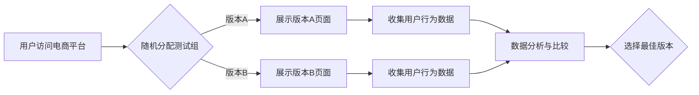

                 

## 电商搜索的A/B测试：AI如何加速优化

> 关键词：电商搜索、A/B测试、人工智能、推荐系统、机器学习、优化算法、用户体验

## 1. 背景介绍

在当今以电商为核心的数字经济时代，搜索引擎已成为用户获取商品信息和完成购买决策的关键入口。电商平台的搜索体验直接影响着用户粘性、转化率和最终的商业成功。传统的A/B测试方法虽然能够有效地评估搜索结果页面的不同设计方案，但其效率有限，且难以捕捉到用户行为背后的复杂交互关系。

随着人工智能技术的快速发展，机器学习算法能够从海量用户数据中挖掘出隐藏的模式和趋势，为电商搜索的优化提供更精准、更有效的解决方案。本文将深入探讨如何利用AI技术，结合A/B测试方法，加速电商搜索的优化，提升用户体验和商业价值。

## 2. 核心概念与联系

### 2.1 A/B测试

A/B测试是一种常用的用户体验优化方法，通过将用户随机分配到不同的测试组，比较不同版本的设计方案对用户行为的影响。

**流程图：**



### 2.2 人工智能 (AI)

人工智能是指模拟人类智能行为的计算机系统。在电商搜索领域，AI技术主要应用于以下几个方面：

* **搜索结果排序:** 利用机器学习算法，根据用户搜索历史、浏览记录、购买行为等数据，对搜索结果进行个性化排序，提升用户搜索体验。
* **推荐系统:** 基于用户的兴趣偏好和购买行为，推荐相关商品，提高用户转化率。
* **自然语言处理 (NLP):** 理解用户搜索的意图，即使用户输入的关键词不完整或模糊，也能准确地返回相关结果。

### 2.3 结合A/B测试与AI

将AI技术与A/B测试相结合，可以实现以下优势：

* **更精准的优化:** AI算法能够从海量数据中挖掘出用户行为的细微变化，帮助识别出对用户体验影响最大的因素。
* **更快速迭代:** AI算法可以快速学习和适应用户的变化，从而加速搜索结果页面的优化迭代。
* **更个性化的体验:** AI算法可以根据用户的个性化需求，提供更精准的搜索结果和推荐，提升用户满意度。

## 3. 核心算法原理 & 具体操作步骤

### 3.1 算法原理概述

在电商搜索的A/B测试中，常用的AI算法包括：

* **梯度提升树 (GBDT):** 是一种集成学习算法，通过构建多个决策树并进行加权组合，实现对复杂数据的预测和排序。
* **深度神经网络 (DNN):** 能够学习更复杂的特征关系，在自然语言处理和推荐系统中表现出色。
* **协同过滤:** 基于用户的行为相似性，推荐相关商品。

### 3.2 算法步骤详解

**以GBDT为例，其在电商搜索A/B测试中的具体操作步骤如下：**

1. **数据收集:** 收集用户搜索历史、浏览记录、购买行为等数据，并进行清洗和预处理。
2. **特征工程:** 从原始数据中提取特征，例如用户ID、商品ID、搜索关键词、点击次数、购买次数等。
3. **模型训练:** 使用GBDT算法对训练数据进行模型训练，学习用户行为的模式和趋势。
4. **模型评估:** 使用测试数据对模型进行评估，并选择性能最佳的模型。
5. **A/B测试:** 将训练好的模型应用于不同的测试组，比较不同版本搜索结果页面的用户行为指标，例如点击率、转化率等。
6. **结果分析:** 分析A/B测试的结果，选择对用户体验和商业价值影响最大的版本。
7. **模型迭代:** 根据A/B测试的结果，对模型进行调整和优化，不断提升搜索结果的质量。

### 3.3 算法优缺点

**GBDT算法的优缺点:**

* **优点:** 
    * 准确率高，能够学习复杂的数据关系。
    * 训练速度快，适合处理海量数据。
    * 可解释性强，可以分析模型的决策过程。
* **缺点:** 
    * 对数据质量要求高，需要进行充分的清洗和预处理。
    * 容易过拟合，需要进行正则化和交叉验证等技术来避免。

### 3.4 算法应用领域

GBDT算法广泛应用于电商搜索、推荐系统、广告投放等领域，其强大的预测能力和可解释性使其成为AI优化的重要工具。

## 4. 数学模型和公式 & 详细讲解 & 举例说明

### 4.1 数学模型构建

在电商搜索A/B测试中，常用的数学模型包括：

* **点击率 (CTR):**  衡量用户点击搜索结果的概率。

$$CTR = \frac{点击次数}{展示次数}$$

* **转化率 (CVR):** 衡量用户点击搜索结果后完成购买的概率。

$$CVR = \frac{购买次数}{点击次数}$$

* **用户满意度 (US):** 衡量用户对搜索结果的满意程度。

$$US = \frac{好评次数}{总评价次数}$$

### 4.2 公式推导过程

GBDT算法的训练过程可以看作是一个优化问题的求解过程，目标是找到一个能够最大化用户满意度的模型。

GBDT算法使用梯度下降法来优化模型参数，其核心思想是通过不断调整模型参数，使得模型预测结果与真实结果之间的误差最小化。

### 4.3 案例分析与讲解

假设电商平台A和B分别测试了两种不同的搜索结果排序算法，并收集了用户点击、购买和评价数据。

通过计算CTR、CVR和US等指标，可以比较两种算法的性能。

如果算法A的CTR、CVR和US都高于算法B，则说明算法A对用户体验和商业价值有更好的提升效果。

## 5. 项目实践：代码实例和详细解释说明

### 5.1 开发环境搭建

* **操作系统:** Linux/macOS/Windows
* **编程语言:** Python
* **深度学习框架:** TensorFlow/PyTorch
* **数据处理工具:** Pandas/NumPy
* **版本控制工具:** Git

### 5.2 源代码详细实现

```python
# 导入必要的库
import pandas as pd
from sklearn.model_selection import train_test_split
from sklearn.metrics import accuracy_score
from xgboost import XGBClassifier

# 加载数据
data = pd.read_csv('电商搜索数据.csv')

# 数据预处理
# ...

# 将数据分为训练集和测试集
X_train, X_test, y_train, y_test = train_test_split(data.drop('点击', axis=1), data['点击'], test_size=0.2)

# 创建GBDT模型
model = XGBClassifier()

# 训练模型
model.fit(X_train, y_train)

# 预测测试集结果
y_pred = model.predict(X_test)

# 计算模型准确率
accuracy = accuracy_score(y_test, y_pred)
print(f'模型准确率: {accuracy}')
```

### 5.3 代码解读与分析

* **数据加载和预处理:** 首先需要加载电商搜索数据，并进行必要的预处理，例如缺失值处理、特征编码等。
* **数据分割:** 将数据分为训练集和测试集，用于训练和评估模型。
* **模型创建:** 使用XGBoost库创建GBDT模型。
* **模型训练:** 使用训练集训练GBDT模型。
* **模型评估:** 使用测试集评估模型的性能，例如计算准确率。

### 5.4 运行结果展示

运行上述代码后，可以得到模型的准确率，并根据准确率进行模型选择和优化。

## 6. 实际应用场景

### 6.1 个性化搜索结果

利用AI算法分析用户的搜索历史、浏览记录和购买行为，为每个用户提供个性化的搜索结果，提升用户搜索体验。

### 6.2 智能推荐

根据用户的兴趣偏好和购买行为，推荐相关商品，提高用户转化率。

### 6.3 搜索结果优化

通过A/B测试和AI算法，不断优化搜索结果页面的设计和布局，提升用户满意度。

### 6.4 未来应用展望

* **多模态搜索:** 将文本、图像、语音等多种数据类型融合到搜索系统中，实现更全面的信息检索。
* **实时搜索:** 利用实时数据流，提供更及时、更准确的搜索结果。
* **跨平台搜索:** 将搜索功能扩展到移动端、智能家居等多个平台，提供更便捷的搜索体验。

## 7. 工具和资源推荐

### 7.1 学习资源推荐

* **书籍:**
    * 《Python机器学习》
    * 《深度学习》
* **在线课程:**
    * Coursera
    * edX
    * Udemy

### 7.2 开发工具推荐

* **深度学习框架:** TensorFlow, PyTorch
* **数据处理工具:** Pandas, NumPy
* **版本控制工具:** Git

### 7.3 相关论文推荐

* **《Gradient Boosting Machines》**
* **《Deep Learning》**
* **《Recommender Systems: The Textbook》**

## 8. 总结：未来发展趋势与挑战

### 8.1 研究成果总结

AI技术在电商搜索领域的应用取得了显著成果，例如个性化搜索、智能推荐、搜索结果优化等，有效提升了用户体验和商业价值。

### 8.2 未来发展趋势

* **多模态搜索:** 将文本、图像、语音等多种数据类型融合到搜索系统中，实现更全面的信息检索。
* **实时搜索:** 利用实时数据流，提供更及时、更准确的搜索结果。
* **跨平台搜索:** 将搜索功能扩展到移动端、智能家居等多个平台，提供更便捷的搜索体验。

### 8.3 面临的挑战

* **数据质量:** AI算法对数据质量要求较高，需要保证数据的准确性、完整性和一致性。
* **模型 interpretability:** 许多AI算法的决策过程难以解释，这可能导致用户对搜索结果缺乏信任。
* **公平性与偏见:** AI算法可能存在公平性问题，例如对特定用户群体进行歧视。

### 8.4 研究展望

未来，需要进一步研究如何提高AI算法的解释性、公平性和鲁棒性，并探索新的AI技术应用场景，以更好地服务于电商搜索领域的发展。

## 9. 附录：常见问题与解答

**Q1: 如何选择合适的AI算法？**

**A1:** 选择合适的AI算法需要根据具体业务场景和数据特点进行综合考虑。例如，对于分类问题，可以使用决策树、支持向量机或神经网络等算法；对于回归问题，可以使用线性回归、逻辑回归或梯度提升树等算法。

**Q2: 如何评估AI模型的性能？**

**A2:** AI模型的性能可以通过多种指标进行评估，例如准确率、召回率、F1-score、AUC等。选择合适的评估指标需要根据具体业务场景和任务目标进行确定。

**Q3: 如何避免AI模型的过拟合问题？**

**A3:** 为了避免AI模型的过拟合问题，可以使用正则化技术、交叉验证、Dropout等方法来防止模型过度依赖训练数据。

**Q4: 如何保证AI模型的公平性？**

**A4:** 为了保证AI模型的公平性，需要在数据收集、模型训练和模型评估阶段都进行充分的考虑，例如使用公平性评估指标、进行数据平衡等。


作者：禅与计算机程序设计艺术 / Zen and the Art of Computer Programming 
<end_of_turn>

