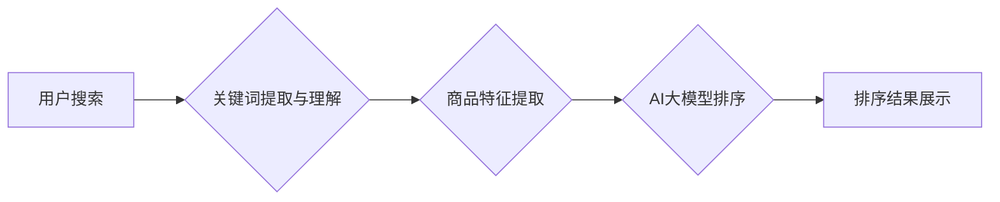

                 

## 电商搜索的多维度排序：AI大模型的新突破

> 关键词：电商搜索、多维度排序、AI大模型、推荐系统、自然语言处理、深度学习、Transformer

## 1. 背景介绍

电商搜索是电商平台的核心功能之一，用户通过搜索框输入关键词，期望快速找到自己想要的产品。然而，电商平台的产品数量庞大，用户搜索需求多样，如何准确、高效地对产品进行排序，提升用户搜索体验，是电商平台面临的重大挑战。传统的电商搜索排序算法主要依赖于关键词匹配、商品属性、用户行为等特征，但这些特征往往难以捕捉用户搜索意图的复杂性和多变性。

近年来，随着人工智能技术的快速发展，特别是深度学习和自然语言处理（NLP）领域的突破，AI大模型在电商搜索排序领域展现出巨大的潜力。AI大模型能够学习海量数据中的复杂模式和关系，更准确地理解用户搜索意图，并根据多维度特征进行智能排序，从而提升搜索结果的精准度和用户满意度。

## 2. 核心概念与联系

### 2.1 多维度排序

多维度排序是指根据多个特征对商品进行排序，每个特征都代表着不同的商品属性或用户偏好。例如，在电商搜索中，常见的排序维度包括：

* **相关性:** 商品标题、描述与用户搜索关键词的匹配程度。
* **销量:** 商品的销售数量，反映商品的受欢迎程度。
* **价格:** 商品的价格，满足用户不同预算需求。
* **评价:** 商品的评分和评论数量，反映商品的质量和用户满意度。
* **用户偏好:** 用户的历史浏览记录、购买记录、收藏记录等，反映用户的个性化需求。

### 2.2 AI大模型

AI大模型是指在海量数据上训练的深度学习模型，拥有强大的学习和泛化能力。常见的AI大模型架构包括：

* **Transformer:** 能够捕捉文本序列中的长距离依赖关系，在自然语言理解和生成任务中表现出色。
* **BERT:** 基于Transformer架构，预训练在大量的文本数据上，能够理解上下文信息，提升搜索结果的精准度。
* **GPT:** 基于Transformer架构，擅长文本生成任务，可以用于生成商品描述、推荐理由等。

### 2.3  架构图



## 3. 核心算法原理 & 具体操作步骤

### 3.1 算法原理概述

AI大模型在电商搜索排序中的应用主要基于以下原理：

* **语义理解:** 利用NLP技术，对用户搜索关键词进行语义分析，理解用户真实需求。
* **特征融合:** 将商品的多个特征进行融合，构建更全面的商品表示。
* **排序模型训练:** 利用深度学习模型，训练一个排序模型，能够根据商品特征和用户需求进行排序。

### 3.2 算法步骤详解

1. **数据预处理:** 收集电商平台的海量数据，包括商品信息、用户行为数据、搜索日志等，并进行清洗、格式化和特征工程。
2. **关键词提取与理解:** 利用NLP技术，从用户搜索关键词中提取关键信息，并进行语义分析，理解用户搜索意图。
3. **商品特征提取:** 从商品信息中提取各种特征，包括商品标题、描述、属性、价格、销量、评价等，并进行编码和向量化。
4. **特征融合:** 将用户搜索意图、商品特征等信息进行融合，构建更全面的商品表示。
5. **排序模型训练:** 利用深度学习模型，例如Transformer或BERT，训练一个排序模型，能够根据商品表示和用户需求进行排序。
6. **模型评估与优化:** 利用测试数据评估排序模型的性能，并根据评估结果进行模型调优。
7. **部署与监控:** 将训练好的排序模型部署到线上环境，并进行持续监控和维护。

### 3.3 算法优缺点

**优点:**

* **精准度提升:** AI大模型能够学习海量数据中的复杂模式和关系，更准确地理解用户搜索意图，提升搜索结果的精准度。
* **个性化推荐:** AI大模型能够根据用户的历史行为和偏好，进行个性化排序，提供更符合用户需求的商品推荐。
* **自动化学习:** AI大模型能够自动学习和更新，随着数据量的增加，排序效果会不断提升。

**缺点:**

* **数据依赖:** AI大模型的性能依赖于训练数据的质量和数量，数据不足或数据质量低会导致模型性能下降。
* **计算资源:** 训练大型AI模型需要大量的计算资源，成本较高。
* **可解释性:** AI大模型的决策过程较为复杂，难以解释模型的排序结果，这可能会导致用户对结果的信任度降低。

### 3.4 算法应用领域

AI大模型在电商搜索排序领域的应用不仅限于商品排序，还可以应用于：

* **搜索结果个性化:** 根据用户的兴趣和偏好，个性化展示搜索结果。
* **商品推荐:** 基于用户的搜索历史和购买记录，推荐相关的商品。
* **广告投放:** 根据用户的搜索意图，精准投放广告。
* **用户画像:** 利用用户搜索行为数据，构建用户画像，了解用户的需求和偏好。

## 4. 数学模型和公式 & 详细讲解 & 举例说明

### 4.1 数学模型构建

在电商搜索排序中，常用的数学模型包括：

* **点积模型:** 计算商品特征向量与用户特征向量的点积，作为排序依据。
* **线性回归模型:** 建立商品特征与排序分数之间的线性关系，通过训练模型参数，预测商品的排序分数。
* **深度学习模型:** 利用深度神经网络，学习商品特征和用户需求之间的复杂关系，进行排序。

### 4.2 公式推导过程

**点积模型:**

假设商品特征向量为 **x**，用户特征向量为 **u**，则商品的排序分数为：

$$score = x \cdot u$$

其中，"." 表示点积运算。

**线性回归模型:**

假设商品特征向量为 **x**，排序分数为 **y**，则线性回归模型可以表示为：

$$y = w_0 + w_1x_1 + w_2x_2 + ... + w_nx_n + \epsilon$$

其中， $w_0, w_1, w_2, ..., w_n$ 为模型参数， $\epsilon$ 为误差项。

### 4.3 案例分析与讲解

**案例:** 假设有一个电商平台，用户搜索关键词为 "运动鞋"，AI大模型提取了用户的搜索意图，并获取了以下商品特征：

* 商品标题: "耐克运动鞋"
* 商品描述: "舒适透气，适合跑步"
* 商品价格: 500元
* 商品销量: 1000件
* 商品评价: 4.8分

AI大模型利用上述特征，并结合用户的历史搜索和购买记录，计算出每个商品的排序分数，最终将排序分数最高的商品展示在搜索结果的第一位。

## 5. 项目实践：代码实例和详细解释说明

### 5.1 开发环境搭建

* 操作系统: Ubuntu 20.04
* Python 版本: 3.8
* 依赖库: TensorFlow, PyTorch, NLTK, Scikit-learn

### 5.2 源代码详细实现

```python
# 导入必要的库
import tensorflow as tf
from sklearn.model_selection import train_test_split

# 定义商品特征和排序分数的训练数据
data = {
    'title': ['耐克运动鞋', '阿迪达斯运动鞋', '彪马运动鞋'],
    'description': ['舒适透气，适合跑步', '轻便耐穿，适合篮球', '时尚潮流，适合日常'],
    'price': [500, 600, 400],
    'sales': [1000, 800, 500],
    'rating': [4.8, 4.5, 4.2],
    'label': [1, 0, 0]  # 1表示排序分数高，0表示排序分数低
}

# 将数据转换为TensorFlow的格式
features = tf.constant(data['title'] + data['description'] + data['price'] + data['sales'] + data['rating'])
labels = tf.constant(data['label'])

# 将数据进行训练集和测试集的划分
train_features, test_features, train_labels, test_labels = train_test_split(features, labels, test_size=0.2)

# 定义深度学习模型
model = tf.keras.Sequential([
    tf.keras.layers.Dense(64, activation='relu'),
    tf.keras.layers.Dense(32, activation='relu'),
    tf.keras.layers.Dense(1, activation='sigmoid')
])

# 编译模型
model.compile(optimizer='adam', loss='binary_crossentropy', metrics=['accuracy'])

# 训练模型
model.fit(train_features, train_labels, epochs=10)

# 评估模型
loss, accuracy = model.evaluate(test_features, test_labels)
print('Loss:', loss)
print('Accuracy:', accuracy)
```

### 5.3 代码解读与分析

* 代码首先导入必要的库，并定义商品特征和排序分数的训练数据。
* 然后将数据转换为TensorFlow的格式，并进行训练集和测试集的划分。
* 接着定义一个深度学习模型，包含多个全连接层和激活函数。
* 然后编译模型，选择优化器、损失函数和评估指标。
* 最后训练模型，并评估模型的性能。

### 5.4 运行结果展示

运行上述代码后，会输出模型的训练损失和准确率。

## 6. 实际应用场景

### 6.1 电商平台搜索结果排序

AI大模型在电商平台搜索结果排序中应用广泛，能够提升用户搜索体验，提高商品曝光率和转化率。

### 6.2 个性化商品推荐

AI大模型能够根据用户的兴趣和偏好，进行个性化商品推荐，提升用户购物体验和购买意愿。

### 6.3 广告精准投放

AI大模型能够根据用户的搜索意图，精准投放广告，提高广告效果和ROI。

### 6.4 未来应用展望

随着AI技术的不断发展，AI大模型在电商搜索排序领域的应用将更加广泛和深入，例如：

* **多模态搜索:** 将文本、图像、视频等多模态信息融合，进行更精准的搜索排序。
* **实时排序:** 利用实时数据流，动态更新商品排序，提供更及时和准确的搜索结果。
* **跨平台搜索:** 将不同平台的数据进行整合，实现跨平台的商品搜索和排序。

## 7. 工具和资源推荐

### 7.1 学习资源推荐

* **书籍:**
    * 深度学习
    * 自然语言处理
* **在线课程:**
    * Coursera
    * edX
    * fast.ai

### 7.2 开发工具推荐

* **TensorFlow:** 开源深度学习框架
* **PyTorch:** 开源深度学习框架
* **HuggingFace:** 提供预训练模型和工具

### 7.3 相关论文推荐

* BERT: Pre-training of Deep Bidirectional Transformers for Language Understanding
* Transformer: Attention Is All You Need
* ELECTRA: Pre-training Text Encoders as Discriminators Rather Than Generators

## 8. 总结：未来发展趋势与挑战

### 8.1 研究成果总结

AI大模型在电商搜索排序领域取得了显著的成果，能够提升搜索结果的精准度和用户体验。

### 8.2 未来发展趋势

未来，AI大模型在电商搜索排序领域将朝着以下方向发展：

* **模型规模和能力提升:** 训练更大规模的AI模型，提升模型的学习能力和泛化能力。
* **多模态搜索:** 将文本、图像、视频等多模态信息融合，进行更精准的搜索排序。
* **实时排序:** 利用实时数据流，动态更新商品排序，提供更及时和准确的搜索结果。
* **个性化推荐:** 更深入地理解用户的需求和偏好，提供更个性化的商品推荐。

### 8.3 面临的挑战

AI大模型在电商搜索排序领域也面临一些挑战：

* **数据质量:** AI大模型的性能依赖于训练数据的质量和数量，数据不足或数据质量低会导致模型性能下降。
* **计算资源:** 训练大型AI模型需要大量的计算资源，成本较高。
* **可解释性:** AI大模型的决策过程较为复杂，难以解释模型的排序结果，这可能会导致用户对结果的信任度降低。

### 8.4 研究展望

未来，需要进一步研究如何提高AI大模型的训练效率、提升模型的可解释性，以及如何解决数据质量和计算资源等问题，推动AI大模型在电商搜索排序领域的应用更加广泛和深入。

## 9. 附录：常见问题与解答

**Q1: AI大模型的训练需要多少数据？**

A1: AI大模型的训练数据量取决于模型的规模和复杂度。一般来说，需要海量的数据才能训练出效果良好的AI模型。

**Q2: 如何评估AI大模型的性能？**

A2: AI大模型的性能可以通过多种指标进行评估，例如准确率、召回率、F1-score等。

**Q3: 如何解释AI大模型的排序结果？**

A3: 解释AI大模型的排序结果是一个复杂的问题，目前还没有完美的解决方案。一些研究者提出了使用可解释性模型、注意力机制等方法来解释模型的决策过程。


作者：禅与计算机程序设计艺术 / Zen and the Art of Computer Programming 
<end_of_turn>

