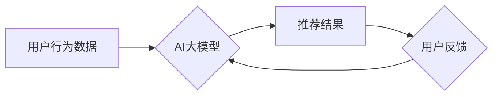

                 

## 电商行业中AI大模型的可解释性研究

> 关键词：AI大模型、可解释性、电商、推荐系统、决策树、逻辑回归、自然语言处理、模型评估

## 1. 背景介绍

近年来，人工智能（AI）技术飞速发展，特别是深度学习模型的突破性进展，为电商行业带来了前所未有的机遇。从个性化推荐、精准营销到智能客服，AI大模型在电商各个环节发挥着越来越重要的作用。然而，随着模型规模和复杂度的不断增加，AI大模型的“黑箱”属性也日益凸显。这意味着，我们难以理解模型是如何做出决策的，这对于电商行业来说是一个不容忽视的问题。

电商行业高度依赖数据驱动决策，而AI大模型的不可解释性可能会导致以下问题：

* **缺乏信任:** 当模型的决策结果难以解释时，用户和商家可能会对模型的可靠性和准确性产生怀疑，从而降低对模型的信任度。
* **决策透明度不足:**  电商平台需要对推荐结果、营销策略等决策过程进行透明化，以确保用户权益和平台公平性。不可解释的模型难以满足这一需求。
* **模型调试和优化困难:**  无法理解模型内部机制，难以针对性地进行模型调试和优化，从而影响模型的性能提升。
* **法律和伦理风险:**  在某些情况下，AI模型的决策可能会产生负面影响，例如歧视或偏见。缺乏可解释性使得平台难以承担相应的法律和伦理责任。

因此，研究电商行业中AI大模型的可解释性，对于提升用户信任、保障决策透明度、促进模型发展和规范应用至关重要。

## 2. 核心概念与联系

**2.1 可解释性 (Interpretability)**

可解释性是指人们能够理解和解释机器学习模型的决策过程的能力。一个可解释的模型能够提供清晰的解释，说明其是如何从输入数据到输出结果的。

**2.2 AI大模型 (Large AI Models)**

AI大模型是指参数量巨大、训练数据海量、计算资源消耗高的机器学习模型。这类模型通常具有强大的泛化能力和学习能力，能够处理复杂的任务，例如自然语言处理、图像识别、语音合成等。

**2.3 电商场景 (E-commerce Scenarios)**

电商场景是指电子商务平台所涉及的各种业务活动，例如商品推荐、用户画像、价格预测、营销策略等。

**2.4 核心概念联系**

在电商行业，AI大模型被广泛应用于各种场景，例如：

* **个性化推荐:**  根据用户的历史购买记录、浏览行为等数据，推荐个性化的商品。
* **精准营销:**  根据用户的兴趣爱好、消费习惯等数据，精准投放广告和促销活动。
* **智能客服:**  利用自然语言处理技术，自动回复用户的咨询和问题。
* **库存管理:**  预测商品需求，优化库存水平，降低库存成本。

然而，这些AI大模型往往是复杂的深度学习网络，其内部决策机制难以理解。这使得电商平台难以解释推荐结果、营销策略等决策过程，从而影响用户信任和平台透明度。

**2.5  Mermaid 流程图**



## 3. 核心算法原理 & 具体操作步骤

**3.1 算法原理概述**

可解释性算法旨在揭示AI模型的决策过程，使其更易于理解和解释。常用的可解释性算法包括：

* **决策树:**  决策树是一种树形结构的模型，通过一系列的决策规则将数据分类或预测目标值。决策树的可解释性较高，其决策过程可以通过树形结构直观地展现。
* **逻辑回归:**  逻辑回归是一种用于分类问题的线性模型，其输出结果是一个概率值，表示样本属于某一类别的可能性。逻辑回归的决策边界是线性的，易于理解。
* **特征重要性分析:**  特征重要性分析方法可以评估每个特征对模型预测结果的影响程度，从而识别重要的特征和潜在的偏见。
* **局部解释方法:**  局部解释方法，例如LIME和SHAP，可以解释单个预测结果是如何产生的，并提供对模型决策的局部解释。

**3.2 算法步骤详解**

以决策树为例，其构建步骤如下：

1. **选择特征:**  根据特征的重要性，选择最优特征作为根节点。
2. **划分数据集:**  根据根节点的特征值，将数据集划分为多个子集。
3. **递归划分:**  对每个子集重复步骤1和步骤2，直到满足停止条件，例如达到最大树深度或每个子集包含的样本数量低于阈值。
4. **生成决策树:**  将所有划分步骤组合起来，形成决策树。

**3.3 算法优缺点**

| 算法 | 优点 | 缺点 |
|---|---|---|
| 决策树 | 易于理解，可视化效果好 | 容易过拟合，对数据噪声敏感 |
| 逻辑回归 | 计算简单，解释性强 | 只能处理线性关系，对复杂数据拟合能力有限 |
| 特征重要性分析 | 可以识别重要的特征和潜在的偏见 | 无法解释单个预测结果 |
| 局部解释方法 | 可以解释单个预测结果 | 计算复杂度较高 |

**3.4 算法应用领域**

可解释性算法在电商行业中广泛应用于：

* **推荐系统解释:**  解释推荐结果背后的逻辑，提升用户信任和满意度。
* **营销策略评估:**  分析营销策略对用户行为的影响，优化营销策略效果。
* **风险控制:**  解释模型对用户风险的评估，提高风险控制的准确性和透明度。
* **产品开发:**  分析用户偏好和需求，指导产品开发方向。

## 4. 数学模型和公式 & 详细讲解 & 举例说明

**4.1 数学模型构建**

决策树模型可以表示为一个树形结构，其中每个节点代表一个特征，每个分支代表一个特征的取值，每个叶子节点代表一个类别或预测结果。

**4.2 公式推导过程**

决策树的构建过程可以看作是一个贪婪算法，其目标是找到最优的特征划分，使得数据集在各个子集上尽可能纯净。常用的划分标准包括信息增益、Gini系数等。

**信息增益:**

$$
Gain(S, a) = Entropy(S) - \sum_{v} \frac{|S_v|}{|S|} Entropy(S_v)
$$

其中：

* $S$ 是数据集
* $a$ 是特征
* $S_v$ 是特征 $a$ 取值为 $v$ 的子集
* $Entropy(S)$ 是数据集 $S$ 的熵

**Gini系数:**

$$
Gini(S) = 1 - \sum_{i=1}^{k} p_i^2
$$

其中：

* $k$ 是类别数
* $p_i$ 是类别 $i$ 的概率

**4.3 案例分析与讲解**

假设我们有一个数据集，包含用户的年龄、收入和购买商品的类别。我们想要构建一个决策树模型，预测用户的购买类别。

我们可以使用信息增益或Gini系数作为划分标准，选择最优的特征作为根节点。例如，如果信息增益最高的特征是年龄，那么根节点将是年龄特征。

然后，我们将数据集根据年龄特征划分为多个子集，例如年龄小于30岁和年龄大于等于30岁。对每个子集重复上述步骤，直到满足停止条件。

最终，我们将得到一个决策树模型，可以根据用户的年龄、收入等特征预测其购买类别。

## 5. 项目实践：代码实例和详细解释说明

**5.1 开发环境搭建**

* Python 3.7+
* scikit-learn
* pandas
* matplotlib

**5.2 源代码详细实现**

```python
from sklearn.tree import DecisionTreeClassifier
from sklearn.model_selection import train_test_split
from sklearn.metrics import accuracy_score

# 加载数据
data = pd.read_csv('ecommerce_data.csv')

# 划分特征和目标变量
X = data.drop('purchase_category', axis=1)
y = data['purchase_category']

# 训练测试集划分
X_train, X_test, y_train, y_test = train_test_split(X, y, test_size=0.2, random_state=42)

# 创建决策树模型
model = DecisionTreeClassifier()

# 训练模型
model.fit(X_train, y_train)

# 预测测试集
y_pred = model.predict(X_test)

# 计算准确率
accuracy = accuracy_score(y_test, y_pred)
print(f'准确率: {accuracy}')

# 可视化决策树
from sklearn.tree import plot_tree
import matplotlib.pyplot as plt

plt.figure(figsize=(12, 8))
plot_tree(model, feature_names=X.columns, class_names=model.classes_, filled=True)
plt.show()
```

**5.3 代码解读与分析**

* 首先，我们加载数据，并划分特征和目标变量。
* 然后，我们使用 `train_test_split` 函数将数据划分为训练集和测试集。
* 接下来，我们创建决策树模型，并使用 `fit` 方法训练模型。
* 训练完成后，我们使用 `predict` 方法预测测试集的类别。
* 最后，我们计算模型的准确率，并使用 `plot_tree` 函数可视化决策树结构。

**5.4 运行结果展示**

运行代码后，将输出模型的准确率，并显示决策树的结构图。决策树结构图可以直观地展示模型的决策过程，例如哪些特征被用来划分数据，每个节点的决策规则等。

## 6. 实际应用场景

**6.1 个性化推荐系统**

电商平台可以利用可解释性算法解释推荐结果，例如，告诉用户为什么推荐了某个商品，以及哪些特征影响了推荐结果。这可以提升用户对推荐系统的信任度，并帮助用户更好地理解平台的推荐逻辑。

**6.2 精准营销策略**

电商平台可以利用可解释性算法分析营销策略对用户行为的影响，例如，哪些广告文案更有效，哪些用户群体对特定促销活动更感兴趣。这可以帮助平台优化营销策略，提高营销效果。

**6.3 风险控制**

电商平台可以利用可解释性算法解释模型对用户风险的评估，例如，哪些特征导致用户被标记为高风险用户。这可以帮助平台更好地理解风险因素，并制定更有效的风险控制策略。

**6.4 产品开发**

电商平台可以利用可解释性算法分析用户偏好和需求，例如，哪些商品类型更受欢迎，哪些功能更受用户关注。这可以帮助平台更好地了解用户需求，并指导产品开发方向。

**6.5 未来应用展望**

随着AI技术的不断发展，可解释性算法在电商行业将有更广泛的应用场景。例如：

* **个性化客服:**  利用可解释性算法，构建能够解释自身决策的智能客服系统，提升用户体验。
* **动态价格调整:**  利用可解释性算法，分析市场因素和用户行为，动态调整商品价格，提高利润率。
* **欺诈检测:**  利用可解释性算法，识别和预防欺诈行为，保障平台安全。

## 7. 工具和资源推荐

**7.1 学习资源推荐**

* **书籍:**
    * "Interpretable Machine Learning" by Christoph Molnar
    * "The Hundred-Page Machine Learning Book" by Andriy Burkov
* **在线课程:**
    * Coursera: "Machine Learning" by Andrew Ng
    * edX: "Artificial Intelligence" by Columbia University
* **博客和网站:**
    * Towards Data Science
    * Machine Learning Mastery

**7.2 开发工具推荐**

* **scikit-learn:**  Python机器学习库，包含多种可解释性算法。
* **LIME:**  局部解释方法，用于解释单个预测结果。
* **SHAP:**  另一种局部解释方法，可以解释模型的整体决策过程。
* **TensorBoard:**  用于可视化深度学习模型的工具，可以帮助理解模型的结构和决策过程。

**7.3 相关论文推荐**

* "Towards a Rigorous Science of Interpretable Machine Learning" by Christoph Molnar
* "SHAP: A Unified Approach to Interpreting Model Predictions" by Scott Lundberg and Su-In Lee
* "Local Interpretable Model-Agnostic Explanations (LIME)" by Marco Tulio Ribeiro, Sameer Singh, and Carlos Guestrin

## 8. 总结：未来发展趋势与挑战

**8.1 研究成果总结**

近年来，AI大模型的可解释性研究取得了显著进展，涌现出多种可解释性算法和工具。这些算法和工具能够帮助我们更好地理解AI模型的决策过程，提升用户信任和平台透明度。

**8.2 未来发展趋势**

未来，AI大模型的可解释性研究将朝着以下方向发展：

* **更有效的解释方法:**  开发更有效的解释方法，能够更准确地解释模型的决策过程，并提供更易于理解的解释结果。
* **面向特定应用场景的可解释性算法:**  针对不同应用场景，开发更针对性的可解释性算法，例如，面向医疗领域的解释性算法、面向金融领域的解释性算法等。
* **可解释性与模型性能的平衡:**  探索如何兼顾模型性能和可解释性，开发既准确又可解释的AI模型。

**8.3 面临的挑战**

AI大模型的可解释性研究仍然面临一些挑战：

* **复杂模型的解释难度:**  深度学习模型的结构复杂，其内部决策机制难以理解，解释难度较大。
* **解释结果的可信度:**  一些解释方法可能存在偏差或误导性，需要进一步验证其可信度。
* **解释结果的可操作性:**  解释结果需要能够被用户理解和操作，需要将其转化为可行的建议或决策。

**8.4 研究展望**

尽管面临挑战，但AI大模型的可解释性研究前景广阔。随着技术的不断发展，相信我们将能够开发出更有效的解释方法，并将其应用于更多领域，推动AI技术的可持续发展。

## 9. 附录：常见问题与解答

**9.1 如何选择合适的可解释性算法？**

选择合适的可解释性算法需要根据具体的应用场景和模型类型进行选择。例如，对于线性模型，逻辑回归是一种常用的解释性算法；对于树形模型，决策树的可视化效果较好；对于深度学习模型，LIME和SHAP等局部解释方法更有效。

**9.2 如何评估可解释性算法的性能？**

评估可解释性算法的性能需要考虑多个因素，例如解释结果的准确性、可理解性、操作性等。常用的评估指标包括准确率、F1-score、人类评估等。

**9.3 如何将可解释性结果应用于实际决策？**

将可解释性结果应用于实际决策需要将其转化为可行的建议或决策。例如，可以根据模型解释结果调整营销策略、优化产品设计、改进风险控制等。


作者：禅与计算机程序设计艺术 / Zen and the Art of Computer Programming<end_of_turn>

