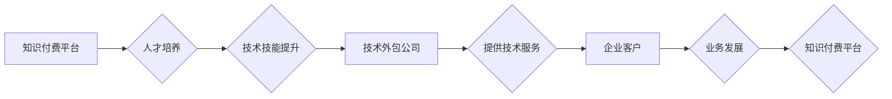

                 

## 知识付费与技术外包的协同发展

> 关键词：知识付费、技术外包、协同发展、人工智能、软件开发、技术人才、数字化转型

### 1. 背景介绍

近年来，随着互联网技术的飞速发展和数字化转型的加速推进，技术人才的需求量呈指数级增长。与此同时，知识经济的兴起也使得知识付费成为一种新的商业模式，并逐渐成为技术人才获取和提升的重要途径。技术外包作为一种灵活高效的软件开发模式，也得到了广泛应用。 

然而，知识付费和技术外包之间存在着一定的关联性，它们相互影响，共同推动着技术领域的进步和发展。本文将深入探讨知识付费与技术外包的协同发展，分析其背后的机制、优势和挑战，并展望其未来发展趋势。

### 2. 核心概念与联系

#### 2.1 知识付费

知识付费是指通过互联网平台等渠道，将知识、技能、经验等转化为有价值的信息产品，并向付费用户提供学习、提升和应用的机会。知识付费的模式多样，包括在线课程、付费咨询、电子书、会员体系等。

#### 2.2 技术外包

技术外包是指企业将部分或全部的软件开发、技术维护等工作委托给专业的第三方公司或个人完成。技术外包可以帮助企业节省成本、提高效率、专注于核心业务，并获得专业的技术支持。

#### 2.3 协同发展机制

知识付费和技术外包之间存在着以下协同发展机制：

* **人才培养与需求匹配:** 知识付费平台可以帮助企业培养技术人才，提供所需的技能和知识，满足技术外包的需求。
* **技术水平提升与服务质量:** 技术外包公司可以通过知识付费平台提升技术水平，学习新技术、掌握新技能，从而提供更高质量的服务。
* **市场拓展与合作共赢:** 知识付费平台和技术外包公司可以合作拓展市场，共同服务于企业客户，实现互利共赢。

**Mermaid 流程图**



### 3. 核心算法原理 & 具体操作步骤

#### 3.1 算法原理概述

知识付费与技术外包的协同发展可以看作是一个复杂的系统，其核心算法原理可以概括为以下几个方面：

* **需求匹配算法:** 通过分析企业需求和技术人才技能，匹配合适的技术外包服务和知识付费课程。
* **质量评估算法:** 通过对技术外包服务和知识付费课程的质量进行评估，筛选优质的服务和课程，提高用户体验。
* **合作机制算法:** 通过设计合理的合作机制，激励知识付费平台、技术外包公司和企业客户参与协同发展。

#### 3.2 算法步骤详解

1. **需求采集:** 

   * 企业客户通过平台提交技术需求，包括项目类型、技术栈、预算、时间等信息。
   * 技术人才通过平台发布技能和经验信息，包括专业领域、技术水平、服务价格等。

2. **需求匹配:** 

   * 系统利用需求匹配算法，根据企业需求和技术人才技能进行匹配，推荐合适的技术外包服务和知识付费课程。
   * 算法可以考虑多个因素，例如技术匹配度、服务价格、用户评价等。

3. **质量评估:** 

   * 系统利用质量评估算法，对技术外包服务和知识付费课程进行评估，包括服务质量、课程内容、用户评价等。
   * 算法可以参考第三方评价、用户反馈、专家审核等数据。

4. **合作机制:** 

   * 系统设计合理的合作机制，激励知识付费平台、技术外包公司和企业客户参与协同发展。
   * 例如，可以设置佣金分成、奖励机制、合作项目等。

5. **项目执行:** 

   * 企业客户与技术外包公司签订合同，开始项目执行。
   * 技术人才可以通过知识付费平台学习新技术、提升技能，更好地完成项目任务。

#### 3.3 算法优缺点

**优点:**

* **提高效率:** 自动化匹配和评估过程，提高资源配置效率。
* **降低成本:** 通过平台化服务，降低企业寻找和管理技术人才的成本。
* **提升质量:** 通过质量评估机制，筛选优质的服务和课程，提高用户体验。

**缺点:**

* **算法准确性:** 算法的准确性取决于数据质量和算法模型，存在一定的误差。
* **数据安全:** 平台需要保障用户数据安全，防止信息泄露。
* **公平性:** 需要确保算法公平公正，避免歧视和偏见。

#### 3.4 算法应用领域

* **软件开发:** 匹配企业需求和技术人才，提供软件开发外包服务。
* **技术咨询:** 匹配企业需求和技术专家，提供技术咨询服务。
* **在线教育:** 匹配用户学习需求和课程资源，提供个性化学习服务。

### 4. 数学模型和公式 & 详细讲解 & 举例说明

#### 4.1 数学模型构建

知识付费与技术外包的协同发展可以抽象为一个多主体博弈模型，其中包括知识付费平台、技术外包公司和企业客户三个主体。每个主体都有自己的目标和策略，通过博弈的方式来实现利益最大化。

#### 4.2 公式推导过程

假设：

* $P$ 为知识付费平台的收益
* $C$ 为技术外包公司的收益
* $E$ 为企业客户的收益
* $x$ 为知识付费平台提供的课程数量
* $y$ 为技术外包公司提供的服务数量
* $z$ 为企业客户的需求量

则可以构建以下收益函数：

* $P = f(x, y, z)$
* $C = g(x, y, z)$
* $E = h(x, y, z)$

其中，$f(x, y, z)$, $g(x, y, z)$, $h(x, y, z)$ 为各自的收益函数，具体形式取决于平台、公司和客户的运营模式和市场环境。

#### 4.3 案例分析与讲解

例如，假设知识付费平台通过销售课程获得收益，技术外包公司通过提供服务获得收益，企业客户通过获得技术服务获得收益。

* 知识付费平台的收益函数可以表示为：$P = \alpha x - \beta y$，其中 $\alpha$ 为课程销售价格，$\beta$ 为平台运营成本。
* 技术外包公司的收益函数可以表示为：$C = \gamma y - \delta z$，其中 $\gamma$ 为服务价格，$\delta$ 为公司运营成本。
* 企业客户的收益函数可以表示为：$E = \epsilon z - \eta x$，其中 $\epsilon$ 为技术服务价值，$\eta$ 为企业客户学习成本。

通过分析这些收益函数，可以找到每个主体最优的策略，从而实现协同发展。

### 5. 项目实践：代码实例和详细解释说明

#### 5.1 开发环境搭建

* 操作系统：Windows/macOS/Linux
* 编程语言：Python
* 开发工具：VS Code/PyCharm
* 框架：Flask/Django

#### 5.2 源代码详细实现

```python
# Flask 框架示例

from flask import Flask, render_template, request

app = Flask(__name__)

# 模拟用户数据
users = [
    {'id': 1, 'name': 'Alice', 'skills': ['Python', 'Java', 'SQL']},
    {'id': 2, 'name': 'Bob', 'skills': ['C++', 'Machine Learning', 'Data Science']},
]

# 模拟项目需求
projects = [
    {'id': 1, 'title': 'Web App Development', 'skills': ['Python', 'JavaScript', 'HTML', 'CSS']},
    {'id': 2, 'title': 'Data Analysis', 'skills': ['Python', 'R', 'SQL', 'Data Visualization']},
]

@app.route('/')
def index():
    return render_template('index.html', users=users, projects=projects)

@app.route('/match', methods=['POST'])
def match():
    user_id = request.form['user_id']
    project_id = request.form['project_id']
    # 匹配算法逻辑
    # ...
    return render_template('match.html', user_id=user_id, project_id=project_id)

if __name__ == '__main__':
    app.run(debug=True)
```

#### 5.3 代码解读与分析

* 代码使用 Flask 框架构建了一个简单的 web 应用。
* `index.html` 页面展示了用户和项目信息。
* `match` 路由处理用户提交的匹配请求，并执行匹配算法逻辑。
* 匹配算法逻辑需要根据实际需求进行实现，例如计算用户技能与项目需求的匹配度。

#### 5.4 运行结果展示

运行代码后，访问 `http://127.0.0.1:5000/`，即可看到首页，用户可以选择匹配的项目和技术人才。

### 6. 实际应用场景

#### 6.1 在线教育平台

* 知识付费平台可以提供编程、数据科学、人工智能等领域的在线课程，帮助用户提升技术技能。
* 技术外包公司可以为企业提供定制化的软件开发服务，满足企业个性化需求。

#### 6.2 科技创业公司

* 科技创业公司可以利用知识付费平台学习新技术，快速提升团队技术水平。
* 技术外包公司可以为创业公司提供快速迭代、低成本的软件开发服务，帮助创业公司快速发展。

#### 6.3 大型企业

* 大型企业可以利用知识付费平台培训员工，提升员工技能和知识水平。
* 技术外包公司可以为大型企业提供专业的技术支持，帮助企业优化业务流程、提升效率。

#### 6.4 未来应用展望

随着人工智能、大数据等技术的不断发展，知识付费与技术外包的协同发展将更加深入，应用场景也将更加广泛。例如：

* **个性化学习:** 基于用户学习习惯和需求，提供个性化的学习路径和课程推荐。
* **智能匹配:** 利用人工智能算法，更加精准地匹配用户需求和技术人才。
* **远程协作:** 利用云计算和远程协作工具，实现跨地域的知识共享和技术合作。

### 7. 工具和资源推荐

#### 7.1 学习资源推荐

* **在线学习平台:** Coursera, edX, Udemy, Udacity
* **技术博客:** Hacker News, Medium, Dev.to
* **开源社区:** GitHub, Stack Overflow

#### 7.2 开发工具推荐

* **代码编辑器:** VS Code, PyCharm, Sublime Text
* **版本控制系统:** Git, GitHub
* **云平台:** AWS, Azure, Google Cloud

#### 7.3 相关论文推荐

* **The Economics of Knowledge Sharing**
* **The Impact of Online Learning on Educational Outcomes**
* **The Future of Work: How Technology Will Transform the Workplace**

### 8. 总结：未来发展趋势与挑战

#### 8.1 研究成果总结

知识付费与技术外包的协同发展是一个新兴的领域，具有巨大的发展潜力。通过分析其核心概念、算法原理、应用场景等，我们可以看到其在推动技术人才培养、促进技术创新、加速数字化转型等方面具有重要意义。

#### 8.2 未来发展趋势

* **智能化:** 利用人工智能技术，实现更加智能化的匹配、评估和服务。
* **个性化:** 提供更加个性化的学习和服务，满足用户多样化的需求。
* **全球化:** 打破地域限制，实现全球范围内的知识共享和技术合作。

#### 8.3 面临的挑战

* **数据安全:** 保障用户数据安全，防止信息泄露。
* **算法公平性:** 确保算法公平公正，避免歧视和偏见。
* **人才培养:** 培养更多高素质的技术人才，满足市场需求。

#### 8.4 研究展望

未来，我们需要继续深入研究知识付费与技术外包的协同发展机制，探索更有效的算法模型、更完善的合作机制，并关注其对社会、经济和文化的影响，推动其健康可持续发展。

### 9. 附录：常见问题与解答

**Q1: 知识付费与技术外包有什么区别？**

**A1:** 知识付费是指将知识、技能等转化为信息产品，通过付费的方式提供学习和提升的机会。技术外包是指将部分或全部的软件开发、技术维护等工作委托给第三方公司或个人完成。

**Q2: 知识付费与技术外包如何协同发展？**

**A2:** 知识付费平台可以帮助企业培养技术人才，提供所需的技能和知识，满足技术外包的需求。技术外包公司可以通过知识付费平台提升技术水平，学习新技术、掌握新技能，从而提供更高质量的服务。

**Q3: 知识付费与技术外包有哪些应用场景？**

**A3:** 知识付费与技术外包的应用场景广泛，包括在线教育、科技创业公司、大型企业等。


作者：禅与计算机程序设计艺术 / Zen and the Art of Computer Programming 
<end_of_turn>

