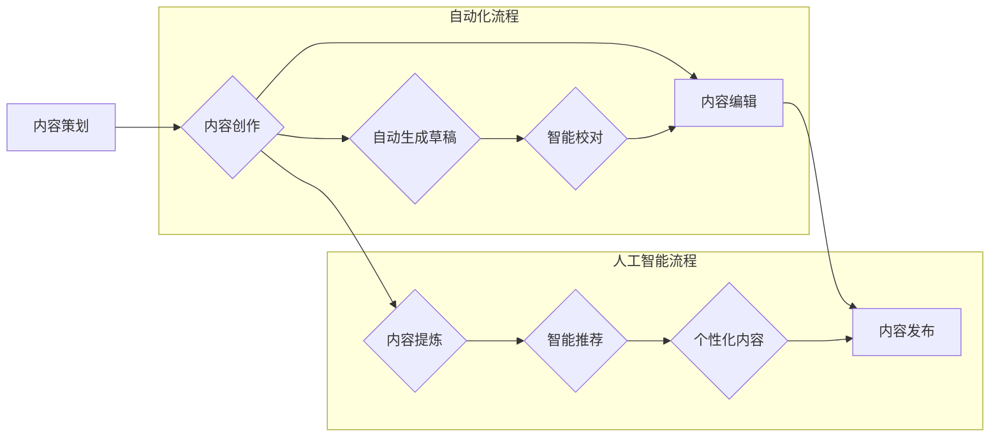

                 

## 知识付费创业中的内容生产流程优化

> 关键词：知识付费、内容生产、流程优化、自动化、效率提升、机器学习、人工智能

## 1. 背景介绍

知识付费行业近年来蓬勃发展，越来越多的专家学者和创作者通过线上平台分享知识和技能，并获得收益。然而，内容生产是一个耗时耗力的过程，对于知识付费创业者来说，如何高效地生产高质量的内容，是实现可持续发展的重要课题。

传统的知识付费内容生产流程通常包括以下几个步骤：

* **内容策划:** 确定内容主题、目标受众、内容形式等。
* **内容创作:**  撰写文章、录制视频、制作音频等。
* **内容编辑:**  校对、修改、排版等。
* **内容发布:**  上传到平台、进行推广等。

这些步骤往往需要大量的重复劳动和人工干预，导致效率低下，难以满足快速迭代的需求。

## 2. 核心概念与联系

为了解决知识付费内容生产效率问题，我们可以借鉴自动化和人工智能技术，优化内容生产流程。

**核心概念:**

* **自动化:** 通过脚本、工具和平台，将重复性、规则性任务自动化，减少人工干预。
* **人工智能:** 利用机器学习、自然语言处理等技术，辅助内容创作、编辑和发布。

**流程图:**



**核心概念原理和架构:**

* **自动化流程:** 通过脚本和工具，实现内容创作的自动化生成，例如根据关键词自动生成文章草稿，自动生成视频字幕等。
* **人工智能流程:** 利用机器学习算法，对内容进行分析和提炼，例如自动识别内容主题、关键词、情感倾向等，并根据用户画像进行个性化内容推荐。

## 3. 核心算法原理 & 具体操作步骤

### 3.1  算法原理概述

**自动生成内容草稿算法:**

该算法基于自然语言生成模型，例如GPT-3等，通过训练大量的文本数据，学习语言的语法和语义规则，能够根据给定的关键词或主题，自动生成符合语法和语义的文本内容。

**智能校对算法:**

该算法基于自然语言处理技术，能够识别语法错误、拼写错误、风格不一致等问题，并提供修改建议。

### 3.2  算法步骤详解

**自动生成内容草稿算法步骤:**

1. **输入关键词或主题:** 用户输入想要生成的主题或关键词。
2. **模型预处理:** 将输入的关键词或主题进行预处理，例如词干提取、词性标注等。
3. **文本生成:** 利用训练好的自然语言生成模型，根据预处理后的关键词或主题，生成文本内容草稿。
4. **输出草稿:** 将生成的文本内容草稿输出给用户。

**智能校对算法步骤:**

1. **文本输入:** 用户输入需要校对的文本内容。
2. **语法分析:** 利用语法分析工具，分析文本的语法结构。
3. **拼写检查:** 利用词典和拼写检查算法，识别拼写错误。
4. **风格检查:** 利用机器学习模型，识别风格不一致、语气不当等问题。
5. **输出建议:** 将识别出的问题和修改建议输出给用户。

### 3.3  算法优缺点

**自动生成内容草稿算法:**

* **优点:** 提高内容生产效率，节省时间和人力成本。
* **缺点:** 生成的内容可能缺乏原创性和深度，需要人工进行修改和完善。

**智能校对算法:**

* **优点:** 提高内容质量，减少语法和拼写错误。
* **缺点:** 无法识别所有类型的错误，例如逻辑错误、表达不清等，需要人工进行最终审核。

### 3.4  算法应用领域

* **自动生成博客文章、新闻稿、产品说明书等内容。**
* **自动校对和编辑文章、书籍、论文等。**
* **自动生成社交媒体文案、广告文案等。**

## 4. 数学模型和公式 & 详细讲解 & 举例说明

### 4.1  数学模型构建

**文本生成模型:**

文本生成模型通常基于概率模型，例如条件语言模型，其目标是学习文本序列的概率分布。

**条件概率公式:**

$$P(w_t | w_1, w_2, ..., w_{t-1})$$

其中：

* $w_t$ 是第 $t$ 个单词。
* $w_1, w_2, ..., w_{t-1}$ 是前 $t-1$ 个单词。

**目标函数:**

模型训练的目标是最大化条件概率的似然函数。

$$L = \sum_{i=1}^{N} \log P(w_{i} | w_{1}, w_{2}, ..., w_{i-1})$$

其中：

* $N$ 是文本序列的长度。

### 4.2  公式推导过程

具体公式推导过程涉及到概率论、统计学和机器学习等知识，这里不再赘述。

### 4.3  案例分析与讲解

**举例说明:**

假设我们训练了一个文本生成模型，其目标是生成英文句子。

输入：The cat sat on the

模型根据训练数据，预测下一个单词可能是 "mat"、"chair"、"table" 等。

输出：The cat sat on the mat.

## 5. 项目实践：代码实例和详细解释说明

### 5.1  开发环境搭建

* **操作系统:** Linux/macOS/Windows
* **编程语言:** Python
* **库和框架:** TensorFlow/PyTorch、NLTK、spaCy

### 5.2  源代码详细实现

```python
# 自动生成内容草稿示例代码

import tensorflow as tf

# 加载预训练模型
model = tf.keras.models.load_model("gpt-3_model.h5")

# 输入关键词
keywords = ["人工智能", "知识付费"]

# 生成内容草稿
generated_text = model.predict(keywords)

# 输出内容草稿
print(generated_text)
```

### 5.3  代码解读与分析

* 该代码示例使用 TensorFlow 库加载预训练的 GPT-3 模型。
* `model.predict()` 函数根据输入的关键词生成文本内容草稿。
* 生成的文本内容需要进行后续的修改和完善。

### 5.4  运行结果展示

运行结果将是一个包含多个单词的文本序列，例如：

```
人工智能在知识付费领域有着巨大的潜力，可以帮助专家学者更有效地分享知识和技能。
```

## 6. 实际应用场景

* **知识付费平台:** 自动生成课程内容、文章、视频脚本等。
* **在线教育平台:** 自动生成学习资料、习题、测试题等。
* **内容创作工具:** 提供自动生成内容、校对编辑等功能。

### 6.4  未来应用展望

* **更个性化的内容推荐:** 利用用户画像和行为数据，生成更符合用户需求的内容。
* **跨语言内容生成:** 支持多种语言的自动内容生成。
* **多模态内容生成:** 生成文本、图像、音频等多种形式的内容。

## 7. 工具和资源推荐

### 7.1  学习资源推荐

* **书籍:**
    * 《深度学习》
    * 《自然语言处理》
* **在线课程:**
    * Coursera
    * edX
    * Udemy

### 7.2  开发工具推荐

* **TensorFlow:** 开源深度学习框架。
* **PyTorch:** 开源深度学习框架。
* **NLTK:** 自然语言处理工具包。
* **spaCy:** 自然语言处理库。

### 7.3  相关论文推荐

* **Attention Is All You Need:** https://arxiv.org/abs/1706.03762
* **BERT: Pre-training of Deep Bidirectional Transformers for Language Understanding:** https://arxiv.org/abs/1810.04805

## 8. 总结：未来发展趋势与挑战

### 8.1  研究成果总结

知识付费内容生产流程优化是一个不断发展的领域，自动化和人工智能技术正在为知识付费创业者提供越来越多的工具和方法。

### 8.2  未来发展趋势

* **更智能的自动化:** 利用更先进的机器学习算法，实现更智能的自动化内容生产。
* **更个性化的内容体验:** 根据用户画像和行为数据，生成更个性化的内容。
* **多模态内容生成:** 生成文本、图像、音频等多种形式的内容。

### 8.3  面临的挑战

* **数据质量:** 自动化内容生产依赖于高质量的数据训练，数据质量问题会影响内容质量。
* **伦理问题:** 人工智能技术可能会带来伦理问题，例如内容原创性、信息真实性等。
* **技术门槛:** 

利用人工智能技术进行内容生产需要一定的技术门槛，对于一些中小创业者来说，可能难以投入。

### 8.4  研究展望

未来，我们需要继续研究更智能、更安全、更易于使用的自动化内容生产技术，帮助知识付费创业者更高效地生产高质量的内容，并为用户提供更个性化的学习体验。

## 9. 附录：常见问题与解答

**常见问题:**

* **自动生成的内容质量如何？**

自动生成的内容可能缺乏原创性和深度，需要人工进行修改和完善。

* **如何保证自动生成内容的准确性和真实性？**

需要使用高质量的数据进行训练，并进行人工审核。

* **如何解决自动生成内容的伦理问题？**

需要制定相关的伦理规范和标准，并进行监督和管理。

**作者：禅与计算机程序设计艺术 / Zen and the Art of Computer Programming**<end_of_turn>

