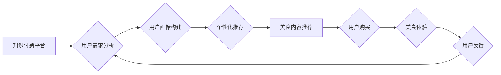

                 

## 关键词：知识付费、跨界营销、美食、人工智能、数据分析、用户画像、个性化推荐

## 1. 背景介绍

在当今数字化时代，知识付费和跨界营销已成为商业发展的重要趋势。知识付费模式打破了传统付费方式的局限，通过提供有价值的知识和技能，满足用户不断提升自我和获取专业技能的需求。跨界营销则通过将不同行业或领域的资源和产品进行整合，创造新的价值和体验，从而吸引更广泛的用户群体。

美食行业作为人们生活的重要组成部分，蕴藏着巨大的商业潜力。近年来，随着互联网和移动技术的普及，线上美食平台蓬勃发展，用户对美食的需求日益多样化。然而，传统美食营销模式面临着用户注意力分散、竞争加剧等挑战。

知识付费与美食跨界营销的结合，可以有效解决上述问题，创造新的商业模式和价值。通过将美食与知识相结合，可以提升用户体验，增强用户粘性，并开拓新的市场空间。

## 2. 核心概念与联系

### 2.1 知识付费

知识付费是指通过线上平台或线下活动，向用户提供有价值的知识、技能或服务，并收取相应的费用。知识付费模式的优势在于：

* **满足用户个性化需求:** 用户可以根据自己的兴趣和需求选择付费学习的内容。
* **降低学习门槛:** 在线学习平台提供便捷、灵活的学习方式，降低了用户学习的门槛。
* **提升知识价值:** 知识付费模式可以有效提升知识的价值，并促进知识的传播和应用。

### 2.2 跨界营销

跨界营销是指将不同行业或领域的资源和产品进行整合，创造新的价值和体验，从而吸引更广泛的用户群体。跨界营销的优势在于：

* **拓展用户群体:** 通过与其他行业的合作，可以触达新的用户群体。
* **提升品牌知名度:** 跨界营销可以增强品牌的影响力和知名度。
* **创造新的价值:** 通过整合不同领域的资源，可以创造新的产品、服务或体验。

### 2.3 美食跨界

美食跨界是指将美食与其他行业或领域进行整合，创造新的价值和体验。美食跨界营销的优势在于：

* **提升美食体验:** 通过与其他行业的合作，可以提升美食的体验感和趣味性。
* **拓展美食市场:** 美食跨界可以开拓新的美食市场，吸引更多用户。
* **增强品牌形象:** 美食跨界可以提升品牌的形象和文化内涵。

**Mermaid 流程图**



## 3. 核心算法原理 & 具体操作步骤

### 3.1 算法原理概述

知识付费与美食跨界营销的核心算法原理是基于用户画像和个性化推荐。通过对用户的行为数据、兴趣偏好等进行分析，构建用户画像，并根据用户画像进行个性化推荐，从而提高用户体验和转化率。

### 3.2 算法步骤详解

1. **数据收集:** 收集用户行为数据，包括用户浏览记录、购买记录、评价记录等。
2. **数据清洗:** 对收集到的数据进行清洗，去除无效数据和重复数据。
3. **特征提取:** 从用户行为数据中提取特征，例如用户年龄、性别、地理位置、兴趣爱好、消费习惯等。
4. **用户画像构建:** 基于提取的特征，构建用户画像，将用户分为不同的群体。
5. **个性化推荐:** 根据用户的画像特征，推荐个性化的美食内容，例如推荐用户感兴趣的菜系、推荐用户所在区域的特色美食等。
6. **效果评估:** 对推荐效果进行评估，并根据评估结果不断优化算法模型。

### 3.3 算法优缺点

**优点:**

* **精准推荐:** 基于用户画像的个性化推荐可以提高推荐的精准度。
* **提升用户体验:** 个性化推荐可以满足用户的个性化需求，提升用户体验。
* **提高转化率:** 精准推荐可以提高用户购买意愿，从而提升转化率。

**缺点:**

* **数据依赖:** 算法的准确性依赖于数据的质量和数量。
* **算法复杂度:** 用户画像构建和个性化推荐算法的复杂度较高。
* **隐私安全:** 用户数据收集和使用需要考虑隐私安全问题。

### 3.4 算法应用领域

* **电商平台:** 为用户推荐个性化的商品。
* **内容平台:** 为用户推荐个性化的内容。
* **社交平台:** 为用户推荐个性化的好友和话题。
* **金融平台:** 为用户推荐个性化的金融产品。

## 4. 数学模型和公式 & 详细讲解 & 举例说明

### 4.1 数学模型构建

用户画像构建可以采用聚类算法，例如K-Means聚类算法。K-Means聚类算法将用户数据划分为K个簇，每个簇代表一个用户群体。

**K-Means聚类算法步骤:**

1. 随机选择K个用户作为初始聚类中心。
2. 将每个用户分配到距离其最近的聚类中心所属的簇。
3. 计算每个簇的中心点。
4. 将每个用户重新分配到距离其最近的聚类中心所属的簇。
5. 重复步骤3和步骤4，直到聚类中心不再变化。

### 4.2 公式推导过程

K-Means聚类算法的目标是最小化所有用户到其所属聚类中心的距离之和。

**距离公式:**

$$
d(x, c) = \sqrt{\sum_{i=1}^{n}(x_i - c_i)^2}
$$

其中：

* $x$ 是用户数据向量。
* $c$ 是聚类中心向量。
* $n$ 是特征数量。

**目标函数:**

$$
J = \sum_{i=1}^{K}\sum_{x \in C_i} d(x, c_i)^2
$$

其中：

* $J$ 是目标函数值。
* $K$ 是聚类数量。
* $C_i$ 是第i个簇。

### 4.3 案例分析与讲解

假设我们有以下用户数据：

| 用户ID | 年龄 | 性别 | 收入 |
|---|---|---|---|
| 1 | 25 | 男 | 5000 |
| 2 | 30 | 女 | 8000 |
| 3 | 28 | 男 | 6000 |
| 4 | 35 | 女 | 10000 |
| 5 | 22 | 男 | 4000 |

我们可以使用K-Means聚类算法将用户数据划分为两个簇。

**聚类结果:**

* 簇1: 用户ID 1, 3, 5
* 簇2: 用户ID 2, 4

## 5. 项目实践：代码实例和详细解释说明

### 5.1 开发环境搭建

* Python 3.x
* scikit-learn 库

### 5.2 源代码详细实现

```python
from sklearn.cluster import KMeans
import pandas as pd

# 加载用户数据
data = pd.read_csv('user_data.csv')

# 选择特征列
features = ['年龄', '收入']
X = data[features]

# 使用K-Means聚类算法
kmeans = KMeans(n_clusters=2)
kmeans.fit(X)

# 获取聚类结果
labels = kmeans.labels_
data['簇'] = labels

# 打印聚类结果
print(data)
```

### 5.3 代码解读与分析

* 首先，我们使用pandas库加载用户数据。
* 然后，我们选择年龄和收入作为特征列，并将其存储在X变量中。
* 接下来，我们使用KMeans类进行聚类，并设置聚类数量为2。
* 然后，我们使用fit()方法训练模型，并获取聚类结果。
* 最后，我们将聚类结果存储在data['簇']列中，并打印结果。

### 5.4 运行结果展示

运行代码后，将输出包含用户ID、年龄、收入和簇标签的数据。

## 6. 实际应用场景

### 6.1 美食推荐

* 根据用户的年龄、性别、收入等特征，推荐个性化的美食内容。
* 为用户推荐附近的特色餐厅或美食店铺。
* 为用户推荐与用户兴趣相关的美食活动或课程。

### 6.2 美食营销

* 通过跨界营销，将美食与其他行业或领域进行整合，创造新的价值和体验。
* 例如，与旅游平台合作，推出美食旅游套餐；与生活服务平台合作，提供美食外卖服务。
* 利用社交媒体平台，进行美食推广和营销活动。

### 6.3 美食社区

* 建立美食社区，让用户分享美食经验、交流美食心得。
* 通过社区运营，提升用户粘性，并促进用户之间的互动。
* 利用社区数据，进行用户画像分析，并提供个性化的美食推荐。

### 6.4 未来应用展望

* **人工智能驱动的个性化推荐:** 利用人工智能技术，实现更精准、更个性化的美食推荐。
* **虚拟现实和增强现实技术的应用:** 利用VR/AR技术，打造沉浸式的美食体验。
* **大数据分析和预测:** 利用大数据分析技术，预测用户的美食需求，并提供相应的服务。

## 7. 工具和资源推荐

### 7.1 学习资源推荐

* **书籍:**
    * 《Python数据科学手册》
    * 《机器学习实战》
* **在线课程:**
    * Coursera: 数据科学与机器学习
    * edX: 人工智能与机器学习

### 7.2 开发工具推荐

* **Python:** 
    * scikit-learn: 机器学习库
    * pandas: 数据分析库
    * matplotlib: 数据可视化库
* **云平台:**
    * AWS
    * Azure
    * Google Cloud

### 7.3 相关论文推荐

* **K-Means聚类算法:**
    * MacQueen, J. (1967). Some methods for classification and analysis of multivariate observations. *Proceedings of the fifth Berkeley symposium on mathematical statistics and probability*, 1, 280-285.
* **个性化推荐系统:**
    * Adomavicius, G., & Tuzhilin, A. (2005). Toward the next generation of recommender systems: A data-driven approach. *IEEE Transactions on Knowledge and Data Engineering*, 17(6), 734-749.

## 8. 总结：未来发展趋势与挑战

### 8.1 研究成果总结

知识付费与美食跨界营销的结合，为用户提供更个性化、更丰富的美食体验，并为商家创造新的商业模式和价值。

### 8.2 未来发展趋势

* **人工智能技术的应用:** 人工智能技术将进一步提升个性化推荐的精准度和效率。
* **虚拟现实和增强现实技术的应用:** VR/AR技术将为用户带来更沉浸式的美食体验。
* **大数据分析和预测:** 大数据分析技术将帮助商家更好地了解用户的需求，并提供更精准的服务。

### 8.3 面临的挑战

* **数据隐私安全:** 用户数据收集和使用需要考虑隐私安全问题。
* **算法模型的复杂性:** 用户画像构建和个性化推荐算法的复杂度较高，需要不断优化和改进。
* **跨界合作的难点:** 跨界合作需要协调各方的利益，并克服技术和文化上的差异。

### 8.4 研究展望

未来，知识付费与美食跨界营销将继续发展，并与其他领域进行融合，创造新的价值和体验。


## 9. 附录：常见问题与解答

**Q1: 如何构建用户画像？**

**A1:** 用户画像构建可以通过数据分析和机器学习算法实现。

**Q2: 如何进行个性化推荐？**

**A2:** 个性化推荐可以通过用户画像和算法模型，推荐符合用户兴趣和需求的内容。

**Q3: 知识付费与美食跨界营销有哪些优势？**

**A3:** 知识付费与美食跨界营销可以提升用户体验，增强用户粘性，并开拓新的市场空间。


作者：禅与计算机程序设计艺术 / Zen and the Art of Computer Programming 
<end_of_turn>

