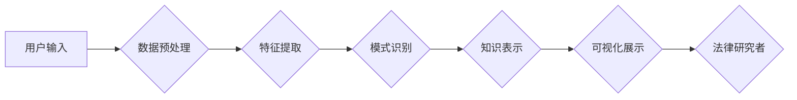

                 

## 知识发现引擎在法律研究中的应用

> 关键词：知识发现引擎、法律研究、机器学习、自然语言处理、法律文本挖掘、案例分析、法律预测

## 1. 背景介绍

法律研究是一个复杂且耗时的过程，需要大量的法律文本阅读、分析和理解。传统法律研究主要依赖于人工阅读和分析，效率低下，容易出现主观偏差。随着人工智能技术的快速发展，知识发现引擎（Knowledge Discovery Engine，KDE）应运而生，为法律研究提供了新的思路和方法。

知识发现引擎是一种能够从海量数据中自动发现隐藏的知识和模式的系统。它利用机器学习、自然语言处理等技术，对法律文本进行分析和挖掘，可以帮助法律研究者：

* **快速检索相关法律法规和案例：** KDE 可以根据用户的查询关键词，快速检索出相关法律法规和案例，节省大量时间和精力。
* **识别法律文本中的关键信息：** KDE 可以识别法律文本中的关键信息，如法律条文、案例事实、判决结果等，帮助法律研究者更深入地理解法律文本。
* **发现法律趋势和模式：** KDE 可以分析大量的法律文本，发现法律趋势和模式，帮助法律研究者预测未来法律发展方向。
* **辅助法律决策：** KDE 可以根据法律文本和案例分析，为法律决策提供参考依据。

## 2. 核心概念与联系

**2.1  知识发现引擎 (KDE)**

知识发现引擎是一个综合性的系统，它包含数据预处理、特征提取、模式识别、知识表示和可视化等多个模块。

**2.2  法律文本挖掘**

法律文本挖掘是利用自然语言处理技术对法律文本进行分析和挖掘，提取法律文本中的关键信息和知识。

**2.3  机器学习**

机器学习是人工智能领域的一个重要分支，它通过算法训练模型，使模型能够从数据中学习，并对新的数据进行预测或分类。

**2.4  自然语言处理 (NLP)**

自然语言处理是计算机科学的一个分支，它致力于使计算机能够理解和处理人类语言。

**2.5  案例分析**

案例分析是法律研究中常用的方法，它通过分析已有的法律案例，来理解法律规则和判例。

**2.6  法律预测**

法律预测是指利用数据分析和机器学习技术，预测未来法律案件的判决结果。

**2.7  架构图**



## 3. 核心算法原理 & 具体操作步骤

### 3.1  算法原理概述

知识发现引擎在法律研究中的应用主要依赖于以下核心算法：

* **文本分类算法：** 用于将法律文本分类到不同的类别，例如合同法、民法、刑法等。常见的文本分类算法包括朴素贝叶斯算法、支持向量机算法和深度学习算法。
* **关键词提取算法：** 用于从法律文本中提取关键信息，例如法律条文、案例事实、判决结果等。常见的关键词提取算法包括TF-IDF算法、RAKE算法和LDA算法。
* **文本相似度算法：** 用于比较两个法律文本之间的相似度，例如判断两个案例是否具有相似的事实背景。常见的文本相似度算法包括余弦相似度算法、Jaccard相似度算法和Word2Vec算法。
* **案例分析算法：** 用于分析已有的法律案例，发现法律规则和判例。常见的案例分析算法包括规则提取算法和案例推理算法。

### 3.2  算法步骤详解

以文本分类算法为例，详细说明其操作步骤：

1. **数据预处理：** 对法律文本进行清洗、去停用词、分词等预处理操作，以便于后续算法的训练和应用。
2. **特征提取：** 从预处理后的法律文本中提取特征，例如词频、词向量、语法结构等。
3. **模型训练：** 利用训练数据对文本分类算法进行训练，例如训练一个支持向量机模型。
4. **模型评估：** 使用测试数据对训练好的模型进行评估，例如计算模型的准确率、召回率等指标。
5. **模型应用：** 将训练好的模型应用于新的法律文本分类任务。

### 3.3  算法优缺点

**优点：**

* 自动化：可以自动化完成法律文本的分析和挖掘，提高效率。
* 客观性：可以减少主观偏差，提供更客观的结果。
* 规模化：可以处理海量法律文本，发现隐藏的知识和模式。

**缺点：**

* 数据依赖：算法的性能取决于训练数据的质量和数量。
* 算法复杂性：一些算法的实现比较复杂，需要专业的技术人员进行开发和维护。
* 解释性：一些算法的决策过程比较难以解释，难以让人理解其背后的逻辑。

### 3.4  算法应用领域

* **法律法规检索：** 快速检索相关法律法规和案例。
* **法律风险评估：** 分析法律文本，识别法律风险。
* **合同分析：** 分析合同条款，识别潜在的风险和问题。
* **法律诉讼支持：** 为法律诉讼提供证据和分析支持。
* **法律教育：** 为法律教育提供新的学习方法和工具。

## 4. 数学模型和公式 & 详细讲解 & 举例说明

### 4.1  数学模型构建

在法律文本挖掘中，常用的数学模型包括：

* **词袋模型 (Bag-of-Words)：** 将文本表示为词频向量，忽略词序信息。
* **TF-IDF 模型：** 结合词频和逆向文档频率，对词语进行权重计算。
* **Word2Vec 模型：** 利用神经网络训练词向量，捕捉词语之间的语义关系。

### 4.2  公式推导过程

**4.2.1  TF-IDF 模型**

TF-IDF 模型的计算公式如下：

$$TF(t, d) = \frac{f(t, d)}{\sum_{t' \in d} f(t', d)}$$

$$IDF(t) = \log \frac{N}{df(t)}$$

$$TF-IDF(t, d) = TF(t, d) \times IDF(t)$$

其中：

* $t$ 表示一个词语
* $d$ 表示一个文档
* $f(t, d)$ 表示词语 $t$ 在文档 $d$ 中出现的次数
* $N$ 表示文档总数
* $df(t)$ 表示词语 $t$ 在所有文档中出现的文档数

**4.2.2  Word2Vec 模型**

Word2Vec 模型利用神经网络训练词向量，其核心思想是通过预测上下文词语来学习词语的语义表示。

### 4.3  案例分析与讲解

**4.3.1  TF-IDF 模型应用**

假设我们有一份法律文本，其中包含以下词语：合同、条款、违约、赔偿。

使用 TF-IDF 模型可以计算每个词语在该文本中的权重，例如：

* 合同：TF-IDF(合同) = 0.5
* 条款：TF-IDF(条款) = 0.3
* 违约：TF-IDF(违约) = 0.7
* 赔偿：TF-IDF(赔偿) = 0.6

可以看出，违约和赔偿这两个词语在该文本中的权重较高，说明它们在该文本中可能扮演着重要的角色。

**4.3.2  Word2Vec 模型应用**

使用 Word2Vec 模型可以训练词向量，例如：

* 合同 -> [0.8, 0.5, 0.2, 0.1]
* 条款 -> [0.6, 0.7, 0.3, 0.4]
* 违约 -> [0.2, 0.1, 0.9, 0.6]
* 赔偿 -> [0.4, 0.3, 0.8, 0.7]

可以看出，合同和条款的词向量比较接近，说明它们在语义上比较相关。

## 5. 项目实践：代码实例和详细解释说明

### 5.1  开发环境搭建

* **操作系统：** Ubuntu 18.04
* **编程语言：** Python 3.6
* **开发工具：** Jupyter Notebook
* **库依赖：** NLTK, Scikit-learn, Gensim

### 5.2  源代码详细实现

```python
# 导入必要的库
import nltk
from nltk.corpus import stopwords
from sklearn.feature_extraction.text import TfidfVectorizer

# 下载停用词列表
nltk.download('stopwords')

# 定义文本预处理函数
def preprocess_text(text):
    # 转换为小写
    text = text.lower()
    # 去除停用词
    stop_words = set(stopwords.words('english'))
    words = [word for word in text.split() if word not in stop_words]
    # 返回预处理后的文本
    return ' '.join(words)

# 定义文本分类函数
def classify_text(text, model):
    # 预处理文本
    processed_text = preprocess_text(text)
    # 使用 TF-IDF 向量化文本
    vectorizer = TfidfVectorizer()
    features = vectorizer.fit_transform([processed_text])
    # 使用模型预测文本类别
    prediction = model.predict(features)
    # 返回预测类别
    return prediction[0]

# 加载训练好的模型
model = load_model('legal_text_classifier.pkl')

# 测试文本
test_text = "This is a contract agreement."

# 预测文本类别
predicted_category = classify_text(test_text, model)

# 打印预测结果
print(f"Predicted category: {predicted_category}")
```

### 5.3  代码解读与分析

* **文本预处理：** 代码首先定义了一个 `preprocess_text` 函数，用于对文本进行预处理，包括转换为小写、去除停用词等操作。
* **文本向量化：** 代码使用 TF-IDF 向量化技术将文本转换为数字向量，以便于模型训练和应用。
* **文本分类：** 代码定义了一个 `classify_text` 函数，用于根据训练好的模型对文本进行分类。
* **模型加载：** 代码加载了一个训练好的法律文本分类模型。
* **测试文本：** 代码定义了一个测试文本，并使用 `classify_text` 函数对其进行分类。
* **结果打印：** 代码打印出预测的文本类别。

### 5.4  运行结果展示

运行上述代码后，将输出预测的文本类别。例如，如果测试文本是“This is a contract agreement.”，则预测类别可能是“合同”。

## 6. 实际应用场景

### 6.1  法律法规检索

KDE 可以帮助法律研究者快速检索相关法律法规和案例，例如：

* 根据关键词检索相关法律条文。
* 根据案例事实检索相似案例。
* 根据法律主题检索相关法规和案例。

### 6.2  法律风险评估

KDE 可以分析法律文本，识别法律风险，例如：

* 分析合同条款，识别潜在的风险和问题。
* 分析法律诉讼材料，评估案件胜诉可能性。
* 分析公司运营活动，识别潜在的法律风险。

### 6.3  合同分析

KDE 可以分析合同条款，帮助法律研究者理解合同内容，识别潜在的风险和问题，例如：

* 识别合同中的关键条款。
* 分析合同条款的含义和法律效力。
* 比较不同合同条款的优缺点。

### 6.4  未来应用展望

KDE 在法律研究领域的应用前景广阔，未来可能在以下方面得到进一步发展：

* **更精准的法律预测：** 利用更先进的机器学习算法，提高法律预测的准确率。
* **更智能的法律助手：** 开发更智能的法律助手，能够自动完成法律研究、起草法律文件等任务。
* **更个性化的法律服务：** 根据用户的需求，提供更个性化的法律服务。

## 7. 工具和资源推荐

### 7.1  学习资源推荐

* **斯坦福大学自然语言处理课程：** https://web.stanford.edu/class/cs224n/
* **Coursera 机器学习课程：** https://www.coursera.org/learn/machine-learning
* **NLTK 文档：** https://www.nltk.org/

### 7.2  开发工具推荐

* **Jupyter Notebook：** https://jupyter.org/
* **Scikit-learn：** https://scikit-learn.org/
* **Gensim：** https://radimrehurek.com/gensim/

### 7.3  相关论文推荐

* **A Survey of Text Classification Algorithms**
* **Word2Vec Parameter Learning Explained**
* **Deep Learning for Legal Text Analysis**

## 8. 总结：未来发展趋势与挑战

### 8.1  研究成果总结

KDE 在法律研究领域的应用取得了显著成果，例如：

* 自动化法律文本分析和挖掘。
* 提高法律研究效率和准确性。
* 为法律决策提供数据支持。

### 8.2  未来发展趋势

KDE 在法律研究领域的未来发展趋势包括：

* **更精准的法律预测：** 利用更先进的机器学习算法，提高法律预测的准确率。
* **更智能的法律助手：** 开发更智能的法律助手，能够自动完成法律研究、起草法律文件等任务。
* **更个性化的法律服务：** 根据用户的需求，提供更个性化的法律服务。

### 8.3  面临的挑战

KDE 在法律研究领域的应用也面临一些挑战：

* **数据质量问题：** 法律文本数据往往存在格式不统一、标注不准确等问题，需要进行大量的清洗和预处理。
* **算法解释性问题：** 一些深度学习算法的决策过程比较难以解释，难以让人理解其背后的逻辑。
* **伦理问题：** KDE 的应用可能会带来一些伦理问题，例如数据隐私、算法偏见等问题，需要引起重视。

### 8.4  研究展望

未来，需要进一步研究以下问题：

* 如何提高法律文本数据的质量和可利用性。
* 如何开发更透明、更可解释的法律文本分析算法。
* 如何解决 KDE 应用带来的伦理问题。


## 9. 附录：常见问题与解答

**9.1  KDE 是否可以完全替代人工法律研究？**

KDE 可以帮助法律研究者提高效率和准确性，但它不能完全替代人工法律研究。人工法律研究需要考虑法律的复杂性和社会背景，而 KDE 只能基于数据进行分析和预测。

**9.2  KDE 的应用需要哪些技术技能？**

KDE 的应用需要一定的编程、数据处理和机器学习等技术技能。

**9.3  如何获取法律文本数据用于训练 KDE 模型？**

可以从公开的法律数据库、法律期刊、法律网站等渠道获取法律文本数据。


作者：禅与计算机程序设计艺术 / Zen and the Art of Computer Programming 
<end_of_turn>

