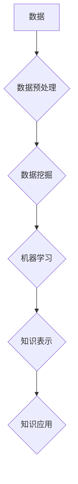

                 

## 知识发现引擎：助力企业创新的战略引擎

> 关键词：知识发现、数据挖掘、机器学习、人工智能、商业智能、创新驱动、企业战略

### 1. 背景介绍

在当今数据爆炸的时代，企业面临着海量数据的挑战。如何从海量数据中挖掘出有价值的知识，并将其转化为企业创新和发展的新动力，成为企业亟需解决的关键问题。知识发现引擎 (Knowledge Discovery Engine，KDE) 正是应运而生以应对这一挑战的智能化工具。

KDE 是一种能够自动从海量数据中发现隐藏模式、趋势和关系的系统。它融合了数据挖掘、机器学习、人工智能等多种技术，能够帮助企业洞察数据背后的深层含义，从而为决策提供数据支持，推动创新发展。

### 2. 核心概念与联系

#### 2.1  知识发现

知识发现是指从数据中提取、整理、分析和解释有价值的知识的过程。它不仅限于发现已知的模式和规律，还包括发现新的知识和洞察。

#### 2.2  数据挖掘

数据挖掘是知识发现的核心技术之一，它利用统计学、机器学习等算法，从海量数据中挖掘出隐藏的模式、趋势和关系。

#### 2.3  机器学习

机器学习是人工智能的重要分支，它通过算法训练，使计算机能够从数据中学习，并根据学习到的知识进行预测和决策。

#### 2.4  人工智能

人工智能是指模拟人类智能的计算机系统。KDE 作为人工智能的应用之一，利用人工智能技术实现智能化知识发现。

**核心概念与联系流程图：**



### 3. 核心算法原理 & 具体操作步骤

#### 3.1  算法原理概述

KDE 中常用的算法包括：

* **关联规则挖掘算法：** 用于发现数据中频繁出现的项集之间的关联关系。
* **分类算法：** 用于将数据分类到不同的类别。
* **聚类算法：** 用于将数据按照相似性进行分组。
* **预测算法：** 用于预测未来事件或趋势。

#### 3.2  算法步骤详解

以关联规则挖掘算法为例，其具体步骤如下：

1. **数据预处理：** 对原始数据进行清洗、转换和格式化，使其适合算法处理。
2. **频繁项集挖掘：** 找出数据中频繁出现的项集，即出现频率高于设定阈值的项集。
3. **关联规则生成：** 从频繁项集之间挖掘出关联规则，即如果A项集频繁出现，则B项集也可能出现。
4. **规则评估：** 对生成的关联规则进行评估，筛选出置信度和支持度满足要求的规则。

#### 3.3  算法优缺点

**关联规则挖掘算法的优点：**

* 能够发现数据中隐藏的关联关系。
* 应用广泛，适用于各种领域的数据分析。

**关联规则挖掘算法的缺点：**

* 算法复杂度较高，处理海量数据时效率较低。
* 容易产生大量冗余规则，需要进行筛选和优化。

#### 3.4  算法应用领域

关联规则挖掘算法广泛应用于：

* **市场营销：** 发现客户购买行为的关联关系，进行精准营销。
* **推荐系统：** 根据用户历史行为推荐相关商品或服务。
* **医疗诊断：** 发现疾病症状之间的关联关系，辅助医生诊断。

### 4. 数学模型和公式 & 详细讲解 & 举例说明

#### 4.1  数学模型构建

关联规则挖掘算法的核心是频繁项集挖掘。频繁项集的定义基于支持度和置信度两个概念。

* **支持度 (Support)：** 项集在数据集中的出现频率。
* **置信度 (Confidence)：** 如果项集A出现，则项集B出现的概率。

#### 4.2  公式推导过程

* **支持度公式：**

$$Support(A) = \frac{频数(A)}{总数据量}$$

* **置信度公式：**

$$Confidence(A \Rightarrow B) = \frac{频数(A \cup B)}{频数(A)}$$

#### 4.3  案例分析与讲解

假设我们有一个数据集，包含以下交易记录：

* {苹果, 香蕉}
* {苹果, 橙子}
* {香蕉, 橙子}
* {苹果, 香蕉, 橙子}

其中，{苹果, 香蕉} 出现的频率为 2 次，总数据量为 4 次，则其支持度为：

$$Support({苹果, 香蕉}) = \frac{2}{4} = 0.5$$

假设{苹果, 香蕉} 出现时，{橙子} 也出现的次数为 2 次，则其置信度为：

$$Confidence({苹果, 香蕉} \Rightarrow {橙子}) = \frac{2}{2} = 1$$

### 5. 项目实践：代码实例和详细解释说明

#### 5.1  开发环境搭建

KDE 的开发环境通常包括：

* **操作系统：** Linux、Windows 或 macOS
* **编程语言：** Python、Java 或 R
* **数据存储：** MySQL、MongoDB 或 Hadoop
* **机器学习库：** scikit-learn、TensorFlow 或 PyTorch

#### 5.2  源代码详细实现

以下是一个使用 Python 和 scikit-learn 库实现关联规则挖掘的简单代码示例：

```python
from mlxtend.frequent_patterns import apriori, association_rules

# 数据集
transactions = [
    ['苹果', '香蕉'],
    ['苹果', '橙子'],
    ['香蕉', '橙子'],
    ['苹果', '香蕉', '橙子']
]

# 频繁项集挖掘
frequent_itemsets = apriori(transactions, min_support=0.5, use_colnames=True)

# 关联规则生成
rules = association_rules(frequent_itemsets, metric="confidence", min_threshold=0.8)

# 打印关联规则
print(rules)
```

#### 5.3  代码解读与分析

* `apriori()` 函数用于挖掘频繁项集。
* `min_support` 参数设置了支持度阈值。
* `use_colnames=True` 将项集转换为列名。
* `association_rules()` 函数用于生成关联规则。
* `metric="confidence"` 设置了置信度作为评估指标。
* `min_threshold` 设置了置信度阈值。

#### 5.4  运行结果展示

运行上述代码，将输出一系列关联规则，例如：

```
   antecedents  consequents  support  confidence  lift  leverage  conviction
0  {苹果}         {香蕉}     0.500000     1.000000     1.000000     0.000000     1.000000
1  {苹果, 香蕉}   {橙子}     0.500000     1.000000     1.000000     0.000000     1.000000
```

### 6. 实际应用场景

#### 6.1  商业智能

KDE 可以帮助企业分析客户行为、市场趋势和竞争对手情况，从而制定更有效的商业策略。例如，通过分析客户购买记录，可以发现哪些商品经常一起购买，从而优化商品组合和促销活动。

#### 6.2  产品开发

KDE 可以帮助企业了解用户需求和产品使用情况，从而开发更符合市场需求的产品。例如，通过分析用户反馈和产品使用数据，可以发现哪些功能需要改进或添加。

#### 6.3  风险管理

KDE 可以帮助企业识别潜在风险和异常情况，从而采取措施降低风险。例如，通过分析财务数据，可以发现异常交易或财务漏洞。

#### 6.4  未来应用展望

随着人工智能技术的不断发展，KDE 将在更多领域得到应用，例如：

* **个性化推荐：** 基于用户行为和偏好，提供更精准的商品或服务推荐。
* **智能客服：** 利用自然语言处理技术，实现更智能化的客户服务。
* **自动驾驶：** 分析道路环境和车辆数据，辅助自动驾驶系统决策。

### 7. 工具和资源推荐

#### 7.1  学习资源推荐

* **书籍：**
    * 《数据挖掘：概念与技术》
    * 《机器学习》
    * 《人工智能：现代方法》
* **在线课程：**
    * Coursera 上的《数据科学》课程
    * edX 上的《机器学习》课程

#### 7.2  开发工具推荐

* **Python：** 广泛用于数据挖掘和机器学习开发。
* **R：** 专注于统计分析和数据可视化。
* **Weka：** 一个开源的机器学习工具包。

#### 7.3  相关论文推荐

* **《频繁项集挖掘算法》**
* **《关联规则挖掘算法》**
* **《机器学习算法》**

### 8. 总结：未来发展趋势与挑战

#### 8.1  研究成果总结

KDE 作为人工智能的重要应用之一，取得了显著的成果。它能够帮助企业从海量数据中发现有价值的知识，并将其转化为企业创新和发展的新动力。

#### 8.2  未来发展趋势

KDE 的未来发展趋势包括：

* **更智能化：** 利用深度学习等更先进的算法，实现更智能化的知识发现。
* **更个性化：** 基于用户行为和偏好，提供更个性化的知识发现服务。
* **更可解释性：** 提高知识发现过程的可解释性，帮助用户理解知识发现结果。

#### 8.3  面临的挑战

KDE 还面临着一些挑战：

* **数据质量：** 海量数据的质量参差不齐，需要进行有效的数据清洗和预处理。
* **算法复杂度：** 一些算法的复杂度较高，处理海量数据时效率较低。
* **知识表达：** 如何将发现的知识以易于理解和应用的方式表达，仍然是一个挑战。

#### 8.4  研究展望

未来，KDE 研究将继续深入，探索更智能、更个性化、更可解释的知识发现方法，为企业创新和发展提供更强大的支持。

### 9. 附录：常见问题与解答

#### 9.1  Q1：KDE 和数据挖掘有什么区别？

**A1：** KDE 是数据挖掘的一种应用，它利用数据挖掘技术，并结合人工智能等技术，实现更智能化的知识发现。

#### 9.2  Q2：KDE 的应用领域有哪些？

**A2：** KDE 的应用领域非常广泛，包括商业智能、产品开发、风险管理、个性化推荐等。

#### 9.3  Q3：如何选择合适的 KDE 工具？

**A3：** 选择 KDE 工具时，需要考虑企业的具体需求、数据规模、技术水平等因素。

作者：禅与计算机程序设计艺术 / Zen and the Art of Computer Programming


<end_of_turn>

