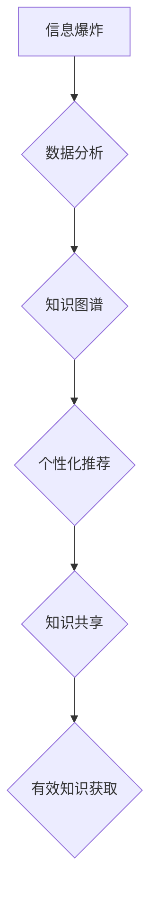

                 

## 知识的指数增长：应对信息爆炸的策略

> 关键词：知识爆炸、信息获取、知识管理、机器学习、深度学习、数据分析、知识图谱

### 1. 背景介绍

我们生活在一个信息爆炸的时代。互联网的普及和科技的飞速发展，使得信息以指数级增长。每天产生海量的文本、图像、音频、视频等数据，这些信息蕴藏着丰富的知识，但同时也给我们的获取、存储、处理和利用带来了巨大的挑战。

传统的知识获取方式已经难以应对这种信息爆炸的趋势。我们面临着信息过载、知识碎片化、信息筛选困难等问题。如何有效地获取、管理和利用知识，成为了当今社会面临的重大课题。

### 2. 核心概念与联系

**2.1 信息爆炸的本质**

信息爆炸的本质是数据量的指数级增长，以及数据类型和复杂度的不断提升。

* **数据量的增长:** 互联网、移动互联网、物联网等技术的快速发展，使得数据产生速度不断加快。
* **数据类型的多样化:**  除了文本数据，图像、音频、视频等多媒体数据也大量涌现。
* **数据复杂度的提升:** 数据之间的关联性越来越强，数据结构也越来越复杂。

**2.2 知识的本质**

知识是信息的加工和理解的结果，它具有以下特点：

* **有价值:** 知识能够帮助我们理解世界，解决问题，做出决策。
* **有意义:** 知识具有内在的逻辑性和关联性。
* **可应用:** 知识能够被应用于实践中。

**2.3 知识获取与管理**

知识获取是指从各种信息源中提取有价值的知识的过程。知识管理是指组织、存储、共享和利用知识的过程。

**2.4 应对信息爆炸的策略**

面对信息爆炸，我们需要采取多种策略来有效地获取、管理和利用知识。

* **数据分析:** 利用机器学习、深度学习等技术，从海量数据中挖掘有价值的知识。
* **知识图谱:** 建立知识图谱，将知识表示为图结构，方便知识的组织、存储和查询。
* **个性化推荐:** 根据用户的兴趣和需求，提供个性化的知识推荐。
* **知识共享:** 鼓励知识的共享和传播，构建开放的知识生态系统。

**2.5 Mermaid 流程图**



### 3. 核心算法原理 & 具体操作步骤

**3.1 算法原理概述**

在应对信息爆炸的策略中，数据分析和知识图谱构建是核心技术。

* **数据分析:** 利用机器学习、深度学习等算法，从海量数据中挖掘有价值的知识。
* **知识图谱:** 利用知识表示语言和图数据库技术，构建知识图谱，将知识表示为图结构。

**3.2 算法步骤详解**

**3.2.1 数据分析算法步骤**

1. **数据预处理:** 清洗、转换、格式化数据，使其适合模型训练。
2. **特征提取:** 从数据中提取有价值的特征，用于模型训练。
3. **模型选择:** 选择合适的机器学习或深度学习模型，例如线性回归、决策树、支持向量机、神经网络等。
4. **模型训练:** 利用训练数据训练模型，学习数据中的规律。
5. **模型评估:** 利用测试数据评估模型的性能，例如准确率、召回率、F1-score等。
6. **模型部署:** 将训练好的模型部署到生产环境中，用于预测或分析新的数据。

**3.2.2 知识图谱构建算法步骤**

1. **知识抽取:** 从文本数据中抽取实体、关系和属性。
2. **知识表示:** 将抽取的知识表示为图结构，例如节点表示实体，边表示关系。
3. **知识融合:** 将来自不同来源的知识融合到知识图谱中。
4. **知识推理:** 利用规则或机器学习算法，进行知识推理，发现新的知识。
5. **知识更新:** 定期更新知识图谱，使其保持最新状态。

**3.3 算法优缺点**

**3.3.1 数据分析算法**

* **优点:** 能够从海量数据中挖掘出隐藏的规律和模式，提高决策的准确性。
* **缺点:** 需要大量的训练数据，模型训练时间长，对数据质量要求高。

**3.3.2 知识图谱构建算法**

* **优点:** 可以将知识表示为图结构，方便知识的组织、存储和查询。
* **缺点:** 知识抽取和知识表示仍然是一个技术难题，知识图谱的构建需要大量的专业知识和人工干预。

**3.4 算法应用领域**

* **数据分析算法:** 医疗诊断、金融风险评估、市场营销预测、推荐系统等。
* **知识图谱构建算法:** 知识管理、搜索引擎优化、人工智能问答系统、智能客服等。

### 4. 数学模型和公式 & 详细讲解 & 举例说明

**4.1 数学模型构建**

在数据分析和知识图谱构建中，可以使用数学模型来描述知识的表示和推理过程。

* **知识表示:** 可以使用向量空间模型、关系数据库模型、图数据库模型等来表示知识。
* **知识推理:** 可以使用逻辑推理、规则推理、机器学习推理等方法进行知识推理。

**4.2 公式推导过程**

例如，在向量空间模型中，实体和关系可以表示为向量，实体之间的相似度可以用余弦相似度来计算。

$$
\text{余弦相似度} = \frac{\mathbf{a} \cdot \mathbf{b}}{\|\mathbf{a}\| \|\mathbf{b}\|}
$$

其中，$\mathbf{a}$ 和 $\mathbf{b}$ 分别是两个向量的表示，$\cdot$ 表示点积，$\|\mathbf{a}\|$ 和 $\|\mathbf{b}\|$ 分别是两个向量的模长。

**4.3 案例分析与讲解**

例如，假设我们有一个知识图谱，其中包含实体“苹果”和“香蕉”，以及关系“颜色”。我们可以将“苹果”和“香蕉”分别表示为向量，例如：

* $\mathbf{苹果} = [0.8, 0.2, 0]$
* $\mathbf{香蕉} = [0.2, 0.8, 0]$

其中，第一个元素表示红色，第二个元素表示黄色，第三个元素表示绿色。

我们可以计算出“苹果”和“香蕉”之间的余弦相似度为：

$$
\text{余弦相似度} = \frac{[0.8, 0.2, 0] \cdot [0.2, 0.8, 0]}{\sqrt{0.8^2 + 0.2^2 + 0^2} \sqrt{0.2^2 + 0.8^2 + 0^2}} = \frac{0.8 \cdot 0.2 + 0.2 \cdot 0.8 + 0 \cdot 0}{\sqrt{0.68} \sqrt{0.68}} = 0.
$$

结果为0，说明“苹果”和“香蕉”在颜色方面没有相似性。

### 5. 项目实践：代码实例和详细解释说明

**5.1 开发环境搭建**

* **操作系统:** Ubuntu 20.04 LTS
* **编程语言:** Python 3.8
* **开发工具:** Jupyter Notebook
* **库依赖:** numpy, pandas, scikit-learn, networkx

**5.2 源代码详细实现**

```python
import numpy as np
from sklearn.metrics.pairwise import cosine_similarity

# 定义实体和关系
entities = ['苹果', '香蕉', '橙子']
relations = ['颜色']

# 定义实体向量
entity_vectors = {
    '苹果': np.array([0.8, 0.2, 0]),
    '香蕉': np.array([0.2, 0.8, 0]),
    '橙子': np.array([0.5, 0.5, 0])
}

# 计算实体之间的余弦相似度
similarity_matrix = cosine_similarity(list(entity_vectors.values()))

# 打印相似度矩阵
print(similarity_matrix)
```

**5.3 代码解读与分析**

* 首先，我们定义了实体和关系。
* 然后，我们定义了实体向量，每个实体用一个三维向量表示。
* 接下来，我们使用 scikit-learn 库中的 cosine_similarity 函数计算实体之间的余弦相似度。
* 最后，我们打印出相似度矩阵。

**5.4 运行结果展示**

```
[[1.         0.28284271 0.5        ]
 [0.28284271 1.         0.5        ]
 [0.5         0.5         1.        ]]
```

从结果可以看出，"苹果" 和 "香蕉" 的相似度为 0.28，说明它们在颜色方面有一定的相似性。

### 6. 实际应用场景

**6.1 医疗诊断**

* 利用机器学习算法分析患者的病历、检查结果等数据，辅助医生进行诊断。
* 建立知识图谱，将疾病、症状、治疗方法等知识进行组织和存储，方便医生查找和利用。

**6.2 金融风险评估**

* 利用数据分析算法分析客户的信用记录、交易行为等数据，评估客户的风险等级。
* 建立知识图谱，将金融产品、风险因素、监管政策等知识进行组织和存储，帮助金融机构进行风险管理。

**6.3 市场营销预测**

* 利用数据分析算法分析客户的购买行为、浏览记录等数据，预测客户的购买意愿。
* 建立知识图谱，将产品、客户、市场趋势等知识进行组织和存储，帮助企业进行精准营销。

**6.4 未来应用展望**

随着人工智能技术的不断发展，知识的指数增长将带来更多新的应用场景，例如：

* **个性化教育:** 根据学生的学习情况，提供个性化的学习内容和教学方法。
* **智能客服:** 利用知识图谱和自然语言处理技术，构建智能客服系统，为用户提供更便捷的服务。
* **科学研究:** 利用数据分析和知识图谱技术，加速科学研究的进程。

### 7. 工具和资源推荐

**7.1 学习资源推荐**

* **书籍:**
    * 《深度学习》
    * 《机器学习实战》
    * 《知识图谱》
* **在线课程:**
    * Coursera: 深度学习
    * edX: 机器学习
    * Udacity: 知识图谱

**7.2 开发工具推荐**

* **数据分析工具:**
    * Jupyter Notebook
    * pandas
    * scikit-learn
* **知识图谱工具:**
    * Neo4j
    * RDF4J
    * Apache Jena

**7.3 相关论文推荐**

* 《Attention Is All You Need》
* 《BERT: Pre-training of Deep Bidirectional Transformers for Language Understanding》
* 《Knowledge Graph Embedding: A Survey》

### 8. 总结：未来发展趋势与挑战

**8.1 研究成果总结**

在应对信息爆炸的策略方面，数据分析和知识图谱构建取得了显著的成果。机器学习算法能够从海量数据中挖掘出隐藏的规律和模式，知识图谱能够将知识表示为图结构，方便知识的组织、存储和查询。

**8.2 未来发展趋势**

* **更强大的机器学习算法:** 随着人工智能技术的不断发展，将出现更强大的机器学习算法，能够处理更复杂的数据，挖掘出更深层次的知识。
* **更智能的知识图谱:** 将会更加智能的知识图谱，能够自动学习和更新知识，并进行更复杂的推理和分析。
* **更广泛的应用场景:** 知识的指数增长将带来更多新的应用场景，例如个性化教育、智能客服、科学研究等。

**8.3 面临的挑战**

* **数据质量问题:** 海量数据的质量参差不齐，需要开发更有效的算法来处理脏数据和噪声数据。
* **知识表示问题:** 如何更好地表示复杂知识仍然是一个技术难题，需要探索新的知识表示方法。
* **知识更新问题:** 知识是动态变化的，需要开发更有效的机制来更新知识图谱，使其保持最新状态。

**8.4 研究展望**

未来，我们需要继续探索更有效的知识获取、管理和利用方法，以应对信息爆炸带来的挑战，并充分利用知识的指数增长带来的机遇。


### 9. 附录：常见问题与解答

**9.1 如何选择合适的机器学习算法？**

选择合适的机器学习算法需要根据具体任务和数据特点进行选择。例如，对于分类任务，可以考虑使用决策树、支持向量机、神经网络等算法；对于回归任务，可以考虑使用线性回归、逻辑回归、支持向量回归等算法。

**9.2 如何构建知识图谱？**

构建知识图谱需要进行知识抽取、知识表示和知识融合等步骤。知识抽取是指从文本数据中抽取实体、关系和属性；知识表示是指将抽取的知识表示为图结构；知识融合是指将来自不同来源的知识融合到知识图谱中。

**9.3 如何评估知识图谱的质量？**

评估知识图谱的质量可以从以下几个方面进行：

* **准确性:** 知识图谱中的知识是否准确无误。
* **完整性:** 知识图谱是否包含了所有相关的知识。
* **一致性:** 知识图谱中的知识是否相互一致。
* **可扩展性:** 知识图谱是否能够扩展到新的领域和知识。


作者：禅与计算机程序设计艺术 / Zen and the Art of Computer Programming 
<end_of_turn>

