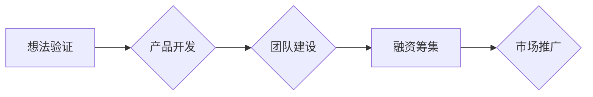

                 

## 知识经济下程序员的创业之道

> 关键词：知识经济、程序员、创业、技术创新、商业模式、敏捷开发、人工智能、云计算、数据分析

### 1. 背景介绍

21世纪，知识已成为经济的核心要素，知识经济时代到来。在这个时代，拥有知识、技能和创造力的个体和组织将占据主导地位。程序员，作为掌握着数字世界构建和操控的“码农”，在知识经济中扮演着越来越重要的角色。他们不仅是技术人才，更是创新驱动力的关键力量。

然而，传统的程序员工作模式面临着挑战。随着互联网和科技的快速发展，软件开发周期缩短，市场竞争加剧，程序员需要不断学习新技术、提升自身能力，才能保持竞争力。在这种背景下，程序员创业成为一种新的选择，也是一种自我提升和实现价值的重要途径。

### 2. 核心概念与联系

**2.1 知识经济与程序员创业**

知识经济的核心是知识的创造、传播和应用。程序员拥有丰富的技术知识和技能，能够将这些知识转化为具有商业价值的产品和服务。程序员创业可以将个人技术优势与市场需求相结合，创造新的价值，推动经济发展。

**2.2 程序员创业模式**

程序员创业模式多样化，可以分为以下几种：

* **独立开发：**程序员独立开发软件产品，通过线上平台或线下销售渠道进行推广和销售。
* **创业公司：**程序员联合其他人才创办科技公司，开发和销售软件产品或提供软件服务。
* **自由职业：**程序员以自由职业的形式为企业或个人提供软件开发服务。
* **开源社区：**程序员参与开源项目，开发和维护开源软件，并通过社区贡献获得认可和回报。

**2.3 程序员创业的优势**

* **技术优势：**程序员拥有扎实的技术基础和开发能力，能够快速开发和迭代产品。
* **市场需求：**软件需求不断增长，程序员创业有广阔的市场空间。
* **低成本创业：**程序员创业门槛相对较低，可以利用开源工具和云计算平台降低成本。
* **灵活性和自主性：**程序员创业可以灵活安排工作时间和内容，拥有更高的自主权。

**2.4 程序员创业的挑战**

* **市场竞争激烈：**软件市场竞争激烈，程序员需要不断学习新技术、提升产品竞争力。
* **商业模式创新：**程序员需要找到合适的商业模式，才能实现可持续发展。
* **团队建设：**程序员创业需要组建高效的团队，才能完成复杂的项目。
* **资金筹集：**程序员创业需要资金支持，需要找到合适的投资渠道。

**2.5 程序员创业的流程**

程序员创业是一个循序渐进的过程，一般包括以下几个阶段：

* **想法验证：**程序员需要确定创业方向，验证市场需求和商业模式的可行性。
* **产品开发：**程序员需要根据市场需求和技术能力开发产品原型，并进行迭代优化。
* **团队建设：**程序员需要组建高效的团队，包括技术人员、市场人员、运营人员等。
* **融资筹集：**程序员需要筹集资金，支持产品开发和市场推广。
* **市场推广：**程序员需要进行市场推广，提升产品知名度和用户量。

**2.6 Mermaid 流程图**

### 3. 核心算法原理 & 具体操作步骤

**3.1 算法原理概述**

在程序员创业过程中，算法设计和优化是至关重要的。算法可以帮助程序员更高效地解决问题，提高产品性能和用户体验。

**3.2 算法步骤详解**

* **需求分析：**程序员需要首先明确算法的具体需求，包括输入数据、输出结果、时间复杂度、空间复杂度等。
* **算法设计：**程序员需要根据需求分析结果，设计出合适的算法方案。
* **算法实现：**程序员需要将算法方案转化为具体的代码实现。
* **算法测试：**程序员需要对算法进行测试，验证其正确性和效率。
* **算法优化：**程序员需要根据测试结果，对算法进行优化，提高其性能。

**3.3 算法优缺点**

不同的算法具有不同的优缺点，程序员需要根据具体需求选择合适的算法。

* **时间复杂度：**算法执行的时间成本。
* **空间复杂度：**算法使用的内存空间成本。
* **稳定性：**算法在不同输入数据下的输出结果是否一致。
* **易读性：**算法代码是否易于理解和维护。

**3.4 算法应用领域**

算法广泛应用于各个领域，例如：

* **搜索引擎：**用于网页排名和搜索结果排序。
* **推荐系统：**用于推荐用户感兴趣的内容。
* **图像识别：**用于识别图像中的物体和场景。
* **自然语言处理：**用于理解和生成自然语言。

### 4. 数学模型和公式 & 详细讲解 & 举例说明

**4.1 数学模型构建**

数学模型可以帮助程序员描述和分析算法的性能，并进行优化设计。例如，可以使用时间复杂度和空间复杂度来衡量算法的效率。

**4.2 公式推导过程**

时间复杂度通常用大O符号表示，例如O(n)，O(log n)，O(n^2)等。这些符号表示算法执行时间与输入数据大小的关系。

* **O(n)：**线性时间复杂度，算法执行时间与输入数据大小成正比。
* **O(log n)：**对数时间复杂度，算法执行时间与输入数据大小的对数成正比。
* **O(n^2)：**平方时间复杂度，算法执行时间与输入数据大小的平方成正比。

**4.3 案例分析与讲解**

例如，查找一个元素在排序数组中的位置，可以使用二分查找算法。二分查找算法的时间复杂度为O(log n)，因为它每次将搜索范围缩小一半。

**4.4 数学公式举例说明**

$$
T(n) = 2T(n/2) + O(n)
$$

这个公式描述了分治算法的时间复杂度。其中，T(n)表示算法执行时间，n表示输入数据大小。

### 5. 项目实践：代码实例和详细解释说明

**5.1 开发环境搭建**

程序员创业需要搭建合适的开发环境，包括操作系统、编程语言、开发工具等。

**5.2 源代码详细实现**

程序员需要根据算法设计，编写具体的源代码实现。

**5.3 代码解读与分析**

程序员需要对代码进行解读和分析，确保代码的正确性和效率。

**5.4 运行结果展示**

程序员需要运行代码，并展示运行结果，验证算法的正确性和性能。

### 6. 实际应用场景

程序员创业的产品和服务可以应用于各个领域，例如：

* **教育科技：**开发在线学习平台、教育软件等。
* **医疗健康：**开发医疗诊断系统、健康管理软件等。
* **金融科技：**开发金融交易平台、风险管理系统等。
* **智能家居：**开发智能家居控制系统、智能家电等。

**6.4 未来应用展望**

随着人工智能、云计算、大数据等技术的快速发展，程序员创业将迎来更多新的机遇和挑战。

### 7. 工具和资源推荐

**7.1 学习资源推荐**

* **在线课程平台：**Coursera、edX、Udemy等。
* **编程社区：**Stack Overflow、GitHub等。
* **技术博客：**Hacker News、Medium等。

**7.2 开发工具推荐**

* **代码编辑器：**VS Code、Sublime Text等。
* **版本控制系统：**Git、GitHub等。
* **云计算平台：**AWS、Azure、GCP等。

**7.3 相关论文推荐**

* **算法导论：**Thomas H. Cormen、Charles E. Leiserson、Ronald L. Rivest、Clifford Stein。
* **深度学习：**Ian Goodfellow、Yoshua Bengio、Aaron Courville。

### 8. 总结：未来发展趋势与挑战

**8.1 研究成果总结**

程序员创业在知识经济时代具有重要意义，它推动了技术创新和经济发展。

**8.2 未来发展趋势**

* **人工智能驱动：**人工智能技术将进一步推动程序员创业，例如自动代码生成、智能测试等。
* **云原生开发：**云计算平台将成为程序员创业的基石，提供更灵活、更可扩展的开发环境。
* **数据驱动：**数据分析和机器学习将成为程序员创业的重要工具，帮助程序员更好地理解用户需求和市场趋势。

**8.3 面临的挑战**

* **技术迭代速度快：**程序员需要不断学习新技术，才能保持竞争力。
* **市场竞争激烈：**程序员创业需要找到独特的市场定位和商业模式。
* **人才短缺：**程序员创业需要组建高效的团队，但人才短缺是一个普遍问题。

**8.4 研究展望**

未来，需要进一步研究程序员创业的成功因素、商业模式创新、团队建设等方面，为程序员创业提供更多指导和支持。

### 9. 附录：常见问题与解答

* **程序员创业需要哪些技能？**

程序员创业需要具备技术能力、商业头脑、沟通能力、团队合作能力等多方面的技能。

* **程序员创业有哪些风险？**

程序员创业存在市场风险、技术风险、资金风险等多种风险。

* **程序员创业有哪些成功案例？**

有很多成功的程序员创业案例，例如：Google、Facebook、Airbnb等。

作者：禅与计算机程序设计艺术 / Zen and the Art of Computer Programming 
<end_of_turn>

