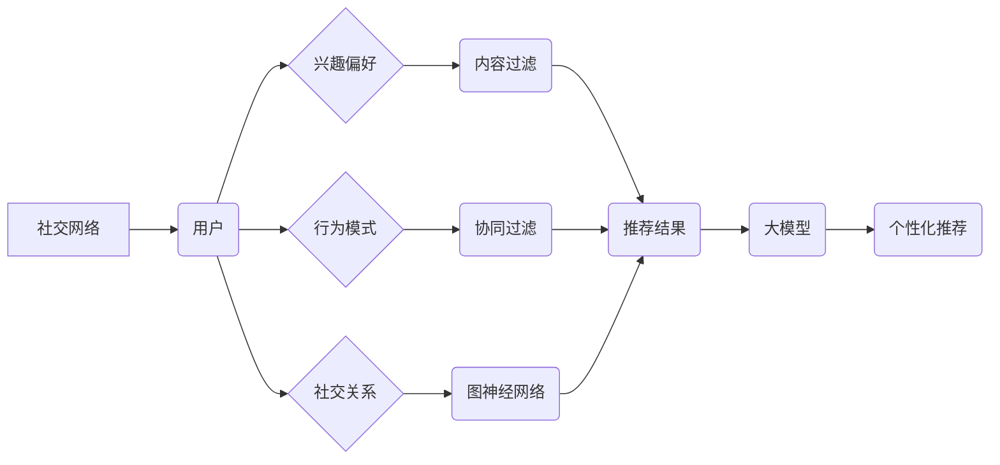

                 

## 社交网络推荐：大模型的发展方向

> 关键词：社交网络推荐、大模型、Transformer、图神经网络、个性化推荐、冷启动问题、数据隐私

## 1. 背景介绍

社交网络已经成为人们生活中不可或缺的一部分，用户每天在这些平台上花费大量时间，与朋友、家人和陌生人进行互动。为了提升用户体验，社交网络平台需要提供个性化的推荐服务，帮助用户发现感兴趣的内容和人脉。传统的社交网络推荐系统主要依赖于协同过滤、内容过滤和基于规则的方法，但这些方法存在一些局限性，例如数据稀疏性、冷启动问题和缺乏对用户深层意图的理解。

近年来，大模型的兴起为社交网络推荐带来了新的机遇。大模型，例如 GPT-3 和 BERT，拥有强大的语义理解和文本生成能力，能够从海量文本数据中学习到复杂的模式和关系。将大模型应用于社交网络推荐，可以有效解决传统方法的局限性，提供更精准、个性化的推荐服务。

## 2. 核心概念与联系

### 2.1  社交网络推荐

社交网络推荐是指根据用户的社交关系、兴趣偏好、行为模式等信息，推荐用户可能感兴趣的内容、人脉或服务。

### 2.2  大模型

大模型是指参数量巨大、训练数据量庞大的深度学习模型。大模型能够学习到复杂的模式和关系，并应用于各种自然语言处理任务，例如文本分类、机器翻译、问答系统等。

### 2.3  Transformer

Transformer是一种新型的深度学习架构，其核心是自注意力机制，能够有效捕捉文本序列中的长距离依赖关系。Transformer在自然语言处理领域取得了突破性的进展，例如在机器翻译、文本摘要和问答系统等任务上取得了state-of-the-art的性能。

### 2.4  图神经网络

图神经网络是一种专门用于处理图结构数据的深度学习模型。社交网络可以看作是一个图结构，其中用户是节点，社交关系是边。图神经网络能够学习图结构中的复杂关系，并应用于社交网络推荐、社区发现和节点分类等任务。

**核心概念与架构关系流程图**



## 3. 核心算法原理 & 具体操作步骤

### 3.1  算法原理概述

大模型在社交网络推荐中的应用主要基于以下几个核心算法原理：

* **Transformer模型**: Transformer模型能够有效捕捉文本序列中的长距离依赖关系，可以用于理解用户的文本信息，例如用户发布的帖子、评论和私信等。
* **图神经网络**: 图神经网络能够学习图结构中的复杂关系，可以用于理解用户的社交关系网络，例如用户的关注关系、好友关系和互动关系等。
* **知识图谱**: 知识图谱是一种结构化的知识表示形式，可以用于存储和推理用户兴趣相关的知识，例如用户喜欢的电影、音乐和书籍等。

### 3.2  算法步骤详解

1. **数据收集和预处理**: 收集用户社交网络数据，包括用户个人信息、社交关系、行为模式、兴趣偏好等。对数据进行清洗、格式化和转换，以便于模型训练。
2. **特征工程**: 从原始数据中提取特征，例如用户发布的文本内容、社交关系的结构、行为模式的统计特征等。
3. **模型训练**: 使用Transformer模型、图神经网络和知识图谱等技术构建推荐模型，并使用收集到的数据进行训练。
4. **模型评估**: 使用测试数据评估模型的性能，例如准确率、召回率和F1-score等。
5. **模型部署**: 将训练好的模型部署到生产环境中，为用户提供个性化的推荐服务。

### 3.3  算法优缺点

**优点**:

* **精准度高**: 大模型能够学习到复杂的模式和关系，提供更精准的推荐结果。
* **个性化强**: 大模型可以根据用户的深层意图和行为模式提供个性化的推荐服务。
* **可扩展性强**: 大模型可以轻松扩展到新的数据和任务。

**缺点**:

* **训练成本高**: 大模型的训练需要大量的计算资源和时间。
* **数据依赖性强**: 大模型的性能依赖于训练数据的质量和数量。
* **解释性差**: 大模型的决策过程难以解释，难以理解模型是如何生成推荐结果的。

### 3.4  算法应用领域

大模型在社交网络推荐领域的应用非常广泛，例如：

* **内容推荐**: 推荐用户可能感兴趣的文章、视频、图片等内容。
* **人脉推荐**: 推荐用户可能认识或感兴趣的人。
* **活动推荐**: 推荐用户可能感兴趣的活动和事件。
* **商品推荐**: 推荐用户可能感兴趣的商品和服务。

## 4. 数学模型和公式 & 详细讲解 & 举例说明

### 4.1  数学模型构建

大模型在社交网络推荐中的应用通常基于以下数学模型：

* **用户嵌入**: 将用户表示为低维向量，捕捉用户的兴趣偏好和行为模式。
* **物品嵌入**: 将物品表示为低维向量，捕捉物品的特征和属性。
* **相似度计算**: 计算用户和物品之间的相似度，例如余弦相似度或点积相似度。
* **推荐排序**: 根据用户和物品之间的相似度，对推荐结果进行排序。

### 4.2  公式推导过程

**用户嵌入**:

假设用户集合为U，物品集合为I，用户u的嵌入向量为u，物品i的嵌入向量为i。用户嵌入可以通过以下公式计算：

$$u = \text{Embedding}(u)$$

$$i = \text{Embedding}(i)$$

其中，Embedding()是一个神经网络层，用于将用户和物品映射到低维向量空间。

**相似度计算**:

用户u和物品i之间的余弦相似度可以计算如下：

$$\text{Similarity}(u, i) = \frac{u \cdot i}{||u|| ||i||}$$

其中，u·i表示用户u和物品i的点积，||u||和||i||分别表示用户u和物品i的范数。

**推荐排序**:

根据用户和物品之间的相似度，对推荐结果进行排序，选择相似度最高的物品作为推荐结果。

### 4.3  案例分析与讲解

例如，假设有一个社交网络平台，用户可以发布帖子、评论和私信。我们可以使用大模型训练一个推荐模型，根据用户的帖子、评论和私信内容，推荐用户可能感兴趣的帖子和用户。

在训练过程中，我们可以使用Transformer模型学习用户的文本信息，图神经网络学习用户的社交关系网络，知识图谱学习用户兴趣相关的知识。然后，我们可以使用上述公式计算用户和物品之间的相似度，并对推荐结果进行排序。

## 5. 项目实践：代码实例和详细解释说明

### 5.1  开发环境搭建

* **操作系统**: Linux
* **编程语言**: Python
* **深度学习框架**: PyTorch 或 TensorFlow
* **其他工具**: Git、Jupyter Notebook

### 5.2  源代码详细实现

```python
# 导入必要的库
import torch
import torch.nn as nn

# 定义用户嵌入层
class UserEmbedding(nn.Module):
    def __init__(self, embedding_dim):
        super(UserEmbedding, self).__init__()
        self.embedding = nn.Embedding(num_users, embedding_dim)

    def forward(self, user_ids):
        return self.embedding(user_ids)

# 定义物品嵌入层
class ItemEmbedding(nn.Module):
    def __init__(self, embedding_dim):
        super(ItemEmbedding, self).__init__()
        self.embedding = nn.Embedding(num_items, embedding_dim)

    def forward(self, item_ids):
        return self.embedding(item_ids)

# 定义推荐模型
class RecommenderModel(nn.Module):
    def __init__(self, embedding_dim):
        super(RecommenderModel, self).__init__()
        self.user_embedding = UserEmbedding(embedding_dim)
        self.item_embedding = ItemEmbedding(embedding_dim)

    def forward(self, user_ids, item_ids):
        user_embeddings = self.user_embedding(user_ids)
        item_embeddings = self.item_embedding(item_ids)
        similarity = torch.matmul(user_embeddings, item_embeddings.t())
        return similarity

# 实例化模型
model = RecommenderModel(embedding_dim=64)

# 训练模型
# ...

# 推理模型
user_ids = torch.tensor([1, 2, 3])
item_ids = torch.tensor([4, 5, 6])
similarity = model(user_ids, item_ids)
```

### 5.3  代码解读与分析

* **用户嵌入层和物品嵌入层**: 这些层将用户和物品映射到低维向量空间，捕捉用户的兴趣偏好和物品的特征。
* **推荐模型**: 该模型计算用户和物品之间的相似度，并根据相似度对推荐结果进行排序。
* **训练模型**: 使用训练数据训练模型，优化模型参数。
* **推理模型**: 使用训练好的模型对用户进行推荐。

### 5.4  运行结果展示

训练好的模型可以用于预测用户对不同物品的兴趣评分，并根据评分对物品进行排序，生成推荐结果。

## 6. 实际应用场景

### 6.1  内容推荐

* **社交媒体平台**: 推荐用户可能感兴趣的文章、视频、图片等内容。
* **新闻网站**: 推荐用户可能感兴趣的新闻和资讯。
* **电商平台**: 推荐用户可能感兴趣的商品和服务。

### 6.2  人脉推荐

* **社交网络平台**: 推荐用户可能认识或感兴趣的人。
* **职业社交平台**: 推荐用户可能感兴趣的行业专家和潜在雇主。

### 6.3  活动推荐

* **社交网络平台**: 推荐用户可能感兴趣的活动和事件。
* **旅游平台**: 推荐用户可能感兴趣的旅游目的地和活动。

### 6.4  未来应用展望

大模型在社交网络推荐领域的应用前景广阔，未来可能应用于以下场景：

* **个性化广告推荐**: 根据用户的兴趣偏好和行为模式，推荐更精准的广告。
* **社交关系分析**: 分析用户的社交关系网络，发现潜在的社区和趋势。
* **用户行为预测**: 预测用户的未来行为，例如购买商品、分享内容或与他人互动。

## 7. 工具和资源推荐

### 7.1  学习资源推荐

* **书籍**:
    * Deep Learning by Ian Goodfellow, Yoshua Bengio, and Aaron Courville
    * Natural Language Processing with PyTorch by Yoav Goldberg
* **在线课程**:
    * Stanford CS224N: Natural Language Processing with Deep Learning
    * DeepLearning.AI: TensorFlow Specialization

### 7.2  开发工具推荐

* **深度学习框架**: PyTorch, TensorFlow
* **自然语言处理库**: NLTK, spaCy
* **图神经网络库**: PyTorch Geometric, DGL

### 7.3  相关论文推荐

* Attention Is All You Need (Vaswani et al., 2017)
* Graph Convolutional Networks (Kipf and Welling, 2016)
* BERT: Pre-training of Deep Bidirectional Transformers for Language Understanding (Devlin et al., 2018)

## 8. 总结：未来发展趋势与挑战

### 8.1  研究成果总结

大模型在社交网络推荐领域取得了显著的成果，能够提供更精准、个性化的推荐服务。

### 8.2  未来发展趋势

* **模型规模和能力的提升**: 随着计算资源的不断发展，大模型的规模和能力将进一步提升，能够学习到更复杂的模式和关系。
* **多模态融合**: 将文本、图像、音频等多种模态信息融合到推荐模型中，提供更全面的用户体验。
* **联邦学习**: 利用联邦学习技术，在保护用户隐私的前提下进行模型训练，提升推荐模型的安全性。

### 8.3  面临的挑战

* **数据稀疏性和冷启动问题**: 社交网络数据往往存在稀疏性和冷启动问题，难以训练出高质量的推荐模型。
* **解释性差**: 大模型的决策过程难以解释，难以理解模型是如何生成推荐结果的。
* **数据隐私和安全**: 大模型的训练需要大量用户数据，如何保护用户隐私和数据安全是一个重要的挑战。

### 8.4  研究展望

未来研究方向包括：

* **开发新的算法和模型**: 针对社交网络推荐领域的数据特点，开发新的算法和模型，解决数据稀疏性和冷启动问题。
* **提升模型的解释性**: 研究大模型的决策过程，开发可解释的推荐模型。
* **保障数据隐私和安全**: 研究联邦学习等技术，在保护用户隐私的前提下进行模型训练。


## 9. 附录：常见问题与解答

**Q1: 大模型的训练成本很高，如何降低训练成本？**

A1: 可以采用以下方法降低训练成本：

* 使用预训练模型：利用现有的预训练模型，减少模型训练所需的时间和资源。
* 使用知识蒸馏：将大模型的知识迁移到小模型中，训练更小的模型，降低训练成本。
* 使用分布式训练：将模型训练任务分发到多个机器上，并行训练，加速训练速度。

**Q2: 如何解决大模型的解释性问题？**

A2: 可以采用以下方法提升大模型的解释性：

* 使用可解释的机器学习模型：例如决策树、线性回归等模型，其决策过程更容易理解。
* 使用注意力机制：注意力机制可以帮助我们理解模型在哪些部分关注用户数据，从而更好地解释模型的决策过程。
* 使用反向传播解释：通过反向传播算法，可以分析模型参数的变化，理解模型是如何学习到特定特征的。


作者：禅与计算机程序设计艺术 / Zen and the Art of Computer Programming<end_of_turn>

