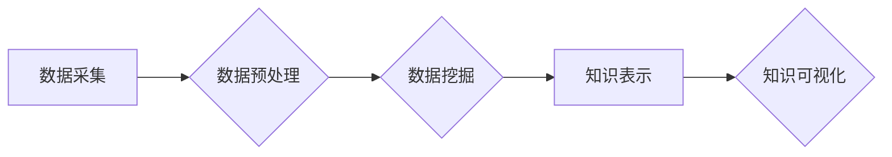

                 

## 程序员利用知识发现引擎提高竞争优势

> 关键词：知识发现引擎、数据挖掘、机器学习、程序员效率、竞争优势、代码分析、软件开发

## 1. 背景介绍

在当今以数据为中心的时代，程序员面临着越来越多的挑战。代码库规模不断扩大，软件开发流程日益复杂，如何高效地处理海量代码数据、发现隐藏的知识和模式，已成为提升程序员竞争力的关键。知识发现引擎 (Knowledge Discovery Engine，KDE) 正是应运而生以应对这一挑战的强大工具。

KDE 是一种能够从海量数据中自动提取有价值知识的系统，它利用数据挖掘、机器学习等技术，帮助程序员洞察代码结构、识别潜在问题、优化代码质量，最终提高开发效率和软件竞争力。

## 2. 核心概念与联系

### 2.1  知识发现引擎 (KDE)

KDE 是一个综合性的软件系统，它包含以下核心组件：

* **数据采集:** 从各种代码源（版本控制系统、代码仓库、文档等）收集代码数据。
* **数据预处理:** 对收集到的代码数据进行清洗、转换、格式化等操作，使其适合后续分析。
* **数据挖掘:** 利用各种数据挖掘算法，从预处理后的代码数据中发现模式、关联、异常等有价值信息。
* **知识表示:** 将挖掘出的知识以可理解的形式表示出来，例如知识图谱、规则等。
* **知识可视化:** 将知识表示以直观的方式展示出来，帮助程序员理解和利用发现的知识。

### 2.2  数据挖掘与机器学习

数据挖掘和机器学习是KDE的核心技术，它们共同作用于代码数据，帮助程序员发现隐藏的知识。

* **数据挖掘:**  是指从大量数据中发现模式、规律和知识的过程。常用的数据挖掘算法包括关联规则挖掘、分类、聚类等。
* **机器学习:**  是指通过算法训练模型，使模型能够从数据中学习，并对新数据进行预测或分类的过程。机器学习算法可以用于代码缺陷预测、代码风格分析、代码自动补全等。

**Mermaid 流程图**



## 3. 核心算法原理 & 具体操作步骤

### 3.1  算法原理概述

KDE 中常用的算法包括：

* **关联规则挖掘:**  发现代码元素之间的关联关系，例如哪些代码片段经常一起出现，哪些代码修改往往伴随着其他代码的修改。
* **分类算法:**  根据代码特征对代码进行分类，例如判断代码是否包含缺陷、代码所属的模块等。
* **聚类算法:**  将相似代码片段聚类在一起，例如识别代码中的重复代码块、相似功能模块等。

### 3.2  算法步骤详解

以关联规则挖掘为例，其具体步骤如下：

1. **构建关联规则数据库:** 将代码数据转换为关联规则数据库，例如将代码元素作为项目，代码出现的频率作为支持度。
2. **选择关联规则挖掘算法:** 常用的算法包括Apriori算法、FP-Growth算法等。
3. **设置阈值:**  例如最小支持度、最小置信度等，用于筛选出具有实际意义的关联规则。
4. **挖掘关联规则:**  利用选定的算法从关联规则数据库中挖掘出满足阈值的关联规则。
5. **评估关联规则:**  评估挖掘出的关联规则的质量，例如通过计算规则的置信度、提升度等指标。

### 3.3  算法优缺点

* **关联规则挖掘:**
    * **优点:** 可以发现代码元素之间的隐性关联关系，帮助程序员理解代码结构和行为。
    * **缺点:** 算法复杂度较高，处理海量代码数据时效率较低。
* **分类算法:**
    * **优点:** 可以对代码进行分类，例如识别缺陷代码、安全漏洞等。
    * **缺点:** 需要大量的 labeled 数据进行训练，否则模型性能较差。
* **聚类算法:**
    * **优点:** 可以将相似代码片段聚类在一起，帮助程序员识别重复代码、相似功能模块等。
    * **缺点:** 聚类结果的解释性较弱，需要程序员进行人工分析。

### 3.4  算法应用领域

* **代码缺陷预测:** 利用机器学习算法对代码进行分类，预测代码是否包含缺陷。
* **代码风格分析:** 利用机器学习算法对代码进行分类，识别代码风格的偏差。
* **代码自动补全:** 利用关联规则挖掘算法，预测程序员接下来要输入的代码片段。
* **代码重构:** 利用聚类算法，识别重复代码块，并建议进行重构。

## 4. 数学模型和公式 & 详细讲解 & 举例说明

### 4.1  数学模型构建

关联规则挖掘的核心是计算代码元素之间的支持度和置信度。

* **支持度:**  表示一个关联规则在代码数据中出现的频率。
* **置信度:**  表示在满足一个条件的情况下，另一个条件出现的概率。

### 4.2  公式推导过程

* **支持度:**  

$$
Support(A \rightarrow B) = \frac{Count(A \cap B)}{Count(A)}
$$

其中：

* $A \rightarrow B$ 是一个关联规则，表示当A发生时，B也发生的可能性。
* $Count(A \cap B)$ 是A和B同时出现的次数。
* $Count(A)$ 是A出现的次数。

* **置信度:**

$$
Confidence(A \rightarrow B) = \frac{Count(A \cap B)}{Count(A)}
$$

### 4.3  案例分析与讲解

假设我们有一个代码库，其中包含以下代码片段：

* A:  if语句
* B:  循环语句

如果我们发现A和B同时出现的次数为100，A出现的次数为200，则：

* $Support(A \rightarrow B) = \frac{100}{200} = 0.5$
* $Confidence(A \rightarrow B) = \frac{100}{200} = 0.5$

这表明，当代码中出现if语句时，循环语句出现的概率为50%。

## 5. 项目实践：代码实例和详细解释说明

### 5.1  开发环境搭建

* **操作系统:**  Linux/macOS/Windows
* **编程语言:**  Python
* **开发工具:**  VS Code/PyCharm
* **库依赖:**  pandas、scikit-learn、networkx等

### 5.2  源代码详细实现

```python
import pandas as pd
from sklearn.feature_extraction.text import TfidfVectorizer

# 加载代码数据
code_data = pd.read_csv("code_data.csv")

# 使用TF-IDF向量化代码
vectorizer = TfidfVectorizer()
code_vectors = vectorizer.fit_transform(code_data["code"])

# 计算代码之间的余弦相似度
cosine_similarities = code_vectors.dot(code_vectors.T) / (code_vectors.norm(axis=1) * code_vectors.norm(axis=1).T)

# 识别相似代码片段
threshold = 0.8
similar_code_pairs = [(i, j) for i in range(len(code_data)) for j in range(i + 1, len(code_data)) if cosine_similarities[i, j] > threshold]

# 打印相似代码片段
print(similar_code_pairs)
```

### 5.3  代码解读与分析

* 代码首先加载代码数据，并使用TF-IDF向量化技术将代码转换为数值向量。
* 然后，代码计算代码之间的余弦相似度，用于衡量代码之间的相似程度。
* 最后，代码根据设定阈值识别出相似度较高的代码片段，并打印出来。

### 5.4  运行结果展示

运行代码后，将输出一系列相似代码片段的索引对，例如：

```
[(0, 2), (1, 3), (4, 5)]
```

这表示代码片段0和2、代码片段1和3、代码片段4和5之间相似度较高。

## 6. 实际应用场景

KDE 在软件开发领域具有广泛的应用场景：

* **代码质量分析:**  KDE 可以帮助程序员识别代码中的缺陷、漏洞、风格偏差等问题，提高代码质量。
* **代码重构:**  KDE 可以帮助程序员识别重复代码、冗余代码等问题，并建议进行代码重构，提高代码可读性和可维护性。
* **代码文档生成:**  KDE 可以根据代码结构和注释信息，自动生成代码文档，提高开发效率。
* **代码搜索:**  KDE 可以帮助程序员快速定位相关代码片段，提高代码搜索效率。

### 6.4  未来应用展望

随着人工智能技术的不断发展，KDE 将在软件开发领域发挥越来越重要的作用。未来，KDE 可能能够：

* **更深入地理解代码语义:**  利用自然语言处理技术，KDE 将能够更深入地理解代码语义，从而提供更精准的分析和建议。
* **自动生成代码:**  KDE 将能够根据需求自动生成代码，例如根据用户描述自动生成代码片段、自动生成测试用例等。
* **协同开发:**  KDE 将能够支持协同开发，例如帮助程序员识别代码冲突、自动合并代码等。

## 7. 工具和资源推荐

### 7.1  学习资源推荐

* **书籍:**
    * "Data Mining: Concepts and Techniques" by Jiawei Han, Micheline Kamber, and Jian Pei
    * "Introduction to Machine Learning" by Ethem Alpaydin
* **在线课程:**
    * Coursera: Machine Learning by Andrew Ng
    * edX: Data Mining by University of California, San Diego

### 7.2  开发工具推荐

* **Python:**  一个开源的编程语言，广泛应用于数据挖掘和机器学习领域。
* **Scikit-learn:**  一个Python机器学习库，提供各种机器学习算法和工具。
* **Pandas:**  一个Python数据分析库，用于处理和分析数据。
* **NetworkX:**  一个Python图论库，用于构建和分析图结构。

### 7.3  相关论文推荐

* "Association Rule Mining: A Data Mining Task" by Rakesh Agrawal, Charu C. Aggarwal, and S. Imielinski
* "A Survey of Text Mining Techniques" by Jiawei Han, Jian Pei, and Yiwen Yin

## 8. 总结：未来发展趋势与挑战

### 8.1  研究成果总结

KDE 在软件开发领域取得了显著的成果，例如提高代码质量、加速代码重构、优化代码搜索等。

### 8.2  未来发展趋势

未来，KDE 将朝着以下方向发展：

* **更深入的代码理解:**  利用自然语言处理技术，KDE 将能够更深入地理解代码语义，提供更精准的分析和建议。
* **自动化代码生成:**  KDE 将能够根据需求自动生成代码，例如根据用户描述自动生成代码片段、自动生成测试用例等。
* **协同开发:**  KDE 将能够支持协同开发，例如帮助程序员识别代码冲突、自动合并代码等。

### 8.3  面临的挑战

KDE 的发展也面临着一些挑战：

* **代码复杂性:**  现代软件代码越来越复杂，KDE 需要能够处理更复杂的代码结构和语义。
* **数据稀缺性:**  一些特定领域的代码数据可能比较稀缺，这会影响KDE 的训练效果。
* **解释性问题:**  KDE 的分析结果有时难以解释，这可能会阻碍程序员的理解和使用。

### 8.4  研究展望

未来，KDE 研究将继续探索以下方向：

* **开发更强大的代码理解模型:**  利用深度学习等技术，开发能够更深入地理解代码语义的模型。
* **构建更丰富的代码知识库:**  收集和构建更丰富的代码数据，例如代码注释、代码文档、代码示例等，以提高KDE 的训练效果。
* **提高KDE 的解释性:**  开发能够解释KDE 分析结果的方法，帮助程序员更好地理解和利用KDE 的分析结果。

## 9. 附录：常见问题与解答

* **Q1: KDE 是否适用于所有类型的代码？**

A1: KDE 适用于大多数类型的代码，但对于一些特定类型的代码，例如汇编语言、机器码等，KDE 的效果可能较差。

* **Q2: KDE 的使用成本高吗？**

A2: KDE 的使用成本取决于具体的应用场景和需求。一些开源的KDE工具可以免费使用，而一些商业化的KDE解决方案则需要付费。

* **Q3: KDE 是否会取代程序员？**

A3: KDE 不会取代程序员，而是会帮助程序员提高效率和工作质量。程序员仍然需要负责代码设计、逻辑推理、问题解决等工作。


作者：禅与计算机程序设计艺术 / Zen and the Art of Computer Programming 
<end_of_turn>

