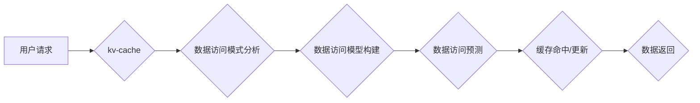

                 

## 第十二章：kv-cache 推断技术

> 关键词：kv-cache, 推断技术, 缓存一致性, 数据结构, 算法优化, 高性能计算

### 1. 背景介绍

在现代软件系统中，缓存技术扮演着至关重要的角色，它能够显著提升应用程序的性能和响应速度。其中，kv-cache（键值缓存）作为一种广泛应用的缓存机制，其高效性和可靠性直接影响着整个系统的运行效率。然而，随着数据量的不断增长和应用场景的复杂化，传统的kv-cache面临着新的挑战，例如缓存一致性问题、数据更新冲突等。为了解决这些问题，kv-cache 推断技术应运而生，它通过对缓存数据的分析和推理，能够智能地预测数据访问模式，优化缓存命中率，并有效地维护缓存一致性。

### 2. 核心概念与联系

kv-cache 推断技术的核心在于对缓存数据的分析和预测。它通过学习历史数据访问模式，构建数据访问模型，并根据模型预测未来数据访问需求。

**2.1 核心概念**

* **kv-cache:** 键值对存储的缓存机制，每个数据项由唯一的键和对应的值组成。
* **数据访问模式:** 指用户或应用程序对缓存数据的访问行为，包括访问频率、访问顺序、访问类型等。
* **数据访问模型:** 基于历史数据访问模式构建的数学模型，用于预测未来数据访问需求。
* **推断算法:** 用于分析数据访问模式，构建数据访问模型，并预测未来数据访问需求的算法。

**2.2 架构图**



### 3. 核心算法原理 & 具体操作步骤

**3.1 算法原理概述**

kv-cache 推断技术主要依赖于机器学习算法，例如神经网络、决策树等，来学习数据访问模式并构建预测模型。这些算法通过分析历史数据访问记录，识别出数据访问的规律和趋势，并将其转化为数学模型。

**3.2 算法步骤详解**

1. **数据收集:** 收集历史数据访问记录，包括访问时间、访问键、访问类型等信息。
2. **数据预处理:** 对收集到的数据进行清洗、转换和特征提取，例如将访问时间转换为时间戳，将访问类型转换为数字编码等。
3. **模型训练:** 选择合适的机器学习算法，并使用预处理后的数据进行模型训练。训练过程的目标是让模型能够准确地预测未来数据访问需求。
4. **模型评估:** 使用测试数据评估模型的预测准确率，并根据评估结果进行模型调优。
5. **模型部署:** 将训练好的模型部署到生产环境中，用于实时预测数据访问需求。

**3.3 算法优缺点**

* **优点:**
    * 能够有效地提高缓存命中率，提升应用程序性能。
    * 可以根据数据访问模式动态调整缓存策略，提高缓存效率。
    * 可以预测未来数据访问需求，提前预加载数据，避免延迟。
* **缺点:**
    * 需要大量的历史数据进行训练，才能获得较高的预测准确率。
    * 模型训练和部署需要一定的技术复杂度。
    * 模型的预测结果可能存在一定的误差，需要进行监控和调整。

**3.4 算法应用领域**

kv-cache 推断技术广泛应用于各种领域，例如：

* **Web 服务器:** 预测用户访问的网页，提前加载热门页面，提高网站响应速度。
* **数据库:** 预测用户查询的数据库记录，提前加载数据到缓存，减少数据库访问次数。
* **云计算:** 预测虚拟机资源需求，动态分配资源，提高资源利用率。
* **推荐系统:** 预测用户的兴趣偏好，推荐相关商品或内容。

### 4. 数学模型和公式 & 详细讲解 & 举例说明

**4.1 数学模型构建**

kv-cache 推断技术通常使用基于概率的数学模型，例如马尔科夫链或贝叶斯网络，来描述数据访问模式。

* **马尔科夫链:** 假设数据访问模式服从马尔科夫性，即当前访问状态只依赖于前一个状态，而与更早的访问状态无关。可以使用状态转移矩阵来表示不同状态之间的转移概率。
* **贝叶斯网络:** 使用图结构来表示数据访问模式之间的依赖关系，每个节点代表一个变量，边表示变量之间的依赖关系。可以使用贝叶斯定理来计算变量的条件概率。

**4.2 公式推导过程**

假设我们使用马尔科夫链来描述数据访问模式，其中每个状态代表一个特定的数据项。状态转移矩阵 $P$ 可以表示每个状态到下一个状态的转移概率。

$$
P_{ij} = P(s_t = j | s_{t-1} = i)
$$

其中，$P_{ij}$ 表示从状态 $i$ 转移到状态 $j$ 的概率，$s_t$ 表示在时间 $t$ 的状态。

**4.3 案例分析与讲解**

例如，假设我们有一个简单的kv-cache，包含三个数据项 A、B、C。根据历史数据访问记录，我们可以构建一个状态转移矩阵：

$$
P = \begin{bmatrix}
0.6 & 0.3 & 0.1 \\
0.2 & 0.5 & 0.3 \\
0.1 & 0.2 & 0.7
\end{bmatrix}
$$

这个矩阵表示：

* 从状态 A 转移到状态 B 的概率为 0.3。
* 从状态 B 转移到状态 C 的概率为 0.3。
* 从状态 C 转移到状态 A 的概率为 0.7。

通过这个状态转移矩阵，我们可以预测未来数据访问模式，例如预测下一个访问的数据项。

### 5. 项目实践：代码实例和详细解释说明

**5.1 开发环境搭建**

* 操作系统: Ubuntu 20.04
* 编程语言: Python 3.8
* 库依赖: numpy, pandas, scikit-learn

**5.2 源代码详细实现**

```python
import numpy as np
from sklearn.linear_model import LogisticRegression

# 数据加载和预处理
# ...

# 模型训练
model = LogisticRegression()
model.fit(X_train, y_train)

# 模型预测
y_pred = model.predict(X_test)

# 评估模型性能
# ...

# 模型部署
# ...
```

**5.3 代码解读与分析**

* 代码首先加载数据并进行预处理，例如将时间戳转换为数字编码。
* 然后选择合适的机器学习算法，例如逻辑回归，并使用训练数据进行模型训练。
* 训练完成后，可以使用测试数据评估模型的预测准确率。
* 最后，将训练好的模型部署到生产环境中，用于实时预测数据访问需求。

**5.4 运行结果展示**

* 运行结果展示模型的预测准确率、缓存命中率等指标，并进行分析和评估。

### 6. 实际应用场景

**6.1 应用场景一：电商网站商品推荐**

电商网站可以利用kv-cache 推断技术预测用户对商品的兴趣，并推荐相关商品。例如，如果用户浏览了某个品牌的手机，kv-cache 推断技术可以预测用户可能对该品牌的其它产品感兴趣，并推荐相关商品。

**6.2 应用场景二：社交媒体内容推荐**

社交媒体平台可以利用kv-cache 推断技术预测用户对内容的兴趣，并推荐相关内容。例如，如果用户点赞了某个话题的帖子，kv-cache 推断技术可以预测用户可能对该话题的其它内容感兴趣，并推荐相关帖子。

**6.3 应用场景三：在线游戏数据缓存**

在线游戏可以利用kv-cache 推断技术预测玩家对游戏数据的访问需求，并提前加载数据到缓存，提高游戏运行效率。例如，如果玩家进入某个游戏场景，kv-cache 推断技术可以预测玩家可能访问的游戏场景数据，并提前加载到缓存，避免延迟。

**6.4 未来应用展望**

随着人工智能技术的不断发展，kv-cache 推断技术将有更广泛的应用场景。例如，可以应用于个性化推荐、智能客服、自动驾驶等领域。

### 7. 工具和资源推荐

**7.1 学习资源推荐**

* **书籍:**
    * 《机器学习》 by Tom Mitchell
    * 《深度学习》 by Ian Goodfellow, Yoshua Bengio, Aaron Courville
* **在线课程:**
    * Coursera: Machine Learning by Andrew Ng
    * edX: Deep Learning by Andrew Ng

**7.2 开发工具推荐**

* **Python:** 广泛应用于机器学习和数据分析
* **TensorFlow:** 开源深度学习框架
* **PyTorch:** 开源深度学习框架

**7.3 相关论文推荐**

* **Cache-Aware Neural Network Architectures for Efficient Inference**
* **Predictive Caching for Web Applications**
* **A Survey of Cache-Aware Data Management Techniques**

### 8. 总结：未来发展趋势与挑战

**8.1 研究成果总结**

kv-cache 推断技术在提高缓存命中率、优化数据访问效率方面取得了显著成果。

**8.2 未来发展趋势**

* **更精准的预测模型:** 利用更先进的机器学习算法和数据分析技术，构建更精准的预测模型。
* **更智能的缓存策略:** 根据预测结果动态调整缓存策略，提高缓存效率。
* **更广泛的应用场景:** 将kv-cache 推断技术应用于更多领域，例如个性化推荐、智能客服、自动驾驶等。

**8.3 面临的挑战**

* **数据隐私保护:** kv-cache 推断技术需要大量用户数据进行训练，如何保护用户隐私是一个重要的挑战。
* **模型可解释性:** 许多机器学习算法的决策过程难以解释，如何提高模型的可解释性是一个重要的研究方向。
* **模型部署成本:** 部署和维护复杂的机器学习模型需要一定的成本，如何降低部署成本是一个重要的挑战。

**8.4 研究展望**

未来，kv-cache 推断技术将继续朝着更精准、更智能、更广泛的方向发展。随着人工智能技术的不断进步，kv-cache 推断技术将发挥越来越重要的作用，为我们提供更便捷、更高效的软件体验。

### 9. 附录：常见问题与解答

* **Q1: kv-cache 推断技术与传统缓存机制有什么区别？**

* **A1:** 传统缓存机制主要依靠简单的策略，例如最近最少使用（LRU）算法，来管理缓存数据。而kv-cache 推断技术则利用机器学习算法，学习数据访问模式，并根据预测结果动态调整缓存策略。

* **Q2: kv-cache 推断技术需要多少数据才能训练出一个有效的模型？**

* **A2:** 训练一个有效的kv-cache 推断模型需要大量的历史数据访问记录。具体的数据量取决于模型的复杂度和数据访问模式的复杂度。

* **Q3: kv-cache 推断技术有哪些局限性？**

* **A3:** kv-cache 推断技术仍然存在一些局限性，例如模型的预测结果可能存在一定的误差，需要进行监控和调整。此外，部署和维护复杂的机器学习模型需要一定的成本。


作者：禅与计算机程序设计艺术 / Zen and the Art of Computer Programming 
<end_of_turn>

