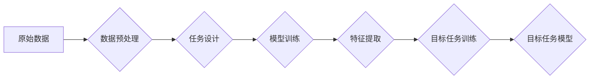

                 

## 自我监督学习在AI发展中的重要性

> 关键词：自我监督学习、无监督学习、监督学习、预训练模型、迁移学习、深度学习、数据效率

## 1. 背景介绍

人工智能（AI）的蓬勃发展离不开海量数据的支撑。传统监督学习方法依赖于人工标注的数据，但标注数据成本高昂且耗时，且在某些领域难以获取。为了解决这一瓶颈，无监督学习和半监督学习应运而生。其中，自我监督学习作为一种新型的无监督学习方法，近年来备受关注。

自我监督学习的核心思想是通过设计特殊的“伪标签”，将无标注数据转化为“伪监督”数据，从而训练模型。这种方法能够有效利用海量无标注数据，提升模型的泛化能力和性能。

## 2. 核心概念与联系

### 2.1  自我监督学习的概念

自我监督学习是一种特殊的无监督学习方法，它通过在未标记数据上构建预测任务来学习数据中的潜在结构和规律。

**核心流程：**

1. **数据预处理:** 对原始数据进行清洗、转换等预处理操作。
2. **任务设计:** 设计一个与目标任务相关的预测任务，例如图像补全、文本预测等。
3. **模型训练:** 使用预训练模型或从头训练模型，在“伪监督”数据上进行训练。
4. **特征提取:** 将训练好的模型用于目标任务的特征提取。
5. **目标任务训练:** 使用提取到的特征进行目标任务的训练。

**流程图：**



### 2.2  自我监督学习与其他学习方法的联系

* **与监督学习的联系:** 自我监督学习借鉴了监督学习的思想，通过设计预测任务来模拟监督学习的过程。
* **与无监督学习的联系:** 自我监督学习属于无监督学习范畴，因为它不需要人工标注数据。
* **与半监督学习的联系:** 自我监督学习可以看作是一种特殊的半监督学习方法，它利用了少量标注数据和大量无标注数据进行训练。

## 3. 核心算法原理 & 具体操作步骤

### 3.1  算法原理概述

自我监督学习的核心在于设计一个能够在无标注数据上进行有效的预测任务。常见的自我监督学习任务包括：

* **图像补全:** 随机遮挡图像的一部分，然后训练模型预测遮挡部分的内容。
* **文本预测:** 在文本序列中遮挡部分词语，然后训练模型预测遮挡部分的词语。
* **对比学习:** 将数据点进行配对，训练模型学习相似数据点之间的关系。

这些任务能够帮助模型学习数据中的潜在结构和规律，从而提升模型的泛化能力。

### 3.2  算法步骤详解

1. **数据准备:** 收集大量无标注数据。
2. **任务设计:** 选择一个与目标任务相关的预测任务。
3. **模型选择:** 选择一个合适的深度学习模型，例如Transformer、CNN等。
4. **模型训练:** 在“伪监督”数据上进行模型训练，优化模型参数。
5. **特征提取:** 使用训练好的模型提取目标任务所需的特征。
6. **目标任务训练:** 使用提取到的特征进行目标任务的训练。

### 3.3  算法优缺点

**优点:**

* **数据效率:** 可以有效利用海量无标注数据进行训练。
* **泛化能力:** 能够提升模型的泛化能力，使其在未见过的数据上表现更好。
* **可迁移性:** 预训练模型可以迁移到其他任务中，降低训练成本。

**缺点:**

* **任务设计:** 需要精心设计预测任务，才能有效学习数据中的潜在结构。
* **训练成本:** 训练大型预训练模型仍然需要大量的计算资源。
* **效果评估:** 评估自我监督学习模型的效果相对复杂，需要考虑多种指标。

### 3.4  算法应用领域

自我监督学习在各个领域都有广泛的应用，例如：

* **计算机视觉:** 图像分类、目标检测、图像分割等。
* **自然语言处理:** 文本分类、情感分析、机器翻译等。
* **语音识别:** 语音识别、语音合成等。
* **推荐系统:** 商品推荐、用户画像等。

## 4. 数学模型和公式 & 详细讲解 & 举例说明

### 4.1  数学模型构建

自我监督学习的数学模型通常基于深度学习框架，例如TensorFlow、PyTorch等。模型的结构可以根据具体的预测任务进行设计，常见的模型结构包括CNN、RNN、Transformer等。

### 4.2  公式推导过程

自我监督学习的训练目标通常是最小化预测误差。例如，在图像补全任务中，训练目标是最小化预测部分和真实部分之间的均方误差。

$$
Loss = \frac{1}{N} \sum_{i=1}^{N} ||\hat{x}_i - x_i||^2
$$

其中：

* $N$ 是样本数量。
* $\hat{x}_i$ 是模型预测的遮挡部分。
* $x_i$ 是真实遮挡部分。

### 4.3  案例分析与讲解

**图像补全任务:**

假设我们有一个图像补全任务，需要预测图像中遮挡部分的内容。我们可以使用一个CNN模型进行训练。

1. 将图像分成两部分，一部分作为输入，一部分作为输出。
2. 在输入部分随机遮挡一部分像素。
3. 使用CNN模型预测遮挡部分的像素值。
4. 计算预测值和真实值之间的均方误差。
5. 使用梯度下降算法优化模型参数，最小化预测误差。

## 5. 项目实践：代码实例和详细解释说明

### 5.1  开发环境搭建

* Python 3.x
* TensorFlow/PyTorch
* CUDA (可选)

### 5.2  源代码详细实现

```python
# 使用TensorFlow实现图像补全任务

import tensorflow as tf

# 定义模型结构
model = tf.keras.models.Sequential([
    tf.keras.layers.Conv2D(32, (3, 3), activation='relu', input_shape=(64, 64, 3)),
    tf.keras.layers.MaxPooling2D((2, 2)),
    tf.keras.layers.Conv2D(64, (3, 3), activation='relu'),
    tf.keras.layers.MaxPooling2D((2, 2)),
    tf.keras.layers.Flatten(),
    tf.keras.layers.Dense(1024, activation='relu'),
    tf.keras.layers.Dense(64 * 64 * 3)
])

# 定义损失函数和优化器
loss_fn = tf.keras.losses.MeanSquaredError()
optimizer = tf.keras.optimizers.Adam()

# 训练模型
model.compile(loss=loss_fn, optimizer=optimizer)
model.fit(x_train, y_train, epochs=10)

# 预测遮挡部分
predictions = model.predict(x_test)
```

### 5.3  代码解读与分析

* 代码首先定义了一个CNN模型，用于预测图像遮挡部分的内容。
* 模型的输入是一个64x64大小的彩色图像，输出是一个64x64大小的彩色图像。
* 损失函数使用均方误差，优化器使用Adam优化器。
* 模型使用训练数据进行训练，训练完成后可以使用预测数据进行预测。

### 5.4  运行结果展示

运行结果展示可以包括预测图像与真实图像的对比，以及预测准确率等指标。

## 6. 实际应用场景

### 6.1  图像修复

利用自我监督学习，可以修复图像中的损坏部分，例如缺失的像素、噪声等。

### 6.2  超分辨率

通过训练模型预测高分辨率图像，可以将低分辨率图像进行放大，提升图像质量。

### 6.3  文本生成

利用文本预测任务，可以训练模型生成高质量的文本，例如文章、故事等。

### 6.4  未来应用展望

自我监督学习在未来将有更广泛的应用，例如：

* **个性化推荐:** 根据用户的行为数据，训练模型推荐个性化的商品或服务。
* **医疗诊断:** 利用医学图像数据，训练模型辅助医生进行诊断。
* **自动驾驶:** 利用道路场景数据，训练模型辅助车辆进行自动驾驶。

## 7. 工具和资源推荐

### 7.1  学习资源推荐

* **书籍:**
    * Deep Learning by Ian Goodfellow, Yoshua Bengio, and Aaron Courville
    * Self-Supervised Learning by Pieter Abbeel and David Silver
* **课程:**
    * Stanford CS231n: Convolutional Neural Networks for Visual Recognition
    * DeepMind's Self-Supervised Learning course

### 7.2  开发工具推荐

* **TensorFlow:** https://www.tensorflow.org/
* **PyTorch:** https://pytorch.org/
* **Keras:** https://keras.io/

### 7.3  相关论文推荐

* **BERT: Pre-training of Deep Bidirectional Transformers for Language Understanding**
* **SimCLR: A Simple Framework for Contrastive Learning of Visual Representations**
* **MoCo: Momentum Contrast for Self-Supervised Learning**

## 8. 总结：未来发展趋势与挑战

### 8.1  研究成果总结

自我监督学习近年来取得了显著进展，在多个领域取得了优异的性能。预训练模型的出现，使得模型的训练成本降低，并提升了模型的泛化能力。

### 8.2  未来发展趋势

* **更有效的任务设计:** 设计更有效的自我监督学习任务，能够更好地学习数据中的潜在结构。
* **模型架构创新:** 探索新的模型架构，例如Transformer的变体，提升模型的性能。
* **跨模态学习:** 将自我监督学习应用于跨模态数据，例如图像和文本的联合学习。

### 8.3  面临的挑战

* **数据质量:** 自我监督学习仍然依赖于高质量的数据，数据噪声和偏差会影响模型的性能。
* **训练效率:** 训练大型预训练模型仍然需要大量的计算资源，如何提高训练效率是重要的挑战。
* **解释性:** 自我监督学习模型的决策过程相对复杂，如何提高模型的解释性也是一个重要的研究方向。

### 8.4  研究展望

自我监督学习是一个充满潜力的研究方向，未来将继续推动人工智能的发展。随着算法和模型的不断改进，自我监督学习将在更多领域得到应用，并为人类社会带来更多价值。

## 9. 附录：常见问题与解答

* **什么是自我监督学习？**

自我监督学习是一种利用无标注数据进行训练的机器学习方法。它通过设计特殊的预测任务，将无标注数据转化为“伪监督”数据，从而训练模型。

* **自我监督学习与监督学习有什么区别？**

监督学习需要人工标注数据，而自我监督学习不需要。

* **自我监督学习有哪些应用场景？**

自我监督学习在图像修复、超分辨率、文本生成等领域都有广泛的应用。

* **如何设计有效的自我监督学习任务？**

有效的自我监督学习任务需要满足以下条件：

* 与目标任务相关
* 能够有效利用无标注数据
* 能够训练出具有泛化能力的模型

* **自我监督学习的未来发展趋势是什么？**

自我监督学习的未来发展趋势包括：

* 更有效的任务设计
* 模型架构创新
* 跨模态学习


作者：禅与计算机程序设计艺术 / Zen and the Art of Computer Programming 
<end_of_turn>

