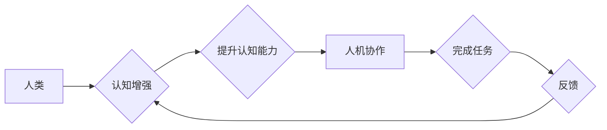

                 

## 认知增强与人机协作：未来工作模式的探索

> 关键词：认知增强、人机协作、人工智能、深度学习、自然语言处理、工作模式、未来趋势

### 1. 背景介绍

随着人工智能（AI）技术的飞速发展，特别是深度学习和自然语言处理领域的突破，我们正处于一个前所未有的时代。AI技术已经开始渗透到各个领域，从医疗保健到金融，从交通运输到娱乐，正在深刻地改变着我们的生活方式。

在工作领域，AI技术也带来了巨大的变革潜力。它可以自动化重复性任务，解放人类的生产力，并为我们提供更智能、更便捷的工作体验。然而，AI技术也带来了新的挑战，例如工作岗位的替代、数据隐私和算法偏见等。

认知增强与人机协作是AI技术发展的重要方向之一。它旨在通过AI技术提升人类的认知能力，帮助人类更高效地完成工作，并与AI系统协同工作，实现更佳的协作效果。

### 2. 核心概念与联系

**2.1 认知增强**

认知增强是指利用AI技术提升人类认知能力的过程。它可以包括以下几个方面：

* **记忆增强:** 利用AI技术帮助人类记忆和检索信息，例如智能笔记、知识图谱等。
* **注意力增强:** 利用AI技术帮助人类集中注意力，提高工作效率，例如专注力训练软件、智能提醒等。
* **决策增强:** 利用AI技术提供数据分析和决策支持，帮助人类做出更明智的决策，例如预测分析、风险评估等。
* **创造力增强:** 利用AI技术激发人类的创造力，例如AI辅助写作、创意设计等。

**2.2 人机协作**

人机协作是指人类和AI系统共同完成任务的过程。它强调人类和AI系统的互补性，发挥各自的优势，实现协同工作。

**2.3 核心概念联系**

认知增强和人机协作是相互促进、相互依赖的关系。认知增强可以为更有效的协作提供基础，而人机协作可以为认知增强提供应用场景和反馈机制。

**Mermaid 流程图**



### 3. 核心算法原理 & 具体操作步骤

**3.1 算法原理概述**

认知增强与人机协作涉及多种AI算法，例如深度学习、自然语言处理、强化学习等。这些算法可以帮助AI系统理解人类语言、识别图像、预测未来趋势等。

**3.2 算法步骤详解**

具体操作步骤取决于具体的应用场景。例如，在智能笔记应用中，AI系统需要首先识别用户的文字输入，然后将其转化为结构化的数据，并将其存储在知识图谱中。当用户需要检索信息时，AI系统可以根据用户的查询关键词，从知识图谱中快速找到相关信息。

**3.3 算法优缺点**

* **优点:**

    * 自动化重复性任务，提高工作效率。
    * 提供数据分析和决策支持，帮助人类做出更明智的决策。
    * 激发人类的创造力，帮助人类解决复杂问题。

* **缺点:**

    * 需要大量的数据进行训练，数据质量直接影响算法性能。
    * 算法可能存在偏见，需要进行仔细的评估和调优。
    * 算法的解释性较差，难以理解AI系统是如何做出决策的。

**3.4 算法应用领域**

* **医疗保健:** 辅助诊断、个性化治疗、药物研发。
* **金融:** 风险评估、欺诈检测、投资决策。
* **教育:** 个性化学习、智能辅导、自动批改作业。
* **制造业:** 自动化生产、质量控制、 predictive maintenance。

### 4. 数学模型和公式 & 详细讲解 & 举例说明

**4.1 数学模型构建**

认知增强与人机协作的数学模型通常基于概率论、统计学和机器学习等理论。例如，在自然语言处理领域，可以使用词嵌入模型来表示单词的语义关系，并构建语言模型来预测文本的下一个词。

**4.2 公式推导过程**

例如，在深度学习领域，常用的激活函数是ReLU函数，其公式如下：

$$f(x) = max(0, x)$$

ReLU函数的推导过程基于神经元的生物学启发，它模拟了神经元的“开闭”机制。当输入值大于0时，ReLU函数输出输入值本身；当输入值小于0时，ReLU函数输出0。

**4.3 案例分析与讲解**

例如，在智能助手领域，可以使用贝叶斯网络来建模用户与系统的交互过程。贝叶斯网络可以表示用户的问题、系统的回答以及两者之间的概率关系。通过训练贝叶斯网络，可以使智能助手更好地理解用户的意图，并提供更准确的回答。

### 5. 项目实践：代码实例和详细解释说明

**5.1 开发环境搭建**

* Python 3.x
* TensorFlow 或 PyTorch 深度学习框架
* NLTK 自然语言处理库
* Jupyter Notebook 开发环境

**5.2 源代码详细实现**

以下是一个简单的自然语言处理示例代码，使用NLTK库对文本进行分词：

```python
import nltk

text = "This is a sample text for demonstration."

tokens = nltk.word_tokenize(text)

print(tokens)
```

**5.3 代码解读与分析**

* `nltk.word_tokenize(text)` 函数使用NLTK库中的词元化算法对文本进行分词，将文本分割成单词或短语。
* `print(tokens)` 函数打印分词后的结果。

**5.4 运行结果展示**

```
['This', 'is', 'a', 'sample', 'text', 'for', 'demonstration', '.']
```

### 6. 实际应用场景

**6.1 智能客服**

AI驱动的智能客服可以自动回答用户常见问题，例如订单查询、退换货流程等，提高客户服务效率。

**6.2 个性化推荐**

AI系统可以根据用户的历史行为和偏好，推荐个性化的产品、服务或内容，例如电商平台的商品推荐、音乐平台的歌曲推荐等。

**6.3 自动化办公**

AI可以自动化许多重复性办公任务，例如邮件分类、日程安排、文档处理等，解放人类的工作时间，提高工作效率。

**6.4 未来应用展望**

随着AI技术的不断发展，认知增强与人机协作将在更多领域得到应用，例如：

* **医疗保健:** AI辅助手术、远程医疗、个性化治疗方案。
* **教育:** 智能辅导系统、个性化学习路径、自动批改作业。
* **交通运输:** 自动驾驶汽车、智能交通管理系统。
* **艺术创作:** AI辅助写作、音乐创作、绘画创作。

### 7. 工具和资源推荐

**7.1 学习资源推荐**

* **书籍:**

    * 《深度学习》
    * 《人工智能：一种现代方法》
    * 《机器学习实战》

* **在线课程:**

    * Coursera
    * edX
    * Udacity

**7.2 开发工具推荐**

* **Python:** 广泛应用于AI开发，拥有丰富的库和框架。
* **TensorFlow:** Google开发的开源深度学习框架。
* **PyTorch:** Facebook开发的开源深度学习框架。
* **Jupyter Notebook:** 用于代码编写、数据分析和可视化。

**7.3 相关论文推荐**

* **Attention Is All You Need**
* **BERT: Pre-training of Deep Bidirectional Transformers for Language Understanding**
* **Generative Adversarial Networks**

### 8. 总结：未来发展趋势与挑战

**8.1 研究成果总结**

认知增强与人机协作领域取得了显著的进展，例如深度学习算法的突破、自然语言处理技术的进步、强化学习的应用等。这些成果为人类工作方式的变革提供了技术基础。

**8.2 未来发展趋势**

* **更智能的AI系统:** AI系统将更加智能，能够更好地理解人类语言、识别图像、预测未来趋势等。
* **更广泛的应用场景:** 认知增强与人机协作将应用于更多领域，例如医疗保健、教育、交通运输等。
* **更人性化的交互体验:** 人机交互将更加自然、人性化，例如语音交互、体感交互等。

**8.3 面临的挑战**

* **数据隐私和安全:** AI系统需要大量的数据进行训练，如何保护用户数据隐私和安全是一个重要的挑战。
* **算法偏见:** AI算法可能存在偏见，需要进行仔细的评估和调优，避免造成不公平的结果。
* **伦理问题:** AI技术的应用引发了一些伦理问题，例如工作岗位的替代、算法的透明度等，需要进行深入的探讨和研究。

**8.4 研究展望**

未来，我们需要继续加强对认知增强与人机协作领域的 research，探索更智能、更安全、更人性化的AI系统，并积极应对AI技术带来的挑战，确保AI技术造福人类。

### 9. 附录：常见问题与解答

**9.1 如何选择合适的AI算法？**

选择合适的AI算法取决于具体的应用场景和数据特点。例如，对于文本分类任务，可以使用支持向量机（SVM）或深度学习算法；对于图像识别任务，可以使用卷积神经网络（CNN）。

**9.2 如何解决AI算法的偏见问题？**

可以采用以下方法解决AI算法的偏见问题：

* 使用更加多样化的训练数据。
* 对训练数据进行预处理，去除潜在的偏见信息。
* 使用公平性评估指标，评估算法的公平性。
* 开发新的算法，例如公平学习算法。

**9.3 如何确保AI系统的安全性和可靠性？**

可以采用以下方法确保AI系统的安全性和可靠性：

* 使用安全的训练数据和开发环境。
* 对AI系统进行严格的测试和评估。
* 开发安全性和可靠性方面的监控机制。
* 遵循相关的安全和隐私标准。


作者：禅与计算机程序设计艺术 / Zen and the Art of Computer Programming 
<end_of_turn>

