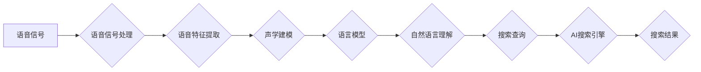

                 

## 语音识别在AI搜索中的应用

> 关键词：语音识别、自然语言处理、AI搜索、深度学习、Transformer模型、语音特征提取、声学建模、语言模型、端到端训练、用户体验

## 1. 背景介绍

随着智能手机、智能音箱等语音交互设备的普及，语音识别技术已成为人工智能领域的重要研究方向之一。语音识别技术能够将语音信号转换为文本，为用户提供更加便捷、直观的搜索体验。AI搜索引擎，作为搜索引擎的升级版，利用人工智能技术，例如深度学习、自然语言处理等，能够更精准地理解用户意图，并提供更相关、更有价值的搜索结果。将语音识别技术与AI搜索引擎相结合，可以大幅提升用户搜索效率和体验。

传统的文本搜索引擎依赖于用户输入的关键词进行搜索，而语音识别技术可以将用户的语音指令转换为文本，从而实现对语音搜索的处理。这对于那些不便于输入文本的用户，例如老年人、残疾人等，提供了更加便捷的搜索方式。此外，语音搜索还可以更自然地理解用户的搜索意图，例如用户可以利用自然语言进行搜索，而不必像文本搜索那样精确地输入关键词。

## 2. 核心概念与联系

语音识别在AI搜索中的应用主要涉及以下几个核心概念：

* **语音信号处理:** 将语音信号转换为数字信号，并进行预处理，例如降噪、增益调整等。
* **语音特征提取:** 从语音信号中提取关键特征，例如梅尔频率倒谱系数（MFCC）、线性预测系数（LPC）等，用于识别语音的类别和内容。
* **声学建模:** 建立语音信号与文本的映射关系，即预测给定语音信号对应的文本序列。
* **语言模型:** 预测文本序列的概率分布，用于提高语音识别的准确率和流畅度。
* **自然语言理解:** 理解用户的语音指令，识别用户的搜索意图，并将其转换为可执行的搜索查询。

**Mermaid 流程图:**



## 3. 核心算法原理 & 具体操作步骤

### 3.1  算法原理概述

语音识别算法的核心是将语音信号转换为文本序列。常用的语音识别算法包括：

* **隐马尔可夫模型（HMM）:** 基于统计模型，假设语音信号是多个音素的序列，并利用马尔可夫链的性质进行概率计算。
* **条件随机场（CRF）:** 是一种概率模型，可以处理序列标注问题，例如语音识别。CRF能够更好地捕捉语音信号之间的上下文关系。
* **深度学习:** 利用多层神经网络进行语音识别，例如卷积神经网络（CNN）、循环神经网络（RNN）和Transformer模型等。深度学习算法能够学习更复杂的语音特征，从而提高语音识别的准确率。

### 3.2  算法步骤详解

以深度学习算法为例，语音识别的具体操作步骤如下：

1. **语音信号预处理:** 对语音信号进行降噪、增益调整、分帧等处理，以提高语音信号的质量。
2. **语音特征提取:** 使用MFCC、LPC等方法提取语音信号的特征向量。
3. **声学建模:** 利用CNN、RNN或Transformer模型训练一个声学模型，将语音特征向量映射到对应的文本序列。
4. **语言模型训练:** 利用大量的文本数据训练一个语言模型，预测文本序列的概率分布。
5. **端到端训练:** 将声学模型和语言模型联合训练，实现语音识别任务的端到端训练。

### 3.3  算法优缺点

**深度学习算法:**

* **优点:** 能够学习更复杂的语音特征，提高语音识别的准确率。
* **缺点:** 需要大量的训练数据，训练时间较长，计算资源需求较高。

**HMM和CRF算法:**

* **优点:** 训练数据需求较低，训练时间较短，计算资源需求较低。
* **缺点:** 难以捕捉语音信号之间的上下文关系，语音识别准确率相对较低。

### 3.4  算法应用领域

语音识别算法广泛应用于以下领域：

* **智能语音助手:** 例如Siri、Alexa、Google Assistant等，可以理解用户的语音指令，并执行相应的操作。
* **语音搜索:** 可以将用户的语音搜索转换为文本查询，并返回相关结果。
* **语音翻译:** 可以将语音信号翻译成另一种语言。
* **语音识别系统:** 用于自动转录语音文件，例如会议记录、采访录音等。

## 4. 数学模型和公式 & 详细讲解 & 举例说明

### 4.1  数学模型构建

语音识别算法通常使用概率模型来描述语音信号与文本之间的关系。常用的概率模型包括HMM、CRF和神经网络模型。

**HMM模型:**

HMM模型假设语音信号是由多个隐含状态组成的序列，每个状态对应一个音素。模型使用状态转移概率矩阵和观测概率矩阵来描述语音信号的生成过程。

**CRF模型:**

CRF模型是一种概率图模型，可以处理序列标注问题。CRF模型使用特征函数和权重来描述语音信号与文本之间的关系，并利用最大似然估计方法训练模型参数。

**神经网络模型:**

神经网络模型使用多层神经网络来学习语音信号的特征和文本的表示。常用的神经网络模型包括CNN、RNN和Transformer模型。

### 4.2  公式推导过程

**HMM模型的概率计算:**

给定语音信号 $O = (o_1, o_2, ..., o_T)$ 和状态序列 $Q = (q_1, q_2, ..., q_T)$，HMM模型的概率计算公式为：

$$P(O|Q) = \prod_{t=1}^{T} P(o_t|q_t)$$

$$P(Q) = \prod_{t=1}^{T-1} P(q_{t+1}|q_t)$$

$$P(O) = \sum_{Q} P(O|Q)P(Q)$$

其中，$P(o_t|q_t)$ 是给定状态 $q_t$ 下观测 $o_t$ 的概率，$P(q_{t+1}|q_t)$ 是状态 $q_t$ 到状态 $q_{t+1}$ 的转移概率。

**CRF模型的概率计算:**

CRF模型的概率计算公式为：

$$P(Y|X) = \frac{1}{Z(X)} \exp \left( \sum_{i=1}^{n} \sum_{k=1}^{K} \lambda_k f_k(x_i, y_i) \right)$$

其中，$Y$ 是文本序列，$X$ 是语音信号，$Z(X)$ 是归一化因子，$\lambda_k$ 是特征函数 $f_k$ 的权重。

### 4.3  案例分析与讲解

**语音识别系统训练案例:**

假设我们训练一个语音识别系统，用于识别数字“0”到“9”。我们可以使用大量的数字语音数据进行训练，并使用CNN模型进行声学建模。训练过程中，模型会学习数字语音的特征，并将其映射到对应的数字文本。

**语音搜索案例:**

当用户使用语音搜索引擎搜索“天气预报”时，语音识别系统会将用户的语音指令转换为文本查询“天气预报”。然后，AI搜索引擎会根据用户的地理位置和历史搜索记录，返回相关的天气预报信息。

## 5. 项目实践：代码实例和详细解释说明

### 5.1  开发环境搭建

语音识别项目开发环境通常需要以下软件：

* **操作系统:** Linux、Windows或macOS
* **编程语言:** Python
* **深度学习框架:** TensorFlow、PyTorch或Keras
* **语音处理库:** Librosa、SpeechRecognition等

### 5.2  源代码详细实现

以下是一个使用Python和PyTorch实现简单的语音识别模型的代码示例：

```python
import torch
import torch.nn as nn

class SimpleSpeechRecognizer(nn.Module):
    def __init__(self, input_size, hidden_size, output_size):
        super(SimpleSpeechRecognizer, self).__init__()
        self.fc1 = nn.Linear(input_size, hidden_size)
        self.relu = nn.ReLU()
        self.fc2 = nn.Linear(hidden_size, output_size)

    def forward(self, x):
        x = self.fc1(x)
        x = self.relu(x)
        x = self.fc2(x)
        return x

# 实例化模型
model = SimpleSpeechRecognizer(input_size=128, hidden_size=64, output_size=10)

# 定义损失函数和优化器
criterion = nn.CrossEntropyLoss()
optimizer = torch.optim.Adam(model.parameters(), lr=0.001)

# 训练模型
for epoch in range(10):
    # 训练数据
    inputs = torch.randn(100, 128)
    targets = torch.randint(0, 10, (100,))

    # 前向传播
    outputs = model(inputs)

    # 计算损失
    loss = criterion(outputs, targets)

    # 反向传播
    optimizer.zero_grad()
    loss.backward()

    # 更新参数
    optimizer.step()

# 保存模型
torch.save(model.state_dict(), 'speech_recognizer.pth')
```

### 5.3  代码解读与分析

这段代码实现了一个简单的语音识别模型，使用PyTorch框架进行开发。

* **模型结构:** 模型使用两层全连接神经网络，第一层输入维度为128，隐藏层维度为64，输出层维度为10，对应数字“0”到“9”。
* **损失函数:** 使用交叉熵损失函数，用于计算模型预测结果与真实标签之间的差异。
* **优化器:** 使用Adam优化器，用于更新模型参数。
* **训练过程:** 模型训练使用随机生成的输入数据和标签进行训练，训练过程包括前向传播、损失计算、反向传播和参数更新。
* **模型保存:** 训练完成后，模型参数会被保存到文件“speech_recognizer.pth”。

### 5.4  运行结果展示

运行这段代码后，模型会进行训练，并最终能够识别数字“0”到“9”。

## 6. 实际应用场景

### 6.1  智能语音助手

语音助手可以理解用户的语音指令，并执行相应的操作，例如播放音乐、设置闹钟、发送短信等。语音识别技术是语音助手的核心技术，能够使用户更方便地与智能设备进行交互。

### 6.2  语音搜索

语音搜索引擎可以理解用户的语音搜索指令，并返回相关的搜索结果。语音搜索可以提供更便捷的搜索体验，尤其是在用户无法输入文本的情况下，例如驾驶汽车、运动等。

### 6.3  语音翻译

语音翻译系统可以将语音信号从一种语言翻译成另一种语言。语音识别技术是语音翻译系统的关键技术，能够将语音信号转换为文本，然后进行翻译。

### 6.4  未来应用展望

语音识别技术在未来将有更广泛的应用场景，例如：

* **医疗保健:** 用于语音诊断、远程医疗等。
* **教育:** 用于语音朗读、语音识别作业等。
* **金融:** 用于语音支付、语音客服等。
* **娱乐:** 用于语音游戏、语音互动等。

## 7. 工具和资源推荐

### 7.1  学习资源推荐

* **书籍:**
    * Speech and Language Processing by Jurafsky and Martin
    * Deep Learning by Goodfellow, Bengio, and Courville
* **在线课程:**
    * Coursera: Natural Language Processing Specialization
    * Udacity: Deep Learning Nanodegree
* **博客和网站:**
    * Google AI Blog
    * OpenAI Blog
    * Towards Data Science

### 7.2  开发工具推荐

* **深度学习框架:** TensorFlow、PyTorch、Keras
* **语音处理库:** Librosa、SpeechRecognition
* **云平台:** AWS、Google Cloud、Azure

### 7.3  相关论文推荐

* **Transformer模型:**
    * Attention Is All You Need (Vaswani et al., 2017)
* **语音识别:**
    * Deep Speech 2: End-to-End Speech Recognition in English and Mandarin (Amodei et al., 2016)
    * wav2vec 2.0: A Framework for Self-Supervised Learning of Speech Representations (Baevski et al., 2020)

## 8. 总结：未来发展趋势与挑战

### 8.1  研究成果总结

语音识别技术近年来取得了显著进展，特别是深度学习技术的应用，使得语音识别准确率大幅提升。Transformer模型的出现，进一步推动了语音识别的发展，能够学习更复杂的语音特征，并实现端到端的语音识别。

### 8.2  未来发展趋势

未来语音识别技术的发展趋势包括：

* **更准确的语音识别:** 随着深度学习技术的不断发展，语音识别准确率将继续提升，能够更好地理解用户的语音指令。
* **更低资源的语音识别:** 研究更轻量级的语音识别模型，能够在低资源环境下也能进行语音识别。
* **多语言语音识别:** 研究能够识别多种语言的语音识别系统，满足全球用户的需求。
* **个性化语音识别:** 研究能够根据用户的语音特征进行个性化语音识别的系统，提高语音识别准确率。

### 8.3  面临的挑战

语音识别技术仍然面临一些挑战，例如：

* **噪声环境下的语音识别:** 噪声环境会影响语音识别的准确率，需要开发更 robust 的语音识别算法。
* **方言和口音识别:** 不同地区的方言和口音会影响语音识别的准确率，需要开发能够识别多种方言和口音的语音识别系统。
* **语音合成:** 语音合成技术与语音识别技术密切相关，需要进一步发展，才能实现更自然、更流畅的语音交互。

### 8.4  研究展望

未来，语音识别技术将继续发展，并与其他人工智能技术相结合，例如自然语言理解、机器学习等，为用户提供更智能、更便捷的语音交互体验。


## 9. 附录：常见问题与解答

**常见问题:**

* **语音识别准确率如何提高？**

**解答:**

语音识别准确率可以通过以下方式提高：

* 使用更强大的深度学习模型。
* 使用更大的训练数据集。
* 使用更有效的语音特征提取方法。
* 使用更先进的语音增强技术。

* **如何选择合适的语音识别算法？**

**解答:**

选择合适的语音识别算法取决于具体的应用场景和需求。

* **HMM和CRF算法:** 适用于资源有限的场景，例如嵌入式设备。
* **深度学习算法:** 适用于高准确率需求的场景，例如语音助手、语音搜索。

* **如何搭建语音识别开发环境？**

**解答:**

搭建语音识别开发环境需要以下步骤：

1. 安装操作系统、编程语言和深度学习框架。
2. 安装语音处理库。
3. 下载语音数据集。
4. 设置开发环境变量。

**作者：禅与计算机程序设计艺术 / Zen and the Art of Computer Programming**<end_of_turn>

