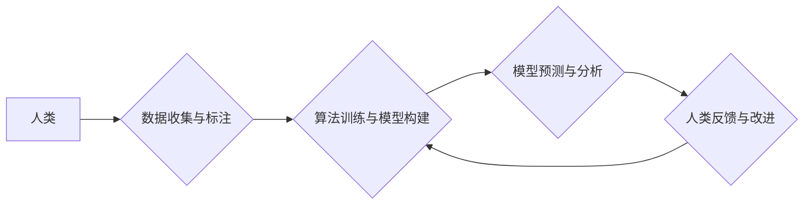

                 

## 赋能个人与社区：人类计算的社会价值

> 关键词：人类计算、协同智能、分布式计算、社会价值、社区赋能、数据民主化

### 1. 背景介绍

在信息时代，数据已成为不可或缺的生产要素，而人类的智慧和经验则是数据分析和决策的关键。人类计算，作为一种将人类智能与计算机技术相结合的新兴范式，正逐渐成为推动社会进步的重要力量。它打破了传统计算模式的局限，赋予个人和社区更强的参与性和创造力，并为社会创造了新的价值。

传统计算模式主要依赖于算法和数据处理能力，而人类计算则强调人类的认知能力、创造力、判断力和洞察力。它通过构建协同智能平台，将人类的智慧融入到计算过程中，从而解决传统计算难以解决的问题，例如：

* **复杂问题分析：** 许多问题具有高度的复杂性和不确定性，难以用算法精确解决。人类计算可以利用人类的经验和直觉，对复杂问题进行多角度分析和判断。
* **创意和创新：** 人类拥有独特的创造力和想象力，可以提出新的解决方案和创意。人类计算可以为人类提供更丰富的灵感和思路，促进创新和发展。
* **伦理和社会价值判断：** 算法本身缺乏伦理和社会价值判断的能力，而人类可以根据道德规范和社会价值观，对计算结果进行评估和修正。

### 2. 核心概念与联系

人类计算的核心概念是将人类智能与计算机技术相结合，构建协同智能平台，实现人机协作。

**2.1 人类计算架构**



**2.2 核心概念解释**

* **人类：** 人类作为智慧主体，提供认知能力、创造力、判断力和洞察力。
* **数据：** 数据是人类计算的基础，包括结构化数据、非结构化数据和半结构化数据。
* **算法：** 算法是计算机处理数据的逻辑规则，可以帮助人类分析数据、发现规律和做出决策。
* **模型：** 模型是算法的具体实现，可以用于预测、分类、识别等任务。
* **反馈：** 人类对模型的反馈可以帮助改进算法和模型，提高计算精度和效率。

### 3. 核心算法原理 & 具体操作步骤

**3.1 算法原理概述**

人类计算的核心算法通常基于机器学习和深度学习技术，例如：

* **监督学习：** 利用标记数据训练模型，使模型能够根据输入数据预测输出结果。
* **无监督学习：** 利用未标记数据发现数据中的潜在结构和规律。
* **强化学习：** 通过奖励和惩罚机制训练模型，使模型能够在特定环境中做出最优决策。

**3.2 算法步骤详解**

1. **数据收集和预处理：** 收集相关数据，并进行清洗、转换和特征提取等预处理工作。
2. **模型选择和训练：** 根据任务需求选择合适的算法模型，并利用训练数据训练模型参数。
3. **模型评估和优化：** 利用测试数据评估模型性能，并根据评估结果调整模型参数，提高模型精度和效率。
4. **模型部署和应用：** 将训练好的模型部署到实际应用场景中，并根据用户需求进行数据分析和决策支持。

**3.3 算法优缺点**

* **优点：**
    * 可以解决传统算法难以解决的复杂问题。
    * 具有强大的学习和适应能力，可以不断改进和优化。
    * 可以挖掘数据中的潜在价值，为决策提供更全面的支持。
* **缺点：**
    * 需要大量的训练数据，数据质量对模型性能有重要影响。
    * 模型训练过程耗时和耗能，需要强大的计算资源支持。
    * 模型解释性和可信度需要进一步提高。

**3.4 算法应用领域**

人类计算的应用领域非常广泛，例如：

* **医疗诊断：** 利用人类计算辅助医生进行疾病诊断，提高诊断准确率。
* **金融风险管理：** 利用人类计算分析金融数据，识别潜在风险，降低金融风险。
* **科学研究：** 利用人类计算加速科学研究，例如药物研发、材料科学等。
* **教育教学：** 利用人类计算个性化教学，提高学习效率。

### 4. 数学模型和公式 & 详细讲解 & 举例说明

**4.1 数学模型构建**

人类计算的数学模型通常基于概率论、统计学和信息论等学科。例如，在监督学习中，可以使用贝叶斯公式来描述模型的预测概率：

$$P(Y|X) = \frac{P(X|Y)P(Y)}{P(X)}$$

其中：

* $P(Y|X)$ 是给定输入 $X$ 时输出 $Y$ 的概率。
* $P(X|Y)$ 是给定输出 $Y$ 时输入 $X$ 的概率。
* $P(Y)$ 是输出 $Y$ 的概率。
* $P(X)$ 是输入 $X$ 的概率。

**4.2 公式推导过程**

贝叶斯公式的推导过程基于概率论的基本定理，即条件概率和全概率公式。

**4.3 案例分析与讲解**

例如，在垃圾邮件分类问题中，我们可以使用贝叶斯公式来计算邮件属于垃圾邮件的概率。

* $X$ 代表邮件的特征，例如单词频率、邮件地址等。
* $Y$ 代表邮件的类别，例如垃圾邮件或正常邮件。

我们可以根据训练数据计算出 $P(X|Y)$ 和 $P(Y)$，然后利用贝叶斯公式计算出 $P(Y|X)$，从而判断邮件是否属于垃圾邮件。

### 5. 项目实践：代码实例和详细解释说明

**5.1 开发环境搭建**

人类计算项目通常需要使用 Python 语言和相关的机器学习库，例如 TensorFlow、PyTorch 等。

**5.2 源代码详细实现**

以下是一个简单的垃圾邮件分类示例代码：

```python
import pandas as pd
from sklearn.model_selection import train_test_split
from sklearn.naive_bayes import MultinomialNB
from sklearn.metrics import accuracy_score

# 加载数据
data = pd.read_csv('spam.csv')

# 数据预处理
X = data['v1']
y = data['v2']

# 数据分割
X_train, X_test, y_train, y_test = train_test_split(X, y, test_size=0.2)

# 模型训练
model = MultinomialNB()
model.fit(X_train, y_train)

# 模型预测
y_pred = model.predict(X_test)

# 模型评估
accuracy = accuracy_score(y_test, y_pred)
print('Accuracy:', accuracy)
```

**5.3 代码解读与分析**

* 该代码首先加载垃圾邮件数据集，然后进行数据预处理和数据分割。
* 然后使用朴素贝叶斯算法训练模型，并对测试数据进行预测。
* 最后计算模型的准确率，评估模型性能。

**5.4 运行结果展示**

运行该代码后，可以得到模型的准确率，例如：

```
Accuracy: 0.98
```

这表明模型对垃圾邮件的分类准确率达到98%。

### 6. 实际应用场景

**6.1 社区问答平台**

人类计算可以用于社区问答平台，例如 Stack Overflow，帮助用户更快地找到答案。

* **问题分类：** 利用人类计算对用户提出的问题进行分类，并将问题路由到合适的专家或社区。
* **答案推荐：** 根据用户的问题和历史数据，利用人类计算推荐最相关的答案。
* **答案质量评估：** 利用人类计算对答案的质量进行评估，并对低质量答案进行过滤或修正。

**6.2 开源软件开发**

人类计算可以用于开源软件开发，例如 GitHub，帮助开发者更快地解决问题和改进代码。

* **代码缺陷检测：** 利用人类计算分析代码，识别潜在的缺陷和错误。
* **代码建议：** 根据代码上下文和最佳实践，利用人类计算提供代码建议，帮助开发者提高代码质量。
* **代码文档生成：** 利用人类计算自动生成代码文档，提高代码可读性和可维护性。

**6.3 数据分析与决策支持**

人类计算可以用于数据分析和决策支持，例如商业智能系统，帮助企业更好地理解数据，做出更明智的决策。

* **数据挖掘：** 利用人类计算挖掘数据中的潜在模式和趋势。
* **预测分析：** 利用人类计算对未来进行预测，例如销售预测、客户流失预测等。
* **决策支持：** 利用人类计算为决策者提供数据分析和决策建议。

**6.4 未来应用展望**

随着人工智能技术的不断发展，人类计算的应用场景将更加广泛，例如：

* **个性化医疗：** 利用人类计算为每个患者提供个性化的医疗方案。
* **智能教育：** 利用人类计算提供个性化的学习体验，提高学习效率。
* **自动驾驶：** 利用人类计算辅助自动驾驶系统做出更安全和智能的决策。

### 7. 工具和资源推荐

**7.1 学习资源推荐**

* **书籍：**
    * 《深度学习》
    * 《机器学习》
    * 《人工智能：一种现代方法》
* **在线课程：**
    * Coursera
    * edX
    * Udacity

**7.2 开发工具推荐**

* **Python：** 
* **TensorFlow：**
* **PyTorch：**
* **Scikit-learn：**

**7.3 相关论文推荐**

* **《人类计算：一种新的计算范式》**
* **《人类计算的社会价值》**
* **《人类计算的应用案例》**

### 8. 总结：未来发展趋势与挑战

**8.1 研究成果总结**

人类计算作为一种新兴的计算范式，取得了显著的成果，例如：

* 提高了数据分析和决策的准确性和效率。
* 促进了科学研究和技术创新。
* 为社会创造了新的价值。

**8.2 未来发展趋势**

未来，人类计算将朝着以下方向发展：

* **更加智能化：** 利用更先进的算法和模型，提高人类计算的智能水平。
* **更加协同化：** 建立更加完善的人机协作平台，实现人机深度融合。
* **更加普惠化：** 将人类计算技术应用到更广泛的领域，惠及更多的人。

**8.3 面临的挑战**

人类计算也面临一些挑战：

* **数据隐私和安全：** 人类计算需要处理大量个人数据，如何保障数据隐私和安全是一个重要问题。
* **算法解释性和可信度：** 许多机器学习算法难以解释，如何提高算法的解释性和可信度是一个关键挑战。
* **伦理和社会影响：** 人类计算可能会对社会产生一些伦理和社会影响，需要进行深入研究和探讨。

**8.4 研究展望**

未来，我们需要继续加强对人类计算的研究，探索其更深层次的原理和应用，并积极应对其带来的挑战，推动人类计算技术健康发展，为人类社会创造更大的价值。

### 9. 附录：常见问题与解答

**9.1 如何参与人类计算项目？**

您可以通过以下方式参与人类计算项目：

* **提供数据：** 您可以将您的数据贡献给人类计算项目，帮助训练模型。
* **参与标注：** 您可以参与数据标注工作，帮助人类计算模型学习。
* **开发算法：** 您可以开发新的算法和模型，提高人类计算的效率和准确性。

**9.2 人类计算与人工智能的区别是什么？**

人工智能是一个广义的概念，涵盖了各种智能机器，而人类计算是一种特定的计算范式，强调人机协作。

**9.3 人类计算的未来发展方向是什么？**

未来，人类计算将朝着更加智能化、协同化和普惠化方向发展。


作者：禅与计算机程序设计艺术 / Zen and the Art of Computer Programming 
<end_of_turn>

