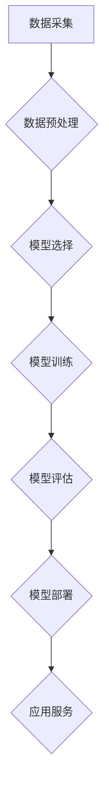

                 

## 零基础快速掌握AI开发

> 关键词：人工智能、机器学习、深度学习、神经网络、算法、编程、Python、TensorFlow

### 1. 背景介绍

人工智能（AI）正以惊人的速度发展，它正在改变着我们生活的方方面面，从医疗保健到金融，从交通运输到娱乐。AI技术已经渗透到我们的日常生活，例如智能语音助手、个性化推荐系统、自动驾驶汽车等。

随着AI技术的普及，对AI开发人才的需求也越来越高。然而，许多人对AI开发感到困惑，认为它需要深厚的数学和编程基础。实际上，只要掌握一些基本概念和工具，即使是零基础的学习者也能快速入门AI开发。

本篇文章将以通俗易懂的语言，带领读者快速了解AI开发的基本概念、核心算法、实践步骤以及应用场景，帮助读者快速掌握AI开发技能。

### 2. 核心概念与联系

**2.1  人工智能（AI）**

人工智能是指使机器能够像人类一样思考、学习和解决问题的能力。AI的目标是创建能够理解、学习和交互的人工智能系统，使其能够执行人类智能任务，例如：

* **学习和推理：**从数据中学习模式和知识，并根据这些知识进行推理和决策。
* **自然语言处理：**理解和生成人类语言，例如文本翻译、语音识别和对话系统。
* **计算机视觉：**理解和解释图像和视频，例如物体识别、图像分类和场景理解。
* **机器人控制：**控制机器人的运动和行为，例如自主导航和物体抓取。

**2.2  机器学习（ML）**

机器学习是人工智能的一个子领域，它专注于让机器从数据中学习，无需明确编程。机器学习算法通过分析数据，识别模式和规律，从而提高其对新数据的预测和决策能力。

**2.3  深度学习（DL）**

深度学习是机器学习的一个子领域，它使用多层神经网络来模拟人类大脑的学习过程。深度学习算法能够学习更复杂的模式和特征，从而在图像识别、自然语言处理等领域取得突破性进展。

**2.4  神经网络**

神经网络是深度学习的基础，它由多个相互连接的神经元组成。每个神经元接收输入信号，对其进行处理，并输出信号。神经网络通过调整神经元之间的连接权重，学习数据中的模式和规律。

**2.5  算法**

算法是解决特定问题的步骤或规则。在AI开发中，算法是实现机器学习和深度学习的关键。不同的算法适用于不同的任务和数据类型。

**2.6  编程**

编程是使用计算机语言编写程序的过程。在AI开发中，需要使用编程语言来实现算法，构建模型，并与数据进行交互。

**2.7  数据**

数据是AI开发的基础。机器学习和深度学习算法需要大量的数据进行训练，才能学习到有效的模式和规律。

**2.8  工具和框架**

为了简化AI开发过程，许多工具和框架被开发出来，例如TensorFlow、PyTorch、Keras等。这些工具和框架提供了预先训练好的模型、高效的计算引擎和易于使用的API，帮助开发者快速构建和部署AI应用。

**2.9  流程图**



### 3. 核心算法原理 & 具体操作步骤

**3.1  算法原理概述**

机器学习算法可以分为监督学习、无监督学习和强化学习三大类。

* **监督学习：**利用标记数据训练模型，预测新的数据标签。例如，图像分类、文本分类等。
* **无监督学习：**利用未标记数据发现数据中的隐藏模式和结构。例如，聚类分析、降维等。
* **强化学习：**通过试错学习，在环境中获得最大奖励。例如，游戏AI、机器人控制等。

**3.2  算法步骤详解**

以监督学习为例，其基本步骤如下：

1. **数据采集：**收集与目标任务相关的训练数据。
2. **数据预处理：**清洗、转换和格式化数据，使其适合模型训练。
3. **特征工程：**从原始数据中提取特征，用于模型训练。
4. **模型选择：**根据任务需求和数据特点选择合适的模型算法。
5. **模型训练：**使用训练数据训练模型，调整模型参数。
6. **模型评估：**使用测试数据评估模型性能，并进行调优。
7. **模型部署：**将训练好的模型部署到实际应用环境中。

**3.3  算法优缺点**

不同的算法具有不同的优缺点，需要根据具体任务和数据特点进行选择。例如，线性回归算法简单易用，但对非线性关系的拟合能力较差；决策树算法能够处理非线性关系，但容易过拟合；支持向量机算法能够处理高维数据，但训练时间较长。

**3.4  算法应用领域**

机器学习算法广泛应用于各个领域，例如：

* **图像识别：**人脸识别、物体检测、图像分类等。
* **自然语言处理：**文本分类、情感分析、机器翻译等。
* **推荐系统：**商品推荐、内容推荐、用户画像等。
* **金融预测：**股票预测、信用风险评估、欺诈检测等。
* **医疗诊断：**疾病诊断、药物研发、医疗影像分析等。

### 4. 数学模型和公式 & 详细讲解 & 举例说明

**4.1  数学模型构建**

机器学习算法通常基于数学模型，例如线性回归模型、逻辑回归模型、神经网络模型等。这些模型通过数学公式来描述数据之间的关系，并进行预测或分类。

**4.2  公式推导过程**

例如，线性回归模型的目标是找到一条直线，能够最佳地拟合训练数据。模型的数学公式如下：

$$y = wx + b$$

其中，$y$ 是预测值，$x$ 是输入特征，$w$ 是权重系数，$b$ 是偏置项。

模型参数 $w$ 和 $b$ 通过最小化预测误差来进行优化。常用的优化算法包括梯度下降法、随机梯度下降法等。

**4.3  案例分析与讲解**

假设我们有一个数据集，包含房屋面积和房屋价格的信息。我们可以使用线性回归模型来预测房屋价格。

* 训练数据：

| 房屋面积 (平方米) | 房屋价格 (万元) |
|---|---|
| 60 | 100 |
| 80 | 150 |
| 100 | 200 |
| 120 | 250 |

* 使用线性回归模型训练数据，得到模型参数 $w$ 和 $b$。
* 将新房屋面积输入模型，得到预测价格。

### 5. 项目实践：代码实例和详细解释说明

**5.1  开发环境搭建**

* 安装Python编程语言。
* 安装深度学习框架，例如TensorFlow或PyTorch。
* 安装必要的库，例如NumPy、Pandas、Matplotlib等。

**5.2  源代码详细实现**

```python
import tensorflow as tf

# 定义模型
model = tf.keras.models.Sequential([
  tf.keras.layers.Dense(units=64, activation='relu', input_shape=(1,)),
  tf.keras.layers.Dense(units=1)
])

# 编译模型
model.compile(optimizer='adam', loss='mean_squared_error')

# 训练模型
model.fit(x_train, y_train, epochs=100)

# 预测
predictions = model.predict(x_new)
```

**5.3  代码解读与分析**

* 首先，我们定义了一个简单的线性回归模型，包含两个全连接层。
* 然后，我们使用Adam优化器和均方误差损失函数对模型进行编译。
* 接着，我们使用训练数据对模型进行训练，训练100个epochs。
* 最后，我们使用新数据对模型进行预测。

**5.4  运行结果展示**

训练完成后，我们可以评估模型的性能，例如使用测试数据计算模型的均方误差。

### 6. 实际应用场景

**6.1  医疗诊断**

AI可以帮助医生更快、更准确地诊断疾病，例如癌症、心血管疾病等。

**6.2  金融预测**

AI可以帮助金融机构预测股票价格、信用风险、欺诈行为等。

**6.3  个性化推荐**

AI可以根据用户的喜好和行为，推荐个性化的商品、内容和服务。

**6.4  未来应用展望**

AI技术的未来应用前景广阔，例如：

* 自动驾驶汽车
* 人工智能助手
* 智能家居
* 医疗机器人
* 个性化教育

### 7. 工具和资源推荐

**7.1  学习资源推荐**

* **在线课程：**Coursera、edX、Udacity等平台提供丰富的AI课程。
* **书籍：**《深度学习》、《机器学习实战》等书籍是AI学习的经典教材。
* **博客和论坛：**机器之心、AI研究者等平台提供最新的AI资讯和技术讨论。

**7.2  开发工具推荐**

* **TensorFlow：**Google开发的开源深度学习框架。
* **PyTorch：**Facebook开发的开源深度学习框架。
* **Keras：**基于TensorFlow或Theano的深度学习框架，易于使用。

**7.3  相关论文推荐**

* **《ImageNet Classification with Deep Convolutional Neural Networks》**
* **《Attention Is All You Need》**
* **《Generative Adversarial Networks》**

### 8. 总结：未来发展趋势与挑战

**8.1  研究成果总结**

近年来，AI领域取得了显著进展，例如图像识别、自然语言处理、语音识别等领域取得了突破性进展。

**8.2  未来发展趋势**

* **模型规模和复杂度提升：**未来AI模型将更加大规模、更加复杂，能够处理更复杂的任务。
* **跨模态学习：**AI将能够融合不同模态的数据，例如文本、图像、音频等，进行更深入的理解和分析。
* **边缘计算：**AI将更加广泛地部署到边缘设备，实现更实时、更高效的应用。

**8.3  面临的挑战**

* **数据隐私和安全：**AI模型训练需要大量数据，如何保护数据隐私和安全是一个重要的挑战。
* **算法可解释性：**许多AI模型是黑箱模型，其决策过程难以解释，这限制了AI在一些领域应用的推广。
* **伦理问题：**AI技术的应用可能会带来一些伦理问题，例如算法偏见、工作岗位替代等，需要引起重视和讨论。

**8.4  研究展望**

未来AI研究将继续探索更强大的算法、更安全的训练方法、更广泛的应用场景，并积极应对AI带来的挑战，推动AI技术朝着更加安全、可解释、可控的方向发展。

### 9. 附录：常见问题与解答

**9.1  什么是机器学习？**

机器学习是一种人工智能技术，它使机器能够从数据中学习，无需明确编程。

**9.2  什么是深度学习？**

深度学习是机器学习的一个子领域，它使用多层神经网络来模拟人类大脑的学习过程。

**9.3  如何选择合适的AI算法？**

选择合适的AI算法需要根据具体任务和数据特点进行考虑。

**9.4  如何评估AI模型的性能？**

常用的AI模型性能评估指标包括准确率、召回率、F1-score等。

**9.5  AI技术有哪些应用场景？**

AI技术广泛应用于各个领域，例如医疗诊断、金融预测、个性化推荐等。


作者：禅与计算机程序设计艺术 / Zen and the Art of Computer Programming 
<end_of_turn>

