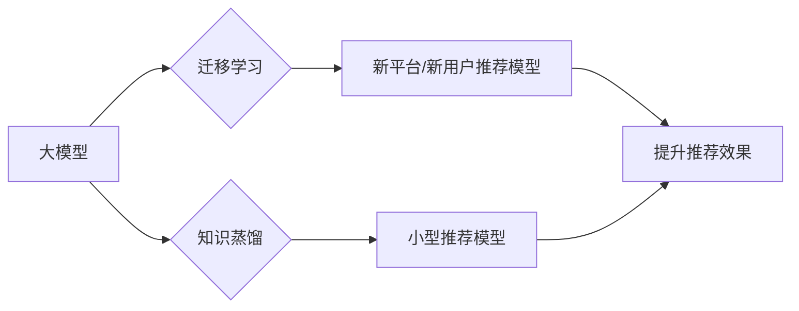

                 

## AI 大模型在电商搜索推荐中的冷启动策略：应对数据不足与新用户

> 关键词：电商搜索推荐、冷启动、大模型、数据不足、新用户、个性化推荐、迁移学习、知识蒸馏

## 1. 背景介绍

电商平台搜索推荐是用户获取商品信息和完成购买的重要途径。传统的搜索推荐系统通常依赖海量用户行为数据进行训练，然而，对于新上线的平台或新用户来说，往往缺乏充足的数据支撑，导致推荐效果不佳，这是一个普遍存在的“冷启动”问题。

冷启动问题主要体现在以下两个方面：

* **数据不足:** 新平台或新用户缺乏历史行为数据，无法训练有效的推荐模型。
* **新用户个性化:** 新用户缺乏行为特征，难以准确预测其兴趣偏好。

传统的基于协同过滤和内容过滤的推荐算法在面对冷启动问题时表现乏力。近年来，大模型技术的发展为解决电商搜索推荐的冷启动问题提供了新的思路。大模型凭借其强大的泛化能力和知识表示能力，能够在数据不足的情况下，通过迁移学习和知识蒸馏等技术，有效提升新平台和新用户的推荐效果。

## 2. 核心概念与联系

### 2.1  大模型

大模型是指参数量达到数十亿甚至千亿级别的深度学习模型。由于其庞大的规模和海量训练数据，大模型能够学习到更丰富的语义和知识表示，从而在自然语言处理、图像识别、机器翻译等领域展现出强大的性能。

### 2.2  迁移学习

迁移学习是一种机器学习范式，它利用预训练模型在源任务上的知识，迁移到目标任务中进行训练。在电商搜索推荐的冷启动场景中，可以将预训练的大模型作为源任务，将新平台或新用户的行为数据作为目标任务，通过迁移学习的方式，快速提升推荐模型的性能。

### 2.3  知识蒸馏

知识蒸馏是一种知识迁移技术，它通过让一个小的模型学习一个大模型的知识，从而达到提升小模型性能的目的。在电商搜索推荐中，可以将预训练的大模型作为教师模型，将一个小型模型作为学生模型，通过知识蒸馏的方式，将大模型的知识迁移到小型模型中，从而降低模型的复杂度和训练成本，同时保持较高的推荐效果。

**核心概念与联系流程图:**



## 3. 核心算法原理 & 具体操作步骤

### 3.1  算法原理概述

大模型在电商搜索推荐中的冷启动策略主要基于迁移学习和知识蒸馏两种技术。

* **迁移学习:** 利用预训练的大模型在其他领域的知识，迁移到电商搜索推荐任务中，通过微调的方式，快速适应新平台或新用户的特点。
* **知识蒸馏:** 将预训练的大模型的知识，通过教师-学生模型的训练方式，迁移到小型模型中，从而降低模型的复杂度和训练成本，同时保持较高的推荐效果。

### 3.2  算法步骤详解

**迁移学习步骤:**

1. **选择预训练大模型:** 选择在语义理解、文本分类等领域表现优异的预训练大模型，例如BERT、RoBERTa、GPT等。
2. **数据预处理:** 对新平台或新用户的行为数据进行预处理，例如文本清洗、特征提取等。
3. **模型微调:** 将预训练大模型的最后一层替换为新的输出层，并对模型进行微调，训练目标是优化新平台或新用户的推荐效果。

**知识蒸馏步骤:**

1. **选择教师模型:** 选择预训练的大模型作为教师模型。
2. **选择学生模型:** 选择一个小型模型作为学生模型。
3. **知识蒸馏训练:** 将教师模型的输出作为学生模型的软标签，并通过交叉熵损失函数进行训练，使得学生模型学习到教师模型的知识。

### 3.3  算法优缺点

**迁移学习:**

* **优点:** 能够快速提升新平台或新用户的推荐效果，降低训练成本。
* **缺点:** 需要选择合适的预训练大模型，并进行模型微调，需要一定的技术门槛。

**知识蒸馏:**

* **优点:** 可以将大模型的知识迁移到小型模型中，降低模型的复杂度和训练成本。
* **缺点:** 需要选择合适的教师模型和学生模型，并进行知识蒸馏训练，需要一定的技术经验。

### 3.4  算法应用领域

* **电商搜索推荐:** 针对新平台或新用户的冷启动问题，提升推荐效果。
* **个性化推荐:** 根据用户的兴趣偏好，提供个性化的商品推荐。
* **内容推荐:** 根据用户的阅读历史和兴趣，推荐相关的文章、视频等内容。

## 4. 数学模型和公式 & 详细讲解 & 举例说明

### 4.1  数学模型构建

在迁移学习中，我们可以使用以下数学模型来表示用户-商品交互关系：

$$
\mathbf{u}_i \cdot \mathbf{v}_j = \mathbf{W} \cdot [\mathbf{u}_i; \mathbf{v}_j] + b
$$

其中：

* $\mathbf{u}_i$ 表示用户 $i$ 的特征向量。
* $\mathbf{v}_j$ 表示商品 $j$ 的特征向量。
* $\mathbf{W}$ 表示权重矩阵。
* $b$ 表示偏置项。

该模型将用户和商品的特征向量进行内积运算，得到用户对商品的评分。

### 4.2  公式推导过程

迁移学习的训练目标是最小化预测评分与真实评分之间的误差。我们可以使用均方误差 (MSE) 作为损失函数：

$$
L = \frac{1}{N} \sum_{i=1}^{N} ( \mathbf{u}_i \cdot \mathbf{v}_j - r_{ij})^2
$$

其中：

* $N$ 表示训练样本的数量。
* $r_{ij}$ 表示用户 $i$ 对商品 $j$ 的真实评分。

通过梯度下降算法，我们可以更新模型参数 $\mathbf{W}$ 和 $b$，使得损失函数最小化。

### 4.3  案例分析与讲解

假设我们有一个电商平台，想要推荐商品给新用户。我们可以使用迁移学习的方式，将预训练的大模型 BERT 微调到该平台的推荐任务中。

1. **选择预训练大模型:** 选择在文本理解领域表现优异的 BERT 模型。
2. **数据预处理:** 对新用户的行为数据进行预处理，例如提取用户浏览过的商品信息、点击过的商品信息等。
3. **模型微调:** 将 BERT 模型的最后一层替换为新的输出层，并对模型进行微调，训练目标是优化新用户的推荐效果。

通过微调 BERT 模型，我们可以学习到新用户的兴趣偏好，并推荐相关的商品。

## 5. 项目实践：代码实例和详细解释说明

### 5.1  开发环境搭建

* Python 3.7+
* TensorFlow 2.x 或 PyTorch 1.x
* CUDA 和 cuDNN (可选，用于 GPU 训练)

### 5.2  源代码详细实现

```python
# 导入必要的库
import tensorflow as tf

# 定义用户-商品交互模型
class RecommenderModel(tf.keras.Model):
    def __init__(self, embedding_dim, num_users, num_items):
        super(RecommenderModel, self).__init__()
        self.user_embedding = tf.keras.layers.Embedding(num_users, embedding_dim)
        self.item_embedding = tf.keras.layers.Embedding(num_items, embedding_dim)
        self.dense = tf.keras.layers.Dense(1)

    def call(self, user_ids, item_ids):
        user_embeddings = self.user_embedding(user_ids)
        item_embeddings = self.item_embedding(item_ids)
        predictions = self.dense(tf.keras.layers.Concatenate()([user_embeddings, item_embeddings]))
        return predictions

# 构建模型实例
model = RecommenderModel(embedding_dim=64, num_users=1000, num_items=10000)

# 定义损失函数和优化器
loss_fn = tf.keras.losses.MeanSquaredError()
optimizer = tf.keras.optimizers.Adam(learning_rate=0.001)

# 训练模型
# ...

# 预测评分
predictions = model.predict(user_ids, item_ids)
```

### 5.3  代码解读与分析

* 该代码定义了一个用户-商品交互模型，使用 Embedding 层将用户和商品映射到低维向量空间，并使用 Dense 层进行评分预测。
* 模型训练使用 MeanSquaredError 损失函数和 Adam 优化器。
* 预测评分可以使用模型的 predict 方法进行计算。

### 5.4  运行结果展示

训练完成后，可以使用测试数据评估模型的性能，例如使用 Mean Absolute Error (MAE) 或 Root Mean Squared Error (RMSE) 作为评价指标。

## 6. 实际应用场景

### 6.1  新平台冷启动

对于新上线的电商平台，用户数据和商品信息都非常有限，传统的推荐算法难以有效工作。利用大模型的迁移学习能力，可以快速提升新平台的推荐效果，吸引用户并促进平台发展。

### 6.2  新用户个性化推荐

新用户缺乏行为特征，难以准确预测其兴趣偏好。大模型可以学习到用户的隐含特征，并根据用户的浏览历史、搜索记录等信息，提供个性化的商品推荐，提升用户体验。

### 6.3  跨平台推荐

不同电商平台的用户群体和商品种类可能存在差异。利用大模型的知识蒸馏技术，可以将一个平台的推荐模型知识迁移到另一个平台，从而实现跨平台的推荐服务。

### 6.4  未来应用展望

随着大模型技术的不断发展，其在电商搜索推荐领域的应用场景将更加广泛。例如：

* **多模态推荐:** 将文本、图像、视频等多模态数据融合到推荐模型中，提供更丰富的推荐结果。
* **动态推荐:** 根据用户的实时行为和上下文信息，动态调整推荐策略，提供更精准的推荐。
* **协同推荐:** 利用用户之间的关系和行为相似性，进行协同推荐，提升推荐效果。

## 7. 工具和资源推荐

### 7.1  学习资源推荐

* **论文:**
    * BERT: Pre-training of Deep Bidirectional Transformers for Language Understanding
    * RoBERTa: A Robustly Optimized BERT Pretraining Approach
    * GPT-3: Language Models are Few-Shot Learners
* **博客:**
    * The Illustrated Transformer
    * Understanding BERT

### 7.2  开发工具推荐

* **TensorFlow:** https://www.tensorflow.org/
* **PyTorch:** https://pytorch.org/
* **Hugging Face Transformers:** https://huggingface.co/transformers/

### 7.3  相关论文推荐

* **迁移学习:**
    * Domain Adaptation for Large Language Models
    * Transfer Learning for Recommender Systems
* **知识蒸馏:**
    * Distilling the Knowledge in a Neural Network
    * Knowledge Distillation for Recommender Systems

## 8. 总结：未来发展趋势与挑战

### 8.1  研究成果总结

大模型在电商搜索推荐中的冷启动策略取得了显著的成果，能够有效提升新平台和新用户的推荐效果。迁移学习和知识蒸馏技术为解决数据不足和新用户个性化问题提供了新的思路。

### 8.2  未来发展趋势

* **模型规模和能力提升:** 大模型的规模和能力将不断提升，能够学习到更丰富的知识和语义表示，从而提升推荐效果。
* **多模态融合:** 将文本、图像、视频等多模态数据融合到推荐模型中，提供更丰富的推荐结果。
* **个性化推荐增强:** 利用用户的实时行为和上下文信息，动态调整推荐策略，提供更精准的推荐。

### 8.3  面临的挑战

* **数据隐私和安全:** 大模型训练需要大量用户数据，如何保护用户隐私和数据安全是一个重要的挑战。
* **模型解释性和可控性:** 大模型的决策过程往往难以解释，如何提高模型的解释性和可控性是一个重要的研究方向。
* **模型部署和效率:** 大模型的部署和推理效率仍然是一个挑战，需要进一步优化模型结构和训练方法。

### 8.4  研究展望

未来，大模型在电商搜索推荐领域的应用将更加广泛和深入。研究者将继续探索大模型的潜力，解决其面临的挑战，并将其应用于更多场景，为用户提供更智能、更个性化的推荐服务。

## 9. 附录：常见问题与解答

* **Q1: 如何选择合适的预训练大模型？**

   A1: 选择预训练大模型需要考虑模型的规模、能力、训练数据等因素。对于电商搜索推荐任务，可以选择在文本理解领域表现优异的 BERT、RoBERTa、GPT 等模型。

* **Q2: 知识蒸馏的训练过程如何进行？**

   A2: 知识蒸馏的训练过程需要选择合适的教师模型和学生模型，并使用教师模型的输出作为学生模型的软标签。训练目标是使得学生模型学习到教师模型的知识，并能够在测试数据上取得较好的性能。

* **Q3: 大模型的部署和推理效率如何提高？**

   A3: 可以通过模型压缩、量化、并行推理等技术提高大模型的部署和推理效率。

作者：禅与计算机程序设计艺术 / Zen and the Art of Computer Programming


<end_of_turn>

