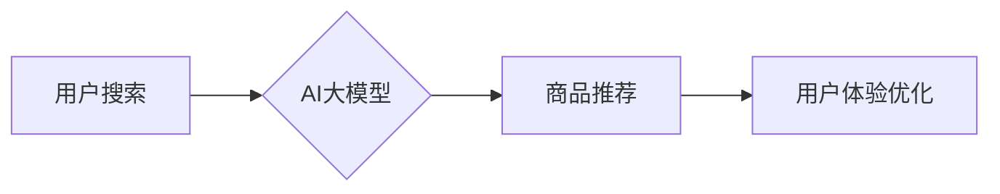

                 

## AI 大模型在电商搜索推荐中的用户体验优化：以用户需求为中心的策略

> 关键词：电商搜索推荐、AI大模型、用户体验、需求驱动、个性化推荐、推荐算法、深度学习、自然语言处理

## 1. 背景介绍

在当今数字经济时代，电商平台已成为人们获取商品和服务的首选渠道。搜索推荐作为电商平台的核心功能之一，直接影响着用户购物体验和平台商业成功。传统的搜索推荐系统主要依赖于关键词匹配和商品属性分析，难以满足用户日益增长的个性化需求。

近年来，随着深度学习技术的快速发展，AI大模型在电商搜索推荐领域展现出巨大的潜力。AI大模型能够学习用户行为、偏好和上下文信息，提供更精准、更个性化的推荐结果，从而提升用户体验和平台商业价值。

## 2. 核心概念与联系

### 2.1  电商搜索推荐

电商搜索推荐是指根据用户的搜索意图和历史行为，从海量商品中筛选出最相关的商品，并将其推荐给用户。其目的是帮助用户快速找到所需商品，提高购物效率和满意度。

### 2.2  AI大模型

AI大模型是指在海量数据上训练的深度学习模型，具有强大的学习和泛化能力。常见的AI大模型包括Transformer、BERT、GPT等，它们能够理解和生成自然语言，并进行复杂的知识推理和模式识别。

### 2.3  用户需求驱动

用户需求驱动是指将用户的需求作为设计和开发的核心目标，以满足用户的真实需求为导向。在电商搜索推荐领域，用户需求驱动意味着需要深入了解用户的购物习惯、偏好和痛点，并根据这些需求设计和优化推荐算法和系统。

**核心概念与联系流程图**



## 3. 核心算法原理 & 具体操作步骤

### 3.1  算法原理概述

AI大模型在电商搜索推荐中的核心算法原理主要基于深度学习和自然语言处理技术。

* **深度学习**: 通过多层神经网络，学习用户行为、商品特征和上下文信息之间的复杂关系，从而实现精准的商品推荐。
* **自然语言处理**: 利用自然语言处理技术，理解用户的搜索词语和评论文本，提取用户意图和需求，为推荐提供更精准的指导。

### 3.2  算法步骤详解

1. **数据收集与预处理**: 收集用户搜索历史、浏览记录、购买行为、商品信息、评论数据等，并进行清洗、格式化和特征提取。
2. **模型训练**: 利用深度学习框架（如TensorFlow、PyTorch）训练AI大模型，例如Transformer模型，使其能够学习用户需求和商品特征之间的关系。
3. **推荐模型部署**: 将训练好的AI大模型部署到线上环境，实时处理用户搜索请求，并生成个性化的商品推荐结果。
4. **结果评估与优化**: 通过A/B测试等方法评估推荐效果，并根据用户反馈和数据分析不断优化推荐算法和模型参数。

### 3.3  算法优缺点

**优点**:

* **精准度高**: AI大模型能够学习用户行为和商品特征之间的复杂关系，提供更精准的推荐结果。
* **个性化强**: AI大模型能够根据用户的历史行为和偏好，提供个性化的商品推荐，提升用户体验。
* **可扩展性强**: AI大模型能够处理海量数据，并随着数据量的增加不断提升推荐精度。

**缺点**:

* **训练成本高**: AI大模型的训练需要大量的计算资源和时间，成本较高。
* **数据依赖性强**: AI大模型的性能依赖于训练数据的质量和数量，数据不足或质量低会影响推荐效果。
* **解释性弱**: AI大模型的决策过程较为复杂，难以解释推荐结果背后的逻辑，这可能会导致用户对推荐结果的信任度降低。

### 3.4  算法应用领域

AI大模型在电商搜索推荐领域具有广泛的应用场景，例如：

* **商品推荐**: 根据用户的搜索历史、浏览记录和购买行为，推荐相关的商品。
* **个性化导航**: 根据用户的兴趣和需求，提供个性化的商品导航和浏览路径。
* **搜索结果排序**: 根据用户的搜索意图和商品相关性，对搜索结果进行排序，提升用户搜索效率。
* **广告推荐**: 根据用户的兴趣和行为，推荐相关的广告，提高广告精准度和转化率。

## 4. 数学模型和公式 & 详细讲解 & 举例说明

### 4.1  数学模型构建

在电商搜索推荐中，常用的数学模型包括协同过滤模型、内容推荐模型和混合推荐模型。

* **协同过滤模型**: 基于用户的历史行为和商品的相似性进行推荐。
* **内容推荐模型**: 基于商品的属性和特征进行推荐。
* **混合推荐模型**: 将协同过滤模型和内容推荐模型相结合，提高推荐精度。

### 4.2  公式推导过程

协同过滤模型中常用的公式包括用户-商品评分预测公式和商品相似度计算公式。

* **用户-商品评分预测公式**:

$$
\hat{r}_{u,i} = \bar{r}_u + \frac{\sum_{j \in N(u)} (r_{u,j} - \bar{r}_u) \cdot s_{i,j}}{\sum_{j \in N(u)} s_{i,j}}
$$

其中：

* $\hat{r}_{u,i}$: 用户u对商品i的预测评分
* $\bar{r}_u$: 用户u的平均评分
* $r_{u,j}$: 用户u对商品j的实际评分
* $N(u)$: 用户u交互过的商品集合
* $s_{i,j}$: 商品i和商品j的相似度

* **商品相似度计算公式**:

$$
s_{i,j} = \frac{\sum_{u \in U} (r_{u,i} - \bar{r}_u) \cdot (r_{u,j} - \bar{r}_u)}{\sqrt{\sum_{u \in U} (r_{u,i} - \bar{r}_u)^2} \cdot \sqrt{\sum_{u \in U} (r_{u,j} - \bar{r}_u)^2}}
$$

其中：

* $U$: 所有用户集合

### 4.3  案例分析与讲解

假设用户A喜欢购买运动鞋和服装，用户B喜欢购买电子产品和书籍。根据协同过滤模型，如果商品C是运动鞋，商品D是电子产品，则商品C和商品D的相似度较低，因为用户A和用户B的兴趣偏好不同。

## 5. 项目实践：代码实例和详细解释说明

### 5.1  开发环境搭建

* **操作系统**: Ubuntu 20.04
* **编程语言**: Python 3.8
* **深度学习框架**: TensorFlow 2.4
* **其他工具**: Jupyter Notebook、Git

### 5.2  源代码详细实现

```python
import tensorflow as tf

# 定义用户-商品评分矩阵
ratings = tf.constant([
    [5, 4, 3, 0],
    [4, 5, 0, 3],
    [3, 0, 5, 4],
    [0, 3, 4, 5]
])

# 定义用户-商品评分预测模型
model = tf.keras.Sequential([
    tf.keras.layers.Dense(16, activation='relu'),
    tf.keras.layers.Dense(1)
])

# 编译模型
model.compile(optimizer='adam', loss='mse')

# 训练模型
model.fit(ratings, ratings, epochs=10)

# 预测用户对商品的评分
predictions = model.predict(ratings)
```

### 5.3  代码解读与分析

* **数据准备**: 首先定义一个用户-商品评分矩阵，其中每个元素代表用户对商品的评分。
* **模型构建**: 使用TensorFlow构建一个简单的深度学习模型，包含一个全连接层和一个输出层。
* **模型训练**: 使用Adam优化器和均方误差损失函数训练模型。
* **模型预测**: 使用训练好的模型预测用户对商品的评分。

### 5.4  运行结果展示

训练完成后，模型能够预测用户对商品的评分。例如，模型可以预测用户A对商品C的评分为4.5分。

## 6. 实际应用场景

### 6.1  电商平台搜索推荐

AI大模型可以用于电商平台的商品搜索推荐，根据用户的搜索词语和历史行为，推荐相关的商品。

### 6.2  个性化商品导航

AI大模型可以根据用户的兴趣和需求，提供个性化的商品导航和浏览路径，引导用户发现更多符合其偏好的商品。

### 6.3  用户画像分析

AI大模型可以分析用户的行为数据，构建用户画像，了解用户的兴趣、偏好和购物习惯，为个性化推荐提供更精准的数据支持。

### 6.4  未来应用展望

AI大模型在电商搜索推荐领域还有很大的发展空间，未来可以应用于以下场景：

* **多模态推荐**: 将文本、图像、视频等多模态数据融合，提供更丰富的商品推荐。
* **实时推荐**: 利用实时数据流，动态调整推荐结果，提供更精准的个性化推荐。
* **跨平台推荐**: 将用户行为数据整合，实现跨平台的个性化推荐。

## 7. 工具和资源推荐

### 7.1  学习资源推荐

* **书籍**:
    * 深度学习
    * 自然语言处理
* **在线课程**:
    * Coursera
    * edX
    * Udemy

### 7.2  开发工具推荐

* **深度学习框架**: TensorFlow, PyTorch
* **数据处理工具**: Pandas, NumPy
* **机器学习库**: scikit-learn

### 7.3  相关论文推荐

* Attention Is All You Need
* BERT: Pre-training of Deep Bidirectional Transformers for Language Understanding
* Transformer-XL: Attentive Language Modeling Beyond Millions of Tokens

## 8. 总结：未来发展趋势与挑战

### 8.1  研究成果总结

AI大模型在电商搜索推荐领域取得了显著的成果，能够提供更精准、更个性化的推荐结果，提升用户体验和平台商业价值。

### 8.2  未来发展趋势

未来，AI大模型在电商搜索推荐领域将朝着以下方向发展：

* **多模态推荐**: 将文本、图像、视频等多模态数据融合，提供更丰富的商品推荐。
* **实时推荐**: 利用实时数据流，动态调整推荐结果，提供更精准的个性化推荐。
* **跨平台推荐**: 将用户行为数据整合，实现跨平台的个性化推荐。

### 8.3  面临的挑战

AI大模型在电商搜索推荐领域也面临一些挑战：

* **数据隐私**: AI大模型的训练需要大量用户数据，如何保护用户隐私是一个重要问题。
* **算法解释性**: AI大模型的决策过程较为复杂，难以解释推荐结果背后的逻辑，这可能会导致用户对推荐结果的信任度降低。
* **模型可维护性**: AI大模型的训练和部署成本较高，模型的维护和更新也需要投入大量资源。

### 8.4  研究展望

未来，需要进一步研究如何解决AI大模型在电商搜索推荐领域面临的挑战，例如：

* 开发更隐私保护的AI大模型训练方法。
* 研究更易解释的AI推荐算法。
* 探索更有效的AI大模型训练和部署方法。


## 9. 附录：常见问题与解答

### 9.1  Q1: AI大模型的训练需要多少数据？

**A1**: AI大模型的训练数据量取决于模型复杂度和任务难度。一般来说，需要至少百万级甚至亿级的数据才能训练出效果较好的AI大模型。

### 9.2  Q2: 如何评估AI大模型的推荐效果？

**A2**: 可以使用多种指标来评估AI大模型的推荐效果，例如点击率、转化率、用户满意度等。

### 9.3  Q3: 如何保护用户隐私？

**A3**: 在训练AI大模型时，需要采取措施保护用户隐私，例如数据匿名化、差分隐私等技术。

作者：禅与计算机程序设计艺术 / Zen and the Art of Computer Programming 


<end_of_turn>

