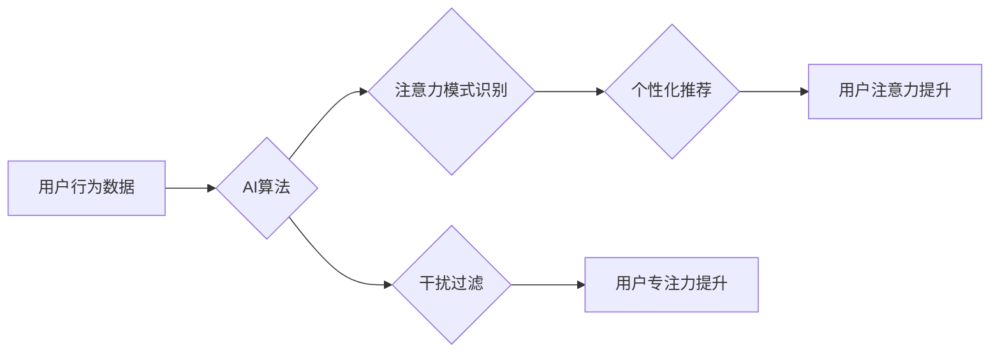

                 

## AI与人类注意力流：未来的工作、技能与注意力经济的管理与创新

> 关键词：人工智能、注意力流、注意力经济、工作技能、未来趋势、算法、数学模型、应用场景

## 1. 背景介绍

在信息爆炸的时代，人类的注意力资源变得越来越稀缺。我们每天被来自各种渠道的信息轰炸，从社交媒体的通知到电子邮件的提醒，从新闻网站的推送到广告的拦截，无处不在的干扰让我们难以集中精力完成任务。而人工智能（AI）技术的快速发展，则为我们提供了新的工具和方法来理解、管理和利用人类注意力。

AI技术能够通过分析用户行为数据，识别用户的注意力模式，并根据这些模式提供个性化的内容推荐、任务提醒和干扰过滤等服务。这不仅可以帮助我们提高工作效率和学习效果，还可以为我们创造更沉浸式、更愉悦的体验。

然而，AI技术对人类注意力流的影响也引发了一些担忧。例如，AI算法可能会被用于操纵用户注意力，引导用户沉迷于特定内容或平台，从而损害用户的健康和福祉。因此，我们需要认真思考AI技术对人类注意力流的影响，并制定相应的伦理规范和管理机制，以确保AI技术能够真正服务于人类。

## 2. 核心概念与联系

### 2.1 人类注意力流

人类注意力流是指人类对信息进行选择性感知、加工和记忆的过程。它是一个复杂而动态的系统，受多种因素影响，包括个体差异、环境刺激、任务要求等。

注意力流可以分为以下几个阶段：

* **吸引注意力:**  信息首先需要吸引我们的注意，例如鲜艳的颜色、突出的声音或熟悉的图案。
* **选择性关注:**  在众多信息中，我们选择关注其中一部分，并忽略其他信息。
* **深度处理:**  我们对所关注的信息进行深入的理解和加工，形成记忆和知识。
* **注意力转移:**  当任务或环境发生变化时，我们转移注意力到新的信息上。

### 2.2 注意力经济

注意力经济是指在信息时代，注意力成为一种稀缺资源，并被商业化和交易的经济模式。

注意力经济的核心概念是：

* **注意力是稀缺资源:**  在信息爆炸的时代，人类的注意力资源变得越来越稀缺。
* **注意力可以被交易:**  企业可以通过各种手段吸引用户的注意力，并将其转化为商业价值。
* **注意力需要被管理:**  个人需要学会管理自己的注意力，避免被信息过载和注意力分散。

### 2.3 AI与注意力流

AI技术可以帮助我们理解、管理和利用人类注意力流。

* **注意力识别:**  AI算法可以分析用户的行为数据，识别用户的注意力模式，例如用户的眼动轨迹、鼠标点击行为、阅读时长等。
* **个性化推荐:**  根据用户的注意力模式，AI算法可以推荐个性化的内容，例如新闻、视频、音乐等，提高用户的注意力和参与度。
* **干扰过滤:**  AI算法可以识别和过滤用户的干扰信息，例如广告、通知、社交媒体提醒等，帮助用户集中注意力完成任务。

**Mermaid 流程图**



## 3. 核心算法原理 & 具体操作步骤

### 3.1 算法原理概述

人类注意力流的识别和管理通常依赖于机器学习算法，特别是深度学习算法。这些算法能够从海量用户行为数据中学习出注意力模式，并根据这些模式进行预测和控制。

常见的算法包括：

* **循环神经网络（RNN）:** RNN能够处理序列数据，例如用户的浏览历史、阅读记录等，并捕捉时间上的依赖关系，从而识别用户的注意力模式。
* **长短期记忆网络（LSTM）:** LSTM是一种改进的RNN，能够更好地处理长序列数据，并记忆更长时间的信息，更准确地识别用户的注意力模式。
* **Transformer网络:** Transformer网络是一种基于注意力机制的深度学习模型，能够更有效地捕捉文本中的语义关系，并识别用户的注意力焦点。

### 3.2 算法步骤详解

1. **数据收集:** 收集用户的行为数据，例如浏览历史、阅读记录、鼠标点击行为、眼动轨迹等。
2. **数据预处理:** 对收集到的数据进行清洗、转换和格式化，使其适合深度学习算法的训练。
3. **模型训练:** 选择合适的深度学习算法，并使用预处理后的数据进行模型训练。
4. **模型评估:** 使用测试数据评估模型的性能，例如准确率、召回率、F1-score等。
5. **模型部署:** 将训练好的模型部署到实际应用场景中，例如个性化推荐系统、干扰过滤系统等。

### 3.3 算法优缺点

**优点:**

* **高准确率:** 深度学习算法能够从海量数据中学习出复杂的注意力模式，并实现较高的识别准确率。
* **个性化定制:** 算法可以根据用户的个人特征和行为模式进行个性化定制，提供更精准的推荐和过滤服务。
* **持续优化:** 随着数据的不断积累和算法的不断改进，模型的性能会持续提升。

**缺点:**

* **数据依赖:** 深度学习算法需要大量的训练数据，否则模型的性能会下降。
* **计算资源消耗:** 训练深度学习模型需要大量的计算资源，成本较高。
* **黑盒效应:** 深度学习模型的内部机制复杂，难以解释其决策过程，存在一定的透明度问题。

### 3.4 算法应用领域

* **个性化推荐:**  推荐新闻、视频、音乐、商品等内容，提高用户参与度和转化率。
* **干扰过滤:**  过滤广告、通知、社交媒体提醒等干扰信息，帮助用户集中注意力完成任务。
* **教育领域:**  根据学生的注意力模式，提供个性化的学习内容和教学方法，提高学习效率。
* **医疗领域:**  识别患者的注意力状态，辅助医生诊断和治疗。

## 4. 数学模型和公式 & 详细讲解 & 举例说明

### 4.1 数学模型构建

注意力机制的数学模型通常基于概率论和信息论。

一个典型的注意力机制模型可以表示为：

$$
\text{Attention}(Q, K, V) = \text{softmax}\left(\frac{Q K^T}{\sqrt{d_k}}\right) V
$$

其中：

* $Q$：查询向量，表示当前时刻需要关注的信息。
* $K$：键向量，表示所有候选信息的表示。
* $V$：值向量，表示候选信息的具体内容。
* $d_k$：键向量的维度。
* $\text{softmax}$：softmax函数，将键向量与查询向量的点积映射到一个概率分布。

### 4.2 公式推导过程

注意力机制的核心思想是通过计算查询向量与键向量的相似度，来确定当前时刻需要关注的信息。

* **点积计算:**  $QK^T$ 计算查询向量与键向量的点积，表示两者之间的相似度。
* **缩放操作:**  $\frac{QK^T}{\sqrt{d_k}}$ 对点积结果进行缩放，以避免梯度爆炸问题。
* **softmax归一化:**  $\text{softmax}(...)$ 将缩放后的点积结果映射到一个概率分布，表示每个候选信息被关注的概率。
* **加权求和:**  最后，将概率分布与值向量进行加权求和，得到最终的注意力输出。

### 4.3 案例分析与讲解

例如，在机器翻译任务中，可以使用注意力机制来确定源语言句子中哪些词语对目标语言句子翻译更重要。

* $Q$：目标语言句子中的当前词语的向量表示。
* $K$：源语言句子中所有词语的向量表示。
* $V$：源语言句子中所有词语的具体内容。

通过计算 $QK^T$，可以得到每个源语言词语与目标语言词语之间的相似度。然后，使用 softmax 函数将相似度映射到一个概率分布，表示每个源语言词语被关注的概率。最后，将概率分布与源语言词语的具体内容进行加权求和，得到最终的翻译结果。

## 5. 项目实践：代码实例和详细解释说明

### 5.1 开发环境搭建

* Python 3.x
* TensorFlow 或 PyTorch 深度学习框架
* Jupyter Notebook 或 VS Code 代码编辑器

### 5.2 源代码详细实现

以下是一个使用 TensorFlow 实现简单注意力机制的代码示例：

```python
import tensorflow as tf

# 定义查询、键和值向量
query = tf.Variable(tf.random.normal([1, 10]))
key = tf.Variable(tf.random.normal([5, 10]))
value = tf.Variable(tf.random.normal([5, 5]))

# 计算注意力权重
attention_weights = tf.matmul(query, key, transpose_b=True) / tf.math.sqrt(10)
attention_weights = tf.nn.softmax(attention_weights, axis=1)

# 计算注意力输出
attention_output = tf.matmul(attention_weights, value)

# 打印注意力输出
print(attention_output)
```

### 5.3 代码解读与分析

* **定义向量:**  代码首先定义了查询、键和值向量，这些向量代表着需要关注的信息、候选信息和具体内容。
* **计算注意力权重:**  使用矩阵乘法计算查询向量与键向量的点积，并进行缩放和 softmax 归一化，得到每个候选信息的注意力权重。
* **计算注意力输出:**  将注意力权重与值向量进行加权求和，得到最终的注意力输出。

### 5.4 运行结果展示

运行代码后，会输出一个注意力输出矩阵，其中每个元素代表着某个候选信息被关注的程度。

## 6. 实际应用场景

### 6.1 个性化推荐系统

AI技术可以分析用户的浏览历史、购买记录、点赞行为等数据，识别用户的兴趣偏好，并推荐个性化的商品、内容或服务。例如，电商平台可以根据用户的购物历史推荐相关的商品，视频网站可以根据用户的观看记录推荐相关的视频，音乐平台可以根据用户的听歌习惯推荐相关的歌曲。

### 6.2 干扰过滤系统

AI技术可以识别和过滤用户的干扰信息，例如广告、通知、社交媒体提醒等，帮助用户集中注意力完成任务。例如，学习软件可以过滤掉用户的社交媒体通知，工作软件可以屏蔽掉不相关的邮件提醒，游戏软件可以屏蔽掉游戏内的广告和弹窗。

### 6.3 教育领域应用

AI技术可以根据学生的注意力模式，提供个性化的学习内容和教学方法，提高学习效率。例如，在线学习平台可以根据学生的学习进度和注意力状态，调整学习内容的难度和节奏，智能辅导系统可以根据学生的学习问题和注意力集中程度，提供个性化的辅导建议。

### 6.4 未来应用展望

随着AI技术的不断发展，其在注意力流管理领域的应用将更加广泛和深入。例如：

* **脑机接口:**  通过脑机接口技术，直接读取用户的脑电信号，识别用户的注意力状态，并提供更精准的注意力管理服务。
* **虚拟现实和增强现实:**  在虚拟现实和增强现实环境中，AI技术可以根据用户的注意力模式，动态调整场景内容和交互方式，提供更沉浸式和个性化的体验。
* **注意力经济管理:**  AI技术可以帮助个人和企业更好地管理自己的注意力资源，提高工作效率、学习效果和生活质量。

## 7. 工具和资源推荐

### 7.1 学习资源推荐

* **书籍:**
    * 《深度学习》 by Ian Goodfellow, Yoshua Bengio, Aaron Courville
    * 《Attention Is All You Need》 by Vaswani et al.
* **在线课程:**
    * Coursera: Deep Learning Specialization
    * Udacity: Deep Learning Nanodegree
* **博客和网站:**
    * TensorFlow Blog: https://blog.tensorflow.org/
    * PyTorch Blog: https://pytorch.org/blog/

### 7.2 开发工具推荐

* **深度学习框架:** TensorFlow, PyTorch, Keras
* **数据处理工具:** Pandas, NumPy
* **可视化工具:** Matplotlib, Seaborn

### 7.3 相关论文推荐

* **Attention Is All You Need:** https://arxiv.org/abs/1706.03762
* **BERT: Pre-training of Deep Bidirectional Transformers for Language Understanding:** https://arxiv.org/abs/1810.04805
* **Transformer-XL: Attentive Language Models Beyond a Fixed-Length Context:** https://arxiv.org/abs/1901.08316

## 8. 总结：未来发展趋势与挑战

### 8.1 研究成果总结

近年来，AI技术在注意力流识别和管理领域取得了显著进展，例如：

* **注意力机制的提出和发展:**  注意力机制成为深度学习领域的重要组成部分，在机器翻译、文本摘要、图像识别等任务中取得了优异的性能。
* **注意力流模型的构建:**  研究者们提出了各种注意力流模型，例如基于RNN、LSTM和Transformer的模型，能够更准确地识别和预测用户的注意力模式。
* **注意力经济的兴起:**  注意力经济的概念逐渐被人们所接受，企业开始重视用户的注意力资源，并开发各种产品和服务来吸引和管理用户的注意力。

### 8.2 未来发展趋势

未来，AI技术在注意力流管理领域的应用将更加广泛和深入，例如：

* **更精准的注意力识别:**  通过结合多模态数据，例如眼动轨迹、脑电信号、生理指标等，实现更精准的注意力识别。
* **更个性化的注意力管理:**  根据用户的个人特征和行为模式，提供更个性化的注意力管理服务，例如定制化的学习计划、工作提醒和干扰过滤。
* **注意力经济的规范化:**  制定相应的伦理规范和管理机制，确保AI技术能够真正服务于人类，避免被滥用。

### 8.3 面临的挑战

AI技术在注意力流管理领域也面临一些挑战，例如：

* **数据隐私问题:**  收集和使用用户的注意力数据需要考虑数据隐私和安全问题。
* **算法解释性问题:**  深度学习模型的内部机制复杂，难以解释其决策过程，存在一定的透明度问题。
* **伦理规范问题:**  AI技术在注意力流管理领域的应用需要遵循相应的伦理规范，避免被滥用。

### 8.4 研究展望

未来，我们需要继续深入研究AI技术在注意力流管理领域的应用，探索其潜力和边界，并制定相应的伦理规范和管理机制，确保AI技术能够真正服务于人类，创造更美好的未来。

## 9. 附录：常见问题与解答

**Q1:  AI技术是否会取代人类的注意力？**

A1:  AI技术可以帮助我们更好地管理和利用注意力，但不会取代人类的注意力。人类的注意力是复杂的，具有创造性、情感和意识等特点，是AI技术无法替代的。

**Q2:  如何保护用户的注意力数据隐私？**

A2:  收集和使用用户的注意力数据需要遵循相应的隐私政策和安全协议，例如数据匿名化、数据加密、数据访问控制等。

**Q3:  AI技术在注意力流管理领域的应用有哪些伦理问题？**

A3:  AI技术在注意力流管理领域的应用需要考虑以下伦理问题：

* **操纵用户注意力:**  AI算法可能会被用于操纵用户的注意力，引导用户沉迷于特定内容或平台。
* **数据歧视:**  AI算法可能会因为训练数据的不均衡而产生歧视性结果，例如对特定人群的注意力进行过度关注或忽略。
* **注意力资源分配不均:**  AI技术可能会导致注意力资源分配不均，加剧社会的不平等问题。


作者：禅与计算机程序设计艺术 / Zen and the Art of Computer Programming<end_of_turn>

