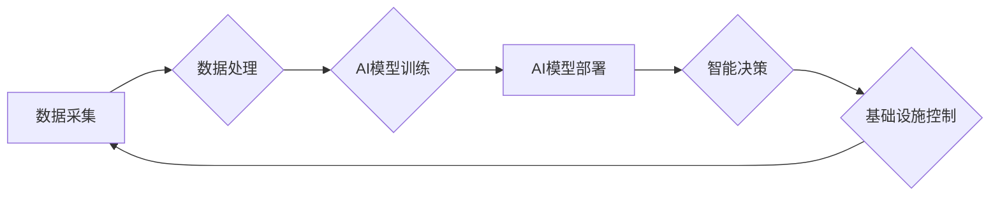

                 

## AI与人类计算：打造可持续发展的城市基础设施建设

> 关键词：人工智能、城市基础设施、可持续发展、人类计算、数据驱动、优化算法、机器学习、深度学习、云计算

## 1. 背景介绍

全球人口持续增长和城市化进程加速，对城市基础设施的需求量呈指数级增长。传统的基础设施建设模式面临着诸多挑战，例如建设周期长、成本高昂、资源浪费、维护难度大等。而人工智能（AI）技术的快速发展为城市基础设施建设带来了新的机遇。AI能够通过分析海量数据，识别模式，预测趋势，从而帮助我们优化城市基础设施的规划、设计、建设和运营，实现更加高效、智能、可持续的发展。

城市基础设施涵盖广泛的领域，包括交通运输、能源供应、供水排水、环境监测、公共安全等。AI技术在这些领域都有着广泛的应用潜力。例如，在交通运输领域，AI可以用于智能交通信号灯控制、自动驾驶车辆管理、交通流量预测等，从而缓解交通拥堵，提高交通效率；在能源供应领域，AI可以用于智能电网管理、能源需求预测、分布式能源优化调度等，从而提高能源利用效率，降低能源成本；在环境监测领域，AI可以用于空气质量监测、水质监测、环境污染预警等，从而保护环境，改善城市生态环境。

## 2. 核心概念与联系

### 2.1 人类计算与AI计算

人类计算是指人类利用自身的认知能力、经验和判断力进行计算和决策的过程。AI计算是指利用人工智能算法和模型，通过数据分析和模式识别，自动完成计算和决策的过程。

人类计算和AI计算各有优缺点。人类计算具有灵活性、创造力和复杂问题解决能力，但效率相对较低，容易受到情绪和主观因素的影响。AI计算具有高效率、准确性和可重复性，但缺乏人类的创造力和对复杂情境下的灵活判断能力。

在城市基础设施建设中，人类计算和AI计算可以相互补充，协同工作。例如，在城市规划设计阶段，人类可以利用自身的经验和专业知识进行总体规划，而AI可以辅助进行数据分析、模拟仿真、方案优化等工作，提高规划方案的科学性和可行性。在基础设施运营维护阶段，AI可以负责数据的实时监控、故障预警、智能控制等，而人类可以负责对AI的监督管理、决策调整和复杂问题的处理。

### 2.2 数据驱动与智能决策

数据驱动是AI技术的核心驱动力。城市基础设施建设涉及海量的传感器数据、地理信息数据、社会经济数据等。通过收集、存储、分析和挖掘这些数据，我们可以获得城市基础设施运行状态、用户需求、潜在风险等方面的洞察，为智能决策提供依据。

智能决策是指利用AI算法和模型，对城市基础设施运行数据进行分析，自动生成优化方案，并对基础设施进行智能控制和管理。例如，在交通运输领域，AI可以根据实时交通流量数据，动态调整交通信号灯控制策略，优化交通流量分配；在能源供应领域，AI可以根据用户用电需求和天气预报数据，智能调度能源供应，提高能源利用效率。

### 2.3 AI架构与城市基础设施

AI技术在城市基础设施建设中的应用，通常需要构建一个完整的AI架构。该架构通常包括以下几个关键组件：

* **数据采集层:** 收集城市基础设施运行数据，例如传感器数据、图像数据、文本数据等。
* **数据处理层:** 对采集到的数据进行清洗、预处理、特征提取等操作，使其能够被AI算法理解和处理。
* **AI模型训练层:** 利用机器学习、深度学习等算法，对数据进行训练，构建AI模型。
* **AI模型部署层:** 将训练好的AI模型部署到实际应用场景中，用于智能决策、控制和管理。
* **数据存储层:** 存储城市基础设施运行数据、AI模型参数等信息。

**Mermaid 流程图**



## 3. 核心算法原理 & 具体操作步骤

### 3.1 算法原理概述

在城市基础设施建设中，常用的AI算法包括机器学习、深度学习、强化学习等。

* **机器学习:** 通过训练模型，让模型从数据中学习规律，并对新数据进行预测或分类。例如，可以利用机器学习算法对城市交通流量进行预测，从而优化交通信号灯控制策略。
* **深度学习:** 是一种更高级的机器学习算法，利用多层神经网络，能够学习更复杂的模式和特征。例如，可以利用深度学习算法对城市环境监测数据进行分析，识别潜在的污染源。
* **强化学习:** 通过训练智能体，使其在环境中通过试错学习，获得最大奖励。例如，可以利用强化学习算法训练自动驾驶车辆，使其能够在复杂路况下安全行驶。

### 3.2 算法步骤详解

以机器学习算法为例，其基本步骤如下：

1. **数据收集:** 收集与城市基础设施相关的海量数据，例如交通流量数据、能源消耗数据、环境监测数据等。
2. **数据预处理:** 对收集到的数据进行清洗、转换、特征提取等操作，使其能够被机器学习算法理解和处理。
3. **模型选择:** 根据具体应用场景，选择合适的机器学习算法，例如线性回归、逻辑回归、决策树、支持向量机等。
4. **模型训练:** 利用训练数据，训练选择的机器学习模型，使其能够学习数据中的规律。
5. **模型评估:** 利用测试数据，评估模型的性能，例如准确率、召回率、F1-score等。
6. **模型部署:** 将训练好的模型部署到实际应用场景中，用于智能决策、控制和管理。

### 3.3 算法优缺点

**优点:**

* **数据驱动:** 基于海量数据分析，决策更加科学、客观。
* **自动化:** 自动化决策和控制，提高效率，降低成本。
* **可扩展性:** 可以根据需要扩展算法模型和应用场景。

**缺点:**

* **数据依赖:** 算法性能依赖于数据质量和数量。
* **黑盒效应:** 一些AI算法难以解释其决策过程，缺乏透明度。
* **伦理风险:** AI算法可能存在偏见和歧视，需要进行伦理审查。

### 3.4 算法应用领域

* **交通运输:** 智能交通信号灯控制、自动驾驶车辆管理、交通流量预测、道路安全监控。
* **能源供应:** 智能电网管理、能源需求预测、分布式能源优化调度、能源效率提升。
* **供水排水:** 智能水管网络管理、水质监测、污水处理优化、节水降耗。
* **环境监测:** 空气质量监测、水质监测、环境污染预警、生态环境保护。
* **公共安全:** 城市安全监控、灾害预警、应急救援指挥。

## 4. 数学模型和公式 & 详细讲解 & 举例说明

### 4.1 数学模型构建

在城市基础设施建设中，可以使用数学模型来描述和分析各种系统和过程。例如，可以构建交通流量模型、能源消耗模型、环境污染模型等。

**交通流量模型:**

可以利用微分方程来描述城市道路上的交通流量变化。假设道路长度为L，交通流量为f(t)，则交通流量变化率可以表示为：

$$
\frac{df(t)}{dt} = S(t) - D(t)
$$

其中，S(t)表示进入道路的车辆流量，D(t)表示离开道路的车辆流量。

**能源消耗模型:**

可以利用线性回归模型来预测城市居民的能源消耗量。假设能源消耗量为y，影响因素包括温度、人口密度、经济发展水平等，则模型可以表示为：

$$
y = a + b_1x_1 + b_2x_2 + ... + b_nx_n
$$

其中，a为截距，b_1, b_2, ..., b_n为系数，x_1, x_2, ..., x_n为影响因素。

### 4.2 公式推导过程

在构建数学模型时，需要根据实际情况推导相应的公式。例如，在构建交通流量模型时，需要根据道路几何形状、车辆速度、交通信号灯控制策略等因素，推导出车辆流量变化率的表达式。

### 4.3 案例分析与讲解

**案例:** 利用机器学习算法预测城市交通流量

**数据:** 收集城市道路上的交通流量数据，包括时间、日期、道路位置、天气状况等信息。

**算法:** 选择合适的机器学习算法，例如线性回归、支持向量机等。

**训练:** 利用历史交通流量数据训练机器学习模型。

**预测:** 利用训练好的模型，预测未来一段时间内的交通流量。

**结果:** 通过分析预测结果，可以了解未来交通流量的趋势，并采取相应的措施，例如调整交通信号灯控制策略、引导车辆选择疏缓道路等，从而缓解交通拥堵。

## 5. 项目实践：代码实例和详细解释说明

### 5.1 开发环境搭建

* **操作系统:** Ubuntu 20.04 LTS
* **编程语言:** Python 3.8
* **深度学习框架:** TensorFlow 2.0
* **数据处理库:** Pandas, NumPy
* **可视化库:** Matplotlib, Seaborn

### 5.2 源代码详细实现

```python
import pandas as pd
from sklearn.model_selection import train_test_split
from sklearn.linear_model import LinearRegression
from sklearn.metrics import mean_squared_error

# 加载交通流量数据
data = pd.read_csv("traffic_data.csv")

# 选择特征和目标变量
features = ["hour", "weekday", "temperature", "holiday"]
target = "traffic_volume"

# 将数据划分为训练集和测试集
X_train, X_test, y_train, y_test = train_test_split(data[features], data[target], test_size=0.2, random_state=42)

# 创建线性回归模型
model = LinearRegression()

# 训练模型
model.fit(X_train, y_train)

# 预测测试集数据
y_pred = model.predict(X_test)

# 计算模型性能
mse = mean_squared_error(y_test, y_pred)
print(f"Mean Squared Error: {mse}")

# 可视化预测结果
import matplotlib.pyplot as plt
plt.scatter(y_test, y_pred)
plt.xlabel("Actual Traffic Volume")
plt.ylabel("Predicted Traffic Volume")
plt.title("Traffic Volume Prediction")
plt.show()
```

### 5.3 代码解读与分析

* **数据加载和预处理:** 使用Pandas库加载交通流量数据，并选择特征和目标变量。
* **数据分割:** 使用train_test_split函数将数据划分为训练集和测试集，用于模型训练和评估。
* **模型创建和训练:** 使用Scikit-learn库创建线性回归模型，并使用训练数据进行模型训练。
* **模型预测:** 使用训练好的模型预测测试集数据。
* **模型评估:** 使用mean_squared_error函数计算模型性能，并可视化预测结果。

### 5.4 运行结果展示

运行代码后，会输出模型的均方误差值，并生成一个散点图，展示实际交通流量与预测交通流量之间的关系。

## 6. 实际应用场景

### 6.1 智能交通管理

AI技术可以应用于智能交通信号灯控制、自动驾驶车辆管理、交通流量预测等方面，提高交通效率，缓解交通拥堵。例如，可以利用AI算法分析实时交通流量数据，动态调整交通信号灯控制策略，优化交通流量分配。

### 6.2 智能能源管理

AI技术可以应用于智能电网管理、能源需求预测、分布式能源优化调度等方面，提高能源利用效率，降低能源成本。例如，可以利用AI算法分析用户用电需求和天气预报数据，智能调度能源供应，避免能源浪费。

### 6.3 智能环境监测

AI技术可以应用于空气质量监测、水质监测、环境污染预警等方面，保护环境，改善城市生态环境。例如，可以利用AI算法分析环境监测数据，识别潜在的污染源，并及时发出预警。

### 6.4 未来应用展望

随着AI技术的不断发展，其在城市基础设施建设中的应用场景将更加广泛。例如，可以利用AI技术进行城市规划设计、基础设施运营维护、灾害预警等方面的智能化管理。

## 7. 工具和资源推荐

### 7.1 学习资源推荐

* **在线课程:** Coursera, edX, Udacity
* **书籍:** "Deep Learning" by Ian Goodfellow, "Hands-On Machine Learning with Scikit-Learn, Keras & TensorFlow" by Aurélien Géron
* **博客和论坛:** Towards Data Science, Machine Learning Mastery

### 7.2 开发工具推荐

* **编程语言:** Python
* **深度学习框架:** TensorFlow, PyTorch
* **数据处理库:** Pandas, NumPy
* **可视化库:** Matplotlib, Seaborn

### 7.3 相关论文推荐

* "Deep Learning for Traffic Flow Prediction" by Wang et al.
* "A Survey on Deep Learning for Smart Grid" by Liu et al.
* "Machine Learning for Environmental Monitoring" by Chen et al.

## 8. 总结：未来发展趋势与挑战

### 8.1 研究成果总结

AI技术在城市基础设施建设领域取得了显著的成果，例如智能交通管理、智能能源管理、智能环境监测等。这些成果为提高城市基础设施的效率、安全性、可持续性提供了新的思路和方法。

### 8.2 未来发展趋势

* **更强大的AI算法:** 随着AI技术的不断发展，将出现更强大的AI算法，能够处理更复杂的数据，解决更复杂的城市基础设施问题。
* **更广泛的应用场景:** AI技术将应用于更多城市基础设施领域，例如城市规划设计、基础设施运营维护、灾害预警等。
* **更智能的城市基础设施:** AI技术将使城市基础设施更加智能化，能够自动感知环境变化，并做出相应的调整，从而提高城市基础设施的效率和可靠性。

### 8.3 面临的挑战

* **数据质量和可用性:** AI算法的性能依赖于数据质量和数量。城市基础设施数据往往分散、不完整、难以获取，这限制了AI技术的应用。
* **算法解释性和透明度:** 一些AI算法难以解释其决策过程，缺乏透明度，这可能导致人们对AI技术的信任度降低。
* **伦理风险:** AI算法可能存在偏见和歧视，需要进行伦理审查，确保AI技术在城市基础设施建设中的应用是公平、公正的。

### 8.4 研究展望

未来，我们需要继续加强对AI技术的研发，解决数据质量、算法解释性和伦理风险等挑战，推动AI技术在城市基础设施建设领域的应用，打造更加智能、可持续的城市。

## 9. 附录：常见问题与解答

**Q1: AI技术是否会取代人类工作？**

A1: AI技术可以自动化一些重复性、低水平的工作，但它并不会完全取代人类工作。AI技术更像是人类的助手，可以帮助人类提高效率，解放人力，专注于更复杂、更需要创造力和判断力的工作。

**Q2: 如何确保AI技术的安全性和可靠性？**

A2: 确保AI技术的安全性和可靠性需要从多个方面入手，例如：

* **数据安全:** 保护数据隐私，防止数据泄露和篡改。
* **算法安全:** 设计安全的AI算法，防止攻击和恶意利用。
* **系统安全:** 建立完善的AI系统安全机制，防止系统故障和安全漏洞。
* **伦理审查:** 对AI技术的应用进行伦理审查，确保其应用是公平、公正的。

**Q3: 如何学习AI技术？**

A3: 学习AI技术有很多资源可以利用，例如在线课程、书籍、博客、论坛等。建议从基础知识开始学习，逐步深入到更高级的AI算法和应用。


作者：禅与计算机程序设计艺术 / Zen and the Art of Computer Programming<end_of_turn>

