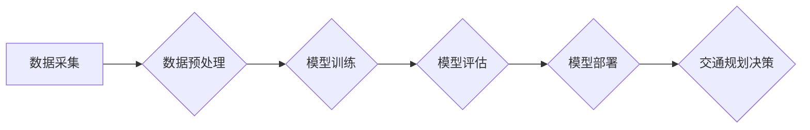

                 

## AI与人类计算：打造可持续发展的城市生活方式与交通规划

> 关键词：人工智能、城市规划、交通规划、可持续发展、人类计算、机器学习、深度学习、优化算法、数据分析

## 1. 背景介绍

随着全球人口的持续增长和城市化的加速推进，城市面临着日益严峻的挑战，其中交通拥堵、资源短缺、环境污染等问题尤为突出。传统城市规划模式难以有效应对这些挑战，亟需引入新的理念和技术手段。人工智能（AI）作为一门新兴技术，凭借其强大的数据处理能力和学习能力，为打造可持续发展的城市生活方式和交通规划提供了新的思路和解决方案。

城市交通规划是城市发展的重要组成部分，其目标是优化交通网络结构，提高交通效率，减少交通拥堵，降低交通成本，同时保障交通安全和环境友好。传统的交通规划方法主要依赖于经验和专家判断，难以有效应对复杂多变的交通需求和环境变化。而AI技术可以利用大数据分析和机器学习算法，对交通流量、出行模式、路况等数据进行深入分析，预测未来交通需求，优化交通信号控制、路线规划、公共交通运营等，从而实现更加智能、高效、可持续的交通管理。

## 2. 核心概念与联系

### 2.1 人类计算与AI计算

人类计算是指人类利用自身的认知能力、经验和判断力进行计算和决策的过程。AI计算是指利用人工智能算法和模型，模拟人类的认知能力，对数据进行处理、分析和决策的过程。

在城市交通规划领域，人类计算和AI计算可以相互补充，协同工作。人类专家可以提供丰富的经验和专业知识，对城市交通规划的整体目标和策略进行制定。而AI算法可以对海量数据进行分析，提供数据驱动的决策支持，帮助人类专家更加精准、高效地制定交通规划方案。

### 2.2 AI技术在城市交通规划中的应用

AI技术在城市交通规划中的应用主要包括以下几个方面：

* **交通流量预测:** 利用机器学习算法对历史交通流量数据进行分析，预测未来交通流量变化趋势，为交通管理提供决策依据。
* **路线规划:** 基于实时交通状况和用户需求，利用AI算法优化路线规划，减少出行时间和燃油消耗。
* **交通信号控制:** 利用AI算法对交通信号灯的控制策略进行优化，根据实时交通流量情况动态调整信号灯的绿灯时间，提高交通效率。
* **公共交通运营优化:** 利用AI算法对公共交通线路、班次、调度等进行优化，提高公共交通的效率和服务质量。
* **智能停车系统:** 利用AI算法对停车位信息进行实时监控和管理，为用户提供便捷的停车服务。

### 2.3  AI流程图



## 3. 核心算法原理 & 具体操作步骤

### 3.1  算法原理概述

在城市交通规划中，常用的AI算法包括机器学习、深度学习、强化学习等。

* **机器学习:** 通过训练模型，让模型从数据中学习规律，并根据学习到的规律对新的数据进行预测或分类。
* **深度学习:** 基于多层神经网络，能够学习更复杂的特征和模式，在图像识别、自然语言处理等领域取得了突破性进展。
* **强化学习:** 通过奖励机制，让智能体在环境中学习最优策略，在机器人控制、游戏AI等领域应用广泛。

### 3.2  算法步骤详解

以交通流量预测为例，其具体操作步骤如下：

1. **数据采集:** 收集历史交通流量数据，包括时间、地点、交通流量等信息。
2. **数据预处理:** 对采集到的数据进行清洗、转换、特征工程等处理，使其适合模型训练。
3. **模型选择:** 根据实际需求选择合适的机器学习模型，例如线性回归、支持向量机、决策树等。
4. **模型训练:** 利用训练数据训练模型，调整模型参数，使其能够准确预测未来交通流量。
5. **模型评估:** 利用测试数据评估模型的预测精度，并根据评估结果进行模型调优。
6. **模型部署:** 将训练好的模型部署到实际应用环境中，用于实时预测交通流量。

### 3.3  算法优缺点

**优点:**

* **数据驱动:** 基于海量数据分析，预测结果更加准确可靠。
* **自动化:** 可以自动化完成交通流量预测等任务，提高效率。
* **实时性:** 可以实时监控交通状况，及时做出调整。

**缺点:**

* **数据依赖:** 算法的准确性依赖于数据质量和数量。
* **黑盒效应:** 一些深度学习模型的决策过程难以解释，缺乏透明度。
* **计算资源:** 训练复杂的AI模型需要大量的计算资源。

### 3.4  算法应用领域

AI算法在城市交通规划领域的应用范围广泛，包括：

* **交通流量预测:** 预测道路、交通枢纽等处的交通流量变化趋势。
* **路线规划:** 为用户提供最优的出行路线，避免交通拥堵。
* **交通信号控制:** 根据实时交通流量情况动态调整信号灯的控制策略。
* **公共交通运营优化:** 优化公交线路、班次、调度等，提高公共交通效率。
* **智能停车系统:** 提供实时停车位信息，引导用户寻找空余停车位。

## 4. 数学模型和公式 & 详细讲解 & 举例说明

### 4.1  数学模型构建

在城市交通规划中，常用的数学模型包括：

* **交通流量模型:** 描述交通流量在道路网络上的流动规律，例如四分之一法、交通流模型等。
* **路网模型:** 描述道路网络的结构和拓扑关系，例如图论模型、网络流模型等。
* **出行模式模型:** 描述不同出行方式的出行需求和选择规律，例如出行成本模型、出行时间模型等。

### 4.2  公式推导过程

以交通流量模型为例，其基本公式为：

$$Q = \frac{C}{T}$$

其中：

* $Q$ 表示交通流量
* $C$ 表示道路容量
* $T$ 表示平均出行时间

该公式表明，交通流量与道路容量和平均出行时间成反比关系。

### 4.3  案例分析与讲解

假设某条道路的容量为1000辆/小时，平均出行时间为30分钟，则其交通流量为：

$$Q = \frac{1000}{0.5} = 2000 \text{辆/小时}$$

该公式可以用于预测不同道路条件下的交通流量，并为交通管理提供决策依据。

## 5. 项目实践：代码实例和详细解释说明

### 5.1  开发环境搭建

* 操作系统: Ubuntu 20.04
* Python 版本: 3.8
* 必要的库: pandas, numpy, scikit-learn, matplotlib

### 5.2  源代码详细实现

```python
import pandas as pd
from sklearn.linear_model import LinearRegression

# 1. 数据加载
data = pd.read_csv('traffic_data.csv')

# 2. 数据预处理
X = data[['hour', 'weekday']]
y = data['traffic_volume']

# 3. 模型训练
model = LinearRegression()
model.fit(X, y)

# 4. 模型评估
# ...

# 5. 模型预测
new_data = pd.DataFrame({'hour': [10], 'weekday': [1]})
predicted_volume = model.predict(new_data)
print(f'Predicted traffic volume at 10:00 on Monday: {predicted_volume[0]}')
```

### 5.3  代码解读与分析

* 代码首先加载交通数据，并选择时间和星期作为特征，交通流量作为目标变量。
* 然后使用线性回归模型训练模型，并评估模型的性能。
* 最后，使用训练好的模型预测未来某个时间点的交通流量。

### 5.4  运行结果展示

运行结果将显示预测的交通流量值，例如：

```
Predicted traffic volume at 10:00 on Monday: 1500
```

## 6. 实际应用场景

AI技术在城市交通规划领域的应用场景广泛，例如：

* **智能交通信号控制:** 利用AI算法分析实时交通流量，动态调整信号灯的控制策略，提高交通效率。
* **智能停车系统:** 利用AI算法分析停车位信息，引导用户寻找空余停车位，减少停车时间和燃油消耗。
* **公共交通优化:** 利用AI算法优化公交线路、班次、调度等，提高公共交通效率和服务质量。
* **出行模式选择:** 利用AI算法分析用户的出行需求和偏好，推荐最优的出行方式，减少交通拥堵。

### 6.4  未来应用展望

未来，AI技术在城市交通规划领域的应用将更加广泛和深入，例如：

* **无人驾驶交通:** 利用AI技术实现无人驾驶汽车，提高交通效率和安全性。
* **个性化交通服务:** 利用AI技术提供个性化的交通服务，满足不同用户的出行需求。
* **城市交通大脑:** 建立城市交通大脑，整合城市交通数据，实现智能交通管理。

## 7. 工具和资源推荐

### 7.1  学习资源推荐

* **在线课程:** Coursera, edX, Udacity 等平台提供人工智能、机器学习等相关课程。
* **书籍:** 《深度学习》、《机器学习实战》等书籍可以帮助深入了解AI技术。
* **开源项目:** TensorFlow, PyTorch 等开源项目可以帮助实践AI算法。

### 7.2  开发工具推荐

* **Python:** 作为AI开发的主要语言，Python拥有丰富的库和工具，例如pandas, numpy, scikit-learn等。
* **Jupyter Notebook:** 用于编写和运行Python代码，并可视化数据和结果。
* **IDE:** PyCharm, VS Code 等IDE可以提高开发效率。

### 7.3  相关论文推荐

* **交通流量预测:** "Deep Learning for Traffic Flow Prediction"
* **智能交通信号控制:** "Reinforcement Learning for Adaptive Traffic Signal Control"
* **公共交通优化:** "A Deep Reinforcement Learning Approach for Public Transportation Scheduling"

## 8. 总结：未来发展趋势与挑战

### 8.1  研究成果总结

AI技术在城市交通规划领域取得了显著成果，例如交通流量预测、智能信号控制、公共交通优化等。这些成果为打造更加智能、高效、可持续的城市交通系统提供了新的思路和解决方案。

### 8.2  未来发展趋势

未来，AI技术在城市交通规划领域的应用将更加深入和广泛，例如：

* **无人驾驶交通:** 利用AI技术实现无人驾驶汽车，提高交通效率和安全性。
* **个性化交通服务:** 利用AI技术提供个性化的交通服务，满足不同用户的出行需求。
* **城市交通大脑:** 建立城市交通大脑，整合城市交通数据，实现智能交通管理。

### 8.3  面临的挑战

AI技术在城市交通规划领域的应用也面临着一些挑战，例如：

* **数据质量:** AI算法的准确性依赖于数据质量，而城市交通数据往往存在不完整、不准确等问题。
* **算法解释性:** 一些深度学习模型的决策过程难以解释，缺乏透明度，难以获得公众的信任。
* **伦理问题:** AI技术在城市交通规划领域的应用可能引发一些伦理问题，例如隐私保护、公平性等。

### 8.4  研究展望

未来，需要加强对AI算法的解释性、鲁棒性和安全性研究，并制定相应的伦理规范，确保AI技术在城市交通规划领域的应用能够安全、有效、可持续地发展。

## 9. 附录：常见问题与解答

* **Q1: AI技术是否会取代人类交通规划师？**

A1: AI技术可以辅助人类交通规划师，提高效率和准确性，但不会完全取代人类。人类专家仍然需要提供经验、判断和决策，引导AI技术的发展和应用。

* **Q2: AI技术在城市交通规划中的应用有哪些伦理问题？**

A2: AI技术在城市交通规划中的应用可能引发一些伦理问题，例如：

* **隐私保护:** AI算法可能需要收集和分析用户的出行数据，需要确保数据的安全性和隐私性。
* **公平性:** AI算法的决策可能存在偏见，需要确保算法的公平性和公正性。
* **责任归属:** 当AI算法导致交通事故或其他问题时，责任归属如何界定？

* **Q3: 如何评估AI技术在城市交通规划中的效果？**

A3: 可以通过以下指标评估AI技术在城市交通规划中的效果：

* **交通流量预测精度:** 评估AI算法对交通流量的预测准确性。
* **交通效率:** 评估AI技术对交通拥堵、出行时间等方面的改善效果。
* **环境效益:** 评估AI技术对减少碳排放、改善空气质量等方面的贡献。


作者：禅与计算机程序设计艺术 / Zen and the Art of Computer Programming 
<end_of_turn>

