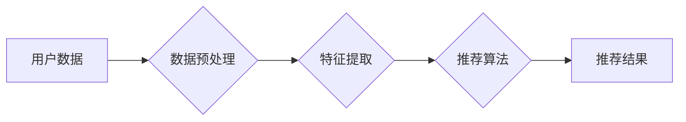

                 

## AI在个性化音乐推荐中的应用：发现新音乐

> 关键词：音乐推荐系统，深度学习，协同过滤，内容过滤，自然语言处理，个性化推荐，机器学习

## 1. 背景介绍

音乐作为一种重要的文化艺术形式，在人们的生活中扮演着不可或缺的角色。随着数字音乐平台的兴起，用户可以轻松访问海量的音乐资源。然而，面对如此庞大的音乐库，用户往往难以找到自己真正喜欢的音乐。个性化音乐推荐系统应运而生，旨在根据用户的音乐偏好，智能推荐符合其口味的音乐作品。

传统的音乐推荐系统主要依赖于用户评分或播放历史等数据，采用协同过滤或内容过滤等方法进行推荐。然而，这些方法存在一些局限性，例如数据稀疏性、冷启动问题以及推荐结果缺乏多样性。近年来，随着深度学习技术的快速发展，AI在音乐推荐领域展现出巨大的潜力。深度学习算法能够从海量音乐数据中学习更复杂的音乐特征，并生成更精准、更个性化的推荐结果。

## 2. 核心概念与联系

### 2.1 音乐推荐系统

音乐推荐系统旨在根据用户的音乐偏好，推荐符合其口味的音乐作品。它通常包含以下几个核心模块：

* **数据采集模块:** 收集用户音乐行为数据，例如播放历史、评分、收藏等。
* **数据预处理模块:** 对收集到的数据进行清洗、转换和特征提取。
* **推荐算法模块:** 根据用户特征和音乐特征，预测用户对音乐作品的喜好，并生成推荐列表。
* **推荐结果展示模块:** 将推荐结果以用户友好的方式展示给用户。

### 2.2 核心概念原理与架构

音乐推荐系统通常采用以下两种主要推荐算法：

* **协同过滤:** 基于用户的相似度或音乐作品的相似度进行推荐。
* **内容过滤:** 基于音乐作品的特征进行推荐。

深度学习算法可以应用于两种推荐算法中，提升推荐效果。

**Mermaid 流程图**



## 3. 核心算法原理 & 具体操作步骤

### 3.1 算法原理概述

深度学习算法在音乐推荐系统中主要用于特征提取和推荐模型构建。常用的深度学习算法包括：

* **多层感知机 (MLP):** 用于学习音乐作品和用户特征之间的非线性关系。
* **卷积神经网络 (CNN):** 用于提取音乐作品的时频特征。
* **循环神经网络 (RNN):** 用于学习用户音乐行为序列中的模式。
* **图神经网络 (GNN):** 用于学习音乐作品之间的关系网络。

### 3.2 算法步骤详解

**以协同过滤+深度学习为例，详细说明算法步骤：**

1. **数据收集:** 收集用户音乐行为数据，例如播放历史、评分、收藏等。
2. **数据预处理:** 对收集到的数据进行清洗、转换和特征提取。例如，将用户播放历史转换为用户-音乐交互矩阵，并将音乐作品的特征转换为向量表示。
3. **深度学习模型训练:** 使用深度学习算法训练协同过滤模型。例如，使用多层感知机学习用户-音乐交互矩阵中的隐向量表示，并预测用户对音乐作品的评分。
4. **推荐结果生成:** 根据训练好的模型，预测用户对未听过的音乐作品的评分，并根据评分排序生成推荐列表。

### 3.3 算法优缺点

**协同过滤+深度学习算法的优点:**

* 能够学习用户和音乐作品之间的复杂关系。
* 推荐结果更精准、更个性化。
* 能够处理高维数据和稀疏数据。

**协同过滤+深度学习算法的缺点:**

* 需要大量的用户数据进行训练。
* 容易受到数据偏差的影响。
* 冷启动问题仍然存在。

### 3.4 算法应用领域

协同过滤+深度学习算法广泛应用于以下领域：

* 音乐推荐系统
* 电影推荐系统
* 商品推荐系统
* 内容推荐系统

## 4. 数学模型和公式 & 详细讲解 & 举例说明

### 4.1 数学模型构建

协同过滤+深度学习算法的数学模型可以表示为以下公式：

$$
\hat{r}_{u,i} = f(h_u, h_i, \theta)
$$

其中：

* $\hat{r}_{u,i}$ 表示模型预测用户 $u$ 对音乐作品 $i$ 的评分。
* $h_u$ 表示用户 $u$ 的隐向量表示。
* $h_i$ 表示音乐作品 $i$ 的隐向量表示。
* $\theta$ 表示模型参数。
* $f$ 表示深度学习模型的激活函数。

### 4.2 公式推导过程

深度学习模型的训练过程是通过最小化预测评分与真实评分之间的误差来实现的。常用的损失函数是均方误差 (MSE):

$$
L = \frac{1}{N} \sum_{u,i} (r_{u,i} - \hat{r}_{u,i})^2
$$

其中：

* $N$ 表示训练样本的数量。
* $r_{u,i}$ 表示用户 $u$ 对音乐作品 $i$ 的真实评分。

通过梯度下降算法，不断更新模型参数 $\theta$，使得损失函数最小化。

### 4.3 案例分析与讲解

假设我们有一个包含用户和音乐作品的交互矩阵，其中每个元素表示用户对音乐作品的评分。我们可以使用协同过滤+深度学习算法训练一个推荐模型。

训练过程中，模型会学习用户和音乐作品的隐向量表示，并根据这些表示预测用户对未听过的音乐作品的评分。

例如，如果用户 $u$ 喜欢音乐作品 $i$，那么模型会学习到用户 $u$ 和音乐作品 $i$ 的隐向量表示之间的相似性。当用户 $u$ 遇到新的音乐作品 $j$ 时，如果音乐作品 $j$ 的隐向量表示与音乐作品 $i$ 的隐向量表示相似，那么模型会预测用户 $u$ 也喜欢音乐作品 $j$。

## 5. 项目实践：代码实例和详细解释说明

### 5.1 开发环境搭建

* Python 3.x
* TensorFlow 或 PyTorch
* NumPy
* Pandas

### 5.2 源代码详细实现

```python
import tensorflow as tf

# 定义用户-音乐交互矩阵
user_item_matrix = tf.constant([[5, 4, 3],
                                [3, 5, 2],
                                [2, 3, 5]])

# 定义用户隐向量表示
user_embeddings = tf.Variable(tf.random.normal([3, 10]))

# 定义音乐作品隐向量表示
item_embeddings = tf.Variable(tf.random.normal([3, 10]))

# 计算预测评分
predictions = tf.matmul(user_embeddings, item_embeddings, transpose_b=True)

# 定义损失函数
loss = tf.reduce_mean(tf.square(predictions - user_item_matrix))

# 定义优化器
optimizer = tf.keras.optimizers.Adam()

# 训练模型
for epoch in range(100):
    with tf.GradientTape() as tape:
        loss_value = loss
    gradients = tape.gradient(loss_value, [user_embeddings, item_embeddings])
    optimizer.apply_gradients(zip(gradients, [user_embeddings, item_embeddings]))

# 打印训练结果
print(loss_value)
```

### 5.3 代码解读与分析

* 代码首先定义了用户-音乐交互矩阵、用户隐向量表示和音乐作品隐向量表示。
* 然后，使用矩阵乘法计算预测评分。
* 定义了均方误差作为损失函数，并使用Adam优化器进行模型训练。
* 训练过程中，模型会不断更新用户和音乐作品的隐向量表示，使得预测评分与真实评分之间的误差最小化。

### 5.4 运行结果展示

训练完成后，可以将模型应用于新的用户和音乐作品，预测用户对新音乐作品的评分。

## 6. 实际应用场景

### 6.1 音乐流媒体平台

音乐流媒体平台如 Spotify、Apple Music 等可以利用 AI 音乐推荐系统，为用户推荐个性化的音乐作品，提升用户体验。

### 6.2 音乐制作平台

音乐制作平台如 SoundCloud、Bandcamp 等可以利用 AI 音乐推荐系统，帮助音乐人发现新的灵感和合作机会。

### 6.3 音乐教育平台

音乐教育平台如 Coursera、edX 等可以利用 AI 音乐推荐系统，为学生推荐个性化的音乐学习资源。

### 6.4 未来应用展望

AI 音乐推荐系统在未来将更加智能化、个性化和多样化。例如，可以利用自然语言处理技术，理解用户的音乐偏好描述，并推荐更精准的音乐作品。还可以利用多模态学习技术，结合音乐、歌词、图片等多种信息进行推荐。

## 7. 工具和资源推荐

### 7.1 学习资源推荐

* **书籍:**
    * Deep Learning by Ian Goodfellow, Yoshua Bengio, and Aaron Courville
    * Hands-On Machine Learning with Scikit-Learn, Keras & TensorFlow by Aurélien Géron
* **在线课程:**
    * TensorFlow Tutorials: https://www.tensorflow.org/tutorials
    * PyTorch Tutorials: https://pytorch.org/tutorials/

### 7.2 开发工具推荐

* **TensorFlow:** https://www.tensorflow.org/
* **PyTorch:** https://pytorch.org/
* **Scikit-learn:** https://scikit-learn.org/

### 7.3 相关论文推荐

* **Collaborative Filtering with Deep Learning:** https://arxiv.org/abs/1609.09807
* **Deep Learning for Music Recommendation:** https://arxiv.org/abs/1803.08746

## 8. 总结：未来发展趋势与挑战

### 8.1 研究成果总结

AI 在音乐推荐领域取得了显著的成果，深度学习算法能够学习用户和音乐作品之间的复杂关系，生成更精准、更个性化的推荐结果。

### 8.2 未来发展趋势

* **更智能化的推荐:** 利用自然语言处理、多模态学习等技术，理解用户的音乐偏好描述，并推荐更精准的音乐作品。
* **更个性化的推荐:** 考虑用户的音乐情绪、场景等因素，提供更个性化的音乐推荐。
* **更协作性的推荐:** 结合用户反馈、音乐人推荐等信息，构建更协作性的音乐推荐系统。

### 8.3 面临的挑战

* **数据稀疏性:** 音乐数据往往是稀疏的，难以训练有效的深度学习模型。
* **冷启动问题:** 新用户和新音乐作品难以获得推荐。
* **公平性问题:** 算法可能存在偏见，导致推荐结果不公平。

### 8.4 研究展望

未来研究将重点关注解决上述挑战，并探索更智能、更个性化、更协作性的音乐推荐系统。


## 9. 附录：常见问题与解答

### 9.1 如何处理数据稀疏性问题？

可以使用以下方法处理数据稀疏性问题：

* **矩阵分解:** 将用户-音乐交互矩阵分解成低维的用户和音乐特征向量。
* **迁移学习:** 利用其他领域的数据进行预训练，迁移到音乐推荐任务中。
* **生成对抗网络 (GAN):** 生成虚拟的用户-音乐交互数据，丰富训练数据。

### 9.2 如何解决冷启动问题？

可以使用以下方法解决冷启动问题：

* **基于内容过滤:** 利用音乐作品的特征进行推荐。
* **基于相似用户:** 推荐与新用户相似用户的音乐作品。
* **用户反馈引导:** 利用用户的反馈信息，不断更新推荐模型。


作者：禅与计算机程序设计艺术 / Zen and the Art of Computer Programming 
<end_of_turn>

