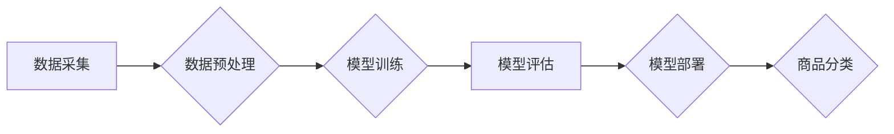

                 

## AI大模型在商品分类中的应用

> 关键词：商品分类、AI大模型、深度学习、卷积神经网络、自然语言处理、推荐系统、电商平台

## 1. 背景介绍

在当今数据爆炸的时代，商品分类作为电商平台的核心功能之一，显得尤为重要。传统的商品分类方法主要依赖人工标注和规则匹配，效率低下，难以适应海量商品和不断变化的商品属性。随着人工智能技术的快速发展，特别是深度学习技术的突破，AI大模型在商品分类领域展现出巨大的潜力。

AI大模型，指的是拥有大量参数、训练数据和计算资源的深度学习模型，能够学习复杂的模式和关系，实现更精准、高效的商品分类。相比传统方法，AI大模型具有以下优势：

* **自动学习**: AI大模型能够自动从海量商品数据中学习特征，无需人工设计规则，提高了分类效率和准确率。
* **适应性强**: AI大模型能够适应不断变化的商品属性和市场趋势，无需频繁更新规则，降低了维护成本。
* **可扩展性好**: AI大模型可以轻松扩展到更大的数据集和更复杂的分类任务，满足电商平台不断增长的需求。

## 2. 核心概念与联系

### 2.1  商品分类概述

商品分类是指将商品按照其属性、特征或类别进行组织和归类，以便于用户搜索、浏览和购买。商品分类的目的是提高用户体验，方便用户找到所需商品，并帮助电商平台更好地管理商品信息。

### 2.2  AI大模型的应用

AI大模型在商品分类中主要应用于以下几个方面：

* **图像识别**: 利用卷积神经网络（CNN）对商品图像进行识别，提取商品的视觉特征，例如颜色、形状、纹理等，进行分类。
* **文本分析**: 利用自然语言处理（NLP）技术对商品标题、描述、评论等文本进行分析，提取商品的语义特征，进行分类。
* **多模态融合**: 将图像识别和文本分析结果进行融合，构建更全面的商品特征，提高分类准确率。

### 2.3  AI大模型架构

AI大模型在商品分类中的应用通常采用以下架构：



**数据采集**: 从电商平台收集商品图像、文本信息等数据。

**数据预处理**: 对收集到的数据进行清洗、格式化、特征提取等处理，以便于模型训练。

**模型训练**: 利用深度学习算法，例如CNN、NLP等，对预处理后的数据进行训练，构建商品分类模型。

**模型评估**: 对训练好的模型进行评估，例如准确率、召回率、F1-score等指标，评估模型的性能。

**模型部署**: 将训练好的模型部署到电商平台，用于实际商品分类。

**商品分类**: 将用户上传的商品图像或文本信息输入到部署的模型中，模型根据训练好的知识进行分类，并返回分类结果。

## 3. 核心算法原理 & 具体操作步骤

### 3.1  算法原理概述

在商品分类中，常用的AI大模型算法包括卷积神经网络（CNN）和循环神经网络（RNN）。

* **卷积神经网络（CNN）**: CNN擅长处理图像数据，能够自动学习图像特征，例如边缘、纹理、形状等。在商品分类中，CNN可以提取商品图像的视觉特征，进行分类。
* **循环神经网络（RNN）**: RNN擅长处理序列数据，例如文本数据。在商品分类中，RNN可以提取商品文本信息的语义特征，进行分类。

### 3.2  算法步骤详解

**CNN算法步骤**:

1. **输入层**: 将商品图像输入到CNN模型的输入层。
2. **卷积层**: 利用卷积核对图像进行卷积运算，提取图像特征。
3. **池化层**: 对卷积层的输出进行池化运算，降低特征维度，提高模型鲁棒性。
4. **全连接层**: 将池化层的输出连接到全连接层，进行分类。
5. **输出层**: 输出商品分类结果。

**RNN算法步骤**:

1. **输入层**: 将商品文本信息输入到RNN模型的输入层。
2. **循环层**: 利用循环单元对文本信息进行处理，提取文本语义特征。
3. **全连接层**: 将循环层的输出连接到全连接层，进行分类。
4. **输出层**: 输出商品分类结果。

### 3.3  算法优缺点

**CNN算法**:

* **优点**: 能够自动学习图像特征，分类准确率高。
* **缺点**: 对文本数据处理能力较弱。

**RNN算法**:

* **优点**: 能够处理序列数据，对文本数据处理能力强。
* **缺点**: 训练难度大，容易出现梯度消失问题。

### 3.4  算法应用领域

* **电商平台**: 商品分类、推荐系统、搜索引擎等。
* **图像识别**: 物体识别、场景识别、人脸识别等。
* **自然语言处理**: 文本分类、情感分析、机器翻译等。

## 4. 数学模型和公式 & 详细讲解 & 举例说明

### 4.1  数学模型构建

在商品分类中，常用的数学模型包括逻辑回归模型和支持向量机模型。

**逻辑回归模型**:

逻辑回归模型是一种用于二分类问题的线性模型，其输出是一个概率值，表示样本属于某一类别的概率。

**公式**:

$$
P(y=1|x) = \frac{1}{1 + e^{-(w^T x + b)}}
$$

其中：

* $P(y=1|x)$ 表示样本 $x$ 属于类别 1 的概率。
* $w$ 是模型参数向量。
* $x$ 是样本特征向量。
* $b$ 是模型偏置项。

**支持向量机模型**:

支持向量机模型是一种用于分类问题的非线性模型，其目标是找到一个最佳的分隔超平面，将不同类别的数据点分开。

**公式**:

$$
\max_{w,b} \frac{1}{2} ||w||^2 - C \sum_{i=1}^{n} \xi_i
$$

其中：

* $w$ 是模型参数向量。
* $b$ 是模型偏置项。
* $C$ 是惩罚参数。
* $\xi_i$ 是松弛变量，用于容忍分类错误。

### 4.2  公式推导过程

逻辑回归模型的公式推导过程基于最大似然估计，其目标是找到最能解释观测数据的模型参数。

支持向量机模型的公式推导过程基于拉格朗日乘子法，其目标是找到最优的分隔超平面，同时满足约束条件。

### 4.3  案例分析与讲解

**案例**: 假设我们有一个商品分类任务，需要将商品分为“衣服”和“鞋子”两类。我们可以使用CNN模型对商品图像进行分类，或者使用RNN模型对商品标题进行分类。

**分析**:

* **CNN模型**: 可以提取商品图像的视觉特征，例如颜色、形状、纹理等，进行分类。
* **RNN模型**: 可以提取商品标题的语义特征，例如“衬衫”、“裤子”、“鞋子”、“运动鞋”等，进行分类。

**讲解**:

* 对于“衣服”类商品，CNN模型可以识别出衣服的形状、颜色等特征，RNN模型可以识别出衣服的名称、材质等语义特征。
* 对于“鞋子”类商品，CNN模型可以识别出鞋子的形状、颜色、材质等特征，RNN模型可以识别出鞋子的类型、品牌等语义特征。

## 5. 项目实践：代码实例和详细解释说明

### 5.1  开发环境搭建

* **操作系统**: Ubuntu 18.04 LTS
* **编程语言**: Python 3.7
* **深度学习框架**: TensorFlow 2.0
* **其他工具**: Jupyter Notebook、Git

### 5.2  源代码详细实现

```python
# 导入必要的库
import tensorflow as tf
from tensorflow.keras.models import Sequential
from tensorflow.keras.layers import Conv2D, MaxPooling2D, Flatten, Dense

# 定义CNN模型
model = Sequential()
model.add(Conv2D(32, (3, 3), activation='relu', input_shape=(224, 224, 3)))
model.add(MaxPooling2D((2, 2)))
model.add(Conv2D(64, (3, 3), activation='relu'))
model.add(MaxPooling2D((2, 2)))
model.add(Flatten())
model.add(Dense(10, activation='softmax'))

# 编译模型
model.compile(optimizer='adam',
              loss='sparse_categorical_crossentropy',
              metrics=['accuracy'])

# 训练模型
model.fit(x_train, y_train, epochs=10, batch_size=32)

# 评估模型
loss, accuracy = model.evaluate(x_test, y_test)
print('Loss:', loss)
print('Accuracy:', accuracy)
```

### 5.3  代码解读与分析

* **导入必要的库**: 首先导入 TensorFlow 库，以及一些常用的模型层和编译器。
* **定义CNN模型**: 使用 Sequential 模型构建一个 CNN 模型，包含卷积层、池化层、全连接层和输出层。
* **编译模型**: 使用 Adam 优化器、稀疏类别交叉熵损失函数和准确率指标编译模型。
* **训练模型**: 使用训练数据训练模型，设置训练轮数和批处理大小。
* **评估模型**: 使用测试数据评估模型的性能，打印损失和准确率。

### 5.4  运行结果展示

训练完成后，可以将模型保存下来，并在实际应用中使用。

## 6. 实际应用场景

### 6.1  电商平台商品分类

电商平台可以利用 AI大模型对商品进行自动分类，提高商品搜索和浏览效率，并为用户提供更精准的商品推荐。

### 6.2  图像识别应用

AI大模型在图像识别领域也有广泛应用，例如自动驾驶、医疗诊断、安防监控等。

### 6.3  自然语言处理应用

AI大模型在自然语言处理领域也有广泛应用，例如机器翻译、文本摘要、情感分析等。

### 6.4  未来应用展望

随着 AI 技术的不断发展，AI大模型在商品分类领域的应用将更加广泛和深入，例如：

* **多模态融合**: 将图像识别、文本分析、语音识别等多模态数据融合，构建更全面的商品特征，提高分类准确率。
* **个性化推荐**: 根据用户的历史购买记录、浏览记录等数据，构建个性化的商品分类模型，提供更精准的商品推荐。
* **动态分类**: 随着商品属性和市场趋势的变化，AI大模型可以动态更新商品分类规则，保持分类准确率。

## 7. 工具和资源推荐

### 7.1  学习资源推荐

* **书籍**:
    * 深度学习
    * 构建深度学习模型
* **在线课程**:
    * Coursera 深度学习课程
    * Udacity 深度学习工程师课程

### 7.2  开发工具推荐

* **深度学习框架**: TensorFlow, PyTorch, Keras
* **编程语言**: Python
* **数据处理工具**: Pandas, NumPy

### 7.3  相关论文推荐

* **AlexNet**: ImageNet Classification with Deep Convolutional Neural Networks
* **ResNet**: Deep Residual Learning for Image Recognition
* **BERT**: Pre-training of Deep Bidirectional Transformers for Language Understanding

## 8. 总结：未来发展趋势与挑战

### 8.1  研究成果总结

AI大模型在商品分类领域取得了显著成果，能够实现更高的分类准确率和更智能的商品推荐。

### 8.2  未来发展趋势

* **模型规模**: AI大模型的规模将继续扩大，训练数据量和模型参数量将不断增加。
* **模型效率**: 研究人员将致力于提高 AI大模型的训练效率和推理效率。
* **模型解释性**: 研究人员将致力于提高 AI大模型的解释性，使模型的决策过程更加透明。

### 8.3  面临的挑战

* **数据获取**: 高质量的商品数据是训练 AI大模型的关键，但获取高质量数据的成本较高。
* **模型训练**: 训练大型 AI大模型需要大量的计算资源和时间。
* **模型部署**: 将训练好的 AI大模型部署到实际应用场景中需要克服一些技术挑战。

### 8.4  研究展望

未来，AI大模型在商品分类领域的应用将更加广泛和深入，为电商平台、图像识别、自然语言处理等领域带来新的机遇。


## 9. 附录：常见问题与解答

**Q1: AI大模型的分类准确率如何？**

A1: AI大模型的分类准确率取决于模型的架构、训练数据和评估指标。一般来说，AI大模型的分类准确率可以达到 90% 以上。

**Q2: 如何训练一个 AI大模型？**

A2: 训练一个 AI大模型需要准备大量的训练数据、选择合适的模型架构、使用合适的优化器和损失函数，并进行多次训练和评估。

**Q3: 如何部署一个 AI大模型？**

A3: 部署一个 AI大模型需要将模型转换为可执行文件，并将其部署到服务器或云平台上。


作者：禅与计算机程序设计艺术 / Zen and the Art of Computer Programming 
<end_of_turn>

