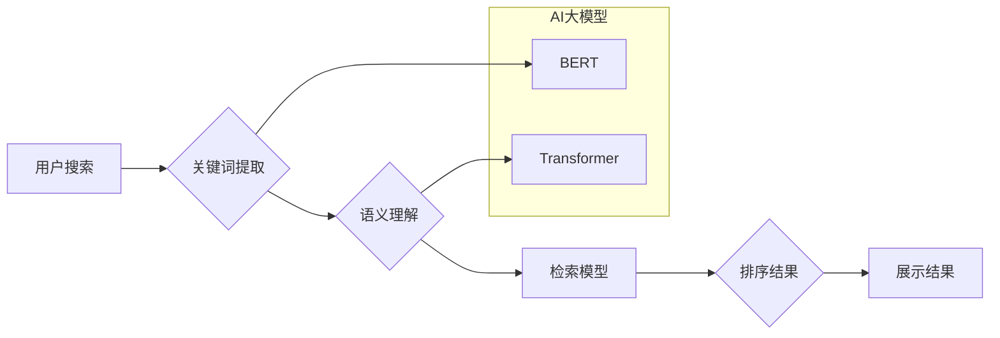

                 

## AI大模型如何优化电商搜索的召回率

> 关键词：电商搜索、召回率、AI大模型、自然语言处理、BERT、Transformer、检索模型、信息检索、推荐系统

## 1. 背景介绍

电商平台的搜索引擎是用户获取商品信息的关键入口，其搜索结果的质量直接影响着用户体验和转化率。传统的电商搜索引擎主要依赖于关键词匹配和基于TF-IDF的文本相似度计算，但这些方法难以捕捉用户搜索意图的复杂性和语义关联，导致召回率低、结果不精准。

近年来，随着深度学习技术的快速发展，AI大模型在信息检索领域展现出巨大的潜力。AI大模型，特别是基于Transformer架构的模型，能够学习到更丰富的语义信息，有效提升搜索结果的质量和召回率。

## 2. 核心概念与联系

### 2.1  电商搜索召回率

召回率（Recall）是信息检索领域的重要指标，它衡量了检索系统在返回所有相关结果中，能够准确检索到多少个相关结果的比例。在电商搜索场景中，召回率越高，意味着搜索引擎能够更好地理解用户需求，并返回更符合用户意图的商品结果。

### 2.2  AI大模型

AI大模型是指参数规模庞大、训练数据海量的人工智能模型，通常具有强大的泛化能力和语义理解能力。常见的AI大模型包括BERT、GPT、T5等。

### 2.3  自然语言处理（NLP）

自然语言处理（NLP）是人工智能的一个分支，旨在使计算机能够理解、处理和生成人类语言。NLP技术在电商搜索中扮演着至关重要的角色，例如：

* **关键词提取:** 从用户搜索词中提取关键信息，用于构建检索查询。
* **语义理解:** 理解用户搜索词背后的意图和需求，例如用户可能想要搜索类似商品、替代品或相关信息。
* **文本相似度计算:** 计算商品描述与用户搜索词之间的相似度，用于排序搜索结果。

### 2.4  检索模型

检索模型是信息检索系统的核心组件，负责根据用户查询和文档内容，返回最相关的文档结果。传统的检索模型主要基于关键词匹配和TF-IDF算法，而AI大模型可以学习到更丰富的语义信息，从而提升检索效果。

**核心概念与联系流程图**



## 3. 核心算法原理 & 具体操作步骤

### 3.1  算法原理概述

AI大模型在电商搜索中主要用于提升检索模型的性能。常见的AI大模型架构包括BERT和Transformer。

* **BERT (Bidirectional Encoder Representations from Transformers):** BERT是一种双向编码器模型，能够理解上下文信息，并学习到词语之间的语义关系。

* **Transformer:** Transformer是一种基于注意力机制的模型，能够捕捉长距离依赖关系，并学习到更复杂的语义表示。

这些模型通过预训练的方式学习到丰富的语言知识，然后在电商搜索场景中进行微调，以提升检索效果。

### 3.2  算法步骤详解

1. **数据预处理:** 将电商平台的商品数据和用户搜索词进行清洗、格式化和分词等预处理操作。
2. **模型训练:** 使用预训练的BERT或Transformer模型，对电商平台的数据进行微调，训练出一个新的检索模型。
3. **模型评估:** 使用测试数据评估检索模型的性能，例如召回率、准确率和F1-score等指标。
4. **模型部署:** 将训练好的检索模型部署到电商平台的搜索引擎中，用于处理用户搜索请求。

### 3.3  算法优缺点

**优点:**

* 能够捕捉用户搜索意图的复杂性和语义关联。
* 提升召回率和搜索结果的精准度。
* 能够处理自然语言查询，提升用户体验。

**缺点:**

* 训练数据量大，计算资源需求高。
* 模型参数量大，部署成本较高。
* 需要专业的技术人员进行模型训练和维护。

### 3.4  算法应用领域

* **电商搜索:** 提升商品搜索的召回率和精准度。
* **问答系统:** 理解用户问题，并提供准确的答案。
* **文本分类:** 将文本自动分类到不同的类别。
* **机器翻译:** 将文本从一种语言翻译成另一种语言。

## 4. 数学模型和公式 & 详细讲解 & 举例说明

### 4.1  数学模型构建

在电商搜索场景中，可以使用基于概率的数学模型来表示商品和用户搜索词之间的相关性。例如，可以使用余弦相似度来衡量商品描述和用户搜索词之间的语义相似度。

**余弦相似度公式:**

$$
\text{cosine similarity}(A, B) = \frac{A \cdot B}{||A|| ||B||}
$$

其中：

* $A$ 和 $B$ 分别表示商品描述和用户搜索词的向量表示。
* $A \cdot B$ 表示 $A$ 和 $B$ 的点积。
* $||A||$ 和 $||B||$ 分别表示 $A$ 和 $B$ 的模长。

### 4.2  公式推导过程

余弦相似度的计算过程如下：

1. 将商品描述和用户搜索词分别转换为向量表示。
2. 计算两个向量的点积。
3. 计算两个向量的模长。
4. 将点积除以两个向量的模长乘积，得到余弦相似度。

### 4.3  案例分析与讲解

假设有一个商品描述为 "红色运动鞋"，用户搜索词为 "运动鞋"。

1. 将商品描述和用户搜索词分别转换为向量表示。例如，可以使用Word2Vec模型将每个词语映射到一个向量空间中。
2. 计算两个向量的点积。
3. 计算两个向量的模长。
4. 将点积除以两个向量的模长乘积，得到余弦相似度。

如果余弦相似度较高，则表示商品描述和用户搜索词之间语义相似，搜索引擎会将该商品返回到搜索结果中。

## 5. 项目实践：代码实例和详细解释说明

### 5.1  开发环境搭建

* Python 3.6+
* TensorFlow/PyTorch
* NLTK/SpaCy

### 5.2  源代码详细实现

```python
# 使用BERT模型进行商品搜索

from transformers import AutoTokenizer, AutoModel

# 加载预训练的BERT模型和分词器
model_name = "bert-base-uncased"
tokenizer = AutoTokenizer.from_pretrained(model_name)
model = AutoModel.from_pretrained(model_name)

# 将商品描述和用户搜索词转换为BERT模型的输入格式
def preprocess_text(text):
    inputs = tokenizer(text, return_tensors="pt")
    return inputs

# 使用BERT模型获取商品描述和用户搜索词的语义表示
def get_embedding(text):
    inputs = preprocess_text(text)
    outputs = model(**inputs)
    embedding = outputs.last_hidden_state[:, 0, :]
    return embedding

# 计算商品描述和用户搜索词之间的余弦相似度
def calculate_similarity(query_embedding, doc_embedding):
    similarity = torch.cosine_similarity(query_embedding, doc_embedding)
    return similarity.item()

# 示例代码
query = "运动鞋"
doc = "红色运动鞋"

query_embedding = get_embedding(query)
doc_embedding = get_embedding(doc)

similarity = calculate_similarity(query_embedding, doc_embedding)

print(f"商品描述和用户搜索词之间的相似度: {similarity}")
```

### 5.3  代码解读与分析

* 该代码首先加载预训练的BERT模型和分词器。
* 然后定义了两个函数：`preprocess_text`用于将文本转换为BERT模型的输入格式，`get_embedding`用于获取文本的语义表示。
* 接着定义了一个函数`calculate_similarity`用于计算两个向量的余弦相似度。
* 最后，示例代码演示了如何使用这些函数计算商品描述和用户搜索词之间的相似度。

### 5.4  运行结果展示

运行该代码后，会输出商品描述和用户搜索词之间的相似度值。

## 6. 实际应用场景

AI大模型在电商搜索场景中的应用非常广泛，例如：

* **个性化推荐:** 根据用户的搜索历史、购买记录和浏览行为，推荐个性化的商品结果。
* **智能补全:** 在用户输入搜索词时，智能预测用户想要搜索的内容，并提供补全建议。
* **搜索结果排序:** 使用AI大模型学习用户偏好，对搜索结果进行排序，提升用户体验。
* **跨语言搜索:** 支持多语言搜索，方便用户使用不同语言进行商品查询。

### 6.4  未来应用展望

未来，AI大模型在电商搜索领域的应用将更加深入和广泛，例如：

* **多模态搜索:** 支持图像、视频等多模态的搜索，提升搜索的丰富性和准确性。
* **对话式搜索:** 使用对话式交互方式，更自然地理解用户的搜索意图。
* **实时搜索:** 能够实时更新商品信息和搜索结果，提供更及时和准确的搜索体验。

## 7. 工具和资源推荐

### 7.1  学习资源推荐

* **BERT论文:** https://arxiv.org/abs/1810.04805
* **Transformer论文:** https://arxiv.org/abs/1706.03762
* **HuggingFace Transformers库:** https://huggingface.co/transformers/

### 7.2  开发工具推荐

* **TensorFlow:** https://www.tensorflow.org/
* **PyTorch:** https://pytorch.org/
* **NLTK:** https://www.nltk.org/
* **SpaCy:** https://spacy.io/

### 7.3  相关论文推荐

* **BERT for Question Answering:** https://arxiv.org/abs/1901.09053
* **XLNet: Generalized Autoregressive Pretraining for Language Understanding:** https://arxiv.org/abs/1906.08237
* **T5: Text-to-Text Transfer Transformer:** https://arxiv.org/abs/1910.10683

## 8. 总结：未来发展趋势与挑战

### 8.1  研究成果总结

AI大模型在电商搜索领域取得了显著的成果，例如：

* 提升了召回率和精准度。
* 提升了用户体验。
* 推动了个性化推荐和智能补全等新功能的开发。

### 8.2  未来发展趋势

* **多模态搜索:** 将图像、视频等多模态信息融入到搜索引擎中。
* **对话式搜索:** 使用对话式交互方式，更自然地理解用户的搜索意图。
* **实时搜索:** 能够实时更新商品信息和搜索结果。
* **联邦学习:** 在保护用户隐私的前提下，利用多平台的数据进行模型训练。

### 8.3  面临的挑战

* **数据规模和质量:** AI大模型需要海量的数据进行训练，而电商平台的数据往往存在噪声和不完整性。
* **模型复杂性和训练成本:** AI大模型的训练成本很高，需要强大的计算资源。
* **模型解释性和可解释性:** AI大模型的决策过程往往难以解释，这可能会导致用户对搜索结果的信任度降低。

### 8.4  研究展望

未来，研究者将继续探索新的AI大模型架构和训练方法，以解决上述挑战，并进一步提升电商搜索的性能和用户体验。


## 9. 附录：常见问题与解答

**Q1: AI大模型的训练需要多少数据？**

A1: AI大模型的训练数据量通常非常庞大，可能需要数百万甚至数十亿个样本。

**Q2: AI大模型的训练成本很高吗？**

A2: 是的，AI大模型的训练成本很高，需要强大的计算资源和大量的电力消耗。

**Q3: 如何评估AI大模型的性能？**

A3: 可以使用召回率、准确率、F1-score等指标来评估AI大模型的性能。

**Q4: AI大模型的决策过程是否透明？**

A4: 由于AI大模型的复杂性，其决策过程往往难以解释，这可能会导致用户对搜索结果的信任度降低。


作者：禅与计算机程序设计艺术 / Zen and the Art of Computer Programming 
<end_of_turn>

