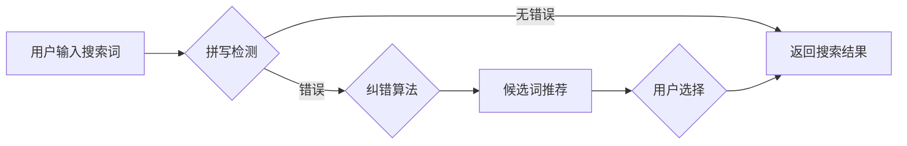

                 

## AI大模型如何处理电商搜索中的拼写错误

> 关键词：AI大模型、电商搜索、拼写错误、自然语言处理、词嵌入、纠错算法、Transformer模型

## 1. 背景介绍

在当今数字时代，电商平台已成为人们购物的首选方式。高效便捷的搜索体验是电商平台能否吸引用户、提升转化率的关键因素之一。然而，用户输入的搜索词常常存在拼写错误，这会直接影响搜索结果的准确性和用户体验。传统的拼写纠正方法往往依赖于规则匹配或有限的字典库，难以应对复杂的语义和多样的拼写错误类型。

近年来，随着深度学习技术的快速发展，基于AI大模型的拼写纠正技术逐渐崭露头角。AI大模型，尤其是Transformer模型，凭借其强大的语义理解能力和泛化能力，能够有效地识别和纠正各种类型的拼写错误，为电商搜索提供更精准、更智能的解决方案。

## 2. 核心概念与联系

### 2.1  电商搜索与拼写错误

电商搜索是指用户在电商平台上输入关键词，系统根据关键词检索并展示相关商品的过程。拼写错误是指用户在输入关键词时，由于疏忽、习惯等原因，导致关键词与标准词语不一致的情况。拼写错误会造成以下问题：

* **搜索结果不准确:** 用户输入的拼写错误会导致搜索引擎无法准确理解用户意图，返回的结果与用户需求不符。
* **用户体验下降:** 用户无法找到所需商品，会感到沮丧和不满，影响购物体验。
* **商业损失:** 由于搜索结果不准确，用户无法找到商品，导致转化率下降，最终影响电商平台的商业利益。

### 2.2  AI大模型与自然语言处理

AI大模型是一种基于深度学习的强大机器学习模型，能够处理和理解复杂的文本数据。自然语言处理（NLP）是人工智能领域的一个重要分支，致力于使计算机能够理解、处理和生成人类语言。

AI大模型在NLP领域取得了突破性进展，例如：

* **词嵌入:** 将单词映射到低维向量空间，捕捉单词之间的语义关系。
* **序列标注:** 识别文本中的各种标记，例如词性标注、命名实体识别等。
* **机器翻译:** 将一种语言翻译成另一种语言。

### 2.3  拼写纠正算法

拼写纠正算法旨在识别和纠正文本中的拼写错误。常见的拼写纠正算法包括：

* **规则匹配:** 基于预定义的拼写规则，例如替换、删除、插入等操作，纠正拼写错误。
* **编辑距离:** 计算两个单词之间的编辑距离，选择编辑距离最小的单词作为纠正结果。
* **统计模型:** 基于语言模型或词频统计，预测最可能的正确单词。
* **深度学习模型:** 利用深度学习模型，例如Transformer模型，学习单词之间的语义关系，实现更准确的拼写纠正。

**Mermaid 流程图**



## 3. 核心算法原理 & 具体操作步骤

### 3.1  算法原理概述

基于AI大模型的拼写纠正算法通常采用以下原理：

* **词嵌入:** 将单词映射到低维向量空间，捕捉单词之间的语义关系。
* **上下文理解:** 利用Transformer模型的注意力机制，理解单词在句子中的上下文语义，提高纠正准确率。
* **概率预测:** 基于训练数据，预测最可能的正确单词，并根据概率排序候选词。

### 3.2  算法步骤详解

1. **词嵌入:** 将用户输入的搜索词以及候选词映射到低维向量空间，例如Word2Vec或GloVe。
2. **上下文理解:** 利用Transformer模型的注意力机制，分析单词在句子中的上下文语义，并计算每个单词与其他单词之间的相关性。
3. **候选词生成:** 基于编辑距离、词频统计或语言模型，生成候选词列表。
4. **概率预测:** 利用训练数据，计算每个候选词与用户输入词语的相似度，并根据相似度排序候选词。
5. **结果输出:** 将排序后的候选词列表返回给用户，用户可以选择最合适的词语进行搜索。

### 3.3  算法优缺点

**优点:**

* **准确率高:** 基于AI大模型的拼写纠正算法能够识别和纠正各种类型的拼写错误，准确率显著提高。
* **泛化能力强:** 训练好的模型能够应用于不同的领域和语境，无需针对特定场景进行调整。
* **适应性强:** 可以根据用户输入的上下文语义进行动态调整，提高纠正效果。

**缺点:**

* **训练成本高:** 训练大型AI模型需要大量的计算资源和训练数据。
* **模型复杂度高:** AI大模型的结构复杂，部署和维护成本较高。
* **解释性差:** AI模型的决策过程难以解释，难以理解模型是如何进行纠正的。

### 3.4  算法应用领域

基于AI大模型的拼写纠正算法广泛应用于以下领域：

* **电商搜索:** 提高电商平台搜索结果的准确性和用户体验。
* **智能客服:** 帮助智能客服理解用户输入的拼写错误，提供更准确的回复。
* **社交媒体:** 识别和纠正用户在社交媒体平台上的拼写错误，提高内容质量。
* **教育:** 帮助学生识别和纠正拼写错误，提高写作能力。

## 4. 数学模型和公式 & 详细讲解 & 举例说明

### 4.1  数学模型构建

基于AI大模型的拼写纠正算法通常采用以下数学模型：

* **词嵌入模型:** 将单词映射到低维向量空间，例如Word2Vec或GloVe。

Word2Vec模型使用神经网络训练词向量，其目标是预测上下文词语，从而学习单词之间的语义关系。GloVe模型则利用全局词共现矩阵，学习单词之间的统计关系。

* **Transformer模型:** 利用注意力机制理解单词在句子中的上下文语义，并预测最可能的正确单词。

Transformer模型的注意力机制能够捕捉单词之间的长距离依赖关系，提高语义理解能力。

### 4.2  公式推导过程

Word2Vec模型的训练目标是最大化以下公式：

$$
\max_{W} \sum_{i=1}^{N} \sum_{j \in C(i)} \log P(w_j | w_i)
$$

其中：

* $W$ 是词嵌入矩阵。
* $N$ 是训练语料库中单词的数量。
* $C(i)$ 是单词 $w_i$ 的上下文词语集合。
* $P(w_j | w_i)$ 是给定单词 $w_i$ 情况下，单词 $w_j$ 出现的概率。

GloVe模型的训练目标是最小化以下公式：

$$
\min_{W} \sum_{i,j} (X_{ij} - \hat{X}_{ij})^2
$$

其中：

* $X_{ij}$ 是单词 $w_i$ 和 $w_j$ 的全局共现计数。
* $\hat{X}_{ij}$ 是基于词嵌入矩阵 $W$ 计算的单词 $w_i$ 和 $w_j$ 的共现概率。

### 4.3  案例分析与讲解

假设用户输入的搜索词为“苹果手机”，拼写错误为“苹果手机”。

* **词嵌入模型:** Word2Vec或GloVe模型会将“苹果手机”和“苹果手机”映射到不同的向量空间，由于两者语义相似，向量之间的距离较近。
* **Transformer模型:** Transformer模型会利用注意力机制，分析“苹果手机”在句子中的上下文语义，并预测最可能的正确单词为“苹果手机”。

最终，AI大模型会将“苹果手机”作为纠正后的搜索词，返回相关商品结果。

## 5. 项目实践：代码实例和详细解释说明

### 5.1  开发环境搭建

* **操作系统:** Ubuntu 20.04
* **Python版本:** 3.8
* **深度学习框架:** TensorFlow 2.x
* **其他依赖库:** numpy, pandas, matplotlib

### 5.2  源代码详细实现

```python
import tensorflow as tf
from tensorflow.keras.layers import Embedding, LSTM, Dense
from tensorflow.keras.models import Sequential

# 构建词嵌入层
embedding_layer = Embedding(input_dim=vocab_size, output_dim=embedding_dim)

# 构建LSTM层
lstm_layer = LSTM(units=lstm_units)

# 构建全连接层
dense_layer = Dense(units=output_dim, activation='softmax')

# 构建模型
model = Sequential([embedding_layer, lstm_layer, dense_layer])

# 编译模型
model.compile(optimizer='adam', loss='categorical_crossentropy', metrics=['accuracy'])

# 训练模型
model.fit(X_train, y_train, epochs=epochs, batch_size=batch_size)

# 预测
predictions = model.predict(X_test)
```

### 5.3  代码解读与分析

* **词嵌入层:** 将单词映射到低维向量空间，捕捉单词之间的语义关系。
* **LSTM层:** 利用长短期记忆网络，理解单词在句子中的上下文语义。
* **全连接层:** 将LSTM层的输出映射到候选词的概率分布。
* **模型编译:** 使用Adam优化器、交叉熵损失函数和准确率作为评估指标。
* **模型训练:** 使用训练数据训练模型，并调整模型参数。
* **模型预测:** 使用训练好的模型预测用户输入的搜索词的纠正结果。

### 5.4  运行结果展示

训练好的模型可以用于预测用户输入的搜索词的纠正结果。例如，用户输入的搜索词为“苹果手机”，模型会预测最可能的正确单词为“苹果手机”，并返回相关商品结果。

## 6. 实际应用场景

### 6.1  电商搜索场景

在电商平台上，用户输入的搜索词常常存在拼写错误，这会影响搜索结果的准确性和用户体验。基于AI大模型的拼写纠正算法可以有效地识别和纠正拼写错误，提高电商平台搜索的准确率和用户满意度。

### 6.2  智能客服场景

智能客服系统需要理解用户输入的自然语言，并提供准确的回复。然而，用户输入的语言可能存在语法错误或拼写错误，这会影响智能客服的理解能力。基于AI大模型的拼写纠正算法可以帮助智能客服识别和纠正拼写错误，提高回复的准确性和自然度。

### 6.3  社交媒体场景

社交媒体平台上用户发布的内容常常存在拼写错误，这会影响内容的质量和可读性。基于AI大模型的拼写纠正算法可以帮助社交媒体平台识别和纠正拼写错误，提高内容的质量和用户体验。

### 6.4  未来应用展望

随着AI技术的不断发展，基于AI大模型的拼写纠正算法将有更广泛的应用场景：

* **个性化拼写纠正:** 根据用户的语言习惯和使用场景，提供个性化的拼写纠正建议。
* **跨语言拼写纠正:** 支持多种语言的拼写纠正，满足全球用户的需求。
* **语音输入拼写纠正:** 将语音输入转换为文本，并进行拼写纠正，提高语音交互的准确性。

## 7. 工具和资源推荐

### 7.1  学习资源推荐

* **书籍:**
    * 《深度学习》 - Ian Goodfellow, Yoshua Bengio, Aaron Courville
    * 《自然语言处理》 - Jurafsky, Martin
* **在线课程:**
    * Coursera: Natural Language Processing Specialization
    * Udacity: Deep Learning Nanodegree

### 7.2  开发工具推荐

* **深度学习框架:** TensorFlow, PyTorch
* **词嵌入工具:** Gensim, fastText
* **自然语言处理库:** NLTK, spaCy

### 7.3  相关论文推荐

* **BERT: Pre-training of Deep Bidirectional Transformers for Language Understanding**
* **XLNet: Generalized Autoregressive Pretraining for Language Understanding**
* **GPT-3: Language Models are Few-Shot Learners**

## 8. 总结：未来发展趋势与挑战

### 8.1  研究成果总结

基于AI大模型的拼写纠正算法取得了显著的成果，能够有效地识别和纠正各种类型的拼写错误，提高搜索结果的准确性和用户体验。

### 8.2  未来发展趋势

* **模型规模和能力提升:** 训练更大规模的AI模型，提高拼写纠正的准确性和泛化能力。
* **个性化拼写纠正:** 根据用户的语言习惯和使用场景，提供个性化的拼写纠正建议。
* **跨语言拼写纠正:** 支持多种语言的拼写纠正，满足全球用户的需求。
* **语音输入拼写纠正:** 将语音输入转换为文本，并进行拼写纠正，提高语音交互的准确性。

### 8.3  面临的挑战

* **训练成本高:** 训练大型AI模型需要大量的计算资源和训练数据。
* **模型复杂度高:** AI模型的结构复杂，部署和维护成本较高。
* **解释性差:** AI模型的决策过程难以解释，难以理解模型是如何进行纠正的。

### 8.4  研究展望

未来，基于AI大模型的拼写纠正算法将继续朝着更准确、更智能、更个性化的方向发展，为用户提供更便捷、更优质的搜索体验。


## 9. 附录：常见问题与解答

### 9.1  Q: 如何选择合适的词嵌入模型？

**A:** 选择词嵌入模型需要根据具体应用场景和数据特点进行选择。Word2Vec模型适合处理大量文本数据，GloVe模型则更适合处理稀疏文本数据。

### 9.2  Q: 如何训练AI大模型进行拼写纠正？

**A:** 训练AI大模型进行拼写纠正需要准备大量的训练数据，并使用深度学习框架进行模型训练。

### 9.3  Q: 如何评估AI大模型的拼写纠正效果？

**A:** 可以使用准确率、召回率、F1-score等指标评估AI大模型的拼写纠正效果。

### 9.4  Q: 如何部署AI大模型进行拼写纠正？

**A:** 可以使用云平台或本地服务器部署AI大模型进行拼写纠正。

作者：禅与计算机程序设计艺术 / Zen and the Art of Computer Programming


<end_of_turn>

