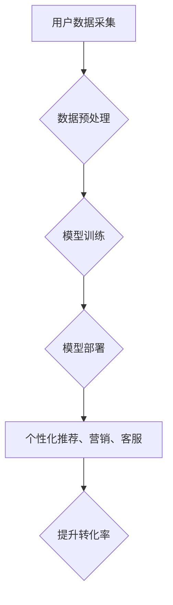

                 

## AI大模型如何提升电商转化率

> 关键词：电商转化率、AI大模型、自然语言处理、推荐系统、个性化营销、用户画像、机器学习、深度学习

## 1. 背景介绍

在当今数字化时代，电商平台竞争日益激烈，提升转化率成为各大电商平台的核心目标。传统电商营销手段如广告投放、促销活动等，虽然有一定效果，但难以精准触达目标用户，且成本逐年攀升。而人工智能（AI）技术的快速发展为电商行业带来了新的机遇。

AI大模型，作为人工智能领域的一项重要突破，凭借其强大的学习和推理能力，能够深度挖掘用户数据，精准分析用户需求，并提供个性化推荐和营销服务，从而有效提升电商转化率。

## 2. 核心概念与联系

### 2.1  电商转化率

电商转化率是指访问电商平台的用户中，最终完成购买行为的用户比例。它是一个衡量电商平台运营效率的重要指标，直接关系到平台的盈利能力。

### 2.2  AI大模型

AI大模型是指在海量数据上训练的深度学习模型，拥有强大的泛化能力和学习能力。它能够理解和处理复杂的语言、图像、音频等数据，并进行精准的预测和分析。

### 2.3  AI大模型在电商中的应用

AI大模型在电商领域可以应用于多个环节，例如：

* **用户画像构建:** 通过分析用户的浏览历史、购买记录、评论等数据，构建用户画像，了解用户的兴趣爱好、消费习惯等信息。
* **商品推荐:** 根据用户的兴趣和需求，推荐相关的商品，提高用户购买意愿。
* **个性化营销:** 根据用户的画像，进行个性化的营销推广，提高营销效果。
* **客服机器人:** 利用自然语言处理技术，开发智能客服机器人，为用户提供24小时在线服务。

**AI大模型在电商中的应用流程:**



## 3. 核心算法原理 & 具体操作步骤

### 3.1  算法原理概述

AI大模型在电商转化率提升中的核心算法主要包括：

* **深度学习算法:** 

    * **卷积神经网络 (CNN):** 用于图像识别和处理，可以分析商品图片，识别商品类别、属性等信息。
    * **循环神经网络 (RNN):** 用于序列数据处理，可以分析用户的浏览历史、购买记录等序列数据，预测用户的下一步行为。
    * **Transformer:** 用于自然语言处理，可以理解和处理用户文本数据，例如评论、搜索词等，挖掘用户需求和意图。

* **推荐算法:** 

    * **协同过滤:** 基于用户的历史行为和商品的相似度进行推荐。
    * **内容过滤:** 基于商品的属性和用户兴趣进行推荐。
    * **混合推荐:** 结合协同过滤和内容过滤算法进行推荐。

### 3.2  算法步骤详解

**以深度学习算法为例，详细说明其在电商转化率提升中的应用步骤:**

1. **数据采集:** 收集用户数据、商品数据、交易数据等。
2. **数据预处理:** 清洗、转换、格式化数据，使其适合模型训练。
3. **模型选择:** 根据具体应用场景选择合适的深度学习算法模型。
4. **模型训练:** 利用训练数据训练模型，调整模型参数，使其能够准确预测用户行为。
5. **模型评估:** 使用测试数据评估模型性能，例如准确率、召回率等。
6. **模型部署:** 将训练好的模型部署到线上环境，用于实时预测和推荐。

### 3.3  算法优缺点

**深度学习算法:**

* **优点:** 能够学习复杂的数据模式，具有较高的预测精度。
* **缺点:** 需要大量的训练数据，训练时间较长，模型解释性较差。

**推荐算法:**

* **优点:** 可以根据用户的兴趣和需求进行精准推荐，提高用户体验。
* **缺点:** 容易陷入冷启动问题，需要不断更新和优化算法模型。

### 3.4  算法应用领域

* **商品推荐:** 推荐用户可能感兴趣的商品，提高用户购买意愿。
* **个性化营销:** 根据用户的画像，进行个性化的营销推广，提高营销效果。
* **用户画像构建:** 分析用户的行为数据，构建用户画像，了解用户的兴趣爱好、消费习惯等信息。
* **客服机器人:** 利用自然语言处理技术，开发智能客服机器人，为用户提供24小时在线服务。

## 4. 数学模型和公式 & 详细讲解 & 举例说明

### 4.1  数学模型构建

在电商转化率提升中，常用的数学模型包括：

* **线性回归模型:** 用于预测用户购买概率。
* **逻辑回归模型:** 用于分类用户，例如将用户分为购买用户和非购买用户。
* **支持向量机 (SVM):** 用于分类和回归，可以处理高维数据。

### 4.2  公式推导过程

**以线性回归模型为例，其公式如下:**

$$
y = \beta_0 + \beta_1x_1 + \beta_2x_2 + ... + \beta_nx_n + \epsilon
$$

其中:

* $y$ 是预测值，例如用户购买概率。
* $\beta_0, \beta_1, ..., \beta_n$ 是模型参数，需要通过训练数据进行学习。
* $x_1, x_2, ..., x_n$ 是输入特征，例如用户的年龄、性别、购买历史等。
* $\epsilon$ 是误差项。

模型参数的学习过程通常使用最小二乘法，其目标是找到使预测值与实际值误差最小的一组参数。

### 4.3  案例分析与讲解

假设我们想要预测用户的购买概率，输入特征包括用户的年龄、性别、购买历史等。我们可以使用线性回归模型进行预测，并通过训练数据学习模型参数。

例如，如果模型训练结果显示，用户的年龄和购买历史对购买概率有正向影响，而性别对购买概率没有显著影响，那么我们可以根据用户的年龄和购买历史进行预测。

## 5. 项目实践：代码实例和详细解释说明

### 5.1  开发环境搭建

* **操作系统:** Linux/macOS/Windows
* **编程语言:** Python
* **深度学习框架:** TensorFlow/PyTorch
* **数据处理库:** Pandas/NumPy
* **机器学习库:** Scikit-learn

### 5.2  源代码详细实现

```python
# 导入必要的库
import pandas as pd
from sklearn.linear_model import LogisticRegression

# 加载数据
data = pd.read_csv("电商数据.csv")

# 数据预处理
# ...

# 训练模型
model = LogisticRegression()
model.fit(data.drop("购买概率", axis=1), data["购买概率"])

# 预测
predictions = model.predict(new_data)

# 评估模型性能
# ...
```

### 5.3  代码解读与分析

* **数据加载:** 使用 Pandas 库加载电商数据。
* **数据预处理:** 对数据进行清洗、转换、特征工程等操作，使其适合模型训练。
* **模型训练:** 使用 LogisticRegression 模型训练，将用户数据作为输入，预测用户购买概率。
* **模型预测:** 使用训练好的模型对新数据进行预测。
* **模型评估:** 使用评估指标，例如准确率、召回率等，评估模型性能。

### 5.4  运行结果展示

运行结果展示用户购买概率的预测值，以及模型的评估指标。

## 6. 实际应用场景

### 6.1  个性化商品推荐

AI大模型可以根据用户的浏览历史、购买记录、兴趣爱好等信息，推荐个性化的商品，提高用户购买意愿。例如，电商平台可以根据用户的浏览历史，推荐用户可能感兴趣的商品，或者根据用户的购买记录，推荐用户可能需要的商品。

### 6.2  精准营销推广

AI大模型可以分析用户的画像，进行精准的营销推广，提高营销效果。例如，电商平台可以根据用户的年龄、性别、兴趣爱好等信息，推送个性化的广告，或者根据用户的购买行为，发送个性化的促销信息。

### 6.3  智能客服机器人

AI大模型可以用于开发智能客服机器人，为用户提供24小时在线服务，解答用户疑问，处理用户投诉等。例如，电商平台可以开发一个智能客服机器人，帮助用户查询商品信息、下单、退换货等。

### 6.4  未来应用展望

随着AI技术的不断发展，AI大模型在电商领域的应用场景将更加广泛，例如：

* **虚拟试衣间:** 利用计算机视觉技术，实现虚拟试衣间，让用户在家就能试穿衣服。
* **智能导购:** 利用自然语言处理技术，开发智能导购机器人，为用户提供个性化的购物建议。
* **个性化价格策略:** 利用AI大模型分析用户的购买行为，制定个性化的价格策略，提高用户购买意愿。

## 7. 工具和资源推荐

### 7.1  学习资源推荐

* **书籍:**
    * 《深度学习》
    * 《机器学习实战》
    * 《Python机器学习》
* **在线课程:**
    * Coursera
    * edX
    * Udacity

### 7.2  开发工具推荐

* **深度学习框架:** TensorFlow, PyTorch
* **数据处理库:** Pandas, NumPy
* **机器学习库:** Scikit-learn

### 7.3  相关论文推荐

* **Attention Is All You Need:** https://arxiv.org/abs/1706.03762
* **BERT: Pre-training of Deep Bidirectional Transformers for Language Understanding:** https://arxiv.org/abs/1810.04805

## 8. 总结：未来发展趋势与挑战

### 8.1  研究成果总结

AI大模型在电商转化率提升方面取得了显著成果，例如：

* **提高商品推荐准确率:** AI大模型可以根据用户的兴趣和需求进行精准推荐，提高用户购买意愿。
* **提升营销效果:** AI大模型可以分析用户的画像，进行精准的营销推广，提高营销效果。
* **优化用户体验:** AI大模型可以用于开发智能客服机器人，为用户提供24小时在线服务，提高用户体验。

### 8.2  未来发展趋势

* **模型更加个性化:** 未来AI大模型将更加注重个性化，能够根据用户的细微变化进行精准的预测和推荐。
* **跨模态融合:** 未来AI大模型将融合多模态数据，例如文本、图像、音频等，提供更加全面的用户体验。
* **解释性更强:** 未来AI大模型将更加注重解释性，能够解释模型的预测结果，提高用户信任度。

### 8.3  面临的挑战

* **数据隐私保护:** AI大模型需要大量用户数据进行训练，如何保护用户数据隐私是一个重要的挑战。
* **模型可解释性:** AI大模型的预测结果往往难以解释，如何提高模型的可解释性是一个重要的研究方向。
* **算法公平性:** AI大模型可能存在算法偏见，如何确保算法公平性是一个重要的伦理问题。

### 8.4  研究展望

未来，AI大模型在电商领域的应用将更加广泛，并对电商行业产生深远的影响。我们需要不断研究和探索，解决AI大模型面临的挑战，并将其应用于更多场景，为用户提供更加便捷、高效、个性化的购物体验。

## 9. 附录：常见问题与解答

**Q1: AI大模型需要多少数据才能训练？**

A1: 训练AI大模型需要大量的训练数据，具体数量取决于模型的复杂度和应用场景。一般来说，需要至少几万条数据，甚至更多。

**Q2: 如何评估AI大模型的性能？**

A2: AI大模型的性能可以通过多种指标进行评估，例如准确率、召回率、F1-score等。

**Q3: 如何解决AI大模型的算法偏见问题？**

A3: 

* 使用更加公平的数据集进行训练。
* 在模型训练过程中加入公平性约束。
* 对模型的预测结果进行监控和评估，及时发现和解决算法偏见问题。

**作者：禅与计算机程序设计艺术 / Zen and the Art of Computer Programming**<end_of_turn>

