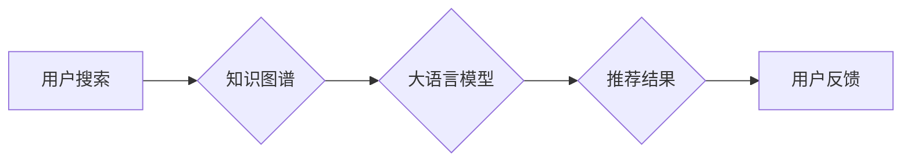

                 

## AI大模型视角下电商搜索推荐的技术创新知识推荐系统

> 关键词：电商搜索推荐、知识图谱、大语言模型、推荐算法、个性化推荐、AI技术

### 1. 背景介绍

随着电商行业的蓬勃发展，用户对商品的搜索和推荐需求日益增长。传统的基于关键词匹配和协同过滤的搜索推荐系统已难以满足用户个性化、精准化的需求。近年来，人工智能技术，特别是大语言模型（LLM）的快速发展，为电商搜索推荐带来了新的机遇。

LLM 拥有强大的文本理解和生成能力，能够从海量商品信息中提取知识，构建知识图谱，并根据用户的搜索历史、浏览记录、购买行为等信息，提供更精准、更个性化的商品推荐。

### 2. 核心概念与联系

#### 2.1  电商搜索推荐

电商搜索推荐是指在电商平台上，根据用户的搜索意图和历史行为，推荐相关商品的过程。其目标是提高用户搜索体验，提升商品曝光率和转化率。

#### 2.2  知识图谱

知识图谱是一种数据结构，用于表示和组织知识。它以实体和关系为基本单元，将现实世界中的事物和它们之间的联系以结构化的形式表示出来。

#### 2.3  大语言模型

大语言模型是一种基于深度学习的强大人工智能模型，能够理解和生成人类语言。它通过训练海量文本数据，学习语言的语法、语义和上下文关系，从而具备强大的文本理解、生成、翻译、问答等能力。

#### 2.4  知识推荐系统

知识推荐系统利用知识图谱和推荐算法，根据用户的兴趣和偏好，推荐相关知识或信息。

**核心概念与联系流程图**



### 3. 核心算法原理 & 具体操作步骤

#### 3.1  算法原理概述

在AI大模型视角下，电商搜索推荐系统通常采用基于知识图谱和大语言模型的推荐算法。

* **知识图谱构建:**  首先，需要构建电商平台的知识图谱，将商品、品牌、类别、属性等信息以实体和关系的形式表示出来。

* **大语言模型训练:**  利用大语言模型训练，使其能够理解商品描述、用户搜索词语等文本信息，并从中提取相关知识。

* **推荐算法:**  根据用户的搜索历史、浏览记录、购买行为等信息，以及商品的知识图谱信息，利用推荐算法生成个性化的商品推荐结果。

#### 3.2  算法步骤详解

1. **数据收集:** 收集用户行为数据、商品信息数据、文本数据等。
2. **知识图谱构建:** 利用自然语言处理技术，从商品信息数据中提取实体和关系，构建电商平台的知识图谱。
3. **大语言模型训练:** 利用训练数据，训练大语言模型，使其能够理解商品描述、用户搜索词语等文本信息。
4. **特征提取:** 利用大语言模型，从用户的搜索词语、浏览记录、购买行为等数据中提取特征，表示用户的兴趣和偏好。
5. **推荐算法:** 根据用户的特征和商品的知识图谱信息，利用推荐算法生成个性化的商品推荐结果。
6. **结果展示:** 将推荐结果以列表、卡片等形式展示给用户。
7. **用户反馈:** 收集用户的反馈信息，用于模型训练和算法优化。

#### 3.3  算法优缺点

**优点:**

* **个性化推荐:**  能够根据用户的兴趣和偏好，提供更精准的商品推荐。
* **提升用户体验:**  提高用户搜索效率，提升用户购物体验。
* **挖掘潜在需求:**  能够挖掘用户的潜在需求，推荐用户可能感兴趣的商品。

**缺点:**

* **数据依赖:**  算法的性能依赖于数据的质量和数量。
* **模型复杂度:**  大语言模型的训练和部署需要强大的计算资源。
* **解释性:**  大语言模型的决策过程较为复杂，难以解释推荐结果的依据。

#### 3.4  算法应用领域

* **电商平台:**  商品推荐、搜索结果优化、个性化营销等。
* **内容平台:**  文章推荐、视频推荐、个性化内容推送等。
* **社交媒体:**  好友推荐、兴趣小组推荐、内容推荐等。

### 4. 数学模型和公式 & 详细讲解 & 举例说明

#### 4.1  数学模型构建

在电商搜索推荐系统中，常用的数学模型包括协同过滤模型、内容推荐模型、混合推荐模型等。

* **协同过滤模型:**  基于用户的历史行为数据，预测用户对商品的评分或购买概率。

* **内容推荐模型:**  基于商品的特征信息，预测用户对商品的兴趣。

* **混合推荐模型:**  结合协同过滤模型和内容推荐模型，提高推荐效果。

#### 4.2  公式推导过程

协同过滤模型中常用的公式包括：

* **用户-商品评分预测:**

$$
\hat{r}_{u,i} = \mu + b_u + b_i + \sigma \cdot \frac{ \sum_{j \in N(u)} (r_{u,j} - \bar{r}_u) \cdot (r_{j,i} - \bar{r}_i)}{\sqrt{\sum_{j \in N(u)} (r_{u,j} - \bar{r}_u)^2} \cdot \sqrt{\sum_{j \in N(u)} (r_{j,i} - \bar{r}_i)^2}}
$$

其中：

* $\hat{r}_{u,i}$: 用户 $u$ 对商品 $i$ 的预测评分
* $\mu$: 全局平均评分
* $b_u$: 用户 $u$ 的偏差
* $b_i$: 商品 $i$ 的偏差
* $r_{u,j}$: 用户 $u$ 对商品 $j$ 的真实评分
* $\bar{r}_u$: 用户 $u$ 的平均评分
* $\bar{r}_i$: 商品 $i$ 的平均评分
* $N(u)$: 用户 $u$ 评分过的商品集合
* $\sigma$: 评分的标准差

#### 4.3  案例分析与讲解

假设用户 $A$ 评分过商品 $1$、$2$、$3$，评分分别为 $4$、$5$、$3$。商品 $2$ 和 $4$ 评分过的人数相同，平均评分分别为 $4.5$ 和 $4.2$。根据上述公式，可以预测用户 $A$ 对商品 $4$ 的评分。

### 5. 项目实践：代码实例和详细解释说明

#### 5.1  开发环境搭建

* Python 3.x
* TensorFlow 或 PyTorch
* Jupyter Notebook

#### 5.2  源代码详细实现

```python
# 导入必要的库
import tensorflow as tf

# 定义模型结构
model = tf.keras.Sequential([
    tf.keras.layers.Embedding(input_dim=vocab_size, output_dim=embedding_dim),
    tf.keras.layers.LSTM(units=128),
    tf.keras.layers.Dense(units=num_classes, activation='softmax')
])

# 编译模型
model.compile(optimizer='adam',
              loss='sparse_categorical_crossentropy',
              metrics=['accuracy'])

# 训练模型
model.fit(x_train, y_train, epochs=10)

# 评估模型
loss, accuracy = model.evaluate(x_test, y_test)
print('Loss:', loss)
print('Accuracy:', accuracy)
```

#### 5.3  代码解读与分析

* **Embedding层:** 将用户和商品的词向量表示为稠密的向量。
* **LSTM层:** 学习用户和商品之间的上下文关系。
* **Dense层:** 输出商品的推荐概率。
* **编译模型:** 选择优化器、损失函数和评价指标。
* **训练模型:** 使用训练数据训练模型。
* **评估模型:** 使用测试数据评估模型的性能。

#### 5.4  运行结果展示

训练完成后，可以将模型应用于实际场景，生成商品推荐结果。

### 6. 实际应用场景

#### 6.1  电商平台商品推荐

* **个性化推荐:** 根据用户的浏览历史、购买记录等信息，推荐用户可能感兴趣的商品。
* **新品推荐:**  推荐平台上最新的商品，提高新品曝光率。
* **关联推荐:**  根据用户浏览或购买的商品，推荐相关联的商品。

#### 6.2  搜索结果优化

* **排序优化:**  根据用户的搜索意图和商品的特征信息，优化搜索结果的排序，提高用户搜索效率。
* **结果多样化:**  提供不同类型的商品结果，满足用户的不同需求。

#### 6.3  个性化营销

* **精准广告:**  根据用户的兴趣和偏好，推送精准的广告信息。
* **促銷活動:**  根据用户的购买行为，推送个性化的促销活动信息。

#### 6.4  未来应用展望

* **多模态推荐:**  结合文本、图像、视频等多模态数据，提供更丰富的商品推荐体验。
* **实时推荐:**  利用实时数据流，提供更及时、更精准的商品推荐。
* **解释性推荐:**  提高推荐系统的透明度，解释推荐结果的依据。

### 7. 工具和资源推荐

#### 7.1  学习资源推荐

* **书籍:**
    * 深度学习
    * 自然语言处理
    * 推荐系统
* **在线课程:**
    * Coursera
    * edX
    * Udacity

#### 7.2  开发工具推荐

* **TensorFlow:**  开源深度学习框架
* **PyTorch:**  开源深度学习框架
* **Scikit-learn:**  机器学习库

#### 7.3  相关论文推荐

* **BERT: Pre-training of Deep Bidirectional Transformers for Language Understanding**
* **Attention Is All You Need**
* **Recurrent Neural Network for Recommender Systems**

### 8. 总结：未来发展趋势与挑战

#### 8.1  研究成果总结

AI大模型视角下的电商搜索推荐技术取得了显著进展，能够提供更个性化、更精准的商品推荐，提升用户体验和商业价值。

#### 8.2  未来发展趋势

* **多模态推荐:**  结合文本、图像、视频等多模态数据，提供更丰富的商品推荐体验。
* **实时推荐:**  利用实时数据流，提供更及时、更精准的商品推荐。
* **解释性推荐:**  提高推荐系统的透明度，解释推荐结果的依据。

#### 8.3  面临的挑战

* **数据质量:**  推荐算法的性能依赖于数据的质量和数量。
* **模型复杂度:**  大语言模型的训练和部署需要强大的计算资源。
* **解释性:**  大语言模型的决策过程较为复杂，难以解释推荐结果的依据。

#### 8.4  研究展望

未来，需要进一步研究如何提高数据质量、降低模型复杂度、增强模型解释性，以及探索新的推荐算法和技术，以推动电商搜索推荐技术的持续发展。

### 9. 附录：常见问题与解答

* **Q1:  如何构建电商平台的知识图谱？**

    **A1:**  可以使用自然语言处理技术，从商品信息数据中提取实体和关系，构建知识图谱。

* **Q2:  如何选择合适的推荐算法？**

    **A2:**  需要根据电商平台的特点和用户的需求，选择合适的推荐算法。

* **Q3:  如何评估推荐系统的性能？**

    **A3:**  可以使用准确率、召回率、点击率等指标评估推荐系统的性能。


作者：禅与计算机程序设计艺术 / Zen and the Art of Computer Programming 
<end_of_turn>

