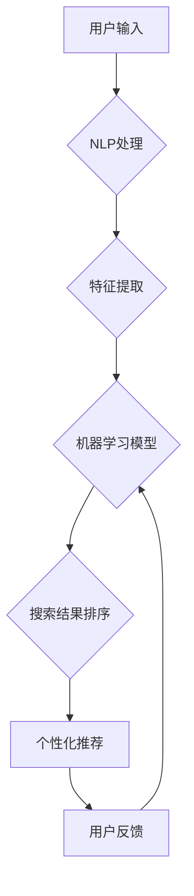

                 

## AI如何优化电商搜索的跨境体验

> 关键词：电商搜索、跨境电商、人工智能、自然语言处理、推荐系统、机器学习、用户体验

## 1. 背景介绍

跨境电商的蓬勃发展为消费者提供了海量商品选择，但也带来了新的挑战。其中，跨境电商搜索体验的优化尤为关键。传统的关键词匹配搜索方式难以满足跨境用户多样化的搜索需求，例如语言差异、文化背景、商品属性理解等。 

人工智能（AI）技术的快速发展为跨境电商搜索体验的优化提供了新的机遇。AI算法能够理解用户意图，提供更精准的搜索结果，并根据用户的历史行为和偏好进行个性化推荐，从而提升用户体验，促进跨境电商交易。

## 2. 核心概念与联系

### 2.1 跨境电商搜索的痛点

* **语言障碍:** 跨境电商平台通常面向全球用户，用户使用多种语言进行搜索，这给搜索引擎带来了巨大的挑战。
* **文化差异:** 不同国家和地区的文化背景差异会导致用户对商品的理解和搜索方式不同。
* **商品属性理解:** 跨境电商平台上的商品信息可能存在不完整或不一致的情况，导致搜索引擎难以准确理解用户需求。
* **个性化推荐:** 传统的搜索引擎难以提供个性化的商品推荐，无法满足用户多样化的需求。

### 2.2 AI技术解决方案

* **自然语言处理 (NLP):** NLP技术能够理解和处理自然语言，例如识别用户意图、翻译语言、提取关键词等。
* **机器学习 (ML):** ML算法能够从海量数据中学习用户行为模式，并根据这些模式进行个性化推荐。
* **深度学习 (DL):** DL算法能够学习更复杂的模式，例如图像识别、语音识别等，可以帮助搜索引擎更准确地理解用户需求。

### 2.3 架构图



## 3. 核心算法原理 & 具体操作步骤

### 3.1 算法原理概述

跨境电商搜索的优化通常采用基于机器学习的推荐算法，例如协同过滤、内容过滤和混合推荐算法。

* **协同过滤:** 基于用户的历史行为数据，推荐与用户相似度高的用户购买过的商品。
* **内容过滤:** 基于商品的属性信息，推荐与用户搜索历史或偏好相符的商品。
* **混合推荐:** 结合协同过滤和内容过滤的优势，提供更精准的商品推荐。

### 3.2 算法步骤详解

1. **数据收集:** 收集用户搜索历史、购买记录、浏览记录、商品属性信息等数据。
2. **数据预处理:** 对收集到的数据进行清洗、转换、编码等预处理操作，使其适合算法训练。
3. **特征工程:** 从原始数据中提取特征，例如用户性别、年龄、地理位置、商品类别、价格等。
4. **模型训练:** 使用机器学习算法对训练数据进行训练，学习用户行为模式和商品属性之间的关系。
5. **模型评估:** 使用测试数据对训练好的模型进行评估，并根据评估结果进行模型调优。
6. **模型部署:** 将训练好的模型部署到线上环境，用于实时推荐商品。

### 3.3 算法优缺点

| 算法类型 | 优点 | 缺点 |
|---|---|---|
| 协同过滤 | 能够发现用户之间的隐性关联，推荐个性化商品 | 需要大量用户数据才能有效，冷启动问题严重 |
| 内容过滤 | 基于商品属性信息，推荐与用户偏好相符的商品 | 容易陷入“同质化推荐”问题，缺乏多样性 |
| 混合推荐 | 结合协同过滤和内容过滤的优势，提供更精准的推荐 | 模型复杂度较高，训练时间较长 |

### 3.4 算法应用领域

* **电商搜索推荐:** 为用户提供个性化商品推荐，提升用户体验和转化率。
* **内容推荐:** 为用户推荐相关新闻、视频、文章等内容。
* **社交推荐:** 为用户推荐新的朋友、兴趣小组等。

## 4. 数学模型和公式 & 详细讲解 & 举例说明

### 4.1 数学模型构建

协同过滤算法的核心是计算用户之间和商品之间相似度的矩阵。

* **用户-用户相似度矩阵:**  

$$
Sim(u_i, u_j) = \frac{\sum_{k=1}^{N} r_{i,k} * r_{j,k}}{\sqrt{\sum_{k=1}^{N} r_{i,k}^2} * \sqrt{\sum_{k=1}^{N} r_{j,k}^2}}
$$

其中：

* $Sim(u_i, u_j)$ 表示用户 $u_i$ 和 $u_j$ 之间的相似度。
* $r_{i,k}$ 表示用户 $u_i$ 对商品 $k$ 的评分。
* $N$ 表示商品总数。

* **商品-商品相似度矩阵:**

$$
Sim(p_i, p_j) = \frac{\sum_{u=1}^{M} r_{u,i} * r_{u,j}}{\sqrt{\sum_{u=1}^{M} r_{u,i}^2} * \sqrt{\sum_{u=1}^{M} r_{u,j}^2}}
$$

其中：

* $Sim(p_i, p_j)$ 表示商品 $p_i$ 和 $p_j$ 之间的相似度。
* $r_{u,i}$ 表示用户 $u$ 对商品 $p_i$ 的评分。
* $M$ 表示用户总数。

### 4.2 公式推导过程

上述公式的推导过程基于余弦相似度计算。余弦相似度可以衡量两个向量的夹角大小，夹角越小，相似度越高。

### 4.3 案例分析与讲解

假设有两个用户 $u_1$ 和 $u_2$，他们对以下商品的评分如下：

| 商品 | $u_1$ | $u_2$ |
|---|---|---|
| 商品 A | 5 | 4 |
| 商品 B | 3 | 5 |
| 商品 C | 4 | 3 |

根据公式，我们可以计算出 $u_1$ 和 $u_2$ 之间的用户-用户相似度：

$$
Sim(u_1, u_2) = \frac{(5 * 4) + (3 * 5) + (4 * 3)}{\sqrt{(5^2 + 3^2 + 4^2)} * \sqrt{(4^2 + 5^2 + 3^2)}} = 0.8
$$

该结果表明 $u_1$ 和 $u_2$ 之间存在一定的相似度。

## 5. 项目实践：代码实例和详细解释说明

### 5.1 开发环境搭建

* Python 3.x
* TensorFlow 或 PyTorch
* Jupyter Notebook

### 5.2 源代码详细实现

```python
import pandas as pd
from sklearn.metrics.pairwise import cosine_similarity

# 加载用户评分数据
ratings_data = pd.read_csv('ratings.csv')

# 计算用户-用户相似度矩阵
user_similarity = cosine_similarity(ratings_data)

# 获取用户 $u_1$ 的相似用户
similar_users = user_similarity[0].argsort()[:-6:-1]  # 排序并获取前 5 个相似用户

# 推荐商品
recommended_items = ratings_data.iloc[similar_users, :].mean().sort_values(ascending=False)
```

### 5.3 代码解读与分析

* 首先，我们加载用户评分数据，并使用 `cosine_similarity` 函数计算用户-用户相似度矩阵。
* 然后，我们获取用户 $u_1$ 的相似用户，并根据这些用户的评分平均值推荐商品。

### 5.4 运行结果展示

运行上述代码后，将输出用户 $u_1$ 的相似用户和推荐商品列表。

## 6. 实际应用场景

### 6.1 跨境电商平台搜索

* **语言翻译:** 使用 NLP 技术将用户搜索词翻译成目标语言，提供跨语言搜索体验。
* **文化差异理解:** 根据用户地理位置和文化背景，调整商品推荐策略，提供更符合用户需求的商品。
* **个性化推荐:** 使用机器学习算法分析用户行为数据，推荐个性化商品，提升用户购物体验。

### 6.2 跨境物流配送

* **物流路线优化:** 使用机器学习算法分析物流数据，优化物流路线，缩短配送时间。
* **配送成本控制:** 使用机器学习算法预测物流成本，帮助企业控制物流成本。
* **物流风险管理:** 使用机器学习算法识别物流风险，帮助企业降低物流风险。

### 6.3 跨境支付

* **支付安全保障:** 使用机器学习算法识别支付欺诈行为，保障支付安全。
* **支付体验优化:** 使用机器学习算法分析用户支付行为，提供个性化支付方案，提升支付体验。
* **跨境汇率管理:** 使用机器学习算法预测汇率波动，帮助企业管理跨境汇率风险。

### 6.4 未来应用展望

随着 AI 技术的不断发展，AI 将在跨境电商领域发挥更重要的作用。未来，AI 将被应用于以下领域：

* **智能客服:** 使用 AI 驱动的聊天机器人提供 24/7 的客户服务，解决用户问题。
* **智能营销:** 使用 AI 分析用户数据，进行精准营销，提高营销效率。
* **智能供应链:** 使用 AI 优化供应链管理，降低成本，提高效率。


## 7. 工具和资源推荐

### 7.1 学习资源推荐

* **在线课程:** Coursera, edX, Udacity
* **书籍:**
    * Deep Learning by Ian Goodfellow
    * Hands-On Machine Learning with Scikit-Learn, Keras & TensorFlow by Aurélien Géron
* **博客:** Towards Data Science, Machine Learning Mastery

### 7.2 开发工具推荐

* **Python:** 
    * TensorFlow
    * PyTorch
    * Scikit-learn
* **云平台:** AWS, Azure, Google Cloud

### 7.3 相关论文推荐

* **Collaborative Filtering for Recommender Systems** by Su-mei Yang and John A. Konstan
* **Matrix Factorization Techniques for Recommender Systems** by Yehuda Koren
* **Deep Learning for Recommender Systems** by Xiangnan He et al.

## 8. 总结：未来发展趋势与挑战

### 8.1 研究成果总结

AI 技术在跨境电商搜索的优化方面取得了显著成果，例如：

* 语言翻译和文化差异理解能力的提升
* 个性化商品推荐的精准度提高
* 跨境物流配送和支付的效率提升

### 8.2 未来发展趋势

* **更精准的个性化推荐:** 利用更丰富的用户数据和更先进的机器学习算法，提供更精准的个性化商品推荐。
* **更智能的客服系统:** 使用自然语言处理和机器学习技术，开发更智能的客服系统，能够理解用户的复杂需求，并提供更有效的解决方案。
* **更安全的跨境支付:** 使用机器学习算法识别支付欺诈行为，保障跨境支付安全。

### 8.3 面临的挑战

* **数据质量问题:** 跨境电商平台的数据质量参差不齐，需要进行有效的数据清洗和预处理。
* **跨语言和跨文化理解:** 跨境电商平台需要处理多种语言和文化背景的数据，这对于 AI 模型的训练和部署提出了更高的要求。
* **隐私保护问题:** 跨境电商平台需要收集和处理大量用户数据，需要采取有效的措施保护用户隐私。

### 8.4 研究展望

未来，AI 技术将在跨境电商领域发挥更重要的作用，推动跨境电商行业的发展。我们需要继续加强对 AI 技术的研究和应用，解决跨境电商面临的挑战，为用户提供更优质的购物体验。

## 9. 附录：常见问题与解答

**Q1: 如何解决跨境电商搜索的语言障碍问题？**

**A1:** 可以使用机器翻译技术将用户搜索词翻译成目标语言，也可以使用多语言搜索引擎，支持多种语言的搜索。

**Q2: 如何解决跨境电商搜索的文化差异问题？**

**A2:** 可以根据用户的地理位置和文化背景，调整商品推荐策略，提供更符合用户需求的商品。

**Q3: 如何评估跨境电商搜索的优化效果？**

**A3:** 可以使用以下指标评估跨境电商搜索的优化效果：

* 点击率 (CTR)
* 转换率 (Conversion Rate)
* 用户满意度 (User Satisfaction)

**Q4: 跨境电商搜索的优化需要哪些技术技能？**

**A4:** 跨境电商搜索的优化需要以下技术技能：

* 自然语言处理 (NLP)
* 机器学习 (ML)
* 数据挖掘 (Data Mining)
* 软件工程 (Software Engineering)


作者：禅与计算机程序设计艺术 / Zen and the Art of Computer Programming 
<end_of_turn>

